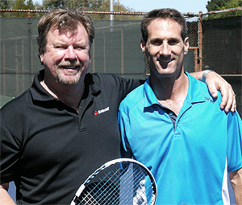
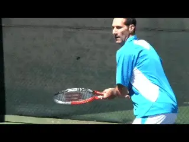
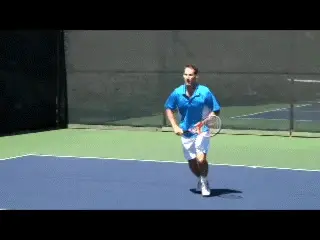
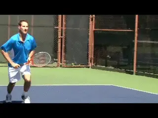
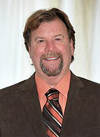

# How to Incorporate the Approach

### Rob Heckelman

**Myself and Jeff Greenwald: how do you help the best player in the world change his game?**

When Jeff Greenwald consulted me to help him in his quest to come to the
net more often, it was an interesting challenge.

In most cases I try to develop this change by first helping the student
learn the structural technique of the volleys and the approach game.
This is followed by a series of drills that allow the player to really
own the new tactics.

Most coaches are well aware that one half of that equation is not
helpful without the other. Without the confidence developed through
progressive repetitions, many players never make the transition to
incorporating attacking into actual match play.

The intrigue in working with Jeff was that he was not only a top-level
player, but also a leading sports psychologist. So I knew it would be
interesting to observe how he approached the challenges involved.

How would Jeff deal with the combination of technical, tactical and
mental changes required? As Jeff points out in his own article, the
issue has as much to do with the personality of the player as anything
else. ([link](https://www.tennisplayer.net/members/mentalgame/jeff_greenwald/mind_of_baseliner/).)

Jeff had had tremendous success as a baseliner all his career. For so
many years he had been comfortable and successful overcoming opponents
with his groundstroke play.

**The idea was to back up his big forehand with relatively easy volleys.**

But there comes a time when players with this style hit a wall and
realize they need change. Jeff had hit that wall.

My role was to help him get more comfortable physical with the shot
sequences, the movement patterns, and especially the footwork he needed
for the transition.

In working with Jeff on the overall plan, I had the pleasure of
collaborating with another legendary Marin County coach, Paul Cohen.
Paul worked rigorously with Jeff to improve his volley technique.
([link](https://www.tennisplayer.net/members/classiclessons/paul_cohen/classic_forehand_volley/index.html).)
This was a prerequisite because as Jeff freely admitted he had learned
to volley as a junior, but never really learned to volley.

I also totally agreed with Paul's premise of using Jeff's strength -
his forehand - to start the approach sequence. Jeff was regularly
hurting players with his fearsome topspin drives.

**The plan was that when the ball was short, Jeff would hit big approaches, mainly off his forehand, but using his backhand too when the opportunity was there.These power approaches would take away the opponent's time and force him to hit passes with a high degree of difficulty.**

**Starting part way up in the court got Jeff confident with the split and balance in the midcourt.Meanwhile Jeff would close the net aggressively. The goal was to generate a miss on the pass or hit an angled volley or overhead for a winner.**

Rather than master unfamiliar multi shot sequences, Jeff only had to do
what he did best and finish with one more relatively easy ball. These
patterns were what I was brought in to help him master.

My job was to provide the feeding sequences, drills and intermediate
competitive games that would allow Jeff to build his confidence and make
that all important mental transformation to the belief he could execute
opportunity attacks behind his groundstrokes under pressure.

**Footwork**

The first thing I noticed was that Jeff was simply not comfortable in
the midcourt and struggled with his footwork and balance. That was
understandable considering he had almost never practiced transition
sequences, much less used them in matches.

So, this became the initial area we worked to master. We began with a
drill in which he started well up in the court.

This allowed him to really feel the split step and how to create balance
without having to move as far or as fast as if he started from the
baseline.

Once he became more stable confident with the split step, he could then
explode forward to the volley. Only then did we start to add the actual
approach shot prior to moving forward in the court. Typically, the
pattern was forehand groundstroke, forehand approach, and angled volley
from either side.

**Once Jeff was more comfortable, he could explode forward on balance.**

In these drills and with Paul's agreement, we engineered more angled
volleys into his game. This helped him deal easily with weak or high
approach shot. But it also prepared him to deal with players who were
fast on their feet and courts that were very slow and difficult to hit
volley winners through the baseline.

We also worked on a crosscourt slice overhead to finish points
effectively against a strong lobbers.

The next step was to change the rules of the game to create a new need
and desire for taking net. In one playing drill, he would lose the point
if he hit more than four ground strokes. In another playing drill he was
awarded two points for hitting a winning volley.

**We also engineered angled volleys into the approach sequences.**

Then we started to set up matches with steady players who possessed both
great passing shots and lobs.

It wasn't just about providing Jeff with information and instruction,
it was about progressively creating the experience of successful
attacking - at the level of drills, at the level of competitive games,
and finally in points and match play.

After a few weeks of mixing all these elements, I could see Jeff's
confidence increase. I could see he believed he was developing skills
that would allow him to dominate players whom he had previously
struggled to defeat.

It was very satisfying. But the larger lesson for all players is that
information alone is just the beginning. And having a pro just feed you
a few balls is never enough.

Real change requires a more comprehensive, multi-dimensional approach.
It was great to be able to contribute some elements to that process, a
process that can work for any player who understands and is willing to
work on the right steps.

formerly the youngest head pro at the John
Gardner Tennis Ranch in Scottsdale, Arizona,
and has been ranked numerous times in Northern
California seniors play. He is the author of a
book on senior tennis, called "Playing Into the
Sunset" as well as the "Business Handbook for
Tennis Pros." In addition to his reputation as
an outstanding teacher and coach, Rod speaks
widely within the tennis industry on all
aspects of instruction and club management.
                                                                                                                                                          California for the last 30 years. He was
