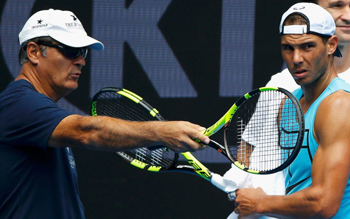
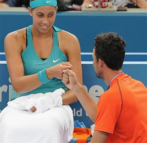
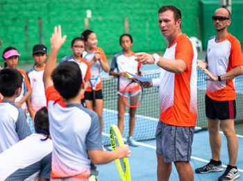
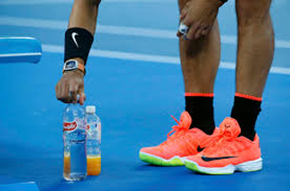
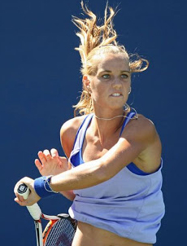
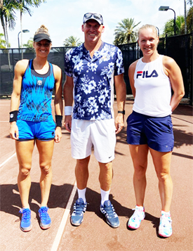

# Maximizing Player and Coach Relationships: Part 2

### Kyle LaCroix

------------------------------------------------------------------------

**Who are the coach and the player - as people?**

In the first article in this series ([link](Maximizing%20Player%20and%20Coach%20Relationships%20-%20Part%201.docx))
I presented some of the results from a study my company SETS did in
conjunction with Stanford University. A key question was who the player
and coach were as people, and another critical factor was their ability
to communicate.

But now let's look at a further vital factor, having a team concept. In
great coaching the team, the athlete and the athlete's security, both
mental and physical, came first. Great athlete coach relationships
always have the coach working with the athlete, never for them.

The athletes always felt that the coach put them first in everything
they did. The coaches never made themselves bigger than the game.
**They were first to give credit to the athlete after a win and the first to defend them after a loss.As an athlete, it should provide comfort knowing your coach has your back.However, the one person that should believe in you more than a coach is yourself.**

You owe it to yourself and the coach to do your own research, study, and
bring your ideas and questions to the court. Any great coach is more
willing to go out of their way for you if they know you are taking a
genuine interest in your own game.

**Does the coach want to be successful or does he want the player to be successful?Ego**

Ego is a significant factor in the athlete coach relationship. But when
I say ego, I am not directly talking about the level of humility or its
lack in the coach or the player.

I am speaking about who comes first. Does the coach want to be
successful or does he or she want the player to be successful?

Does the coach want dinner at 9pm or does the player? Oftentimes,
coaches get into a mode of what's best or most convenient for them.

Do coaches base critical and non-critical decisions on their experience,
expertise and understanding or on their own egos? When they release the
ego, it's surprising how many more good decisions coaches do make.

As an athlete, a coach's ego can be difficult for two reasons. The
first is that you are trying to be respectful and not question what the
coach says or does, assuming they are basing that on their expertise.

The second is that it can be hard for athletes to distinguish between
ego and knowledge. A coach wants to practice earlier than usual. Is this
because he/she wants his athlete to have an earlier night before his
athlete's match tomorrow or so that he/she can get back to the hotel to
watch some big game?

But if you remember from the first article, creating a positive learning
environment means you as the player can come prepared with plans,
suggestions and facts as to why a different option may be more
beneficial for you both.

**At Saddlebrook there was a clearly understood coaching culture.**

The key word is both. If the coach is using his knowledge, he will
appreciate this and agree. If the coach has an ego, he will agree as he
feels it still benefited him in some way.

**Elevated Standards**

Great athletes and great coaches that have achieved significant levels
of success all have high standards for themselves and others. It is an
occupational prerequisite at the elite level.

Other people on the team or in the entourage know this. It is not
something that is explained or discussed.

On the best teams it is inherent. On strong teams and in great athlete
coach relationships the standards are not dictated by the head coach
they are communicated among the members.

A great example of this was during a coaching stint I had at the Harry
Hopman Academy at Saddlebrook Resort. There was a famed and feared
hard-nosed Colombian who was the director of coaching. I always got
along with him because I listened, observed, and worked like a rented
mule.

Some coaches would leave the room when he walked in. One day, a new
teaching professional arranged activities on his court differently from
the Saddlebrook way. Before the director could eviscerate him, two
fellow coaches ran over, and politely but emphatically told the new
coach, "That's not how we do things here.\"

**The right culture means standards are inherently learned.**

They then showed him the way and saved the day for all of us. With the
right culture, standards are inherently learned. Another head coach or
tennis director might create a different structure, but whatever the
structure, the team members need to embrace it or leave the team.

But as an athlete, it is also fundamental to develop your own standards.
By establishing high standards for yourself, it's never an issue of
crossing your coach's perceived line. It will be an issue of crossing
your own line.

That type of accountability garners respect and enhances the athlete
coach relationship even more as now the coach can focus on his role as a
coach and not on discipline. Discipline to an athlete should never about
punishment, it should be about holding the athlete to that higher
standard.

**Meticulous and Detailed Practices**

**Rafa and his drink bottles.**

Details! We have heard this word before. But what does it really mean?
There are so many facets to a practice and the ongoing team experience.

What is the purpose? What is the method? What is the theme?

From the study by SETS Consulting, examples of the intricate details the
athletes gave us were all across the board. Which also tells you how
many different small things could be covered by great coaches.

But being brilliant at the basics was a common denominator. Harping on
fundamentals, breakdowns of patterns, shotmaking, technical minutiae was
there.

But so were many other parts. The color of the sports drink in the
cooler, the angle of the benches, the height of the targets on the
court, the manipulation of crowd noises and wind patterns to emulate a
rival's home turf. Think of Nadal and his obsessive placement of his
drink bottles.

Some of these things might sound over the top, but there are an example
of the passion of the coach and the desire to provide the best
preparation and feeling of control in the mostly uncontrollable
environment of match play.

**Another training camp, this time for Arantxa Rus and Viktorija Golubic.**

For athletes going through what may seem endless repetitions, repeated
drills and even examining the way players drink out of water bottles,
understand that practice is not designed so much for enjoyment, but for
improvement.

There should be an aspect of shared fun involved in the stages of the
development process regardless of player level, but the most important
aspect is going to be the progress.

In the spring of 2019 I had the chance to host a training camp in
preparation for the Miami Open for two WTA Tour players, Arantxa Rus
from the Netherlands and Viktorija Golubic from Switzerland.

**The training camp I ran for Arantxa Rus from the Netherlands and Kiki Bertens from Switzerland ended with thank you notes - from me.**

This was my first time meeting the two of them in person. We had a great
week and both players were happy with their level of play going into the
tournament. But as a gesture of connection I wrote them each a
personalized thank you card by hand in their native languages.

For Arantxa it was in Dutch and for Viktorija it was in Swiss-German.
For those that know anything about the Swiss-German language, I can
assure you that the card was not easy to write and took a few tries to
get just right. They were both blown away by that simple gesture.

In the Spring of 2021, after the Miami Open I was able to host another
training camp in preparation for the clay court season. My club has a
beautiful red clay court that was perfect for the incoming Dutch
players, Rus and Kiki Bertens.

They were incredible athletes, had a wonderful time and brought out a
very high level of tennis. Despite all their laughter, the inside jokes
in Dutch and the brutal acclimatization to South Florida humidity, their
biggest thrill was receiving those thank you cards in

Dutch with a special message for each of them inside. \"Heel erg
bedankt!\" or "Thank you very much!\"

In the SETS study, every athlete interviewed shared one fact. Despite
passionate teaching, candid feedback, high standards and surreal
practice environments, it was not how much they improved physically, it
was what happened in their heads and in their hearts. Athletes may or
may not remember techniques, drills or coaching philosophies. But what
they remember most are the coaches as people and how those coaches made
them feel.

Kyle LaCroix is a USPTA and PTR Certified Professional as well as
receiving his United States Center For Coaching Excellence (USCCE)
Certification. He has been a featured speaking at numerous Industry
Conferences.

Kyle has experience working with ATP/WTA and NCAA collegiate players at
each level of their competitive careers and at every stage of their
professional and personal development. He is recognized throughout the
industry as a reliable, hardworking, genuine presence. Kyle utilizes
great people skills and is an exceptional communicator. He understands
the important roles and responsibilities that federations, coaches and
players carry with them on a daily basis.

He holds an MBA from the University of Michigan and a M.Ed in
Educational Leadership from Stanford University

To find out more please visit
[setsconsult.org](https://setsconsult.org/) 
