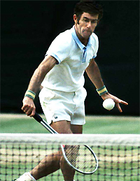
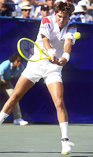
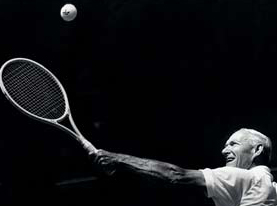
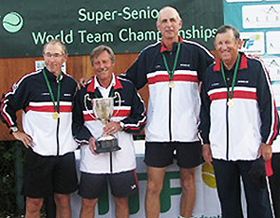
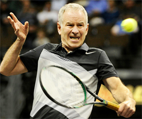
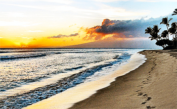
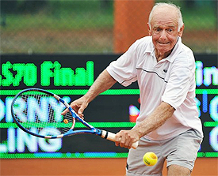

# On Your Mark, Get Set, Go Slow

### Rob Heckelman

------------------------------------------------------------------------

**Ken Rosewall reached the U.S. Open final in 1974 at the age of 40.**

It's 1974 at Forest Hills and an aging Ken Rosewall is on center court
playing for his third championship eighteen years later after his first
win. He's up against a new young stud, who hits groundstrokes like
never before.

The age discrepancy is highlighted by the fact that this young
challenger, Jimmy Connors was born, September 6, 1952, the same week Ken
played in his first U.S. Championship event at Forest Hills reaching the
quarterfinals at 17 years of age. It becomes a lopsided final, but
nonetheless, the crowd before, during and after the match endears
themselves to the modest Australian, not because he is the underdog, but
because he is nearly 40 years old.

Ironically, nearly 20 years later the shoe is on the other foot and
it's a young Jimmy Connors who is nearly 40 years of age and putting
together a run up to the semi-finals, a run that might be one of the
most memorable weeks in tennis history. Again, a senior player steals
the show and endears the hearts and minds of the tennis world.

There is a definite affinity for athletes performing well after their
prime from sports fans worldwide. The reason is simple, most of the
audience can relate, because most of the audience is either the same age
or slightly older.

**20 years later, Jimmy Connors was the senior player crowds cheered.**

We all enjoy seeing these seasoned athletes get another shot at winning
the big one. We dream we could do the same.

We take that dream to the tennis courts and give it our best shot. What
draws us to the television to watch these elder heroes is the same that
drives us to compete late into our lives. The level may be world's
apart, but I dare say for some the intensity level can be the same as
the juniors, the collegians, or even, yes, the pros.

Everyone loves a chance for a do-over, a fresh start, a chance to erase
the past and begin new. That's what senior tennis provides, and because
the age groups are measured by five year intervals, we get a do-over
every five years according to the USTA and ITF age groups.

The original senior tennis tournaments were for players over the age of
45 and was referred to as "Veterans." As life expectancies grew, so did
the age groups, initially in leaps of every ten years and then
eventually every five years.

But as age groups were added the label of seniors stuck. Today we have
senior divisions starting at 30 years plus and moving up in integrals of
five years all the way to the 90's. Today's 60 is yesterdays 40, and
in the tennis world we have taken advantage of that extended aging
opportunity all the way up to the 90 and over.

The fact is that the tennis explosion of the early 70's means that a
very large proportion of today's tennis population being 50 plus in
years. As a result, there is a great need to address this sector of
players separately, taking a more catered to approach to the advancement
of their games.

**Seniors can play their own version of world class tennis into their 90s.**

In these articles, we will delve into the many unique characteristics of
senior tennis and find a more entertaining way of practicing and playing
the sport. Realizing that time is precious, we will approach the sport
with an emphasis on getting changes to happen quickly and enjoying those
changes as they take place.

As part of this we will provide numerous new games and drills to enjoy
competitive practice and to help create progressive change. This
decision to add new types of playing drills and games is based on
working for years and years with actual senior players.

It's about having fun while improving, and let's face it, games are
more fun than drills. That's a common thread for all levels and ages
and here we will tailor that approach to maximizing your development as
a senior player.

**The senior tour provides players with opportunities to compete worldwide.**

The entire senior tournament circuit opened up a brand new competitive
world for both the warriors of the courts that have stroked their way
through the many age groups and an opportunity for many players to play
competitively against a foe with equal physical skills. Also, now the
player across the net has the same amount of wear and tear on the body.

As much as it may be fun on occasion for seniors to play with quicker
and harder hitting younger athletes, it isn't much fun to compete with
them on a steady diet. Not only can it result in a lopsided match
that's no fun for either player, but it also can be physically
stressful.

With new technology the younger and stronger players can hit serves and
ground strokes so much harder that someone without the ability to react
in time might hit late or mishit the ball resulting in an injury. If a
60 year old player is at net against a heavy hard hitting topspin 20
year old, the task can quickly transform from a volleying agenda to a
dodge ball event.

**Senior tennis often involves more net play and artful angles.**

But, when the age, physicality, and abilities are similar, it is more
likely to become a more artful contest which can turn into a wonderful
match up. New and creative strategies develop, like the net player who
tries to execute an approach shot to create a more predictable return,
instead of just putting a short ball away as the top pros on tour do.

On the other side of the net, the baseline player might look to finesse
a shot that will compromise the player at net, rather than overwhelm his
opponent with a ripping passing shot. The net player will use more touch
volleys, capitalizing on the angles available at net.

He may hit a very short volley down the middle to force an error, a shot
that in Open tennis will likely lose you the point. The baseline player
will blend short chip shots to the feet with deft lobs over the net
persons head, just out of their reach. The entire game becomes more
focused on control and variety, less on power and speed.

**Senior tennis also provides the opportunities for incredible world travel.**

The other exciting prospect to senior tennis is the potential for world
travel. Visit the ITF website, www.itf.com, and look up the senior
schedule. It will fascinate you when you discover that there are senior
tournaments all over the world. The U.S.T.A. also has a vast and
complete package of senior events year around all across the country. It
could be said that with senior tennis, you have at your disposal an
international language that is perfect for enhancing your social
environment.

If you plan on taking a few lessons, maybe instead of your local young
pro, try finding an experienced teaching pro that has a better
understanding of you and what you are capable of doing on the court. You
may find that you will only want to modify your game or simply enhance
your current style of play.

Stay open minded about change. Pick one subject and try to master that
one small modification. As an example, you feel your second serve needs
to be deeper and maybe have a little more kick. Work on that and record
your progress. Take your time so that you can establish a trend of
change that meets your standards. Maybe it takes a month, or a couple of
months, no hurry, making this one change will teach you how to be
successful at such transitions in the future.

**Discover the thrill of an improved volley grip.**

If you feel your game has an obvious flaw, make the change cold turkey
and don't hesitate to reinvent that portion of your play. As an
example, you feel your net play is weak due to the incorrect grip you
use when you volley.

Make the change, practice the new style until it becomes a natural part
of your competitive game. You will know when that happens because you
will no longer be thinking about how to hold the racket and volley, it
will just happen naturally.

Once again, if you can be patient and work through this change, this
transition will make any other changes much easier in your future. Part
of what makes senior tennis so much fun is the feeling that you are
still improving and working on your game.

**Any successful progress through change is rewarding in both on court play and your frame of mind. The day you come to net in a competitive match and win a crucial point with that new grip, is a day that you will enjoy and remember for some time.**

                                                                                                                                                                                       formerly the youngest head pro at the John
                                                                                                                                                                                       Gardner Tennis Ranch in Scottsdale, Arizona,
                                                                                                                                                                                       and has been ranked numerous times in Northern
                                                                                                                                                                                       California seniors play. He is the author of a
                                                                                                                                                                                       book on senior tennis, called "Playing Into the
                                                                                                                                                                                       Sunset" as well as the "Business Handbook for
                                                                                                                                                                                       Tennis Pros." In addition to his reputation as
                                                                                                                                                                                       an outstanding teacher and coach, Rod speaks
                                                                                                                                                                                       widely within the tennis industry on all
                                                                                                                                                                                       aspects of instruction and club management.
  ------------------------------------------------------------------------------------------------------------------------------------------------------------------------------------------------------------------------------------
                                                                                                                                                         California for the last 30 years. He was
  ------------------------------------------------------------------------------------------------------------------------------------------------------------------------------------ -----------------------------------------------

  ------------------------------------------------------------------------------------------------------------------------------------------------------------------------------------------------------------------------------------
