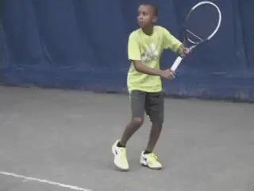
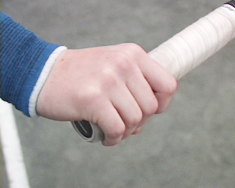
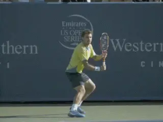
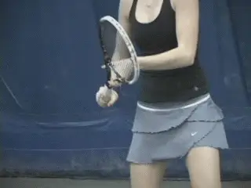
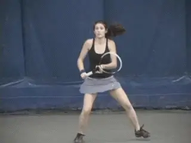
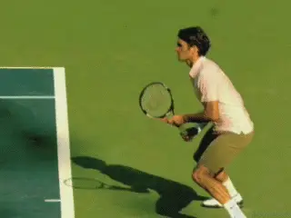
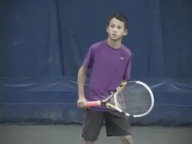
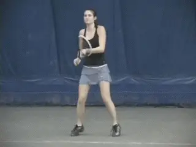
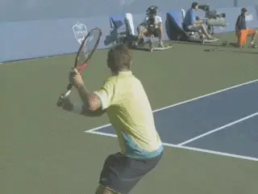
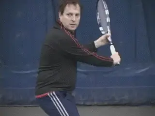

# Building A World Class One Hander: Preparation

In the first two articles in this series, we outlined the multiple
factors that go into deciding to hit the one-hander and what the
advantages and disadvantages are, especially for young players. ([link](https://www.tennisplayer.net/members/classiclessons/chris_lewit/one_handed_backhand_part_1)
for Part 1. [link](https://www.tennisplayer.net/members/classiclessons/chris_lewit/one_handed_backhand_part_2)
for Part 2.)

If you have made that evaluation and are excited about developing a
one-handed backhand--or if you are looking to improve your existing one
hander--let's move on to the key technical reference points. We start
this month with the grips and the options for preparation, and then move
on to the forward swing in the following article.

There will be a lot more to follow in this series as well. For example a
detailed series of drills for working on footwork, racket speed, and how
to use the one-hander for both offense and defense--moving back in the
court and taking the ball on the rise.

**What are the technical reference points for a world class one-hander?**

### Grips

I like strong grips. A strong grip is the basis for developing the
one-hander as a weapon, with velocity and spin. Research by John Yandell
shows that the backhands with some version of this grip from Roger
Federer to Stan Wawrinka to Richard Gasquet average more topspin than
the top two handers.

**A Strong Eastern Grip with the top knuckle on the top edge of the racket and part of the palm rotated behind the handle.**

In the modern game, driving the one-hander with topspin is critical, and
this is especially true for the junior players. But in my program I also
teach this same aggressive topspin to adult players.

I want my players to be able to rally with velocity and spin. I want
them stand in and take the ball on the rise. I want them to hit dipping
passing shots. I want them to move back and defend when necessary.

The grip is the foundation for developing all these aspects. Grip
terminology can be confusing and varies from coach to coach.

I call the grip I teach a Strong Eastern. This means the index knuckle
is on the top pr the back edge of the top of the frame, with part of the
palm of the hand rotated over the top bevel and partially behind the
handle.

A slightly more extreme versions of this grip, similar to Gustavo
Kuerten or Justine Henin, probably generates more spin and is great for
higher balls, but are also more limited for all court play for players
who want to stand in and take the ball on the rise.

**Stronger grips are need for the modern game, but have advantages at the club level too.**

Roger Federer's grip is probably slightly weaker and closer to a
classic Eastern with the hand mostly on top of the handle, although with
his smaller grip handle at least some of his palm is overlapping and
behind the racket face.

That grip would be a hard grip to argue with. But in my opinion, if the
grip is any weaker than Federer's--shifted toward the continental--it
won't create the level of spin required in high junior tennis.

I also think the positioning of the fingers in the grip can be
important. I prefer that players don't completely "fist" the racket,
holding the grip with the fingers bunched tightly together.

Ideally, the index and middle finger should be spread at least slightly
up the side of the handle to encourage better feel. Players who fist the
racket handle tend to muscle the ball and have trouble manipulating the
racket face in the critical split seconds around contact.

**The quick turn, chin on shoulder, leading naturally to the closed stance.**

### The Deep, Quick Turn

The first and most important swing element a coach can give a junior
player or any player is a quick, deep turn. This is a key technical
reference point in evaluating any one-hander.

The turn must be deep. By that I mean that I want to see part of the
back of my students' shirts. To create the deep turn I focus on having
the player turn the right hip tremendously fast.

The turn should be so severe that the chin comes to rest on the right
shoulder. The shoulder angle to the baseline can be up to 150 degrees.
The quick deep turn should happen in the blink of an eye. With my
students we train it religiously.

Nick Saviano calls this "pulling the shoulder". ([link](https://www.tennisplayer.net/members/famouscoach/nick_saviano/saviano_optimizing_your_technique_part1/saviano_optimizing_your_technique_part1.html)
for his excellent articles on TPA.)

This level of body turn will naturally result in a closed stance as the
player steps forward along the line created by the shoulder turn. As
John Yandell has shown, this allows hip and shoulder rotation in the
forward swing as the racket approaches contact.

**The turn on the open stance should also be full and strong.**

But I also believe very player should learn to hit both open and closed
on the one-hander. On the open stance the turn should also be immediate
and full. The shoulders don't turn quite as far, but should still reach
90 degrees or a little further.

At higher levels the quick turn is very important because the players
hit the ball so hard. I feel this is neglected by many coaches and
teaching pros.

Early in a player's development, it may not appear necessary, but the
opposite is true. Without the quick turn, tournament play with slower
rallies and higher balls can actually hurt a player's development.

Players with slow preparation can't understand why they have trouble
later handling the pace of more powerful players. They often tend to
retreat further and further as their opponents hit harder.

Without the right preparation they will be unable to hit the ball on the
rise, play all court tennis, or crush the ball from close to the
baseline. It's the key to success on faster court surfaces as well.
This is true for any competitive junior, but also for a club player who
aspires to reach the 4.5 level or higher.

**Watch Roger Federer's immediate full turn.**

My philosophy is preparation can never be too soon. If the player sets
the racket early he can always wait for the ball. However if the racket
is not set properly, racket head speed may be lost. So let me outline my
beliefs about the setting the racket and the range of acceptable
backswings that will not disrupt racket speed or timing.

### Backswings

There are two primary ways to prepare the racket on the backswing in my
system. These are bent arm and straight arm.

In the bent arm preparation the elbow should point toward the belly
button and is flexed up to about 150 degrees. The left hand is on the
throat with the fingers spread.

The left hand should also stay on the players left, visible to the
opponent, and not move behind the body. The wrist should be cocked up.
This should create wrinkles in the skin of the racket hand.

The chin remains tucked on the right shoulder and the eyes are trained
forward on the incoming ball. This is the backswing pattern used by
Roger Federer.

**Two options: the bent arm and the straight arm backswing patterns.**

In the straight arm preparation the elbow and hands are pushed further
to the left away from the body. The racket hand can come up as high as
the height of the back shoulder. As with the bent elbow backswing, the
wrist is cocked up, firm, and creating wrinkles in the skin of the hand.

The chin is again tucked over the shoulder and the eyes trained on the
ball. The straight arm preparation is used by many top players and was
also used by Justine Henin and Gustavo Kuerten, two of the greatest
one-handers in the history of the game.

### The Loop

The backswing loop follows next regardless of the style of arm
preparation. A loop helps players find timing as well as build racket
speed. To do this the player pulls the elbow of the hitting arm back and
up.

The loop can go higher, tracing more the path of a circle. Or it can
stay lower tracing a more elliptical path similar to a C. The C shape
has the advantage of being more compact and this can facilitate the
ability to play the all court game.

**Two beats: the start of the turn and the start of the backswing.**

### The Hold

With either shape I teach players what I call "the hold. " The hold
promotes racket head acceleration to the contact, and also disguise.

Timing of the hold is critical to avoid late contact or reduced racket
speed. The preparation can be thought of as a "1-2" rhythm with two
beats.

The start of the unit turn is the first beat. The start of the backswing
is the second. The bigger the backswing the sooner the player starts the
second beat.

### The Horizontal Plane

**World class backswings sometimes wrap around the body.**

There is another dimension to the backswing on the one hander. This is
what I call horizontal plane.

The backswing motion on the one-hander is fundamentally longer than the
two hander. This is because as it comes down in the loop, the racket tip
points at an angle behind the body before coming forward.

Some players take the racket so far back in the horizontal plane that
the racket ends up wrapping around the body. This extreme backswing
takes exquisite timing.

I don't recommend it, especially for developing juniors or club
players. I like to set a limit in this plane so that the racket never is
parallel with the baseline.

With younger players or club adults I prefer something even more
compact. Players will have trouble hitting on the rise and will often
make late contact if the backswing goes too far back horizontally.

I work with these players to keep the racket more in the slot, with the
tip staying more on the left side of the body pointing more directly
back at the back fence.

In extreme cases I may have them model the simple straight back
backswing with no loop. This usually reduces the size of the motion to
acceptable parameters.

**If players have oversize backswings I recommend trying to keep the racket in the slot.**

The size of the backswing for the single-handed backhand continues to
evolve in the modern game. If more and more players are--by choice or
necessity-- taking the racket back beyond 30 degrees to the baseline,
it's possible that developmental coaches will have to adjust
recommended protocols.

This is something that good coaches should monitor when they study
technique while visiting pro events or watching the latest stroke clips
on TPA. Tennis is always changing and coaches and players need
to be aware of this and also evaluate what applies to the various
levels.

So that's it for the grips and preparation. In upcoming articles we
will deal with the components of the forward swing, look closely at the
contact point, analyze the variations in topspin and how to create them,
then move into racket speed and footwork drills. Stay tuned.

