# Private Lessons - The serve

### Private Lessons:

### The Serve

### Scott Murphy

**It's generally accepted that the serve is one of the two most important shots in tennis** (the other is the
return of serve), because it starts every point, and is the only shot
not dependent on how the ball is delivered off the opponent's racquet.

As in all the strokes, learning the fundamentals is imperative if a
player is to achieve consistent placement, depth, spin, and power.
Having confidence in one's serve is something that can really set a
player apart. To serve well takes many hours of repetitive practice, but
the rewards are well worth it, and remember you don't need a partner to
do it.

On my teaching court and at my Nike Tahoe Tennis Camps, [(Click here for
info)](http://www.ussportscamps.com/sporthigh.asp?Vendor=1&SubCampType=&Sport=TENN&CampType=1).
I see many of the same service mistakes over and over. The next two
articles will identify them and discuss what can be done to remedy
problems. In this article, I'll talk about the grips, the hitting arm,
and the tossing arm.

### The Grips

### 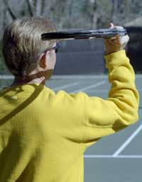

**Without a service grip, you're doomed to the \"waiter's\" delivery. It may work fine when serving martinis, but it won't deliver power and spin.**

Let's start with the grips. Plain and simple, there are just too many
players using eastern forehand and even semi-western grips when serving.

| 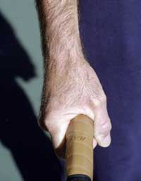 | generated](media_private-lessons-the-serve/media/image3.jpg) |
| --- | --- |
| **The two viable service grips, the continental\ | | | (above) and the eastern backhand.** |  |
| 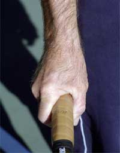 | confidence](media_private-lessons-the-serve/media/image5.jpg) |

For the novice or the unschooled veteran, these grips feel supportive,
but invariably using them leads to the \"waiter's position.\" It's
called that because it appears as though the player is supporting a tray
of food with the racquet prior to swinging at the ball.

In other words, the wrist is laid back and the elbow points down. This
places the racquet head parallel to the ground.

From here, all the player can do is hit a flat, straight-ahead ball with
very little margin for error. When players try to hit the ball hard,
this serve never goes in. Under pressure, all too often it leads to a
dink or what I call the \"granny tap\" serve.

**The correct service grips are the continental (the initial grip to learn**), and for some players, even the eastern
backhand.

But the rub in learning the service grip is that for most players, their
first attempts result in mishits and or serves that are overly sliced.
Consequently, the continental grip is dropped and the old reliable,
one-dimensional serve reappears.

So players reach a plateau with the old serve. They chose not to deal
with the limitations, simply because of the immediate lack of results.
This is criminal! Half the battle is just allowing the grip to feel more
natural over time. The reality is this could be no more than a couple of
practice sessions away!

                                                           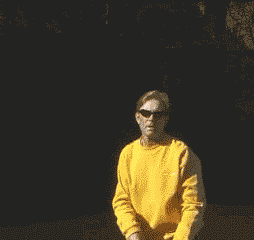
                                                                The backswing and movement to the cocking position.
  -------------------------------------------------------------------------------------------------------------------------------------------------------------------------------
  -------------------------------------------------------------------------------------------------------------------------------------------------------------------------------

  -------------------------------------------------------------------------------------------------------------------------------------------------------------------------------

### The Racquet Path

The second half of the battle is to have a clear understanding of the
path the racquet must travel relative to that grip change.

Taking only your hitting arm into account, there are four movements it
should make when serving:

1.  The cocking position

2.  The racquet drop

3.  The upward swing to the ball

4.  The follow through.

Using the continental or eastern backhand grips facilitates all of these
movements.

To initiate the backswing some players let the racquet head drop while
others will lift it straight up. This is strictly a matter of preference
but either way two things are imperative.

|  |  |
| **Two views of the racquet drop. Note the racquet is perpendicular to the back-but definitely not scratching it.** |  |

**\ The first is that the**racquet face stays closed**(an open face on the takeback will force the elbow into a permanently low position).The second is that at the conclusion of this phase, the tip of the racquet is straight up and on edge (hitting surface parallel to the side fence).This is the cocking position. At this point the elbow is bent creating a \"V\" formation from theshoulder to the elbow to the hand.** This cocking of the
racquet is a part of what's called the \"trophy position\" that I'll
discuss in more detail in part two.

**The cocking position automatically begets the next phase, the racquet drop**. **As the elbow is driven forward and upward, the racquet head responds by dropping straight down more or less perpendicular to the back.**

                                                      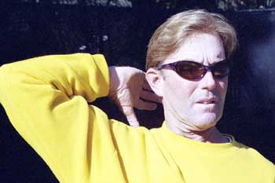
                                    **A good way to set the racquet in the drop position is to visualize touching your thumb to your shoulder.**
  --------------------------------------------------------------------------------------------------------------------------------------------------------------------------------
  --------------------------------------------------------------------------------------------------------------------------------------------------------------------------------

  --------------------------------------------------------------------------------------------------------------------------------------------------------------------------------

Another way of accomplishing this is to imagine touching the base of
your thumb to your hitting shoulder from the cocked position. You won't
actually touch the shoulder but the elbow is automatically driven up and
out.

**From here the racquet begins its rapid ascent to contact. This is the upward swing to the ball. This is where it can get tricky and discouraging for the uninitiated.There's great incentive here though, because this movement, when correct, provides the serve's single greatest power source.**

When the movement is right there is, an internal rotation of the
shoulder as the racquet is driven upward. This is followed by pronation
of the forearm and an outward rolling of the wrist through impact.

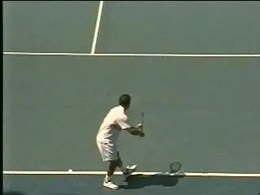

**Pete Sampra Serve**

To better understand this, set your hand on edge at about ear level,
toss a ball up at least as high as you can fully reach and give the back
of the ball a high five.

                                                           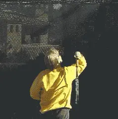
                                    **Watch the internal rotation of the arm and racquet head, and the pronation and the rolling of the wrist**
  --------------------------------------------------------------------------------------------------------------------------------------------------------------------------------
  --------------------------------------------------------------------------------------------------------------------------------------------------------------------------------

  --------------------------------------------------------------------------------------------------------------------------------------------------------------------------------

If you're right handed your forearm will rotate from left to right
placing the palm of your hand at the back of the ball (opposite for a
lefty).

Now try holding the racquet at the throat and set it in a dropped
position on edge. Toss a ball up at least as high as the length of your
hitting arm and racquet, swing to it as if giving it a high five and
stop at impact. The racquet face is now flush against the ball. (You
will accomplish the same result if you imagine hitting the upper left
hand corner of the ball).

Next, try holding the racquet normally and do the same thing until you
can consistently hit the ball squarely. Later on you'll learn to modify
this \"square on\" contact to produce different spins.

### The Follow Through

  --------------------------------------------------------------------------------------------------------------------------------------------------------------------------------
  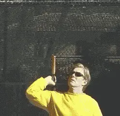
  --------------------------------------------------------------------------------------------------------------------------------------------------------------------------------
  **To get the feel for the internal arm rotation, try it holding the racquet by the throat.**

  --------------------------------------------------------------------------------------------------------------------------------------------------------------------------------

Now you're ready for the follow through.

After you strike the ball keep the racquet going up and out. Your wrist
should roll to the outside and the racquet should decelerate down and
past the left leg (right hander).

Don't make the mistake of stopping the racquet on the right side or
somewhere out in front. These are stunted versions of the follow through
that don't allow for true completion of the swing.

When you're comfortable with the movement of the hitting arm and
racquet, it's time to focus your attention on the toss and the role of
the tossing arm throughout the serve.

All that work you've done on the information above means nothing if
your toss is all over the place!

  --------------------------------------------------------------------------------------------------------------------------------------------------------------------------------
  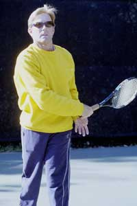
  --------------------------------------------------------------------------------------------------------------------------------------------------------------------------------
  **Don't make the mistake of stopping after pronation. Your arm should be relaxed and continue all the way across your body.**

  --------------------------------------------------------------------------------------------------------------------------------------------------------------------------------

###  The Toss

To me, \"toss\" is a bit of a misnomer because it suggests a throwing
motion**. I think of the toss as more of a \"lift\" in which there's a delicate placement of the ball**. **Prior to releasing the ball it should be on the pads of your fingers, not the tips and not back in the palm.The palm should be facing up, the arm extended and lifted by means of the shoulder.**

Make sure the arm drops so that your hand is just inside the thigh of
your front leg, otherwise you won't get enough momentum to avoid
forcing the toss. The release of the ball should be as high as you can
without tossing it back over your shoulder.

**I liken this release to the petals of a flower opening.Thefingers should \"spread\" away from the ball**
not \"snap\" away from it. A great way to practice this is to work at
tossing the ball so it doesn't spin on the way up.

High-speed video has shown that Sampras is a master of this and he does
it repeatedly during matches! Once you can do this, notice how quiet and
relaxed the lift has become. In the long run **it's more the idea behind the no- spin toss that will make you a better tosser.The high, gentle release will lead to a more accurate placement of the ball on the toss.**

                                                       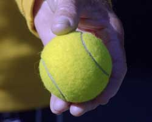
                                                    **Holding the ball on your finger pads at the start of the toss is crucial.Lift the ball with your fingers opening like the petals of a flower.**
  ------------------------------------------------------------------------------------------------------------------------------------------------------------------------------------------------------------------------------------------------------------------------------------------------------------------------------------------------------
  --------------------------------------------------------------------------------------------------------------------------------------------------------------------------------- --------------------------------------------------------------------------------------------------------------------------------------------------------------------

  ------------------------------------------------------------------------------------------------------------------------------------------------------------------------------------------------------------------------------------------------------------------------------------------------------------------------------------------------------

A study has shown that **the world's top players generally toss to a spot somewhere between 8 and 12 inches higher than their point of contact. The toss needs to be at least as high as the length of your hitting arm and racquet but that extra height (within reason) allows for better synchronization of your body to the contact point.**

Another way to practice this is to **stand at tossing arms length from the fenceand reach up and touch the fence at the length of your hitting arm and racquet.** Now
pick a spot about a foot higher and practice consistently lifting the
ball to that spot.

  --------------------------------------------------------------------------------------------------------------------------------------------------------------------------------
  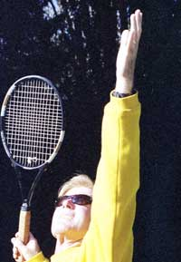
  --------------------------------------------------------------------------------------------------------------------------------------------------------------------------------
  **The tossing arm moves to extensions after the release and stays there until the racquet is cocked.**

  --------------------------------------------------------------------------------------------------------------------------------------------------------------------------------

**Your tossing arm should continue upward after the ball is released so that it's extended straight up as if pointing at the ball.**

A common mistake is to discard the arm the instant the ball is released.
Don't do this! It tends to speed up the hitting motion, prematurely
open the shoulders and create a jack-knife effect on the body.

**The reality is the arm should remain extended until the moment the racquet reaches the tip up or cocked position.When the tossing arm does release it should fold into your mid-section with the elbow bent at more or less 90 degrees. It can either stay there for the remainder of the serve, or (more commonly) precede the racquet to the follow through.**

Work on these elements individually, then simultaneously, and get ready
for part two!

**Scott Murphy** is from Marin County, California where he started
playing tennis at age 5 in a family of tennis nuts. Both of his parents
were major influences in his development. He also took lessons from
Marin legend Hal Wagner and former top 10, Harry Roach. Scott is a
graduate of the University of California at Berkeley where he played
baseball and football but continued to work on his tennis game with
renowned coach Chet Murphy. He was the head pro at San Domenico/Sleepy
Hollow Tennis Club for over 20 years. He also directed the Nike Tahoe
Tennis Camp at the Granlibakken Resort for 10 years. Scott now teaches
privately in Ross, Marin County and in the summer he directs the Tuscan
Tennis Academy which he founded in Quarrata, Italy.

Check out Scott's website at
[scottmurphytennis.net](http://www.scottmurphytennis.net)

You can contact Scott directly at: <scottmrph@yahoo.com>
