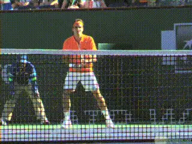
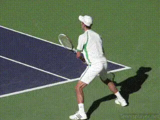
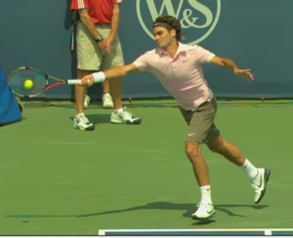
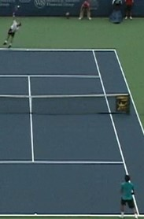
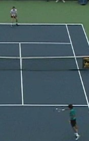
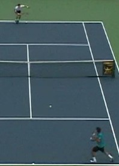
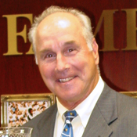

# Return of Serve - The First 3 Principles

**Return of Serve:\ The First 3 PrinciplesBill Tym**

**40% of your effectiveness comes from return of serve.**

Mastery of the return of serve is crucial to achieving your tennis
potential. How important?

I have long contended that, directly or indirectly, 40% of your
effectiveness is attributable to your serve and another 40% to your
return. Notice I say directly or indirectly.

Aces and other unreturned serves are not the only factor contributing to
the 40% figure for the serve. What an effective serve sets up is also
critical.

For example, take the common "serve plus one" pattern where the server
hits a strong serve which is weakly returned and the server steps in and
hits a forehand winner. The match statistics show that the forehand won
the point but, in reality, the serve played a pivotal role in the
point's outcome.

Similarly, if the returner effectively neutralizes a good serve, or even
better gains an offensive position with the return, and then
subsequently wins the point, the effective return played a significant
role in the point's outcome.

Assuming the 80% figure is anywhere close to correct, logic dictates
that you should devote a very large part of your practice time to
mastering the serve and return. Unfortunately, many players do not
devote nearly the time and methodical practice they should to those two
shots, particularly the return.

The purpose of this first series of articles is to highlight the
critical technical, strategic and mental aspects of the return.

**What are the first 3 basic principles on the return?Consistency and Accuracy**

This article will cover the first 3 basic principles of the return.
These are consistency and accuracy, the position of the racquet head,
and watching the ball properly. Subsequent articles will cover the other
basic principles and then move on to technical variations such as the
lunge return, then return strategy and finally how to effectively
practice the return.

When giving classroom presentations, I often write on the board the
letters A, P , M and C. I then ask the class to place those letters in
any order that forms an English word. There is only one correct order: C
-- A -- M - P.

I then mark on the board that C stands for Consistency, A stands for
Accuracy, M stands for Mobility and P stands for power. In my view, you
should learn the game in that order.

Introducing power prematurely in the development process often leads to
players having incomplete games. Furthermore, when returning a big
serve, you don't even want to introduce the element of power.

The serve already supplies the power. Your goal is to stabilize the
situation to enable you to hit an effective return. The objective is to
consistently hit returns accurately to your targets and be able to do
that while moving to intercept the serve; in other words the C, A and M
in "CAMP". Do not worry about the P on the return.

**Most Important Factor**

Many factors can contribute to a successful shot, whether a return or
other stroke, such as good preparation and balance. But the single most
important factor is the exact position of the racket head at the moment
of impact in relation to the path of the incoming ball.

*Video demonstration — the original video for this article was hosted on TennisPlayer.net.*

**As demonstrated by Roger Federer, pros are masters at placing their racket in the correct position at the point of contact even with both feet in the air and lunging on the return.**

This is the first basic principle. If a player has the racket face in
the proper position at contact with the strings pointed towards the
target, there is an excellent chance the shot will go to that target.

We have all seen a beginner mishit practically every ball but then
miraculously hit a good shot. The miracle shot did not result from the
beginner somehow transforming his technique on that one shot. Instead,
the cause was that the beginner luckily delivered the racket head to the
right position at the point of contact.

Pro players are masters at delivering the racket head to the right
position at contact even when leaping, falling off balance or otherwise
being in a compromised position. Always keep in mind this most important
factor and put your attention to your racket face and its position at
the point of contact.

In a subsequent article in this series, I will explain in detail the
relation of the position of the racket head to your primary target---the
point over the net and secondary target--spot on your opponent's
court.

**Watching the Ball Properly**

I teach my students a mental routine to perform after any point in which
they make an error. The routine includes asking themselves questions.
The first question is "Did I make solid contact with the ball?"

If the answer is no, the first follow-up question is "Did I properly
watch the ball? Watching the ball is the second principle.

To successfully watch the ball in the context of the return of serve,
focus on the moment your opponent's racket makes contact with the
serve. This combined with a good split step enables you to properly
react to the serve.

Now focus on the moment the serve bounces in your service box. This
helps you track the ball into your racket.

The next moment is when your racket face makes contact with the return.
This combined with keeping your head still at contact is the most
critical element in ensuring solid contact. Three of the greatest
players in tennis history, Federer, Bjorn Borg and Chris Evert, were/are
masters at watching the ball and keeping their head still at contact.

*Video demonstration — the original video for this article was hosted on TennisPlayer.net.*

*Video demonstration — the original video for this article was hosted on TennisPlayer.net.*

**Roger Federer demonstrates the three key times to focus on the ball: (1) when the server makes contact, (2) the moment the ball bounces in your service box and (3) the moment of contact on your return.Starting the Process**

Another critical component of watching the ball is when you should start
that process. Waiting until the ball leaves the server's tossing hand is
too late. You should start watching the ball as the server is bouncing
it and then continue to watch it as the toss hand rises up to release
the ball and continually watch it for the remaining part of the return.
One of the reasons I advocate watching the ball from the moment the
server starts to bounce the ball is that it gets your mind attuned to
the rhythm of the server. Also, some players will bounce the ball an
inconsistent number of times and unless you are absorbed in the process
at that stage you may not be fully ready when they start their actual
service motion.

As you advance, you will, in addition to becoming better at watching the
ball, start to notice advance cues as to where the server will be
hitting the serve. This not only includes toss location (though some top
players are able to hit multiple serves off the same toss) but also such
factors as how soon the server's shoulders open up into the hit.

Stay Tuned for the other critical principles!

Bill Tym, a USPTA Master Professional and past USPTA national president,
has been involved in tennis as a coach, player and administrator for
half a century. He coached the Vanderbilt University men's tennis team
to its first NCAA tournament. As a player, Tym was a Southeastern
Conference singles champion at the University of Florida. He also
competed on the international tour and won 10 national and international
titles.

As executive director of USPTA, Tym helped create a standardized
certification test. Tym was named USPTA Professional of the Year in
1982, College Coach of the Year in 1989, and Touring Coach of the Year
in 1997 and 2002. He also received the George Bacso Lifetime Achievement
Award from the USPTA in 2001 and the International Tennis Hall of Fame
Tennis Educational Merit Award in 1981.

**Bill wishes to acknowledge TPA founding investor Ed Weiss's help in preparing this article.**
