# Secrets of Spanish Tennis - Paradigms and Superstructure

**Secrets of Spanish Tennis:\ Paradigms and SuperstructureChris Lewit**

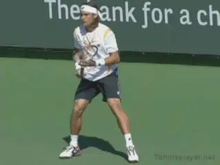

**Why have the Spanish succeeded in developing world class players?**

Spanish Tennis or the Spanish method has become synonymous with
world-class tennis success in the past 20 years. What makes Spanish
tennis so unique?

What exactly are those Spanish coaches doing so differently to develop
superstars that other systems are not doing? To answer that question
over the last several years, I have visited many of the top Spanish
academies and studied with and interviewed some of the leading coaches
in Spain.

As it turns out the Spanish success is not really due to a technical
teaching methodology. Rather is it is a confluence of philosophical
assumptions and training techniques, combined with cultural and even
geographical elements.

In this article let's first look at certain paradigmatic elements and
the unique cultural superstructure of Spanish tennis. Then in upcoming
we will turn to some of the oncourt "secrets" utilized by the
country's top coaches.

Miguel Crespo is a leading Spanish Sport Science researcher, a coach,
and the head of the ITF research office based in Spain. He identifies
eight factors that have contributed to Spanish success, elements which
are unique to Spanish history, culture and geography:

**Key Elements in Spanish Tennis:5. Weather6.Clay Courts7. Role Models and Mentoring8. Intensity and Hard Work1. The History2. Tournament Structure3. Competitive Club System4. Strong Coach Education**

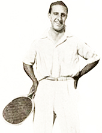

**Manuel Alonso: Wimbledon finalist 1921.History**

The Spanish have a proud tennis culture and believe strongly in honor
and tradition. The first great Spanish champion, Manuel Alonzo reached
the Wimbledon final in 1921. They've had Grand Slam winners from Manuel
Santana in the 1960s, to Andres Gimeno and Manuel Orantes in the 1970s.

Starting with Sergi Bruguera and then Carlos Moya (who was the first
Spanish man to reach the No.1 ranking) in the 1990s, and of course
Rafael Nadal in the 2000s (one of the greatest players ever), young
Spanish players have a tradition of champions that makes them believe
that it is indeed possible to be the best in the world and win major
titles.

There is also a strong tradition of sportsmanship that permeates
training models. All students are expected to give their best and to win
with honor and integrity.

**Tournament Structure**

Spain has one of the best, most comprehensive schedules of national
junior, International Tennis Federation junior and professional circuits
of events of any country in the world. Many top coaches have impressed
upon me how important it is to have so many events, both pro and junior,
all within driving distance from one another, or a short flight or train
ride away.

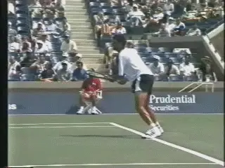

**Sergi Bruguera first of the modern tradition of Spanish champions.**

This cluster of high level junior and professional tournaments is a
tremendous developmental advantage and can make the move up the junior
ITF and professional rankings more manageable and convenient for the
players. Also, coaches are able to travel more frequently to watch their
players because events are close to home. It is possible to play just
professional circuits the whole year in Spain, all within a 4-8 hour
radius of Barcelona, for example, without ever getting on a plane.

And Spain's location makes traveling to other European events very
convenient as well. Barcelona has direct flights with destinations all
over the world from its international airport, which has made it a very
popular home base for many ATP/WTA professionals.

As one Spanish coach said, "In Spain, we have the three things that a
player needs to improve: coaches, tournaments and players. And now more
than ever before, everybody is coming here to Spain ... The best thing
is to have the three things together. You don't find many places with
that."

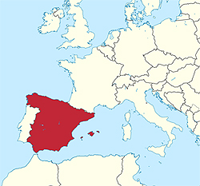

**Spain, one of the best tournaments schedules, and close to the rest of Europe.Strong Coach Education**

Spain has a strong grassroots system with a good coaching education
program in place. The RPT, founded by Luis Mediero, is a private coach
education provider while the RFET (Spanish Federation) also offers
strong beginner to advanced high performance level courses.

**Competitive Club System**

Spain has many strong local club programs and the clubs offer
interleague competition teams which serve to help identify young,
competitive kids who may have the talent to play the game at a high
level.

**Weather**

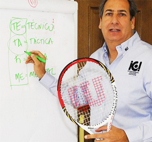

**Luis Mediero: a leader in Spain's strong coaching education.**

The weather is similar to Florida, sunny year-round with mild
temperatures in winter. Minimal rainfall allows outdoor play on the red
clay year-round, which is a major advantage for Spanish players.

The hot months of July and August and the generally warm climate help
toughen players physically and prepare them for the grind of a long
match outdoors. Players in southern Spain train in even hotter climates
than those in Barcelona.

Former world No. 1 doubles player Sergio Casal, cofounder of the
Casal-Sanchez Academy, perhaps described it best: "What happens here?
It's windy. It's sunny. It's hot. And it's slow ... And you have to
play. You get strong here. Here you can build everything."

In search of better weather and training conditions, Andy Murray came to
Spain at a young age to train at the Sanchez Casal Academy . Many other
young British hopefuls have since followed.

Marat Safin came to Spain at an early age to hone his game on the red
clay. Other Russians and Eastern European players have followed him,
including Marat's sister Dinara.

**Clay Courts**

The ubiquitous red clay courts of Spain are perhaps the true secret of
Spanish tennis. As all Spanish coaches will testify - the clay helps the
development of tennis players in myriad ways.

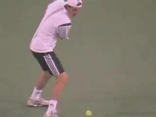

**Marat Safin, one of the first great champions who came to Spain from other countries.**

"We play a lot on clay in Spain because we have a lot of clay courts
and it's good for learning the game," said Javier Piles, long-time
coach for David Ferrer, the 2013 French Open singles finalist. On clay
the players learn to move and hit their shots on balance even when they
are under pressure and this helps them a lot."

The clay in Spain is very slow, and by slowing down the ball speed, it
becomes very difficult to hit clean winners when the kids are young.
Young players learn to win with consistency and patience, rather than by
trying to go for outright winners.

Because the points are longer, players learn tactics better they learn
how to construct points rather than just hit winners. Players learn how
to position their opponent, hurt them, move them around, and use the
geometry of the court. They learn the chess game of tennis.

The clay is less stressful on the joints of the lower body and the back,
allowing players to train longer with less pain and fewer chronic
injuries. The slow ball speed on clay can assist in the development of
proper technique in young, developing players.

The slow and heavy conditions on the red clay force the player to
develop maximum kinetic chain and racquet speed in order to successfully
compete. Players learn by necessity to develop strong acceleration.

*Video demonstration — the original video for this article was hosted on TennisPlayer.net.*

Spain's clay courts: ubiquitous and slow.

The inherent instability of the clay surface helps players develop
better dynamic balance, stability on the run, and general lower body and
foot coordination.

**Role Models and Mentoring**

During my travels in Spain, I was very surprised at the relative
cooperation and friendliness between the elite coaches and academies.
Even though they are competitors, they each understand their role in
development and work together when possible to help Spain.

The same inter-academy cooperation and support is also demonstrated by
the individual players in Spain, who are in general, very humble and
down to earth, and willing to help their compatriots succeed. There is a
"rising tide lifts all boats" mentality, ratherthan a "scorched
earth" competitive approach.

Role models and mentoring are an important component to Spanish success.
Emilio Sanchez called this the importance of "generations."

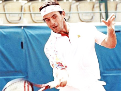

**Emilio Sanchez stresses the importance of "generations."**

Spanish players believe in helping the next generation of players to
improve Spanish tennis as a whole. Time and again at Spanish training
centers, I've seen older pros training with younger junior players
without whining or complaining. The Spanish have somehow inculcated this
generous nature towards countrymen in the majority of its successful
players.

As former world No.2 Alex Corretja said to journalist James Goodall,
"We are like a family and we always try to help each other as much as
we can.

"When I started, a lot of the top players like Alberto Berasategui and
Carlos Costa helped me to become a good player by letting me share
coaches and practices with them. I learned a lot from them as a player,
and now with this knowledge and my experience, I'm trying to do the
same as a coach with the players I work with."

The mentoring approach was adopted not only by players, but by coaches,
like Pato Alvarez and Lluis Bruguera, who were open and eager to share
their knowledge with the younger generation of talented coaches. Even
today, Pato and Luis are happy to share their knowledge with any coaches
who come to visit them. ([**link**](https://www.tennisplayer.net/members/%20famouscoach/famouscoach.html) for
Chris Lewit's interviews with Lluis Bruguera.)

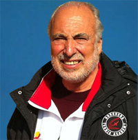

**Luis Bruguera: eager and open to share with younger coaches.**

The Sanchez-Casal Academy even offers a training course in conjunction
with the RPT to train any coach who is interested in their "Spanish
Method." When I asked Casal why they offer such a course, he stated
earnestly that they really wanted to help improve tennis around the
world by sharing their system.

Coming from the hypercompetitive world of high performance tennis in the
United States, this statement really left an impression on me. In
Goodall's article "Spain's Generation Game" published on the ATP
World Tour's website, he described Spain's commitment to helping the
next generation for both coaches and players: "

Then, the same situation triggered the next generation; younger coaches
learning from older ones, they see the results, they imitate, and they
keep on progressing and so a successful system was formed./I One of the
products of that system, 1998 and 2001 Roland Garros finalist Corretja,
stressed it wasn't only the coaches who were key, however; but that the
older; more experienced and higher-ranked players themselves also
fulfilled an important role by mixing with the juniors at that time.

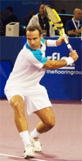

**Alex Corretja stresses the importance of high ranked players mixing with juniors.**

"This is very important in the development of the younger players,"
said Corretja. "When I was young I was lucky enough to practice with
players like Emilio Sanchez and Carlos Costa as well as many others and
it was unbelievable for me as I was dying to get on the court with them.

"When I was a little bit older I used to practice with some of the
younger players coming through like Carlos Moya and Juan Carlos Ferrero,
and now the young guys in Spain are practicing with them so it works
really well."

Having benefited from the system himself, Corretja believes older
players have a duty to nurture young talen. The point wasn't lost on
Moya, who famously took Rafael Nadal under his wing when the Mallorcan
was a young teenager taking his first tentative steps on the
professional circuit.

"I got to know Carlos way before I started playing on the tour and I
practiced with him a lot back home in Mallorca," said Nadal. "I
trusted him and he gave me a lot of confidence."

Spain's focus on blending the generations not only provides mentoring
support for players but also helps to reinforce the competitive spirit.
Said Albert Costa, the 2002 French Open champion, "The role models are
very important. And here in Spain, here in this Academy, we have Albert
Montanes, Nicloas Almagro, Feliciano Lopez, a lot of professional tennis
players and they practice with the young players.

"They play with them. For the juniors it's good to see the difference
of the levels. It's very, very important."

This unusual amount of inter-academy cooperation, coach and player
mentoring and role-modeling, and friendly competition between
compatriots has been an incredible asset to Spanish tennis development
as a whole. Other countries would be wise to encourage a similar culture
of generosity, humility, sharing and cooperation.

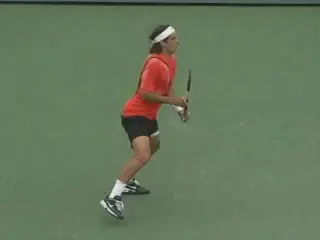

**Elite players like Feliciano Lopez practice with juniors at the Spanish academies.Intensity and Hard Work**

Intensity and hard work are qualities shared by the players and also the
coaches. Albert Costa summed this up perfectly when he said, "The most
important thing with drills is the intensity. If you make drills with
intensity, full of concentration, that's the only way you can improve
your tennis."

This mentality is evident throughout Spanish tennis. Said Spanish coach
Alberto Lopez, "The most important thing is the mentality. We are
really fierce . This is our game."

These eight contributing factors--coaching philosophies and methods
aside--have been tremendously important in Spain's rise to dominance
in the tennis world. Next let's look at some of the actual on court
secrets.

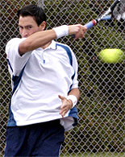
