# The Classic Forehand Volley

### Paul Cohen

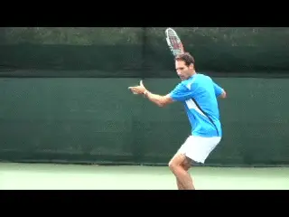

**All credit to Jeff for adding net attack based on his powerful groundstrokes.**

If you read Jeff Greenwald's article last month ([link](https://www.tennisplayer.net/members/members/mentalgame/jeff_greenwald/the_opportunity_attack/))
on incorporating attack into his game, what he says is true. I am the
coach who told one the top senior players in the world that he was
playing some of dumbest tennis I'd ever seen.

As Jeff explains, that meeting was the start of a collaboration that led
to major changes in his game, something that was unusual impressive for
such an accomplished player.

Basically, Jeff learned to use his formidable baseline weapons to set up
opportunity attacks, close the net, and win many points with relatively
easy volleys. As he explains in his article, these changes were critical
in winning a world seniors championship.

All credit goes to Jeff, but I was honored to be a resource for him in
this process. In this article I want to explain the basic work we did
together to improve his technique on the forehand volley, technique that
is ideal for players at any level. Then in a subsequent article we will
look at the backhand volley as well.

**History of the Volley**

**Pancho Gonzalez: a master from the golden volley era.**

The reality is that the volley is currently a vanishing shot at every
level of the game of tennis. Roger Federer beat Pete Sampras, his idol
and role model, in a 5-set serve and volley match at Wimbledon in 1999.
Fast forward 13 years to this year's Wimbledon and Federer defeated
Andy Murray playing primarily from the baseline, as he has for most of
his incredible career.

Today's Modern Game is the Great Groundstroke Era. The Great Volley Era
was from the 1940s through the 1990s.

History's best volleyers included players like Jack Kramer, Pancho
Gonzalez, Lew Hoad, Ken Rosewall, Tony Trabert, Rod Laver, Frank
Sedgeman, and Roy Emerson. There there were players like John Newcombe,
Tony Roche, and Fred Stolle.

Finally, we saw John McEnroe, Stephan Edberg, Boris Becker, and Pete
Sampras. These players represented the end of an era.

There is little argument that today's modern tennis players have the
best groundstrokes in the history of the sport. But the players of the
Gonzalez generation were the best volleyers.

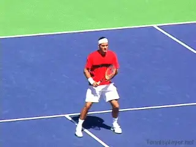

**Modern players often separate the hands too soon making contact slightly late.**

Today's volley quality is well below that level. Today's players
certainly have the talent to raise their technique and volley as well as
anyone, past or present.

But statistics prove that they just don't do it in matches. The volley
in this generation has atrophied because the modern game is primarily a
backcourt slugfest.

In pro tennis, the best volleyers play doubles, not singles. Because
Federer, Nadal, Djokovic, Murray and most of the big names do not play
regular doubles, their volley skill, feel and control has not developed
with the rest of their games. They are good volleyers, not great
volleyers.

Consider this: in a Federer versus Nadal three set match, each player
might come to the net 5-10 times. And then usually, they will hit only
one volley before the point ends one way or another, often with a huge
topspin pass.

First volley short volleys and touch angles are rarely seen. Second
volleys hardly exist.

**Forehand Volley Flaws**

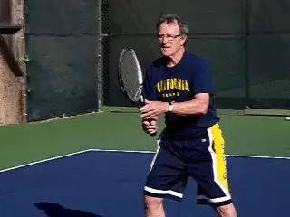

**The classic or what I call the "low" or "two hand" forehand volley.**

Most pro players today have fairly good backhand volleys. But few have
great forehand volleys. This is because the forehand volley is the more
difficult to hit.

Most backhand volleys are hit early, well in front of a player. But if
you watch closely, you will see the contact points on the forehand
volley today are hit slightly late.

This is related to the use of the hands in the preparation. Rather than
pushing forward together, they separate too soon, as we will see.

We do not see players battling at the net, hitting multiple volleys.
These battles belong to the Gonzalez generation. They were beautiful.

But today's big baseline and midcourt groundstrokes and heavily spun
passing shots are more powerful than any volley. This is a shame because
attacking points finished at the net are far more dramatic than numbing,
30 ball baseline exchanges.

**Classic Forehand Volley**

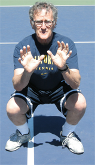 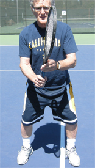

**Like a catcher in baseball, the classic forehand volley makes use of the legs and keeps the hands in front.**

There are actually several types of forehand volleys. But in this
article I want to explain the one I prefer and the one that I presented
when I worked with Jeff.

This is the classic forehand volley, or what I sometimes call the low
volley--not because of a low contact position, but because of the way
players use their bodies and legs.

I prefer using the legs as much as possible on the forehand volley,
hitting the ball well in front of you, and keeping the wrist laid back
about 45 degrees.

Imagine that you are a catcher in baseball, squatting down, reaching for
the incoming pitch with both hands. Now, stand up but still bend your
knees. This use of the legs is one of the factors really missing from
the modern pro volley.

The other key factor is the use of the hands. I call my preferred
technique a "two handed volley," but I don't mean players should make
contact with both hands on the racket.

A two-handed forehand volley means that both hands reach forward to
position the racket head behind the ball. This is critical to create
early contact.

I believe this technique is not only more effective, it is easier for
all levels of tennis players including touring pros. It forces you to
move to the ball, weight forward, with your eyes closer to the flight of
the incoming shot.

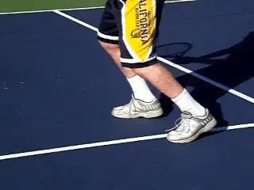

**A look at the step forward with first the right leg and then the left.**

To feel how this works, without your racket, have someone throw a tennis
ball to you underhanded. You will naturally reach with both hands.

Note that your right hand catching the ball has your wrist bent back
about 45 degrees. Notice how your hand and fingers naturally squeeze the
ball when you catch it. This is same feel you want for a high quality
forehand volley.

**The Progression**

Start with the ready position, which is the same for the forehand and
backhand volleys. Hold the racket with a Continental grip. The body
position is "low" with the knees bent, and the back and shoulders
slightly sloped forward.

If you are just learning, or have a poor forehand volley, grip the
racket in the Eastern Forehand grip. As you learn the shot, you will
gradually change to the Continental grip.

Your preparation is simultaneously with your feet and your hands. The
step is forward and somewhat to the side with the right foot.

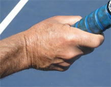

*Video demonstration — the original video for this article was hosted on TennisPlayer.net.*
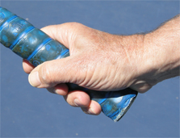

*Video demonstration — the original video for this article was hosted on TennisPlayer.net.*

**Two views of the continental volley grip--the same for forehand and backhand.Simultaneously as you step reach to the incoming ball**with two
hands.**This two-handed move is the critical key to early contact.**

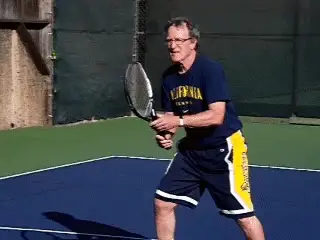

**Both hands reach two feet in front to the ball, with the wrist laid back at 45 degrees.Your racket head will be placed about 2 feet in front of your right shoulder. Yourwrist should be laid back at least in a 45 degree angle, palm pointing towards your opponent.**

Your body is now completely behind the shot. Your eyes are focused at
the incoming ball level. See the ball in front of your body position,
almost as if you are looking through the racket strings at an incoming
ball.

**The idea is to get your head, eyes and body down close to the flight of the ball. If the ball's plane is higher, your body will naturally straighten up.Now step forward with your left foot. Your strike is a short downward, angled punch, leading with the bottom edge of the racket, stopping at contact point.Squeeze the racket handle at contact point with a strong grip, mostly with your last three fingers. Stop your racket head at contact point for control, power and backspin.Once the ball is hit well in front of your body, you see the shot perfectly with both eyes.**

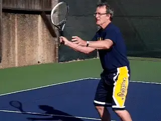

**Step forward and make a short downward strike, leading with the bottom edge of the racket.**

The art of the strike is to feel the "play" of your racket head and
hand on the downward 45 degree angle strike, yet at the same time, being
firm at the contact point.

Do not guide your volleys with long finishes unless the oncoming ball is
very slow. Your squeezed grip feel will have a bit more pressure on your
last three fingers, not your thumb and first finger.

**Do not lean forward in your recovery position. Recover to the ready position and keep your feet moving! Be ready for any reply, especially a lob.**

Wide, low and reaching balls cannot be hit as far in front of you as a
straight incoming ball. These struggling balls are contacted naturally
with less wrist laid back.

You will be fighting for your life on these shots. Keep your head held
through contact point for a split second and keep a firm grip, beveling
your racket head as you undercut/slice your low, wide and reaching shot.

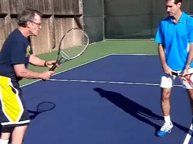

**Demonstrating the key first move in my work with Jeff.**

High balls are more natural shots. Most are easy to hit in front of you.
If the ball is slow and floating, take a bolo punch long stroke, wrist
laid back, soft hand, semi full natural full swing, level off your
hitting plane and whack your shot.

A first angle soft touch volley is almost extinct. John McEnroe's angle
volleys, first and second were the best in the history of the sport.
Hook your wrist, watch the ball carefully, keep your grip and hands soft
and catch the outside edge of the ball.

This shot is tremendously effective for a player like Jeff who can hurt
his opponent with a heavy forehand approach, close fairly tightly to the
net, and then angle the ball crosscourt on a sharp angle for a winner.

Besides the basic work on his technique, this short angle was key volley
we developed with Jeff, also working with Rod Heckelman on this shot and
the short angled overhead. ([link](https://www.tennisplayer.net/members/classiclessons/rob_heckelman/incorporate_approach/)
to read Rod's article on the drills he did with Jeff that were critical
for him in mastering the transition and attacking game.)

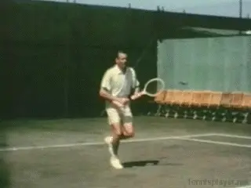

**The Kramer volley as explained to the Brain Trust.Post Script**

Many years ago, our brain trust of Instruction Editors at World Tennis
Magazine--then the leading voice in the sport--met in New York City to
discuss the next year's instruction program.

The subject of the forehand volley came up. Both Fred Stolle and Cliff
Drysdale demonstrated a firm somewhat straight wrist, chop down punch
forehand volley, not hit very much in the front of the body.

Then I demonstrated the low body position contact in front, 45 degree
angle forehand volley just described. Jack Kramer didn't say a word.
Jack just put up his hand about two feet in front of his right shoulder,
laid the wrist back 45 degrees and punched leading with the bottom edge
of his hand. Enough said.

Captain of the University of California, Berkeley
tennis team. Paul worked with dozens of elite,
world class touring players and Grand Slam
winners, including 5 men's and women's
Wimbledon champions. Paul was John McEnroe's
coach, built the tennis games of the Williams
Sisters and was an Instruction Editor of World
Tennis magazine for two decades when World Tennis
was the world's leading tennis publication. Paul
coached hundreds of top national and
international boys and girls players who
succeeded at the top levels of sectional and
national competition. Paul's competitive record
included national champions in every age
division: junior boys, junior girls tennis, NCAA
and 21 and Unders. Currently he is working on a
new book and coaching privately in Marin County,
California. [Click
here](mailto:paul@cohenresearch.com) to email
Paul directly.
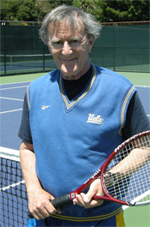                                                                                                                                                       played in two Grand Slam events and was the
