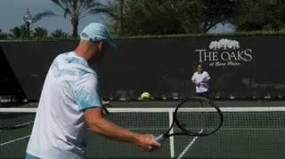
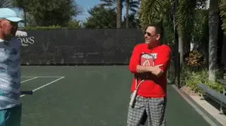
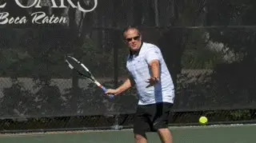
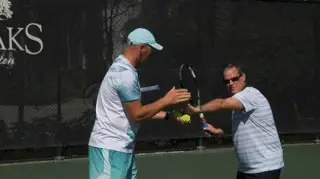
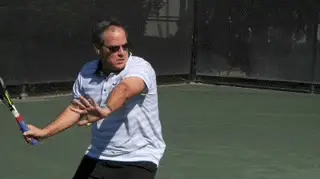
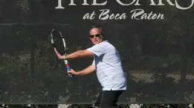
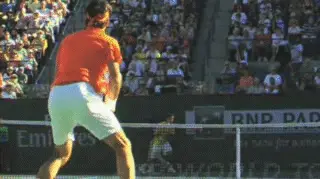
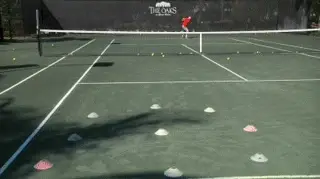
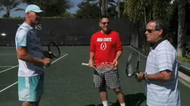
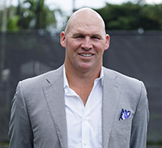

# The Keys to Great Lessons

### The Keys to Great Lessons

### Kyle LaCroix

**Have you pondered what you should look for in a teaching pro?**

What should you look for in a teaching pro? It's a question not enough
students ask and it can be the key to your lesson experience and
development as a player.

In the two decades that I've been a tennis teaching professional and
coach I have worked with and learned from some truly great teachers and
coaches. Some great coaches are well known on the national and
international levels, others fly under the public radar yet do
incredible work.

I've also been a tester, certifying those who wish to join the USPTA.
In that time, I've seen over 700 applicants and personally mentored
over 40 professionals.

Every teaching pro, as with every person, is different and has his own
particular style. But in my experience there are important common
denominators shared by all good teachers and coaches.

**Asking**

Good pros begin by asking you about yourself and what you want to work
on. They ask you what you want to improve and what like or dislike about
your strokes and game style. They ask if you are a singles or doubles
player.

**When good pros meet new students, they ask questions.**

They ask you about your preferred strategies or if you even have them.
Are you a grinder, a hard hitter? Do you like to hit slice and drop
shots? How do you feel about the net?

**Paralysis**

Too many young teaching professionals paralyze students by sharing every
piece of information they know. But understand that if you are a good
teacher you will develop long term relationships and share you knowledge
over the course of the student's technical development.

I remember an applicant I tested who was an absolute tennis fanatic. He
had a real zest for the virtues of the sport. During his 30 minute group
lesson, he became so wrapped up in his own knowledge that that he spent
29 of the 30 allotted minutes talking.

Identifying the root cause of a player's strokes, correcting them and
allowing students to have the most effective stroke possible is what a
great teacher lives for. The tragedy that happens on many teaching
courts is that inexperienced teaching professionals confuse the true
cause of stroke errors with the symptoms.

**Observation: Jason's shoulder turn and Chip's recovery step.**

Player's strokes can have a myriad of problems. I've actually seen
teachers get physically ill contemplating how to approach a stroke with
a hornet's nest of technical dilemmas.

Do you seem to go round and round in lessons with a large number of
"corrections" that sound like they make sense, but none of which
really pulls the stroke together and makes it more functional and
effective?

The right adjustment can naturally correct or eliminate other technical
issues. The art of teaching is finding what that is. If the information
you are receiving seems too complicated and confusing, it probably is.

Recently John Yandell filmed parts of two lessons I taught to students
at the Boca Oaks where I am the head professional. When I looked at
Jason's forehand, I observed that his shoulder turn, although good, was
not complete and lacked a complete left arm stretch.

Chip had a one-handed backhand that had many great technical elements,
but nevertheless he tended to rotate too much through the shot, bringing
the rear recovery foot around too soon.

**Actual Change**

Identifying the primary problem is the first step. But actual change
requires more than analysis. Players learn verbally, visually, and
kinesthetically.

**Working on the same side of the net to give the student direct, non-verbal input.**

Great teaching tailors the solution to the learning style. This means
making sure the student understands the correction in the medium that is
most natural, and can reproduce the new motion physically without the
ball. Great teachers find a visual image, a physical position or body
movement, and usually a swing thought describing the correction.

Another question the student should asking themselves: is the pro
organized? The pro needs to let the student know what he is attempting
to do. But he also needs to communicate the progressions he will use.

One obvious example is feeding. Is everything done out of the basket at
close range? Or does the pro gradually increase the degree of difficulty
as the student progresses, coming closer and closer to simulating match
play?

A common problem for players is taking a lesson that involves simple
basket feeds from the net, feeling improvement, but not being able to
translate it into actual play away from the lesson court.

It's important that the student have at least some significant success
mastering changes in basic feeding. But the teacher should also help the
student understand that fully integrating change is almost never
immediate. Great teachers help the student feel positive about
incremental change in the right direction.

**It's important that students have initial success in implementing change.**

Good pros work overtime to match the degree of difficulty to the
improvement of the student. Another important aspect to watch for: does
the pro begin to integrate technical improvement with the player's
tactical style, showing him how to actually use the stroke in matches?

Throughout this process a skilled teaching pro is careful not to
overwhelm the student with difficult situations and to keep the ratio of
success high. In the words of the great Welby Van Horn, **"Never put a student in a situation where he or she will fail."**

The balance is delicate. As a student you should feel optimistic and
enthusiastic about your progress. But at the same time you should feel
challenged.

Targets can be a critical part of this process, but they need to be
scaled to the level of the player and the difficulty of the situation.

A basic drill that can be repeated in more and more difficult
situations: making 8 out of 10 ball with 1 mulligan. This is a real
skill test for the teacher: finding that perfect middle ground of
challenging the student while making the process appear seamless and
enjoyable.

**Modern" or "Classic""Modern" or "classic" strokes: To teach or not to teach? That is also a critical question. Or is it?**

**The pro should also work on integrating new technique into tactics.**

In today's tennis environment now more than ever, tennis teaching
professionals are faced with a serious dilemma. It's an issue that has
become polarizing and personal. Should coaches be teaching their
students with "modern" technique or with "classic" technique?

"Get out of the stone age and embrace world class tennis," is the view
of those infatuated with the new school approach.

"Modern tennis is foolish, confusing and not appropriate for our
players" say hard core traditionalists.

Both sides of the debate can ignore something more fundamental. **The reality is that students can't master classic or modern strokes if they do not have a proper technical foundation that sets up the progressive development.Timeless Elements**

Ultimately, exactly what technical style to develop is a personal
choice. At one point, players like Bill Tilden, Little Bill Johnston and
Suzanne Lenglen were considered too modern due to their "extreme"
swings and styles.

**What is classical, what is modern, and what is timeless?**

What do I teach? I think **there are timeless elements in all good strokes that transcend eras and styles. The danger in teaching the modern game is that these elements can be overlooked in the emphasis on extreme technical aspects.**

Look at the preparation and balance in the set ups on Federer forehand
or Djokovic's backhand. These shots may have "classical" and
"modern" elements to them, but at the end of the day, the core
elements are timeless, and that makes them great.

**It's dangerous to try to put a fancy roof on a house if the foundation lacks structural integrity.That's where the role of the right tennis teaching professional is critical. Look for a pro that helps you establish fundamentals you can build on.Modern Tennis and Juniors**

The same can be said of junior players. The proper fundamentals never go
out of style. But rigidly modeling a junior's game on a single player
is a mistake. The game evolves because the players themselves evolve.
What looks totally modern today may not when a player matures in ten
years.

In conclusion, great teachers and coaches are many things. They are
respectful of the past and hopeful for the future. They are inspiring
for their students and inspired by their students. They understand the
art of the diagnosis and the cure.

**Top Speed**

If you take group lessons, a critical characteristic to look for in a
teacher is whether he or she is moving at top speed. Students need to be
kept engaged. Obviously, this is easier with one student than with a
group.

The level of technical instruction in groups should be lighter, mixed in
with drills. Students need to keep moving and feel engaged for the
entire lesson. With the right speed and flow, the students will gain
rhythm and naturally increase their intensity level.

**Set realistic target sizes that create success.Giving each studentthe**right amount of
feedback [and attempts [allows all students an even
playing fieldand**a sense of togetherness as a group**. [This prevents students from**becoming overly competitive with each other**and
[[jealous of the attention of the teaching pro**.The End**

A good teaching pro never ends a lesson abruptly. Typically, he briefly
reviews the lesson, reminds the student what they worked on and why the
new adjustment was necessary.

Good pros tend to give homework. This can include a visual aid or cue
they can perform while at home. Something as simple as "stand in front
of mirror and execute the proper swing and be sure the checkpoints are
correct."

A great teacher lets the student know that their lesson is not done when
they leave the court. **They should carry the pros ideas and voice with them away from the teaching court.Court Presence**

One of the clear-cut signs of an experienced, knowledgeable and we'll
trained teaching professional and coach is the way they move around the
court. **They have strong court presence.**

Experienced teachers keep the teaching basket nearby like an oxygen
tank, and then effortlessly move it away when it's time to rally. It's
a small but telling detail.

Presence always plays a role when it comes to verbal and nonverbal
communication skills. Does the teaching professional project his voice?
I know it will be an issue when I can hear the professional on the next
court louder and clearer than the court I'm grading on.

How about inflection? Does this teacher raise the tone of voice as he
accentuates a key word in order to highlight its importance?

Enthusiasm is contagious. Students need to feel that you are into the
lesson, that you love what you do, and that you are totally invested in
their development process. If you love being out there, your student has
no choice to follow your lead.

Targets properly used have a beneficial impact. Good teachers don't use
targets for a specific spot on the court, but to define a general area.

For example, they place cones in a circle or square. The students
success rate and belief are increased when they have a realistic chance
to hit the target area numerous times. If the target area is too small
it will only accomplish one thing chipping away at the student's
confidence.

**The Truth**

**Fun is an inherent part of good teaching.**

Students come in all shapes and sizes, ages and ability levels. Every
student has an agenda when they take a lesson. The reasons run the
gamut, from social conformity, to health and weight loss, stress relief
or an after school hobby.

Great teachers are also aware that not every student has dreams from
beating their best friend, to winning their club championship, to
getting a junior ranking, playing college tennis, or even going pro.

Those dreams should never be judged, ridiculed, or dismissed, but
nurtured. They should also be mixed over time with honest feedback about
their reality. If a teacher doesn't care about a student's dreams,
then eventually the student won't what the teacher thinks.

**Fun**

No matter the reason for taking lessons, the student will only be
rewarded if the process is fun. You can't overrate fun.

Your teaching pro should have fun as well. That's what students will
remember and ultimately come back for. They will feel your connection to
them, to your craft, respect your teaching ideology and be thankful they
have you as their tennis teaching professional.

Kyle LaCroix is a USPTA and PTR Certified Professional as well as
receiving his United States Center For Coaching Excellence (USCCE)
Certification. He has been a featured speaking at numerous Industry
Conferences.

Kyle has experience working with ATP/WTA and NCAA collegiate players at
each level of their competitive careers and at every stage of their
professional and personal development. He is recognized throughout the
industry as a reliable, hardworking, genuine presence. Kyle utilizes
great people skills and is an exceptional communicator. He understands
the important roles and responsibilities that federations, coaches and
players carry with them on a daily basis.

He holds an MBA from the University of Michigan and a M.Ed in
Educational Leadership from Stanford University

To find out more please visit
[setsconsult.org](https://setsconsult.org/) 
