# The Opposite Arm - Other strokes - Part2

### The Opposite Arm: Other strokes

### Part 2

### Scott Murphy

In the first article, we looked at the use of the opposite arm in the
groundstrokes. ([link](The%20Opposite%20Arm%20-%20Ground%20strokes%20-%20Part%201.docx).)
Now I'll discuss what I feel is the correct usage of the opposite arm
on the serve, overhead, the return of serve, and the volley. As in part
one, all the descriptions will be for right-handers. Let's start with
the serve!

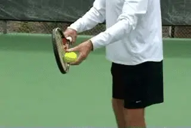

**Key factors: the lift, angle, and extension of the opposite arm.**

I mentioned in the first article that the forehand has the most
incorrect uses of the opposite arm. Well, the serve is a very close
second! For starters, the non-racket arm is the tossing arm, and poor
tosses are the Achilles heel of many a player. A player's service swing
model can be a thing of beauty, but if his tosses are consistently
inaccurate, the model won't be utilized effectively.

**The Toss**

To what degree does the way you hold the ball affect the accuracy of
your toss? There is a range of ways good tossers hold the ball in their
hand, anyone of which may work for you. **What's most important is the momentum or lift from the arm, followed by the angle of the arm, and also, the relative inactivity of the wrist.**
Another factor is the spreading of the fingers as the ball is released.
My suggestion is to **hold the ball so that the middle of the ball rests between the top two joints of your fingers.**
The little finger stays pretty much unattached throughout, but obviously
that can vary from player to player. If you move the ball more towards
the fingertips, you'll be more inclined to snap your wrist back towards
you when you release. This creates excessive spin which can lead to loss
of control and disrupts what should be a very relaxed, deliberate
movement.

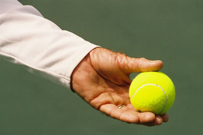
**My suggestion: ball between the top two joints**

Some players hold the ball much further toward the palm, but you rarely
see this with world class players. Goran Ivanisevic is an exception. He
also had a very low toss by modern standards, and I suspect this low
toss corresponds with that type of ball position deeper in the palm. I
think to a great extent the ball's connection with the fingers is what
helps control the toss.

One style I don't recommend is holding the ball with the palm down.
Don't laugh, some players have been known to do this, but I haven't
seen one yet who didn't have tossing problems because of the extra
motion it requires.

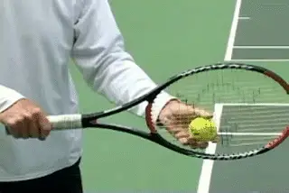\
\
**The tossing arm drops down as far as the inside of the leg.**

At the beginning of the service motion, I think it's best to keep
things simple and that means a more or less straight tossing arm. As the
motion begins, the tossing should drop to some significant degree. The
drop can be as far as to actually touch the mid thigh. It doesn't
necessarily have to go that far, but it should probably go at least
halfway.

This is so the motion creates sufficient lift as the arm comes up. You
could start, as some servers do, with the arm already dropped, but then
you don't get the rhythmic down and up motion. This can make the toss
jerky and rushed. Servers who start with the tossing hand too high are
also in trouble. You see players who have the ball at chest height or
higher. They usually only drop the hand a few inches before starting it
back up. Again, no rhythm and a bigger chance of flipping and spinning.
With so little natural momentum, these players are almost guaranteed an
erratic toss.

**The ReleaseThe point at which the ball is released will also vary among the top players.It can be anywhere between shoulder height and head height.** I like to use"eye level or
above**"**as a reference point. But from what I've
observed, most lower-level players release the ball lower than this,
somewhere between waist and mid chest. With this lower release, the ball
tends to shoot substantially forward. But holding on too long can also
be a problem There's a point above eye level where the release will
cause the ball will go over your shoulder and behind you.

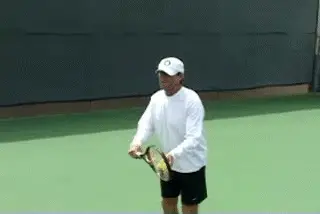

**Release between the shoulder and the top of the head.Releasing the ball somewhere between the shoulder and the top of the head means the ball has a relatively shorter distance to travel to the contact point.The lift of the arm just naturally lifts the ball.All the player has to do is open and spread his fingers. This release point also insures that the tossing arm will follow through to a position of full extension.**

The angle of the tossing arm to the baseline is very important, as John
has pointed out in the Roger Federer serve articles. ([link](../../Stroke%20Analysis/Advanced%20Tennis/John%20Yandell-Roger%20Federer%20Serve%20-%20Part1.docx).)
From the bottom of the drop the arm comes up pointing at an angle across
the baseline. It doesn't point straight at the net as is so commonly
taught. For some players like Sampras it can point almost directly at
the side fence! The exact angle will depend on the contact point the
player develops, and how far left or right he positions the ball.

**Other Functions**

The opposite arm has another function in the motion besides tossing the
ball.**The full extension of the tossing motion is critical to the positioning of the upper body.Once the player reaches extension, he willmaintain this position for a fraction of a second. Note how the shoulders are slanted. This will happen automatically if the tossing motion extends, and it isn't really possible unless it does.**

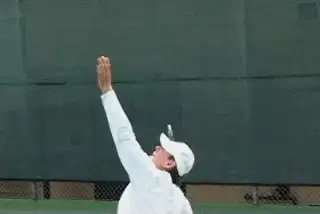

**The opposite arm folds and then leads the follow-through.**

So what happens after the arm extends? This is something else that is
commonly misunderstood and/or neglected.**The opposite arm should relax and then release down into the midsection with an approximately 90 degree bend at the elbow. This acts to slow down the trunk thereby accelerating the arm and racket.**Though some
players will leave the tossing arm in this folded position all the way
to the serve's conclusion,**more commonly the left arm will lead the racket into the follow through. This should happen naturally if the arm is just relaxed. (It's actually somewhat similar to the pace car/race car on the forehand.)**

[**One common misuse of the tossing arm is to drop it rapidly the moment the ball is released. The opposite problem is to leaving it extended too long.The result is that when it finally does come down, it flies off too far to the left instead of folding it into the midsection.Both of these tendencies will disrupt the rhythm of the serve.True Serving**

To reinforce everything I've discussed here I strongly recommend you
check out the Music Videos section and watch the "[True
Serving](http://www.tennisplayer.net/members/music_videos/true_serving/true_serving_large.html)"
segment. It's incredibly pleasurable to watch, but it's also a really
great way to see the range of acceptable options. This may help you
match your choices to your serving style. I also guarantee that just
watching the video a few times will improve your serving. I know because
after watching True Serving about 10 times for this article, I had a
phenomenal serving outing against one of my favorite opponents,
irritating him no end!

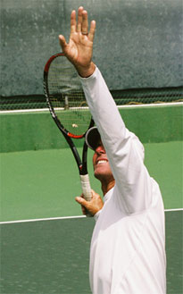

**Three good ways to prepare on the overhead.**

**Overhead**

The use of the non-racket arm during the overhead is in some ways
similar to that of the serve. But the preparation is different. There
are a few options.

- **Probably the most common is to fully extend the arm as you turn sideways and track the ball with it until it's time to swing.**

- **Another option would be to keep the non-racket hand on the racket to facilitate and ensure that the turn is made and then extend the arm to track the ball. I like that one myself.**

- **You can also turn in this fashion and then instead of extending the arm, keep it bent at 90 degrees to allow for better visibility and extend it just before the swing.**

Some players track the ball better without extending the arm
immediately, but then extend it before swinging to position the upper
body as you would on a serve. These are really preferences and none
seems to have an advantage in the quality of the ball.

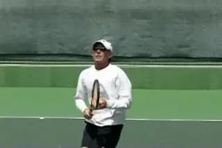

**The opposite arm on the overhead and the backhand overhead.**

Again, as with the serve, **once the decision to swing is made, the non-racket arm releases into the midsection to allow the whipping action of the arm and racket to take place. On a backhand overhead the non racket arm should move in the opposite direction (downward) of the upward swing to help maintain balance and drive the racket through contact.Return**

For the return of serve, the non-racket hand should assist in grip
changes. For one handers while waiting to return, the racket should be
supported by the non-racket hand at the throat. **This allows the racket hand to hold the handle very lightly which makes it easier for the non-racket hand to physically assist in the grip change.** I actually like this position for a
two-hander as well, again because of the light grip pressure it
encourages. If you try it, just remember to immediately slide the hand
down for a backhand, and make sure you don't have a gap in the grip.
Some two-handers will struggle with this move, and since it is more
complex, don't be afraid to wait with both hands together in the
two-handed grip if that works better for you.

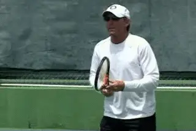

*Video demonstration — the original video for this article was hosted on TennisPlayer.net.*

**The hand stays on the racket and the left arm goes across.**

On the forehand return the non racket hand stays on the racket as the
backswing or coil is initiated. This is the same idea as on the forehand
groundstroke. But watching high speed video of world class players shows
that on returns, especially high velocity first serves, **the hand releases a little sooner. The left arm definitely comes across the body, but rarely reaches full extension as on the groundstrokes.**

Obviously, the speed of the serve plays the major role in this. It is,
however, still critical to include the non racket arm during the coil to
avoid slapping or bunting the return. It also prevents you from opening
too much before contact. **Blocking or "chipping" the return of serve is also very common, especially on big first serves. This is essentially the equivalent to the half volley, and the use of the left arm is further reduced.** Still, you will see some
movement across the body in all these returns. **After the preparation, the opposite arm behaves very much as on the forehand groundstroke, clearing a path for the forward swing.**

On second serves that are moving substantially slower, the non racket
arm can extend further. This is particularly true if you decide to move
back as many pros now do and take a fuller swing. (See Nick's Return
article in this issue. ) If, however, you chose to move up
and attack the second serve, the left arm pattern will again be more
compact, due to the lack of time and the abbreviated backswing.

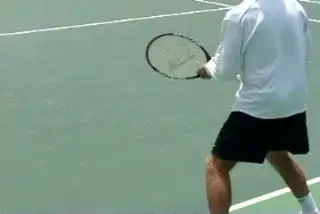

**The opposition of the back arm on a drive and a slice return.**

With the one handed backhand returns the left arm should move back in
the opposite direction of the forward swing to prevent the shoulders
from over-rotating. This also allows the racket to move in a more direct
line to the target. It's the same principle on both the topspin and
slice returns. The exact distance the arm moves back will vary from one
player to the next but keeping the shoulders sideways to the target is
largely dependent on this movement of the arm.

**The VolleyThe one word that comes to mind when I think of the opposite arm in relation to the volley is "balance**."
**Volleys are built on compact, precise movements.** The time required to prepare, execute
and recover from a volley is significantly less than a groundstroke. For
that reason, what you do with your non racket arm on the volley is more
minimal. But it still has a key roll in the preparation and also in
ensuring that the volley is solid and balanced.

As with the groundstrokes, you should support the racket with the left
hand by holding it at the throat. This actually spaces the hands
correctly for the movement of the stroke motion. Using the left hand
will also be very helpful if you're a player who changes grips. (Yikes!
Work on the continental grip, please!)

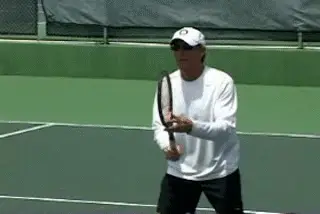

*Video demonstration — the original video for this article was hosted on TennisPlayer.net.*

**The unit turn is subtle, but critical.On the forehand volley, as noted, the extent to which the left hand stays on the racket is minimal compared to the groundstroke. But it is critical that the hands don't separate too soon. The brief unit turn gets the shoulders into the shot and can keep you from arming the ball with a huge swing.Turning with both hands briefly on the racket is a subtle move, and one that is sadly lacking in the volleys of too many players.**

The other point is how the left hand moves across the body and to the
left side in the forward swing. The opposite hand mirrors the position
of the hitting hand. Again, the opposite hand is setting the path the
racket hand follows. Too many volleyers have the same problem with their
left arm that they have on their groundstroke. As they volley, the left
arm will either move the wrong direction across the body, straight up in
the air, dramatically to the left. or drop like a dead weight. All of
these disrupt balance. I've seen players try putting their left hand in
their pocket to solve these problems but then they don't turn at all
and "solve" one problem while creating another.

To work on these changes, I suggest you hit tons of orchestrated
volleys. Start with the ball being tossed to you slowly from a short
distance. Then move to a ball machine if at all possible. The ball
machine is invaluable and I use it religiously with my students, and
also with my own game. The accuracy of the feed allows you to get many,
many more good repetitions where you can control the motion and execute
the volley almost perfectly. Next rally at slow speeds. You can progress
from there to drills, game simulations, and matches.

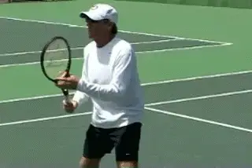

**The backhand volley--a more compact backhand slice.The Backhand VolleyThe backhand volley is really just a smaller version of the slice backhand groundstroke.Unless there's absolutely no time, some shoulder rotation is imperative.** But like the turn on the forehand,
the extent is usually less than on a groundstroke. **Just like the slice backhand, the left hand stays on the throat until the moment the racket is pulled forward, and then the left arm moves back to keep the shoulders sideways to the net.**

So that's it! We've been around the world with the opposite arm! I
hope these two articles have shed light on an aspect of the game that's
often overlooked but in my opinion is critical for anyone who wants
complete technical strokes that can take their game to the next level.

**Scott Murphy** is from Marin County, California where he started
playing tennis at age 5 in a family of tennis nuts. Both of his parents
were major influences in his development. He also took lessons from
Marin legend Hal Wagner and former top 10, Harry Roach. Scott is a
graduate of the University of California at Berkeley where he played
baseball and football but continued to work on his tennis game with
renowned coach Chet Murphy. He was the head pro at San Domenico/Sleepy
Hollow Tennis Club for over 20 years. He also directed the Nike Tahoe
Tennis Camp at the Granlibakken Resort for 10 years. Scott now teaches
privately in Ross, Marin County and in the summer he directs the Tuscan
Tennis Academy which he founded in Quarrata, Italy.

Check out Scott's website at
[scottmurphytennis.net](http://www.scottmurphytennis.net)

You can contact Scott directly at: <scottmrph@yahoo.com>
