# The Overhead

**The OverheadChris Lewit**

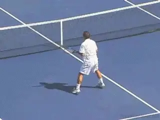

A great overhead is the lynchpin of a great attacking game.

I often tell my students that a great overhead is essential to
developing a world-class attacking game. Why? Because any high level
player worth his salt will neutralize the attacking rival with a high
lob and test his or here overhead smash.

Unfortunately, the overhead is usually under practiced. In this article,
I will share my philosophy on the overhead and some key technical
details. Next time John and I film I will add some of my favorite
overhead drills.

**The Lynchpin**

While overheads are not hit as frequently as groundstrokes or serves,
smashes often come at critical junctures in the match, raising their
importance. In addition, if building a complete all-court game is a
goal, the overhead is the lynchpin, the glue that holds the all-court
game together.

A player's success at the net is only as strong as its weakest link. In
this case, that is often the overhead because it is practiced poorly and
infrequently. It's common for players to spend a lot of time on their
volley skills but neglect the smash, although some players don't spend
any time on their net skills at all.

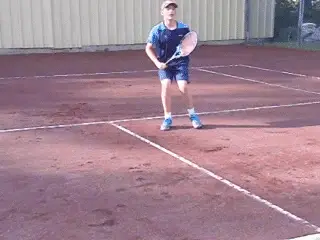

Every player should work to make the smash a strong link.

Big mistake. A poor smash will undermine your confidence in approaching
the net and finishing points aggressively. Pete Sampras, probably the
greatest pure attacking player in history, may have also had the
greatest smash.

Proficient overhead skills are also critical to success in doubles,
which is important at both the club recreational level and in college
tennis. Don't neglect the smash.

**Fear The Smash**

It's very important that the opponent respects and fears a player's
smash. I was recently telling a nationally ranked boy that having a
great overhead smash can dramatically improve his success rate when he
rises to the net. Why? Because if his rival respects and fears his
smash, he will avoid lobbing and try to pass him left or right---never
above.

This improves the chances of anticipating or guessing right at the net.
The rival is limited to two choices on the passing shot rather than
three. So I believe having a great smash will generally improve a
player's statistical success rate when approaching the net.

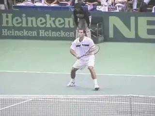

Put the fear of your smash into your opponent in the warm up and early
in a match.

Creating that fear of the smash is important from the beginning of the
match---and it begins in the warmup. I had a wise coach once tell me
that when the opponent lobs me in the warmup to smash the ball with full
power and aggression. Why? To make a statement: "Don't lob me brother
or I will smash that ball down your throat!\"

It's also important to imprint that fear in your opponent from the very
early stages of the match. If the smash is missed the first few times in
point play, this emboldens the opponent to lob more, which can become a
headache. If you earn the rival's respect, he or she will be more
cautious and reluctant to throw up the lob in critical moments, and this
can improve your odds of guessing right and hitting a winning volley.

**Never Miss A Smash**

I remember the smash of Andre Agassi. It was amazing. Everyone always
talked about his groundstrokes, but I was always impressed with his
overhead too. Andre almost never missed a smash and especially when it
was an important moment.

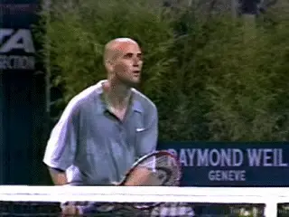

Andre almost never missed a smash.

This allowed him to attack with aggression and enter the net with
impunity. All players should model this mastery of the smash so they
will be emboldened to rise up to the net.

Another great attacking player with an amazing overhead was John
McEnroe. When John hit a smash it was a winner. And all top
players---from elite juniors to pros---have this same overhead mastery.
Their smashes are always dialed in, locked and loaded.

But nothing will discourage a player from attacking the net more than a
lack of confidence in the smash. And having a poor smash often forces
players to go for too much on the approach or first volley, resulting in
unnecessary errors.

If you are a coach reading this, it's very important to explain the
philosophical concepts presented above and convince your player of the
value of training and developing a great smash---because many kids
don't understand why they should practice smashes. It's going to be a
tough sell to your baseline bashers ---but you can do it.

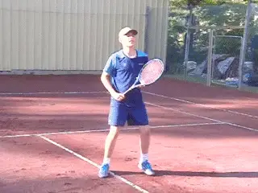

Crossover steps are key to get back for deep lobs.

**FootworkThe drop-step and powerful and quick crossover steps are the key to getting back for difficult lobs.** Players can also
side shuffle backwards for easier lobs within range.

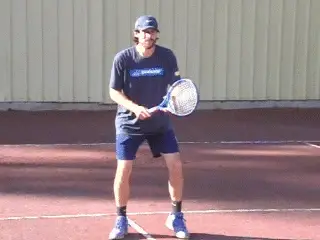

The hands can stay connected in the preparation, or separate earlier as
in a serve.

**Preparation**

The first style of preparation that I teach is with the hands connected
to the racquet during the first movement. The second acceptable style of
preparation is the hands separated earlier more like a serve start.
However, in this style, the take up is generally abbreviated and rarely
do players take full looping backswings as you see when serving.

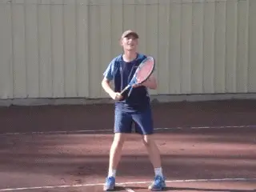

Learning the overhead with the feet anchored can provide simplicity and
stability.

**To Jump Or Not?**

Some coaches teach the overhead in a stationary way with the feet locked
to the ground. They believe this provides simplicity and stability.

It's fine to teach the smash this way, and in fact, sometimes I will
have my players hit with the feet anchored to improve their balance and
positioning. However, modern pro overheads are dynamic and I prefer to
encourage my players to jump in a controlled way, leaving the ground
when smashing.

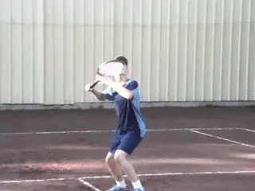

Rotating the arm in the shoulder joint internally is key.

**Internal Shoulder RotationI teach my players to snap downward in a very extreme way to learn how to bring the ball down into the court and how to bounce the ball high over the rival or the fence. The internal rotation of the shoulder is key. A reference point that I use is to finish with the top of the racquet in the center of the body, keeping the elbow high.**

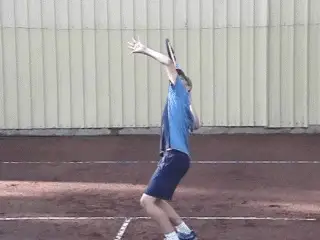

Use the scissor kick when the ball is in danger of getting over you.

**Scissor Kick**

When the lob starts to get over a player's head, a common technique is
to use the scissor kick footwork to allow the body to jump back
explosively to reach the ball but land with balance.

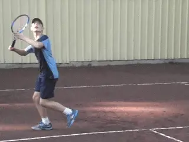

When the ball is wide to the forehand side hit an angled slice overhead.

**Slice, Kick, or Flat?**

Generally players should hit the overhead powerfully and flatter, or
with a mild slice. Some kids will hit the inside edge of the ball and
over pronate. My old coach Gilad Bloom always use to tell his students
to "slightly slice\" to help correct this type of over pronation.

When a lob goes wide to the forehand side, it's common to hit an angle
slice overhead, cutting the outside edge of the ball. This has a sharper
wrist action and acceleration across the edge of the ball. And the
player stays more sideways through the hit versus a power smash from the
middle of the court.

When the lob get over a player's head with the ball going deep, I teach
my players to defensively kick the overhead, imparting safety and
topspin to the shot, in order to neutralize the tough lob. This is a
defensive shot rather than a winning shot.

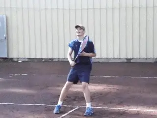

Learn to hit the backhand overhead in the right situation.

**Backhand Overhead**

Rarely hit or practiced, the backhand overhead is a lost art form. But a
great weapon to have when you can't get into position to hit a normal
overhead.

Elbow high and back turned to the net. Extreme extension of the wrist is
key to generating power and security. But it's often a difficult shot
for young kids to master.

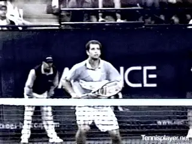

To create realism, smashes should be linked with approaches and volleys.

**Training The Smash**

When drilling, try to link smashes with volleys, and smashes with
approaches and volleys, for more realism and to improve mastery. Start
with single smash exercises and then progress to smash/volley and
approach/volley/smash combination drills. For maximum effect, combine
baseline play with approach, volley, and smash---all in one exercise.
Now go practice! Vamos!

