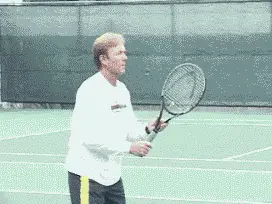
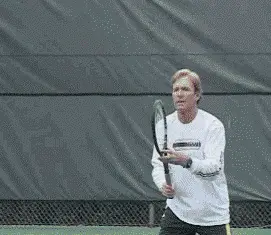
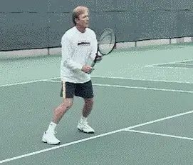
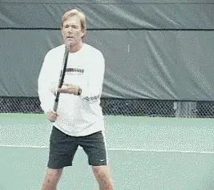
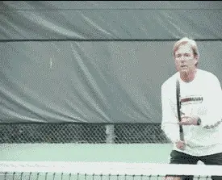
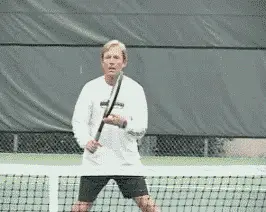

# The Volley Part 3 - Types and tactics

### The Volley: Part 3

### Types and Tactics

### Scott Murphy

Now that readiness, mechanics, and footwork have been discussed (see
[part
one](The%20Volley%20Part%201%20-%20Are%20You%20Really%20Ready.docx) and
[part two](The%20Volley%20Part%202%20-%20Private%20lessons.docx)), it's
on to the various types of volleys and their tactical considerations.
The fact is, there really is no such thing as \"the\" volley. There are
a myriad of situations: high balls, low balls, wide volleys, half
volleys, drop volleys, volleys hit directly at you-the list goes on.

The next two articles will cover all of these situations. Consider it a
primer on what you need to volley effectively in match play.

### The High Volley

**Play aggressively on the \"ideal\" volley, but maintain solid mechanics.**

Let's start with the high volley. **The volley we all love to play is the \"ideal\" high volley. This is a ball above the net, from mid chest to just above shoulder height**. Assuming you're
somewhere in the front two-thirds of the service box, it provides you
with the opportunity to play aggressively.

**The height allows you to \"comfortably\" volley outward and/or downward at a**wide array of targets**.** The best
volleyers really go after this ball **by closing on it** and **accelerating the racquet head forward**, **making sure to maintain solid mechanics.**

Too often this volley is there for the taking, but for lack of moving
forward, the ball winds up dropping below the net where you no longer
have the upper hand. Once this happens, don't make the mistake of
trying to play an aggressive shot as a means of making up for your blown
opportunity. It has now become a low volley and should be played
accordingly.

**Don't fall for the \"sucker\" ball. Volley firmly outward and go for depth.**

### The Sucker Ball

The \"other\" high volley is the one that you hit well above your head.
This is what I consider the ultimate \"sucker ball\" in tennis. It
practically begs you to be overly aggressive and hit it like a maniac.

Too many players try to hit this ball virtually straight down, or they
try to hit it as if it were an overhead. In the former case, it will
usually wind up in the bottom of the net, or, if it does go over the
net, it takes a big, fat bounce so the opponent can track it down and
either rekindle the point, or worse, end it with a pass. When players
mistakenly try to hit this type ball as an overhead, the result is
usually a line drive off the back fence.

**This is a case where you have to let gravity work for you**.
**Volley this ball firmly, but straight out in an attempt to achieve depth.Some follow through is usually required, particularly if the approaching ball lacks pace. If you want to volley this ball down and on an angle, be sure to practice constraint!**

Remember, a high ball that has a great deal of velocity is probably
going out (unless it has very heavy topspin), so take a good look before
you strike.

**A wide base and good knee bend take your shoulders and head closer to the ball.**

### The Low Volley

Because it's hit below the net, the low volley is more of a defensive
or set up shot. **If you're making this shot moving towards the net but you're in the back third of the service box, it's best to try and hit this deep and either down the line or down the middle, before continuing to move forward.** If the incoming ball
has a lot of pace you can borrow that pace by holding the racquet firmly
and letting the ball bounce off your strings. If it lacks pace be sure
to accelerate the racquet through the volley.

**Practicing the low volley when you're closer to the net is essential because the position of the racquet face is critical. Ideally, it's open just enough that the ball stays down after it clears the net. If the racquet face is too open, the ball can sit up for a passing shot.**

More often than not the problem here is that players simply don't get
low enough to avoid some sort of racquet compensation, resulting in an
error or a weak shot. It's what I call the \"giraffe at the watering
hole syndrome,\" where bending at the waist or not bending at all is the
order of the day.

**To volley the low ball well, you have to use your legs correctly.** For starters, there should be a fair
amount of distance between your feet to encourage your knees to be more
flexible. **Both knees should be bent, but the knee of the hind leg should be close to the ground.This will allow you to volley a low ball much the way you would an ideal, shoulder height ball because, in fact, your shoulders are lower and your eyes are closer to the plane of the ball. To get that hind leg down, try turning your back foot on its side or dragging the top of your shoe.**

**For the drop volley, imagine catching an egg.**

### Drop Volley

The drop volley can be a deadly shot on low volleys and in other
situations, as long as it's not overdone. There's almost something
narcotic about the drop volley. But we're not all John McEnroe or Pete
Sampras, so you have to be selective when it comes to this shot. I've
seen players make one sensational drop volley and then proceed to miss
the next five trying to duplicate it. Then there's the player who'll
miss the first five in a row trying to prove he can actually do it.

One of the real crowd pleasers in pro matches is the angled crosscourt
drop volley off a low ball that just dies after it hits. (One of the
advantages here, is that it's being hit over the lowest part of the
net). Of course, the reverse side of this is when it sits up too long
and an alert, speedy player races in and rips a passing shot. You need
to try and keep this shot relatively low to the net or this will often
be the consequence.

**The best time to try the drop volley is when your opponent is playing well back of the baseline, has been pulled well wide of the court, or is obviously quite slow.**

Hitting a drop volley involves decelerating the racquet head at impact.
Imagine someone tossing you an egg or a water balloon in which you pull
back a bit to ease the impact of the catch. That's really what you're
doing on a drop volley, \"catching\" the ball. **Generally, a little cupping of the racquet face accompanies this \"catch\", providing enough backspin to brake the ball even more.**

**Use a crossover step and think bout angling your wide volley**

### Wide Volley

The wide volley requires you to stretch your arm out. You may often find
yourself without the supportive benefit of a laid back wrist. Remember
Boris Becker's exciting wide volley lunges at Wimbledon? Those were
real emergencies and the fact that he had grass to fall on likely
enhanced his ability to pull them off.

When you have very little time to react and have to take a lunge step,
your legs won't be able to help you much, if at all, in accelerating
your volley. At the same time, your arm and wrist will virtually be in a
straight line, so your shoulder will have to be the deciding factor in
controlling and accelerating the shot.

If possible, make your lunge with a crossover step, because your reach
will be longer, your balance will be better, and you'll be able to
recover faster. When you're hitting the wide volley from this position,
you can think more about angling it. This is one of the few instances
where the head of the racquet will actually be ahead of the wrist.

Speaking of the angled volley, whether it is wide or not, how many times
have you gone to angle the ball into a mile of open court and wound up
hitting it into the alley or beyond? It's painful isn't it? In your
haste to take advantage of a golden opportunity, you wind up overdoing
it.

**The main thing to remember here is that there is a MILE of open court. Most of the time, all you have to do is \"bump\" the ball over there, leaving a lot more margin for error.** On
rare occasions, where you're playing someone with Lleyton Hewitt type
speed, it may be necessary to hit the volley more crisply. Spend the
time practicing this shot because it can be devastating when you miss it
in a match.

**Recover after every volley and never assume the ball won't come back!**

### Recovery

**One last thing, and that is the need to recover from volley to volley. This is very important!**

Never assume the ball won't come back, even in the most offensive
situations, particularly if you've played a low volley or a wide
volley. Don't languish! Recover your form and continue to be proactive.
Remember, you're closer to the action and it's important to keep the
pressure on the player trying to pass.

Next, half volleys, swinging volleys, the lob volley, and dealing with
those shots right at your body.

**Scott Murphy** is from Marin County, California where he started
playing tennis at age 5 in a family of tennis nuts. Both of his parents
were major influences in his development. He also took lessons from
Marin legend Hal Wagner and former top 10, Harry Roach. Scott is a
graduate of the University of California at Berkeley where he played
baseball and football but continued to work on his tennis game with
renowned coach Chet Murphy. He was the head pro at San Domenico/Sleepy
Hollow Tennis Club for over 20 years. He also directed the Nike Tahoe
Tennis Camp at the Granlibakken Resort for 10 years. Scott now teaches
privately in Ross, Marin County and in the summer he directs the Tuscan
Tennis Academy which he founded in Quarrata, Italy.

Check out Scott's website at
[scottmurphytennis.net](http://www.scottmurphytennis.net)

You can contact Scott directly at: <scottmrph@yahoo.com>
