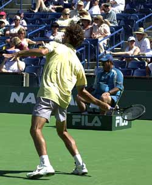
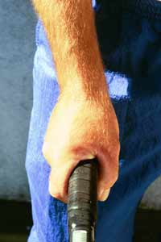
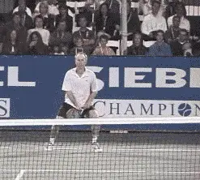
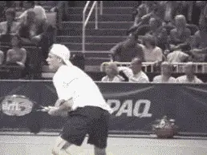
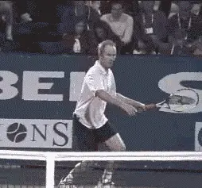
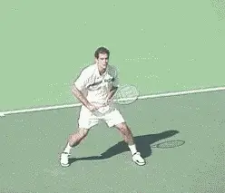
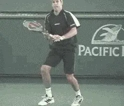
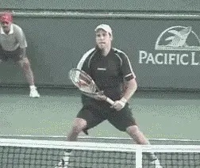
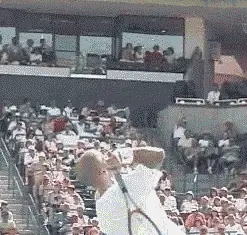

# Private Lessons: Understanding The Continental Grip

### By Kerry Mitchell

**The rise of the western forehand makes the ability to transition between grips critical for players at all levels.**

In the early days of tennis, changing grips was virtually unheard of.
The young players were taught the grip (continental) and told to play.
Fortunately, they were taught the way to play as well - hit very few
groundstrokes and get to the net as quickly as possible.

Another fortunate factor for the players of the past was that most major
tournaments were held on grass courts and other very fast surfaces which
accentuated the use of the grip and that particular way of playing
tennis.

With the rise of hard court tennis in the western U.S. and the growing
popularity of the two-handed backhand, the speed of the game started to
increase, which made it more difficult to play using the Continental
grip. Hard court tennis made for more regular and dependable bounces,
which allowed players to swing more aggressively at the ball.

The added aggressiveness put more value on the use of spins,
particularly topspin. This transition in the game soon spelled the end
of an era for tennis.

**The Continental Grip: Today, many players lack a well-rounded game without it.**

As topspin became more prevalent and the benefits of greater swing speed
became apparent, grips started to change. The new chic grip was the
western or semi-western forehand, which naturally produced more topspin.
Teaching pros started to teach kids western forehand grips and
two-handed backhands.

Another transition was occurring simultaneously - the shift from wood to
metal racquets, and eventually to graphite. Graphite, the basis for all
of today's racquet technology, made the use topspin even more necessary
in order to control the added power these racquets supplied.

Of course, there were some players who were very successful with the old
style of play during this transitional period (John McEnroe, Stefan
Edberg), but as the mechanics of a more complete swing (torso rotation
and free arm swing) became better understood, these players soon saw
their time passing.

Today's player has to learn to use not one but numerous grips to become
a more complete player. These grips are often different very different
in terms of hand placement on the handle and the amount of movement
required to go from one to the other, for example, from a western
forehand to a continental volley grip.

Transitioning between grips can be difficult, and when these transitions
are not done well, the result is often a one dimensional or specialized
player. We definitely see this in the pro game. The players with the
most extreme grips also tend to have the most limited games.

**The days of playing with only one grip have passed at both the club and pro levels.**

It is also true for the club player who either does not have the time to
learn, or chooses not to learn all the necessary grips to become a more
complete player.

Actually, the ability to master a range of grips is probably more
important at the club level. One dimensional pro players often have
success with little more than a serve and heavy topspin groundstrokes in
their arsenals.

But club players lack the huge weapons of the pros. This is why the most
successful club players are the ones with the ability to play a mixed
game. If you want to be that kind of player, then learning the necessary
grips should be your highest priority.

Understanding and mastering new grips requires more than just the
ability to rotate the hand on the racquet handle. Grip changes require
changes in the structure of swing patterns.

**Unless players can transition from the new groundstroke grips to the continental, they become one dimensional.**

The most difficult process in understanding grips and grip changes is
the visual or mental aspect. Correlation between the position of the
hand and the angle of the racquet face has to be created visually in the
mind's eye for each grip position.

This is very difficult when transitioning between two extreme positions
because visually/mentally they are so different.

One of the best reasons past generations played with just one grip was
the ease of transition between different shots. Today players have to
practice a lot with each grip position to acquire the clear visual and
mental images necessary to transition well between them.

In this 3 article series, I will go over the variety of possible grips,
explain why each grip is necessary and then go over the physical changes
and mental images required to make the particular grip work. Part 1
starts with the continental grip. In Part 2, I'll do the same for the
forehand grips, both Western and the Eastern. In part 3 we'll move to
the backhand grips for both 1-Handed and 2-Handed players.

**The Continental Grip**

As we said, the continental grip is no longer "the grip". But it's
still the one grip every player needs in the modern game. One of the
down sides in the evolution of grips is how few modern players know what
the continental grip is or how to use it.

**On the forehand underspin groundstroke, the racquet head is above the wrist, and the inside portion of the elbow is pulled in toward the stomach.**

As the challenge was once learning other grips besides the continental,
it is now rediscovering this grip and learning how and when to use it.
It's ironic that the continental has gone from almost universal to near
extinction in only a couple of generations of players.

**The continental grip or what I call the open racquet face gripis used for volleys, both forehand and backhand; the slice forehand (not used much in the pro game today, but effective at the club level) the slice backhand; and the serve, both flat and spin**.

Spin is the controlling element in the game. The continental grip, is
critical to producing underspin on groundstrokes and volleys, and
topspin on the serve.

Underspin is produced as the racquet face slides under the ball at
contact. With underspin a player gets two benefits. One is the lifting
of the ball quickly, which is important on low or wide balls.

The second benefit is the ability to drop the ball faster. Just like
topspin, the racquet brushes the ball, clipping a portion of the ball
and decreasing the velocity of the shot. The less of the ball that is
caught by the racquet, the greater loss of velocity. With the decrease
in velocity the ball drops faster. An extreme example of this effect is
the drop shot or the drop volley.

**On the forehand volley, again the elbow comes in opening the racquet face and sliding under the ball.**

**How is underspin produced? On the forehand side this happens by making sure the inside portion of the elbow is pulled toward the stomach as the ball is struck. The wrist position is slightly laid back, and the racquet head is positioned above the wrist.**

This position will be very awkward at first. It's important to know
that it stays the same on all forehand underspin shots, no matter how
low the ball goes.

Maintaining this position on low balls requires the bending of the legs.
On low volleys, visualize the butt of the racquet reaching for the
ground as the head of the racquet is supported with a good wrist
position.

The shot may not be used much in the modern pro game, but it is far more
effective at the club level. By using underspin, you keep the ball low,
which is great for approaches. Since club players are not likely to face
Andre Agassi's two-handed backhand pass, they don't need to blast the
approach to be effective at net.

The fact so many club players are unfamiliar with underspin can make the
slice approach even more effective. It tends to take players out of
their comfort zone when it comes to contact height, producing errors and
free points.

**Watch the hand slide under the ball, with arm straight before and after contact.**

**On the forehand volley the motion is similar. Again the elbow comes in, moving toward the stomach. Depending on the ball, the high to low motion can be more pronounced. Pulling the inside part of the elbow down (high to low) and toward the stomach lays the racquet face open and slides it under the ball.**

What makes this possible is the grip itself. The heal of your hand is
placed partially on the top panel (palm facing the ground) of the
racquet allowing the player to push down the butt of the racquet as it
comes to meet the ball.

How about on the backhand side? **On the slice backhand groundstroke and the slice backhand volley, the back of the hand slides under the ball (low to high) staying in the same position throughout the hitting zone.On the groundstroke the arm position is straight before, during and after the contact.** Again, the head of the racquet
stays above the wrist as it passes through the ball. Much like the
forehand, the continental grip allows you to support the racquet head
above the wrist throughout the stroke.

We see the same action of the hand sliding under the ball on the
backhand underspin volley. Notice the elbow stays bent longer, however,
straightening out just before the hit. Depending on the ball, it will
bend again after the hit, allowing the shoulder to bring the arm and
hand all the way through.

**The backhand volley with the continental grip, high to low with the hand sliding under the ball.**

**One more key on both the volleys:the continental grip requires a closed stance.Hitting an open stance volley will cause the player to catch the ball late and push the face of the racquet too open at the contact resulting in an error.The ServeThe continental grip on the serve again allows a player to hit spin (topspin and sidespin) which brings the ball down faster.Since the ball comes down faster it allows the player to hit the serve harder and more upward (it almost forces the player to hit harder because if he/she doesn't, the serve will not go over the net).**

On the serve, the continental grip makes the transition of the racquet
head through the ball much more efficient. With the continental grip,
what many instructors call the snap of the wrist (or pronation) occurs
naturally as part of a good racquet drop.

**The spin is a result of the racquet face crossing the from bottom left to the top right of the ball. (right to left for lefties). A good visual image is to reach for the ball with the top edge of the racquet head.**

**A key image on the serve is to reach for the ball with the top edge of the racquet.**

Unlike the forehand swing, **the serve does not involve laying the wrist back.** This is a common error that occurs
with many players who serve with other grips and results in very limited
ability to create good quality, consistent spin.

**One mental process to understand is that the right image for a particular player on a particular shot won't always correlate perfectly with the contact point. This can be true on the spin serve.Since when serving a player is automatically swinging upward the natural reaction of many players is to open the palm skyward. In this case, the player must use an image that counteracts this tendency, what some coaches callan over- compensation.**

To hit spin in this case, the player should visualize the racquet face
coming across the ball (**the head is closed, facing the ground, at contact.In reality the racquet face angle is again almost perpendicular to the court.**

I'll have more to say on the image versus reality issue in Part 2 when
we'll take on the forehand grips, especially the Western and
Semi-Western grips that are so popular in the modern game.

Kerry Mitchell was a leading Bay Area teaching

junior players and coached a series of

championship high school teams. He was highly

ranked both sectionally and nationally in men's

30 and 35 singles..

After 15 years as the Head Teaching Pro at the

John Yandell Tennis School in San Francisco,

California Kerry and his partner are now

splitting time between homes in Merida, Mexico

and Toronto, Canada. He has continued to coach

and to have great competitive success winning

Canadian National seniors titles---not to

mention continuing to write articles for

TPA from his unique perspective.
