# Winning a 4.5 Tournament-After the Age of 50

### By Geoff Williams

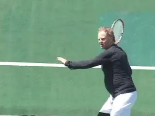

Could I actually win a 4.5 tournament over age 50. Yes but that is only
part of the story.

After 20 years away from competitive tennis in Northern California, I
returned to play tournaments with a goal. To win a NTRP 4.5 tournament
over the age of 50.

Was that possible? Yes, but that gets ahead of the story. This story is
not just about the outcome, it is about how I adapted my training, my
equipment, and especially, my technical and tactical and mental play to
the circumstance. It is also a stroll down memory lane that recounts how
I first fell in love with tennis, where all that led, and what motivated
me to come back to the battlefield in the year 2010.

**Background**

When I first started playing tennis, 43 years ago, I had a Bancroft
wooden racquet that cost 25 cents at the Salvation Army store. (Dad had
three jobs and 8 kids, no mom.) The strings were made of piano wire.

The metal strings were rusty and stunk of used engine oil. (Dad's idea
to keep the strings from rusting.) I had to keep it in a wood press or
it would warp. I used to sleep with it, watching it by the light of a
candle with a long yellow flame.

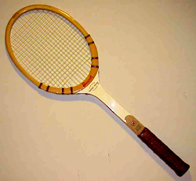

High tech pro frames never felt as good as my old Bancroft.

I hit the wall for days on end. There were almost no practice partners
in the small town I grew up in, Richmond, California, which had only two
dilapidated courts. But the back of the building at the Point Richmond
Plunge, a public swimming pool next to the courts, had a wall with a
white net line painted onto the dark green paint. (Before the days of
graffiti artists.) It also had a 20 foot tall fence surrounded by barb
wire, so no one could get on the roof.

A train tunnel was right next to the courts, and the noise was
deafening. This was good concentration practice. Next to the tracks
there was a polly wog trench, filled with gooey lime green algae, and
lots of frogs.

My friend Eddy and I, both age 8, used to amuse ourselves jumping on the
trains as they rolled by at 5mph on the way into the tunnel. We'd grab
the handle on the red ladders on the flatbed cars and swing ourselves up
onto the train.

Eddy got his leg cut off trying to jump the train one day. Lots of blood
and screaming, people panicking. Eddy was too fat to play tennis, and
too fat to jump trains. His family eventually moved away and I'm not
sure what ever happened to him.

I hit balls that landed on the roof of the Plunge via miss hits, as did
many others. I would scamper up the 20 foot fence, jump up to the roof
from on top of the barb wire, and get all the balls up there, usually 30
or more. I threw them down onto the green grass next to the train
tracks. Then I jumped off the roof into the trees like a squirrel,
grabbing onto any branch I could on the way down. Of course, it helped
that I weighed only about 50 lbs.

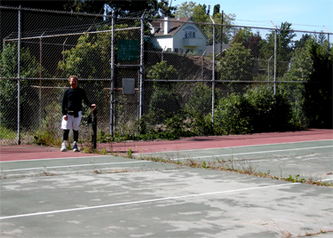

**One of the old Richmond courts still exists, though unplayable for years.**

I am quite a ways from there now, age 54, an electrical contractor,
married and living in the East Bay Hills, playing with $400 rackets
custom Head rackets. But those rackets still don't feel quite as good
as that warped Bancroft. The simple joy of beating your father for the
first time stays with you forever, even though he let me win.

I never played junior tennis, save for one tournament, which I won, the
City of Richmond open, at age 11. I beat an 18 year old, but only after
I lost a match point. He made a bad call, and I teared up and bitched.
He was nice enough to give me a second chance and play the point over,
and I made him pay, coming back and winning the match.

I got a blue ribbon, and a brand new Jack Kramer autograph, with a
diamond insert. I strung it with blue streak victor imperial gut, and it
had a lot of power.

I continued to play until my twenties, when I began to play Northern
California tournaments. I rose to the top three, first in the B and then
the A division, analogous in today's terminology to NTRP 4.5, and 5.0.
This was the late 1970s through the mid 1980s.

I did this without coaching, without junior tennis background, without
high school or college competition, purely on self taught strokes, and
self taught foot work.

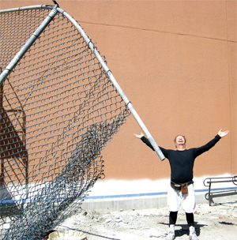

**They painted the building but the wall still exists amid the wreckage.**

I used the same grip and the same side of the string bed on my
groundstrokes, like Alberto Berasategui. My resistance to coaching, and
lack of experience, topped me out at the 4.5 to 5.0 level. That stubborn
tendency to hit the wall for days stopped me from paying for lessons.
The best resource for self-improvement ever
created--TPA--did not yet exist.

Even so, I was able to win five A tournaments. In 1986 I won 73 matches,
with 17 defeats. I made the top ten in Northern California in both the A
and B divisions, amassing over 30 trophies.

The most amusing memories from those days were the psychological tactics
used the players. The guys who were most expert with the psyche jobs
were often the guys who had the best records and the best chance of
winning matches. No one had dangerous power, but many had insane
consistency and frightening psychological mastery.

Some of the common psyches included:

**Antelope psych**: "I am jumping up and down because I am in better
shape than you are and I am not a prey animal and you have no chance of
winning!"

**Vampire psych**: Gloating and excessive fist pumping, screaming and
celebrating after a hard won point or set victory. "I will suck the
life out of you so you will not want to compete any longer, and force
you to face the awful humiliation of my mighty celebration over your
dead and stinking carcass."

**Australian psych**: "I must say you are
serving/playing/volleying/moving/hitting well, today. I've never seen
anyone hit their forehand quite that well, congratuations." This is on
the changeover after the first game.

**Old Man psych**: "I will quick serve you just as you turn around to
get ready to return. I will intentionally hit balls away from you
between points. I will unnecessarily pick up balls in between serves. I
will stall. My purpose is to take you into the foggy/anger zone, you
young fool."

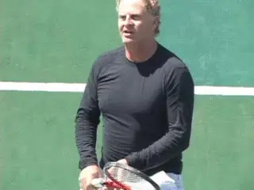

**One grip, two groundstrokes.Guilt psych**: "Are you 100% sure about that call? That looked good
from here." This is the first call in the first game and continues in
every game thereafter.

**The Insult psych**: "I will call a referee before a single point is
played, to make sure you know everyone thinks you are a cheater."
Variation: "I didn't see the butt of the racquet, so you have to spin
it again, as I think you are lying about who won the toss."

**Anal Retentive psych**: "Will you take your towel down off the fence?
It is bothering me from 100 feet away. Will you move your bag one foot
closer to the bench, as I may run into it from the other side of the
net?" "Will you pick up the ball that is resting in the bottom of the
net, as it's non- movingness is distracting me." "You are foot
faulting by 1/2", and I will call it, 80 feet away, while still making
my return."

**Hacker psych**: "I am going to keep the ball going, and run down all
your shots and send them back so safely and risk free that you will
commit suicide, you stupid blaster."

**Cheater psych**: "I will wait for the most opportune possible time,
then call one of your shots out, when we both know it is clearly in, to
drive you insane with anger." "Sorry, I had to do something, you were
threatening to win."

**Intimidation psych**: "I will hit shots in the warm up so fast they
will blow your mind. I will not hit to you, but will hit only winners to
convince you I am going to win." I may bump you on the change overs. I
will grunt so loudly, you will think I am Monica Seles. I will trash
talk you until you cross over to my side of the net and punch me out."
(I only fell for this once.)

**Pretty boy psych**: "I have taken lessons all my life from my tennis
pro father, have the best equipment, the best form, the most power, the
best string, the prettiest face, the best abs, the hottest girl friend,
and the coolest car. You on the other hand are a pathetic, ugly loser.
You can't afford to buy my hair spray."

Any of those sound familiar?

**Injuries and Cramps**

I had been bitten by the thirst for power, and paid the price in pain,
thousands of days over. Injuries and a bad tendency to cramp eventually
took their toll and finally stopped me from playing tournaments for 17
years, from 1987-2004.

At a given time, I might be having problems with my rotator cuff,
hamstring, groin, ankle or calf. I also suffered from constant tennis
elbow due to stiff frames, high string tensions, (73 lbs.), and harsh
strings. I also had ten broken bones, from a variety of causes, like a
brutal blue collar job, and dangerous hobbies, such as owning a
motorcycle capable of very high speeds.

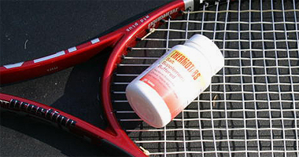

**Thermo Tabs: finally something that helped with the cramping.**

Like many "invulnerable," young and dumb guys, I made few attempts to
rehab or prevent injuries. It's always easier to prevent an injury,
than it is to rehab one, but I didn't know that yet....

Beyond injuries, the even bigger problem I had was a bad tendency to
cramp. In the class tournaments, it was commonplace if you were winning
to play two or even four matches in a 24 hour period, over one weekend.
And in the summer this meant in the heat of eastern California:
Stockton, Davis, Sacramento, or even, Reno, Nevada.

I tried everything to stop the cramps, and nothing worked. Bananas,
Chinese cramp bark, motrin, advil, aspirin, grapes, nuts, fruit. Even if
I made it through the draw the first day, it was common for me to lose
11 lbs in a single day, from a fighting weight of 172, to 161 lbs.
Recovery was not ever possible for the next match.

**Back in the Action**

So after giving up the game for 17 years, I played a 4.5 in 2004, the
San Francisco city championships. Against the #4 seed, I lost 4 and 2,
in 98 degree September heat. My playing weight was now 220 lbs, from 172
lbs, stick in hand. That was enough to set me back until this year.

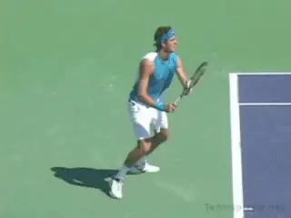

**Delpo's forehand on TPA: inspiration.**

Why did I come back again? It was inspiration. I got the bug again after
gong online and visting TPA. I read virtually every article
on the site. I studied video clips of Sampras serving. I studied
Delpo's forehand. I decided to play tournaments again.

**Preparation**

The first step was to find good practice partners, players willing to
drill and hit lots of serves and returns. The serve is the most
important shot in competition. The return is number two. Consistency is
the third most important aspect of competitive play.

So I tried Craigslist, and found, that of the players answering my ad
for a 4.5 minimum player, 8 out of 10 guys showing were 3.5 or lower.
That did not work so well. Very frustrating to have to tell the guy,
"Sorry, but this is the truth: You have no serve. You have no backhand.
You have no volley. You cannot hit an overhead. You have no consistency.
Run along now, you puny 3.5 liar."

What I really needed was a local court scene with a hot bed of good
players who wanted to work and drill and help me get back into combat
shape. I tried Davies Stadium in Oakland, as there is a USTA 4.5-5.0
team there. They shunned me as if I wasn't good enough to hit with
them.

I then tried Alameda's Washington Park. They only wanted to play
4.0-4.5 doubles. I heard one player complain, "Geoff hits too many
winners. No one wants to play with him."

I tried the storied Berkeley Tennis Club. Strange, they wanted me to
become a member. But I decided to pass on the $7,000 initiation fee and
monthly dues. Beyond the cost barrier, I wasn't sure I could find three
members to sponsor me, willing to hear me grunt loudly every day. It's
kind of a no grunting place.

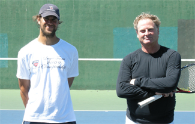

**My friend and practice partner Josh Om and myself at San Pablo Park in Berkeley.**

Then I tried San Pablo Park, in the Berkeley flats, a blue collar, chest
thumping, trash talking, hooking kind of a place. Lots of crazies
haunting the park, like Vietnamese Johnny, yelling, "Do something! Hit
like a man! My money is on that team." He carries a pint of whiskey in
his dark green army fatigue jacket. He said to me, "You got a good
volley!"

So, I finally found a spot where guys wanted to drill and improve, such
as Josh Om, and Freedom Om, and even their patriarch, the original Om,
who walks around dressed in prison orange with small red flowers tied to
the top of his tennis shoes, guru style. He hits a nice ball even at 70
years old and teaches everyone to play with both hands.

This was my kind of group. The orange shirt gang, with ambidextrous
serves and forehands, players not afraid of serve/returning for two
straight hours! The type of guys who can hit to targets for 800 straight
shots. Just what I needed to hone my game back into combat shape.

**Fitness**

I also had to admit the days were long past--20 years and 50 pounds
past-- when I notched wins over some of the best 5.0 and even Open
level players using speed and fighting spirit.

I'm in my 50s, now, and I refuse stop eating good food, drinking good
wine, and good sake. This means I can't (or at least won't) go below
220 lbs. It's like carrying a 50 lb. back pack into the Iraqi desert,
and trying to run down speedy little insurgents who are gunning for you.
The insurgents are not carrying 50 lb. packs. (They also aren't
drinking too much wine or eating too well.) They carry AK47 and
replacement mag clips.

Speed kills but so does blubber, and I was not fast anymore. Watching my
matches now is kind of like watching a gray whale trying to catch up to
and beat up on a dolphin.

I take things to keep on going, such as fish oil, Juvenon, acetyl
carnitine, vitamin D, cla, green tea, alpha lipoic acid, quinine (some
are allergic) also stops cramps, and even golden pickle juice. ([link](http://www.goldenpicklejuice.com/?pjsid=3).)

I tried fluid recovery powder. ([link](http://www.weightloss-hq.biz/recovery-drinks-and-bars/fluid-recovery-drink-review.html)).
I also found that chocolate milk, has the same portions of
carbohydrate/protein 4/1 that a lot of the expensive drinks have, as a
recovery drink, but it's a lot cheaper.

**Injuries**

It's always easier to prevent one than to heal one. So, I stretch,
putting my legs and lower back into extreme flexion, in the evening,
like Federer does. I bend over and I tense my abdomen, near the navel,
and then the perineum, alternatively, to "shove" and then to "suck"
energy towards the injuries.

My own brand of chi energy channeling. I bring my blood pressure sky
high, and then release. It can also clear you of match tension to swing
freely again. I also use ice and heat on muscle pulls.

**Equipment**

I also had to switch from Babolat frames to the Head PT57A, which is a
stick available only to top pros and juniors. You can find it on the
various internet message boards, since it no longer easily accessible
from Head.

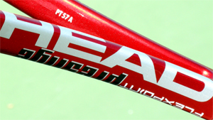

**See the magic identification code on the frame? That's PT57A.**

Soderling, Glubis, and Wawrinka, are examples of pro players that use
the PT57A, either that or the E version which is slightly stiffer. Very
flexy, and it allowed me to practice harder and longer, without the
injuries caused by stiff sticks.

I leaded them up from 320g to 360g for more plow through. Whenever I
tried that with the Babs, I got huge arm/shoulder/elbow pain. I also
gave up on Luxilon big banger original rough, a piano wire like string,
reminiscent of my original racquet's string--actual piano wire. After
trying many hundreds of hybrids, and strings, I switched to Global Gut,
$10/set, hybrid with Alu Power Lux.

Tricked out this way, the sticks feel like a soft piece of taffy,
compared to the stock version of the micro gel mid plus, which feels
like a frozen solid piece of taffy. There is less string breakage due to
the flexy nature, and increased confidence at high swing speed.

I learned to use New Balance shoes, due to the fact they are the only
shoe that fits my Neanderthal 4E flat foot. Thorlo tennis socks, doubled
up, to provide more cushion on the oft injured foot pads, and a super
powered running shoe insert. Sunscreen up to 55 spf, as I've already
had skin cancer on my face. I also use a large towel, which I keep on
the back fence, to take time in between points, and recover, and wipe
off blinding sweat. (Bugs the crap out of the young dumb guys who want
to rush you.)

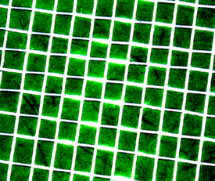

*Video demonstration — the original video for this article was hosted on TennisPlayer.net.*

**Global Gut in a hybrid with Alu Power Lux, glowing in the spring light.Tactics**

Most of the 4.5 guys, develop consistency as their main weapon. They may
be able to hit a few forehands topspin winners, or a few aces, or knock
off a volley here and there, but most don't have the power to approach
and blast off both sides. Speed and consistency wins the tournaments.

But with my speed gone, and my long history of injuries, my tactics now
revolve around ending the points more quickly. I needed to be able to
end points with my forehand and backhand.

I needed to learn how to hit a good serve, and good second serve. The
top pros all have one thing in common: they are only as good as their
second serve. The top players all have similar % of winning points on
the second serve. This is where my study of Sampras on TPA paid
off.

I also needed to end some points at the net, before the grinders wore me
down completely. So, I started to serve/volley for hours at a time, to
make it natural to hit volleys low and away or deep and away, or drop
it, or punch it.

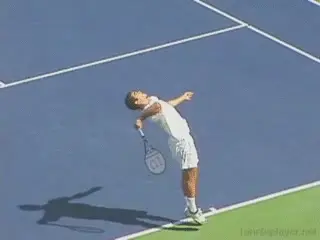

**Studying Sampras was the key to improving my second serve.**

I also needed to be able to probe and hunt for weaknesses, in people's
games. Everybody has some. So I learned to change my serve position on
the line, hunting for a weak return. Sometimes I hit the slice wide to
the forehand in the deuce court. Sometimes it's the twist to the
backhand in the ad side. I change the pace and spin and placements not
only of my serve but also my ground game.

I also changed my return position around, and hit a lot of returns from
these positions in practice, to make them second nature. The last thing
I want to do is hit 35 shot rallies, and run all day, playing two
matches a day, carrying 50 lbs. of extra weight.

**Loss of Condition**

It's not a secret that it's harder to lose and maintain weight when
you get older. My biggest problem was being unwilling to stop eating
well and drinking well. My one pleasure in life--eating like a medieval
king. (And I never use a fork.)

My history of cramping was an even bigger problem. Over the years I
tried lots of things to stop the cramps. I finally found Thermotabs, a
buffered salt/potassium/chloride pill, on the Tennis Warehouse message
board. Works wonders to stop the cramps. Fluid recovery powder also
helps, and I mix these all together and drink it in matches.

I also had to face the problem of two matches a day. This should be
illegal. I believe it causes lots of overuse injuries. Directors have
only so much time/schedule/courts and usually are forced to do this.

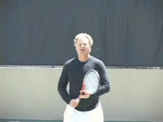

**More winning volleys at the net, before the grinders could wear me down.**

My personal experience, after two matches in day is that my body is
pulverized, with horrible cramping, sore muscles, ripping and searing
physical pain. I move too fast, try too hard, pump too much blood, for
my own good. But until a lawyer or two gets hurt playing, and they gang
up on the directors en masse, nothing will change. Any wimpy lawyers out
there, who hate playing two a day? Call me up. I'm ready for a class
action suit. "It's all your fault, you damn tournament director. You
made me enter this damn thing."

Then there is the nasty summer heat. Burn the skin off your forehead
heat. Burn your feet heat. Skin cancer heat. Horrible cramping heat. So
I don't play the tournaments anymore that are too far away from the
California coast where it can be 20 degrees cooler than inland.
Otherwise, I come back looking like a fat faced lobster, ready for the
pot. I have to rub off the sweat, and off with it comes the sun's cream.

And then, finally, there are the sandbaggers. These are the guys who
aren't really 4.5 level, but are playing for easy matches and trophies.
How do you deal with a guy playing down? The truth is many guys who win
tournaments are playing down. You are going to run into them sooner or
later.

**On To that 4.5 Victory**

I entered my first 4.5 tournament since 2004, in Carmel, at the
beautiful Carmel Valley Athletic Club. I played my first match against a
member there, who choked, and I tuned him up 1 and 0. Put away lots of
volleys.

Next match was the same day, a tall guy who served and volleyed the
whole time, no matter how many returns went sailing past him. He hit a
lot of aces, so what? Tuned him up 1 and 3.

I drove back up to Oakland, due to no money to pay for a hotel, and
ended up driving 8 hrs total in two days. Went back the next day and won
again, playing three matches in 24 hours.

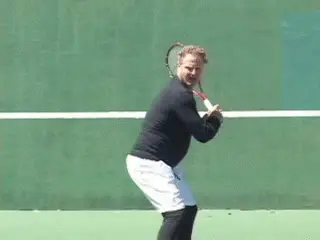

**In the final I jumped on short backhands.**

In the final I played the guy who won the tourney last year, in front of
his home crowd. After driving for another 2 hours to get there, I had
ten minutes to warm up and got broken in the first game. I broke back,
held and broke again for 3-1 lead, but got broken right back again.

The first set went to a tie breaker, where I went up 3-0, and promptly
lost the tie break 7-5. I could not decide which stick to use, and lost
confidence in the breaker, using three sticks.

Then I quickly went down love 3 in the second set, and told myself,
"You are going to come back. This will be a glorious come back. Hit
better serves, hit better returns, move faster." I went to super fast
feet mode, and fire in the eyes on the return.

I broke back. Held. Broke again, Held, and Held again for a 6--4 set.
The guy said, "Shit. Now it's split." I asked for new balls, and the
director was nice enough to give us three new ones.

I took a bathroom break, came out and immediately broke. Got broken
back. Broke back. Got broken back. I pulled out a 15-40 game at 4 all,
and then closed out the match, at love, by looping it high to his
backhand, and using that shot as an approach shot. The guy cracked badly
in the third, due I think to the pressure I had put on his serve.

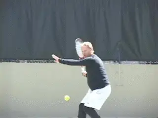

**A critical adjustment--looping deep to the backhand.**

But I also made several adjustments. He had been chipping at my ankles,
short to my forehand, and I was getting lobbed to death, hitting lobs
that landed within a foot of the baseline. So I stopped hitting kickers
to his backhand and started serving down the middle to his forehand,
which turned the match around.

He began to miss, and to hit short to my backhand. I jumped on those
returns down the line, approached or hit winners. I made better returns,
knocking him off the net.

This is what allowed me to work the high looper to his backhand. It made
him back too far off the line, caused some outright errors and allowed
me more room to volley. He banged his racket on the back fence and
screamed out in frustration. The match was over when he did that. It
gave me the confidence to close him out.

But the real turning point had been when I was love three down in the
second, and decided that I was going to come back, intended to come
back, and imagined how good that would feel in the end. I visualized the
director handing me the trophy, and smiling, and shaking my hand. I had
forgotten how hard it was to win, even at this level, against a smart
and determined opponent.

**Post Script**

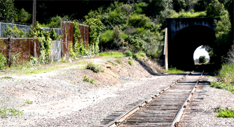

**40 years later the tunnel by the courts is just the same.**

In the end, haven't we all felt a little like fat Eddy, stumbling along
on the oil stained gravel bed by the old railroad tracks near the tunnel
with the creosote covered ties, our pudgy dominant hand clutching the
red ladder, clutching victory? Only to feel our dominant hand slipping,
our legs rotating under the weight of defeat? A little bit of self
belief, cut away with each loss.

The train rolled over his right leg. Blood soaked blue jeans. Eddy's
leg hung by a sliver. My stomach turned nauseous; the blood rushed out
of my head; the world went dark. I stumbled off to the right side of the
gravel bed and collapsed next to the tennis courts. Tears. My hand did
not slip on the red ladder.

the years he went on to become a fixture on the
Northern California NTRP tournament scene,
winning numerous titles at both the 4.5 and 5.0
levels. He accomplished this with a self-taught
style, shunning lessons. His recent return to
glory was inspired in part by his intensive study
of TPA. He claims with a straight
face to have read literally every article on the
site. An electrical contractor by profession,
Geoff lives in the East Bay with his wife Ronda.
Want to swap stories with Geoff or talk Gear Head
talk? Email him: <bestelectrician@sbcglobal.net>
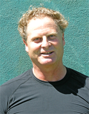                                                                                                                                                                                  first and only junior tournament at age 11. Over
