# Developing World Class Volleys - Tha Forehand Volley

**Developing World Class Volleys**

**The Forehand Volley**

**Pat Cash**

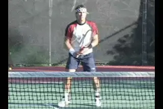

**Developing world class volleys, starting with the forehand.**

I was taught to volley in the traditional Australian way that goes right
back to Rod Laver. This was wooden racquet volleying. And the great
thing about the wooden racquet is that it forced you to hit through the
ball. It truly did.

There was no forgiveness in the racquets. If you miss hit the ball even
slightly, it wouldn't go anywhere. You had to really hit through the
ball and time it exactly perfectly.

Although I became known as a server and volley player, I was a complete
baseliner as a kid. My coach forced me to start going into the net. He
asked "If you can't volley, how can you win a match?" And in the old
days with the wood rackets, he had a point. I learned something
wonderful there.

In the modern game though, fewer and fewer players are learning to
volley and I can understand why. You have less time--you constantly get
passed and lobbed. You really need to be quite precise with the volley
to be effective. If you drop the ball a little bit short or don't play
the shot aggressively, you are in big trouble.

But there is definitely still a place in the game for the volley, in the
pros, and even more so at the lower levels. So in these articles I want
to share what I know about the volley, including especially some of the
fallacies I see that are still widely believed. We'll start this month
with the forehand volley and then move on to the backhand in the next
article.

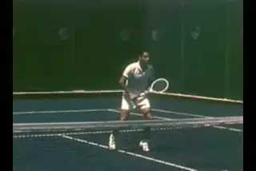

*Video demonstration — the original video for this article was hosted on TennisPlayer.net.*

**With the wood rackets you absolutely had to hit through the volley.**

**Problems**

One problem in volleying in the modern game is that basic volley
technique has deteriorated with the new rackets. Players can get away
with a lot more and **often tend to just chop down on the ball rather
hitting through it and creating a penetrating
shot.**

One day I was watching a classic match between Rod Laver and Ken
Rosewall in black and white, from about the time I was born. **[I just
noticed these guys were [taking a full swing at the volley,]
not so much with the backswing, but [on the forward
motion].]**

**They hit through the ball almost completely flat with a little
underspin.** That is a key point that still totally
applies if you want to be an effective volleyer at any level.

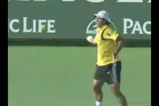

**On the modern forehand, the left arm goes down and back around---not
good for volleys.**

In today's game, one problem is that the grip on the forehand volley
often tends to be too close to Eastern, rather than a true Continental.
It's a huge shift to get all the way to a proper volley grip from the
modern forehand grips.

A lot of players never get comfortable with using the right grip. With
the Eastern grip they hit too much down trying to create spin.

The other big problem is the left hand position. Just about every kid
these days has a big semi-western or western forehand. So these players
are used to swinging the left hand around and across the body as the
shoulders rotate through the shot.

When they try to hit the forehand volley they tend to do the same thing.
The left hand pulls away from the ball and they open up the body too
much too soon. The left hand goes down somewhere near their pocket and
then pulls it back and around the side. Players lose complete control
and end up chopping rather than driving through.

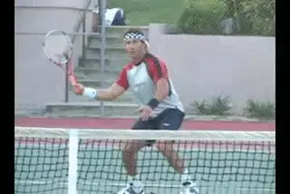

**"Punching" doesn't really describe the forward swing on a forehand
volley.**

**Fallacies**

One of the first fallacies about the volley is that you should "punch"
the ball, straightening out your arm like a jab in boxing. That isn't
what really happens. **[There isn't much movement in the arm and wrist
per se. They need to [stay firm.]]**

**Although there is far less rotation that on the modern groundstrokes,
your shoulders and hips still rotate to drive the
motion. Think of a chip shot in golf. The swing is
through the ball, and the body rotates. That's exactly the same way the
volley should be.**

On the forehand volley you need **to use the left hand as a cantilever
or counterbalance** if you want to develop good
technique. As I just mentioned, modern players have a difficult time
using the left arm correctly on the volley. **The hand should be up
around chest high and in front of your body at the
hit.** That is probably right about the ideal
position.

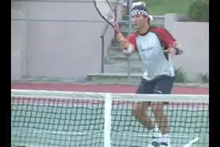

**The left hand stays at chest height as a counterbalance.**

**[The left hand position allows you hit through, rather than swinging
down and rotating around.]** It's almost like a slice
groundstroke with quite a big follow-through compared to what people
would normally think of as a volley. This is even more true on the first
volley, which is a very difficult shot in the modern game.

**Trajectory**

Another point that is misunderstood: **[[the trajectory on the volley
has to be quite low.] If you hit it too high above the net,
it'll definitely go out, especially today.]**

The great volleyers, Stefan Edberg, John McEnroe, Patrick Rafter
consistently hit the ball an inch or two, maybe three, four inches over
the net. They have incredible control. I mean, they really do.

When you are hitting a low volley you're aiming only about an inch or
two over the net. You've got to hit that one quite hard, and from that
position, if you hit it too high and it has any power, it's just going
to float out. **[So you really do need to hit through the ball with just
a slight underspin.]**

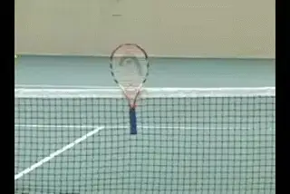

**Use the racket as a target to develop volley precision.**

**The point is that a good volley is very precise
shot.** A good way to work on this is to put your
racquet through the holes in the net so that the head is sticking up,
and you aim for the head of the racquet. That's about where you should
be aiming, particularly for a low volley.

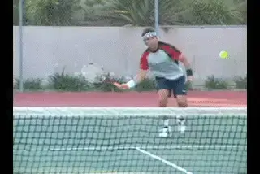

**The racket head needs to drop somewhat on lower volleys.**

**The Knee Fallacy**

A second huge fallacy has to do with bending the knees. **You do have
to get down to the low volley, but the days of really bending down and
scraping the court with the knees are long gone.**

First in the modern game you don't have time to get that far down.
Second, you need time to recover. So, on the low volleys I'm a big
believer **in dropping the head of the racquet down somewhat to the
ball. There is still going to be some knee bend**,
but it is a fallacy to think that you need to keep the racket head up
above your hand to hit a good low volley.

I think John McEnroe is a great example, showing that you don't need to
bend your knees down to the court to have great volleys. McEnroe is
quite upright. He looks like he's always got time, and he recovers his
position on the court so well. He does have freakish control with his
hands, of course, **but when the ball is low he uses the racket face
rather than trying to radically lower his whole
body**. ([link](https://www.tennisplayer.net/members/strokearchive/modern_legends/johnmcenroe/mac_volleys_overheads/mac_fhv/mac_fhv.html?MacFHVRear.pct)
to study his forehand volley in the Stroke Archive.)

**Open Stance**

The next fallacy is that you need to step across to the ball with a
lunge step. I think that is completely wrong. There's too much power in
the game and too much topspin for players to try to lunge out to the
ball.

I'm very much an open stance volleyer. I try to get behind the ball
with the outside foot, the right foot on the forehand.

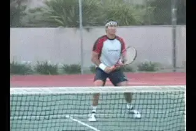

**Open stance volleying, [getting behind the ball] with the
right foot.**

At almost all costs I **try not to step across these
days**. It just takes your body out of position too
much, and **often you'll get caught running into the ball and end up
jamming yourself up.**

**In Front?**

This is related to the next fallacy, that you need the ball way in front
of you. If you can hit it quite late you will have more power with the
racquet face, and also the more control.

On the forehand, ideally, **we're talking about a few inches in front
of the body**. The basic swing is just slightly
outside to inside the swing, and if you time it right this is a very
powerful swing.

But if you push the contact too far out there, you are actually going to
lose control and power. ***The only time I would ever step across or
hit the ball way in front would be if the ball is dipping too quickly or
is too wide for me.***

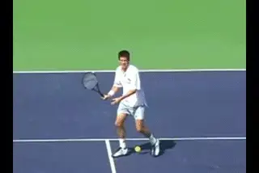

**Contact on the forehand volley is only a few inches in front.**

The good volleyers in recent years, like Pat Rafter ([link](https://www.tennisplayer.net/members/strokearchive/pro_men/pat_rafter/index.html?dir=pr_volleys_and_overhead/pr_Forehand_Volley)),
Tim Henman ([link](https://www.tennisplayer.net/members/strokearchive/pro_men/tim_henman/index.html?dir=th_volleys_and_overhead/TH_Forehand_Volley)),
or Pete Sampras ([link](https://www.tennisplayer.net/members/strokearchive/pro_men/pete_sampras/index.html?dir=ps_volleys_and_overhead/PS_Forehand_Volley)),
you'll see that they actually contact the ball quite late on the
forehand volley.

You also see open stance volleying and this same contact point with the
good doubles players, like the Bryan Brothers, or Leander Paes. The
doubles guys are really, in my opinion, the best examples of the volley
game, and we should learn a little bit from them, since we don't have
us old guys to look at anymore.

**Split Step**

The final fallacy has to do with the split step. **You use the split
step to change directions. But the key is not to stop, to keep moving
forward.** Don't stop and wait, if at all
possible, continue to run through the volley.

Of course, you don't want to run into the volley. But if it's a slow
one, don't split step and wait, continue to run through the volley.

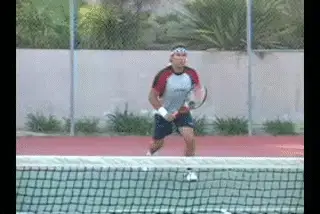

**Watch how I use the split step to change directions, but keep moving
forward.**

**One of the difficult things for youngsters who want to learn how to
volley is that it is a very athletic shot and tough to
master.** That's why you tend to see the most
athletic players being the best volleyers. Roger Federer. Lleyton Hewitt
is a very good volleyer. Andy Murray is a pretty good volleyer. Radak
Stepanek.

Even Rafael Nadal can volley quite well. His technique is not ideal, but
it's pretty good, and because he's so athletic, he does very well
around the net.

Below the world class level, though if you can improve your technique
following some of the points in this article, you have a chance to be
very effective at the net. So try some of these ideas out on your
forehand volley. Stay tuned for the backhand volley in a future article.

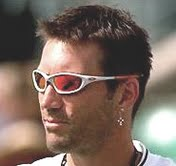

Pat Cash is an elite player in tennis history,

singles and doubles titles over a 15 year

career. In the early 1980's he was the number

one junior player in the world, winning at both

Wimbledon and the U.S.Open. In 1987 he won the

men's singles title at Wimbledon defeating

Mats Wilander, Jimmy Connors, and, in the

final, Ivan Lendl, a match considered one of

the greatest examples of attacking tennis ever

played in a Grand Slam final. Today he

continues to compete successful on the senior

tour. We are thrilled to have Pat as a

contributor to Tennisplayer.net!

Visit Pat's official website at

<http://www.patcash.net>
