# How you can play better doubles in tennis 

[sportstar.thehindu.com](https://sportstar.thehindu.com/columns/vantagepoint-paul-fein/tennis-doubles-bob-bryan-mike-bryan-david-macpherson-serve-and-volley-strategy-interview/article29811117.ece)

# How you can play better doubles in tennis 

# David Macpherson 

**Interviewed by Paul Fein**

*"A good doubles match can be one of the fastest and most exciting of
all sports events." -- John Newcombe, in* World Tennis *magazine
(1977).*

*"You need to be a more capable tennis player to be great at doubles."
--* [***[Martina
Navratilova,]***](https://sportstar.thehindu.com/newstag/Martina_Navratilova?utm=bodytag)
*in* Tennis *magazine (2004).*

Unless you love doubles and follow all-time greats Bob and [**[Mike
Bryan,]**](https://sportstar.thehindu.com/newstag/mike_bryan?utm=bodytag)
you may not have heard of David Macpherson. This upbeat Australian
deserves far more recognition. Since 2005, he's guided the famous Bryan
twins to 15 of their 16 Grand Slam titles, an Olympic gold medal, 39
Masters crowns and 10 year-end world No. 1 rankings.

In 2014, Macpherson coached Switzerland's [**[Roger
Federer]**](https://sportstar.thehindu.com/newstag/tennis-players-roger-federer?utm=bodytag)
and Stanislas Wawrinka to the Davis Cup title and was named Coach of the
Year by World TeamTennis.

Before becoming one of the most respected pro coaches, the 52-year-old
Macpherson reached a career-high ATP doubles team ranking of No. 8 with
Steve DeVries. He also won 16 ATP doubles titles, including the 1992
Masters Series Indian Wells.

Macpherson, affectionately nicknamed "Macca," credits great chemistry
for his extraordinary success with the Bryans. "We're great friends," he
told the ATP. "I love coaching, and they love playing."

The feelings are shared. In a sport where coaching stints often last
only months or even weeks, the Bryans have relished their close
friendship with Macpherson for 15 years.

"Macca understands us perfectly," Mike Bryan told me. "He knows how
badly we want to win, and he matches our intensity and professionalism
each and every day. He is amazingly dedicated to his job, and he always
outworks the opposition. We love the fact that despite the wins and
titles, he makes sure we keep pushing the bar higher and higher. It's a
shared philosophy of never being satisfied.

"Macca is like a second father to us," said Mike, whose parents, Wayne
and Kathy, a former world-class player, got them started in tennis. "He
knows how to balance our delicate interpersonal twin dynamic. He
understands when it's the right time to come in between us, but he'll
never takes sides. When we take to court for matches, he always makes
sure we're on the same page, and our energy is together moving
positively in the right direction.

"There's also nobody I've ever met who has more resiliency when it comes
to weathering a storm of tough results. His unwavering optimism keeps
the morale of our team high and allows us to bounce back stronger."

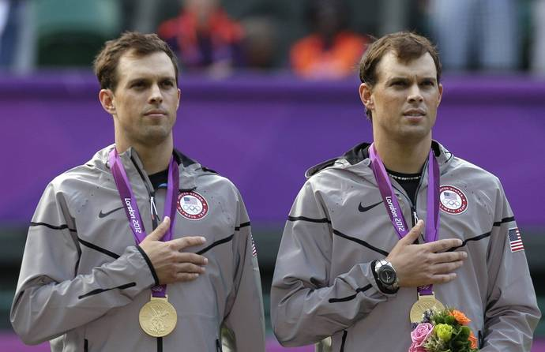

Mike (left) and Bob Bryan during the medal ceremony of the men's
doubles at the 2012 Olympics.   -  AP

The greatest doubles team in men's tennis history appreciates
Macpherson's astute coaching mind as much as his genial personality and
psychological savvy.

"Macca played against us on tour and thus was able to bring an
opponent's perspective to our coaching camp," [**[Bob
Bryan]**](https://sportstar.thehindu.com/newstag/bob_bryan?utm=bodytag)
told me. "He knew our strengths but more importantly could communicate
to us areas of our games that he viewed as weaknesses and needed
improvement.

"Macca is not nearly as physically powerful as us, but he was an amazing
poacher, used unconventional formations, crafty volleys and detailed
game plans to succeed on tour," Bob recalled. "He brought us all this
knowledge, and we have used it to help us achieve our goals.

"No one is more positive, hard-working or loyal as Macca. He is a
doubles genius, has our utmost respect and will be a lifelong friend."

In this wide-ranging interview, Macpherson shares his vast expertise
about the basics and fine points of doubles.

**As a teenager, you learned the game at Tony Roche's junior tennis
academy in Australia, a tennis-loving country renowned for producing
champions, especially in doubles. Which fundamentals of doubles
technique and tactics do you remember most from that training? And which
fundamentals have you tried to inculcate most as a coach?**

The great thing about being coached by Tony is that we learned to
volley. There was such an era [in the 1960s and 1970s] of great
volleyers that we volleyed so much as kids, way more than the kids of
today do in any of the other countries. We did a lot of volleying,
reflex volleying, smashing and just playing the net in general. Because
in Rochie's day there was a lot of grass-court tennis and getting to the
net was at a premium. Fellows didn't have the powerful backhands they do
now. Tony was my favourite volleyer of all time. So to be coached by him
inspired me and helped me to teach volleying going forward. Tony taught
me many other things as well. My doubles education started with the
incredible amount of volleying we did. Tony was one of the best
volleyers, perhaps the best, of all time.

**How is coaching a doubles team different from coaching a player who
focuses on singles?**

Singles is a very lonely sport. So, as a coach, you feel an even greater
onus to prepare your singles player for every eventuality. Because once
they get out there on the court, they have to think for themselves.
That's why you see a lot of singles players looking up at their
[Player's] Box --- sometimes in agitation or bewilderment when things
are not going well.

Whereas in doubles, for example, you prepare Bob and Mike, and if things
aren't going well, they can communicate with each other out there. Mike
might say to Bob, "We worked on this, we talked about that, and Macca
said, 'Go down the line' or whatever." It's helpful for a coach to know
that they have that on-court communication and support.

When I coach John [Isner] in singles, he's out there on an island. He
has to remember everything and execute everything that we talked about
beforehand without anyone else's help. You prepare your singles player
because he has no one to talk to during the match.

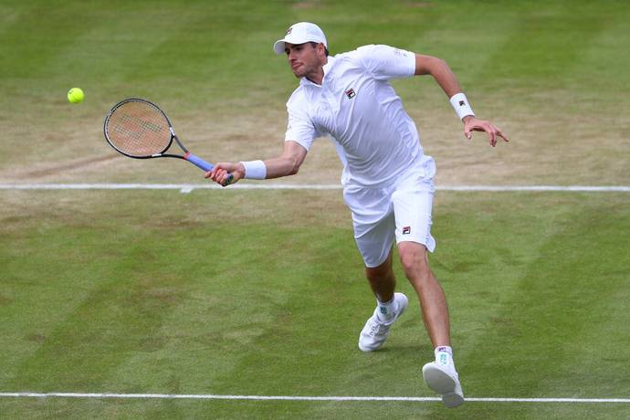

John Isner adopted a serve-and-volley first approach to his grass-court
strategy and came very close to reaching the final at Wimbledon 2018.
  -  Getty Images

**What have been the biggest changes in how doubles has been played on
the ATP and WTA tours since 1985 when you turned pro?**

Two things. First of all, there is now a lot more poaching by the net
player when his partner serves. From the normal formation, the Bryan
brothers took that to a whole new level. Certainly with [John]
Newcombe and Roche [in the 1960s and '70s] and the Woodies [Todd
Woodbridge and Mark Woodforde in the 1990s], those two great Australian
teams, or even [John] McEnroe and [Peter] Fleming [in the 1980s],
weren't anywhere near as active at net as Mike and Bob became. Then
everyone copied the Bryans. Even though the women don't serve as big as
the men, they're doing a lot more poaching these days. They're playing a
much bolder game at the net to try to take more pressure off their
partner serving.

The other big change in doubles is the "I" formation, which the Bryan
brothers had to adjust to because some teams came along in the 1990s and
brought in the "I" formation. That's been a very effective tactic in
men's doubles since then because it's not easy to return the ball into
the alleys off big serves. So when you put your net player in the middle
of the court [on your service games], it makes it difficult for the
returner to hit the ball past the net player. That hasn't been
aesthetically great for doubles because the points in men's doubles this
decade have been a little too short. But it's a very effective tactic in
modern-day doubles.

Players taller than ever have accelerated both trends, with ATP players
now averaging more than 6'2". For example, Bob is 6'4", Mike is 6'3",
and former No. 1 Marcelo Melo is 6'8". Great height gives players the
obvious advantage of serving very powerfully and from such a steep angle
that the returner is often incapable of controlling their return well
enough to avoid the net man who is camped on top of the net and in the
middle of the court. Being tall also increases their range at the net,
so it's a deadly combination.

**I read that Bob and Mike Bryan use 52 different doubles drills in
their practice sessions? Which drills proved most beneficial for them
over the years? And why?**

We've done a lot of different drills over the years. Some they learned
as kids from their parents. Some they learned along the way as they
tried to fine tune what comes up in doubles points. Some of the things
that separate the Bryan brothers from the other teams are the ground
strokes. A lot of doubles teams practise reflex volleys, poaching,
serving and returning serves. But the Bryans have very consistent,
accurate ground strokes. They paid a lot of attention to that in their
doubles drills.

Apart from playing singles points against each other, which keeps their
ground strokes sharp, they also play the two net players against the two
baseliners every day. The net players are positioned near the service
line, and they feed the ball to the players at the baseline. Then it
becomes a good battle between two advancing net players against two
players positioned on the baseline. The Bryans got so good at playing
two back that often good players with good ground strokes keep both
returners on the baseline, especially on first-serve returns. They feel
that if they can get their return in play, then they have an excellent
chance to win the point against two net players because they have such
accurate ground strokes. With this drill, the onus is on the baseline
players not to hit the ball too high over the net and hit with enough
pace so that the volleyers don't win the point.

In another common drill, both players at net whack a ball as hard as
they can at each other. The players work on their hands and their
ability to defend their body in net duels. That helps them improve their
hand-eye coordination and reflexes.

**Which drills do you recommend for juniors? Recreational players?**

Juniors and recreational players also need to do a lot of quick-volley
drills. They also need to do drills to learn how to intercept balls, to
poach. Here the net player has to imagine, to envision where the
opponent's ball is going and then cut across the middle to intercept it.
The junior player and the recreational player sometimes lack the
footwork, confidence and anticipation to cut across the court where the
ball is going to be. That comes instinctively to the pros.

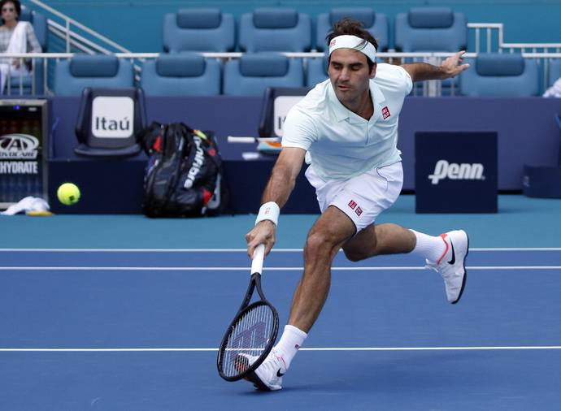

Roger Federer, along with Stefanos Tsitsipas, is one of the two best
volleyers among the top 20 singles players.   -  AP

**The Bryan brothers are always in motion during the point. Why is this
so critical?**

One of the hallmarks of their legacy is their energy. You never see them
flat-footed. I always say to recreational players, "A tennis point lasts
only 5-20 seconds, so if you can't stay on your toes in constant motion
for 20 seconds at a time, you should get out of the business."

The Bryans are so energetic that they're in motion even between points.
During points, they're in motion even if they're not the one hitting the
shot. They're constantly moving their feet, trying to anticipate where
the next ball is going to go. That is a big lesson for recreational
players to learn because that constant movement enables them to get off
to a quicker start.

"Playing doubles with somebody sets up a strange relationship, in which
you are a friend, teammate and competitor," wrote doubles superstar
Martina Navratilova in her 1985 autobiography. What are the keys to
making this "strange relationship" work well?

That's a very astute comment from Martina. You and your partner in this
battle form a friendship and a bond. But it's also very stressful. It's
like being a part of any team. When you suffer adversity and defeat,
it's so easy to blame the other person. That's why there is sort of a
competition between doubles partners as well. You don't want to be the
one who caused the defeat. Sometimes it's a battle to stay positive and
not fall in that trap of blaming your partner for your defeats both
during and after matches.

Part of being a great doubles player is getting the best out of your
partner. That means helping them feel confident and good about
themselves. So even if you're playing with someone who is not playing
well or is a weaker player, you have to work on the psychology part of
the game so that you're getting the best out of them and not diminishing
their confidence. Martina was alluding to the competition between
partners because it's human nature. You want to feel like you're the
better player on the team.

**What criteria should players use when they decide whether they should
play on the deuce side or the ad side, both for a given team and for
their career?**

That's a great question. It starts with the return. Which side of the
court do I return most effectively from. Then, if you're fairly
comfortable returning both cross court and down the line on both sides,
you think about the next shot. And you ask yourself which side of the
court would I like to hit my most powerful and effective shot after the
return.

Then you have to factor in poaching. Most players have more [movement]
range and [shot] power on their forehand side. Bob and Mike feel their
favourite return side is Bob on the deuce side and Mike on the ad side.
But their decision is also based on poaching. Bob feels like if I put
myself on the forehand court and Mike makes a good return, I have so
much more confidence and range to attack the next ball with my forehand
volley.

So, after you consider these three factors, you decide which side is
best for you.

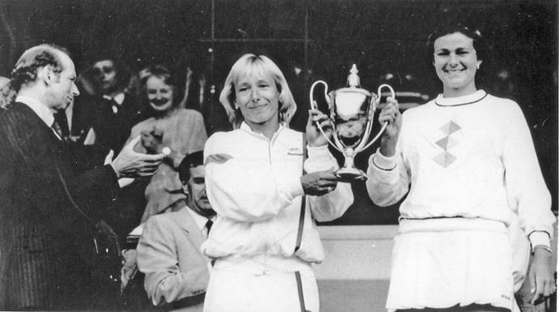

Martina had a nasty [lefty] serve, and Pam had a very good serve. They
both had fantastic volleys.   -  The Hindu Photo Library

**When aspiring doubles players watch the pros play either at
tournaments or on TV, what should they look for to improve their own
doubles games?**

Junior players, USTA league players and recreational players can learn
so much from watching the *Tennis Channel*'s and *ESPN*'s coverage of
doubles and listening to the experts analyse it. One of the biggest
things to be noticed and copied is the desperation from the server's
partner and, to a lesser degree, the returner's partner to track,
anticipate and hunt down the ball at the net. Amateur players are too
often timid up there and take up too little space. They don't help their
partner hold serve or take advantage of a good return of serve. The
Bryans' net man covers an enormous amount of space and hunts down the
ball at net. That makes life easy for their partner both when he serves
and returns serve.

**Why is it smart to hit up the middle in doubles?**

If you can keep the ball low and up the middle when two [opposing]
players are at net, then it's difficult for them to put the ball away.
On the other hand, if you hit the ball too high over the net near the
sidelines, it creates too much of a cross-court angle opportunity for
the net team to put the volley away. Or, if you're the net team and you
volley the ball up the middle, it also limits the amount of angle that
your opponents can use to get the ball by you. Also, by hitting up the
middle against a team that is not particularly cohesive, sometimes both
players let the ball go by. They think the ball should have been their
partner's shot. That shouldn't happen at the highest level, but in
recreational tennis you see that a lot. Recreational players also can
collide going for the ball up the middle. Another reason is that the
ball goes over the lowest part of the net. So hitting up the middle is
often the highest percentage shot.

**How does volleying differ in doubles from singles in terms of
technique and tactics?**

The biggest difference is that in doubles you don't need to have as good
technique as in singles, because in doubles you get to position yourself
so close to the net, especially in the men's game where serving is
powerful. You can get on top of the net, and, basically, without good
technique at all, still put away volleys if your reflexes are quick
enough to deflect the ball away for a winner.

In singles, you don't get to start up at net. You have to work your way
forward to the net. So often, as a singles player, you will have to play
your first volley around the service line [which is 21ft from the
net]. It is much more difficult to volley from the service line than
from very close to the net.

When you serve and volley in doubles, there will be plenty of first
volleys you have to hit from, or just inside, the service line as well.
But there are also plenty of volleys in doubles where the server's
partner is standing on top of the net. So it takes more volleying skill
to be effective in singles than in doubles.

In singles, there is a lot more court to cover than in doubles, and if
you come in on a poor approach shots, you have little chance to win the
point. Whereas in doubles, you can play the angles and it requires two
players at net a lot of the time, so you should be in a good position to
hit a solid volley.

In singles, you have to come to net at the right time, and you also have
to be athletic and anticipate well like [Patrick] Rafter and
[Stefan] Edberg to cover the net. In doubles, quick reflexes are
paramount because sometimes the ball comes at you super quick. The best
doubles players often have the best reflexes of all the players because
they're so used to it.

**Would you say that it's still important to have excellent technique?**

Yes. But there are quite a few players on the ATP Tour that do not have
good volleying technique at all. And their flawed technique is exposed
at times when they're required to play volleys from deeper positions.
But they minimize that. When they serve in doubles, sometimes they don't
even serve and volley. They stay back and just use their ground strokes.
And when they are the partner of the server, they get so close to the
net that even though they don't have good volleying technique, they
don't need it to put away a volley.

**Which pros have the best volleying technique?**

The Bryan brothers are the benchmark. They hit their forehand volleys so
firm and flat, which a lot of players don't do. A lot of players slice
their volleys too much. Their racket head starts too steep [high]
above the ball, and they end up with over-sliced volleys, which lack
power and penetration. These volleys pop up too high. The Bryans have
the most classic forehand volleys. They have a little more slice
[underspin] on their backhand volleys, which is normal. But they have
the ability to flatten out their backhand volleys and get that
penetration when they need to, as did the great Australians like Roche,
[Ken] Rosewall and [Fred] Stolle.

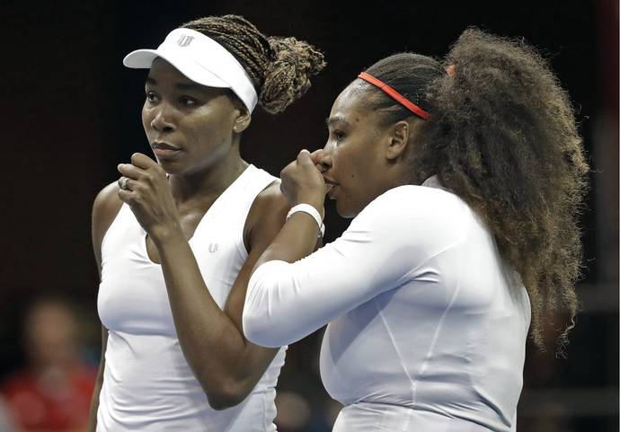

It would be fascinating if we had a time machine that had Martina
Navratilova and Pam Shriver play Venus and Serena Williams.   -  AP

**Besides Bob and Mike, which players today have excellent volleys?**

[Roger] Federer and [Stefanos] Tsitsipas are the two best volleyers
among the top 20 singles players. Tsitsipas is fantastic. He plays good
doubles as well as singles because he really wants [to intercept] the
ball at net. He has the ability to "stick" his volleys when it's
required or hit angles and touch volleys. Federer is often a brilliant
volleyer. I'll never forget that [2014] Davis Cup final when he put on
a doubles clinic against the French team. His volleys were immaculate
and spectacular that day. John [Isner] proved at Wimbledon last year
he is becoming an elite volleyer. He adopted a serve-and-volley first
approach to his grass-court strategy and came very close to reaching the
final. [Grigor] Dimitrov is also an excellent volleyer.

The one-handed players, like Federer, Tsitsipas and Dimitrov --- and
Navratilova and [Justine] Henin, among the women --- are often very
good volleyers. Volleying is more challenging for the two-handed
players, who do things primarily with their second hand, to be as
instinctive and skilful with the backhand volley.

Among the doubles standouts, [Pierre-Hugues] Herbert has very good
volleying technique. He also has the ability to "stick" a volley.

In general, though, today's players don't volley as well as the
generation that taught me, but they do the other parts of the game
infinitely better. They hit the ball with so much more ferocious power.
And their defensive speed --- the way they move around the court --- is
at another level compared to when I was growing up.

**What are the keys to poaching effectively? Put differently, when are
the right times for a net player to take a chance and dart to the middle
of the court?**

It's mostly about anticipation and visualisation and then decisiveness.
You have to anticipate before your opponent has hit the shot where he's
going to hit the ball based on his shot tendencies and watching his
racket face and trying to visualise where he's hitting the ball. So a
great poacher anticipates it before it even happens and is in motion as
the ball is coming off his opponent's strings. That's why the Bryans
look so quick. They are quick, but they're also moving just before the
ball has been struck. So that gets them into a position where they
visualise and imagine where the ball is going to cross the net. They
don't wait for it to come off the strings and then try and go get it.

Sometimes you can be mistaken. You can be sure the opponent is going to
hit the ball cross court, and you move toward the middle, but they fool
you and hit the ball down the line and get a winner. That's all part of
the anticipation and guessing game that goes on during a doubles match.
Poaching is the area recreational players really struggle with:
visualisation and the ability to trust their moving as the opponent's
ball is struck.

You really should be poaching as much as possible because the player at
the net can end the point quickly if they can get their racket on the
ball. Whereas it's harder for the person on the baseline to end the
point. The best the server or returner standing on the baseline can do
is hit an occasional winner. If you're the player at the net, you should
be desperate to volley whenever possible. That's the attitude you should
have.

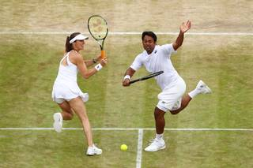

Martina Hingis was a great example of someone with the ultimate shot
variety. She could return the ball anywhere.   -  Getty Images

**Serving and volleying has almost disappeared in women's doubles on the
WTA Tour. Why? Do you teach girls and young women how to serve and
volley?**

Because the women don't serve as big as the men, the advantage is with
the returner a little bit in both singles and doubles. In general,
because women's serves lack the same spin and pace as the men, their
first volley is so much more challenging. The ball coming to them is
lower and more accurate on the WTA Tour than the ATP Tour, where the
serves are so much bigger and the returns are harder to control.

So most of the great women's teams don't serve and volley. They hit the
best serve they can, and the server stays on the baseline, and the net
player does her best to anticipate and poach and pick off balls for
their server. Meanwhile, the server stays back and tries to be
consistent and outthink and outmanoeuvre the other team.

I agree with this tactic. Unless you are an extraordinarily good server
or a particularly gifted volleyer from mid-court, then it's better to
serve and stay back in women's doubles.

**I miss the superb serving and volleying of 1980s doubles greats
Martina Navratilova and Pam Shriver.**

Yeah, Martina had a nasty [lefty] serve, and Pam had a very good
serve. They both had fantastic volleys. They played in an era when no
one hit the ball particularly hard. So serve-volleying for them was a
high-percentage play. But these days the serve return is struck with
such force that unless you're serving with enough force to disrupt that
return power, you really have to be an exceptional volleyer, which
Martina was. And Pam was very good, too.

It would have been interesting for them to play in this era. I'm sure
they would still have been the best team in the world, but they would
have had to deal with some more ferocious hitting on their first
volleys. If you serve-volley against Serena [Williams], you better hit
your spot. Otherwise Serena will hit a ball 100 miles an hour at your
toes.

**It would be fascinating if we had a time machine that had Martina and
Pam play Venus and Serena.**

Yeah, it would be a great match. Martina and Pam [who won a team record
20 Grand Slam titles] were unbelievably good. I'm sure they'd more than
hold their own. Their skills were just fantastic. But Venus and Serena
hit the ball infinitely harder than anyone in the 1980s. Also, equipment
has changed, and athletes have gotten faster and stronger.

**How does a doubles team decide who should serve first to start the
match and also who should serve first to start a given set?**

First, you decide: Who is the better server? And who is the better net
man? If you have a great net man and your two servers are roughly equal
in ability, the fellow who plays a better net game and poaching game
should let his partner serve first. The better net player can do more
damage at the net. The decision is not based only on who is the better
server. You also have to factor in who is the more active and more
offensive net man.

Second, if the team has a lefty and a righty, often the wind and the sun
dictate the choice. You always want to serve with the wind to your
advantage and not looking into the sun.

With the Bryan brothers, we try to arrange it so that Bob serves first.
His serve is his best shot. He's left-handed, and it's especially
difficult to return. And Mike is the ultimate wizard at putting the ball
away at net.

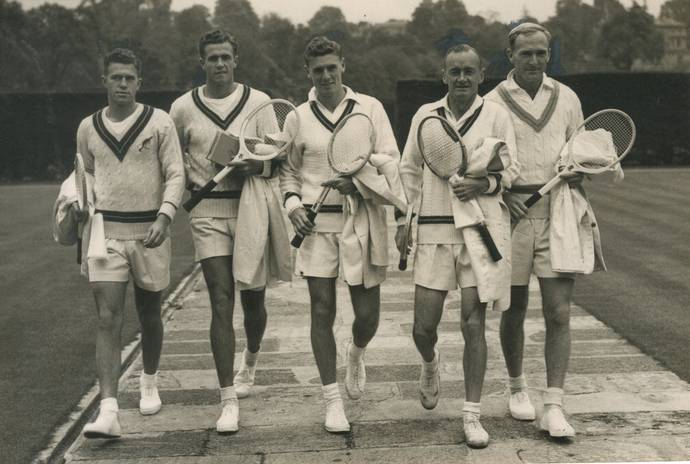

John Bromwich (extreme right), a two-handed Australian player in the
1930s and 1940s, had a deceptive serve return.   -  The Hindu Photo
Library

**What are the "I" and Australian formations? And when should you use
them?**

In the "I" formation, if you're the net player, you crouch below the top
of the net in the [normal] service box across from the returner. Then
your partner basically serves over you, and you pop up and cover
whichever side [right or left half of the court] you and he
predetermined.

The Australian formation is where you stand more upright at the net and
on the same side of the centre service line in the service box as the
server. So he shouldn't hit you in the back of the head because you're
on the same side.

In the pro game, the "I" formation is more effective. But when I'm
coaching recreational tennis --- where I'm wary of people with bad backs
and bad knees --- getting that low to the ground and having to pop up 50
times a match is not that easy for older people. So the Australian
formation is a good alternative to the "I" formation.

The purpose of both formations is to stop the other team from returning
cross court. Most players return cross court with far greater ease and
consistency than they do down the line. So positioning the net player in
the centre for either formation blocks off the cross-court return by and
large, and makes the returner change their shot direction and go down
the line.

**What is the positional disadvantage of the lesser-used Australian
formation?**

The main disadvantage is that a skilful returner can shorten his return
swing and block or poke the ball into the big open area down the line.
That is the best way to defend against the Australian formation. He can
take the ball early and possibly even follow it into the net to steal
the net position, if the server stays back. That creates a difficult
situation for the server if he stays at the baseline and is confronted
with two players at the net. That exposes his partner [who is alone]
at the net.

If you use the Australian formation, the net player shouldn't always
stay on the cross-court side. Sometimes they need to cut across and put
away the down-the-line return in order to keep the returner guessing and
off balance. The whole idea is that you never want the returner to know
where your net man is going to end up [positioned].

**So even recreational players who don't have advanced skills, because
they're playing opponents who don't have advanced skills either, should
still use these formations because they can throw their opponents off
their games?**

Absolutely. My girlfriend plays 3.5-level tennis. I try and help her as
best I can. I tell her to play Australian formation primarily from the
ad side of the court when she's serving to the ad side because most of
the players at her level don't have very good backhand volleys. And so
on the ad side of the court, the returner is able to hit the ball cross
court without any fear of the net player reaching over and putting away
a backhand volley. Then they [the returning team] just steal the net
position away from the server and win the point.

So I advise her, from the ad side of the court to put her partner in the
Australian formation so we don't let the returner get the ball cross
court. That makes the returner hit the ball down the line, which on the
ad side goes to the right-hander's forehand, and the right-handed player
forehand is normally the stronger shot. And then you get into these
baseline rallies where at least the server has the forehand against the
opponent's backhand.

A good tactic to defend against that is to hit the return quickly down
the line and advance to the net behind it and try to put the server
under pressure.

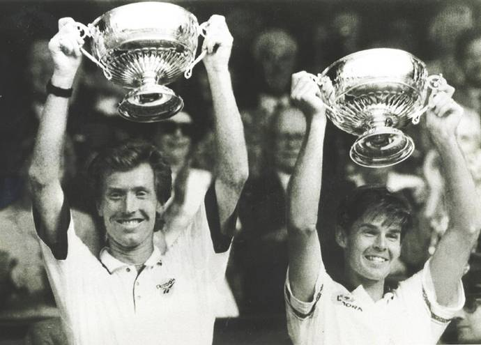

Even the great Australian team of the Woodies, Todd Woodbridge and Mark
Woodforde, wasn't anywhere near as active at net as Mike and Bob Bryan
became.   -  The Hindu Photo Library

**What are the main advantages of the "two-back" formation, where both
players position themselves close to the baseline?**

If you're playing a team that's poaching well and if you leave your
returner's partner at the net, then they're an easy target for the
poacher to volley the ball through. So it's an excellent idea to put
both players on the baseline when you're both returning serve. That
makes it more difficult for the poacher to end the point. This is an
especially good tactic when you're facing a big server or an effective
poacher. Putting both the returner and the returner's partner on the
baseline is a high-percentage play because it gives you a chance to
extend the point and make it more difficult for the other team to end
points with a poach.

And in extreme situations, if you have a very weak serve and if your
opponents have a very powerful return and they're picking on the net
player, then you can have your partner stand on the baseline as well.
I've done that in World TeamTennis in the women's doubles where one of
my players had a very weak serve and one of her opponents had a very big
forehand, and she was belting the ball straight through our net player.
So it made more sense to have the net player play on the baseline as
well.

In my era, Kent Carlsson ranked No. 6 in singles, but he was much weaker
in doubles. So he played on the baseline when his partner served because
his ground strokes were vastly superior to his volleys. It was very
unorthodox, but it often worked. In doubles, you have to be flexible and
imaginative. You play to your strengths, you target the weaknesses and
tendencies of your opponents, and you are constantly throwing different
tactics at your opponents to keep them in two minds about where to
direct the ball. If you have either a massive forehand or exceptional
lobs and poor range or technique at net, then it makes sense to play
from the baseline, like Carlsson, as much as possible.

**World-class players have a much better understanding of percentage
tennis than lower-echelon players. What are the keys to playing
percentage tennis in doubles?**

Percentage tennis entails making as many first serves as possible. The
Bryan boys try to make 70 percent or more of their first serves, which
they accomplish a lot of the time. You should try to serve as accurately
and powerfully as possible while maintaining that 70-percent level.
That's the trick. Anyone can get a cream puff serve in 70 percent of the
time. But to serve with velocity and accuracy at 70 percent is truly
great serving.

High-percentage returning also has a fine line. You want to return serve
accurately and low and keep it away from the net player. You want to
return as consistently as possible. But when you're playing a team with
good volleyers, you sometimes have to take more risks. Sometimes the
higher-percentage play is to return serve with more aggression. Maybe
they will result in a lower percentage of returns, but the returns you
do make will win points [either outright or on the next shot]. And
that will give you a chance for a service break.

So, high-percentage doubles can mean a lot of different things.
Sometimes it's doing a lot of poaching and taking away cross-court
returns, which are many players' favourite returns. High-percentage
serving requires that you serve with slice and kick, rather than dead
flat, to control the ball for consistency and accuracy.

You do need some spin to control your returns. But if there is a
poaching threat from the net player, you do need to hit with as much
penetration [power] as possible. So returning in doubles needs to be a
little more high risk than returning in singles, where you don't have a
net player harassing you, so you can hit the ball with more margin [for
error]. Specifically, in singles you can hit the ball higher over the
net and position yourself deeper behind the baseline to give yourself
more time to get the ball in play.

But in doubles, because you have a net man harassing you, you need to
take the ball earlier and hit the ball cleaner and lower over the net to
get it by the net player. Returning serve in doubles is one of the
hardest things in tennis to do, especially in the men's game. That's why
a lot of the doubles players beat singles players in doubles. The
singles players get so used to returning high over the net or chipping
the return and playing well behind the baseline and giving up ground.
But when they play doubles, they have to change all that.

Some singles players adjust to that better than others. Rafa [Nadal]
does a great job. When he plays doubles, he stands in much closer and
rips the ball harder and flatter than he would in singles. He smart
enough and flexible enough to do that, and he's won an Olympic gold
medal and Masters titles in doubles. Rafa and Roger [Federer] have
skills, such as anticipating really well at net, that transfer really
well to doubles.

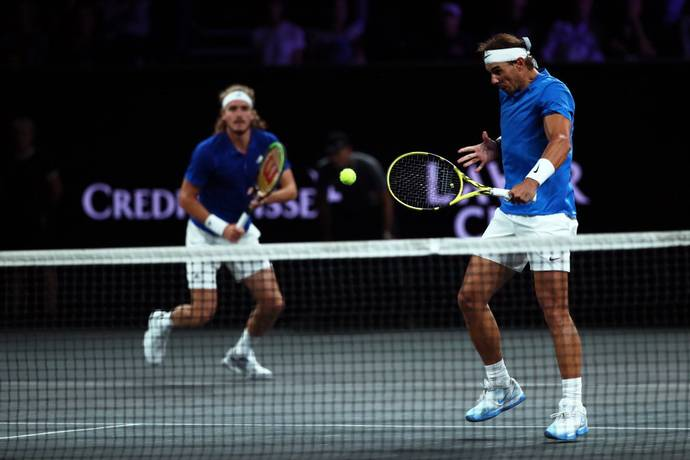

When Rafa Nadal plays doubles, he stands in much closer and rips the
ball harder and flatter than he would in singles.   -  Getty Images

**"Your doubles game should be filled with sabotage and surprise,"
advises Marty Smith in his excellent instruction book, *Absolute
Tennis*. What surprise tactics do you recommend?**

That's a great quote. That speaks to what I'm talking about --- the net
man doing damage, helping your partner hold serve and also cashing in
when your partner hits good serve returns. A big part of that is
surprising your opponents with your anticipation and your movement.
Sabotage is also a good way to describe it because you're breaking up
the rhythm of your opponents who would like to just hit the ball high
over the middle of the net and play a safe shot. If you sabotage and
surprise your opponents, you're taking away that safe shot by stepping
across, getting close to the net and putting the ball away. That forces
your opponent to try to hit deep lobs or accurate shots in the alleys.
These are tougher, lower-percentage shots.

**Which elite doubles players had tricky, unpredictable or varied serve
returns?**

That's a great question. John Bromwich, a two-handed Australian player
in the 1930s and 1940s, had a deceptive serve return. The Woodies were
consistent. Like the Bryans, they could hit effective lob returns. The
one-dimensional doubles players don't lob a lot on serve returns. Both
of these teams could hit the push lob when their opponents were very
close to the net.

**What about clever, versatile doubles players in the women's game?**

[**[Martina
Hingis]**](https://sportstar.thehindu.com/newstag/Martina_Hingis?utm=bodytag)
was a marvel. She was an absolute genius. She was a great example of
someone with the ultimate shot variety. She could return the ball
anywhere. She was especially deadly off the backhand. Her forehand was
good in doubles, too. The two Martinas [Hingis and Navratilova] were
the best volleyers in women's tennis history. Hingis was a spectacular
doubles player. She was clever and a master at deception. Her hands were
gold. She and the other Martina were the benchmarks.

**Bob and Mike Bryan, of course, learned a great deal and improved a lot
when you coached them. What did you learn from coaching them for 11
years?**

My gosh. They brought the best out of me. Their intensity and their
professionalism and their desire and their ability to win in the clutch
taught me a lot. I was a good player, not a great player, but working
with them has made me a better coach.

Doubles is such a game of tactics and counter-tactics, and they helped
me take that to the next level. I had to try to anticipate where their
opponents were going to serve. For example, what percentage of the time
would they serve down the middle to [left-hander] Bob's forehand, and
what percentage would they take him wide to the backhand? And when they
take him wide to the backhand, would the net man cover the line, or
would he cover the lob? How much would they poach on [right-hander]
Mike's backhand?

There is so much to try to anticipate about what their opponents would
try to do to disrupt and sabotage the Bryans' games. I make a game plan
and talk about it with the guys. Then, once the match starts, it's up to
them to use that information and process it and sometimes adjust it if
it's not working perfectly.

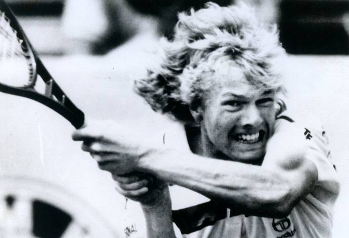

Kent Carlsson ranked No. 6 in singles, but he was much weaker in
doubles. So he played on the baseline when his partner served because
his ground strokes were vastly superior to his volleys.   -  The Hindu
Photo Library

**Do you use a lot of statistics to formulate your game plans?**

I trust my eyes and my instincts a bit more because I watch a lot of
tapes [videos] of previous match-ups involving other teams. I see what
plays they went to on the big points. I do use some stats. The USTA
tabulates a lot of stats now, so they help me with stats.

I didn't have that for the bulk of my coaching career. But that changed
in the last couple of years when I've coached John [Isner]. The USTA
information tells me what percentage of the time a player serves to the
forehand, the backhand, or the body, and all sorts of things.

I do use data more than I used to. In the old days, I'd just get out
there in the stands and watch the Bryans' opponents and make little
notes to myself and then try to visualise and anticipate the match
unfolding and what would be required to win.

**Bob and Mike just turned 41. Do they have another major title in
them?**

I totally believe that. They just won the Masters tournament in Miami
against all the other great teams. So they're back to playing their best
stuff. I have high hopes they can win many more Grand Slams.

**Everyone likes to win, of course. But, unlike singles, doubles is
typically very enjoyable whether you win or lose. What is it about
doubles that makes it so much fun?**

You have a comrade, a partner. You play with someone you like, and you
enjoy that interaction out there. Singles is a lonely sport. You're out
there with no one to feed off or encourage you. Of course, if you're
playing doubles with someone you don't get along with and you're blaming
each other and not feeding each other positive energy, it can be a
miserable experience. But if you're feeding each other good energy and
enjoying the camaraderie and the communication and the teamwork, that
makes it so much fun.

When doubles is played well, you see more entertaining points than in
singles. You have four players having rapid exchanges. The Bryan
brothers' highlight reel of points are just spectacular. In the men's
game, when the serves get too big, the points can get a little too
short. But there's nothing more attractive and exciting in tennis than a
well-played doubles match.

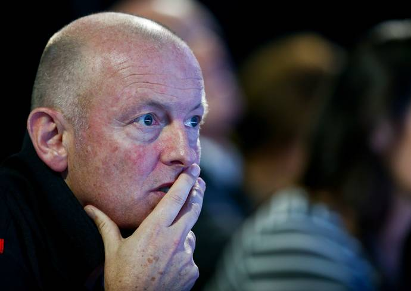

**David Macpherson, affectionately nicknamed "Macca," credits great
chemistry for his extraordinary success with the Bryans.   -  Getty
Images**

**David Macpherson** is the most successful doubles coach in tennis
history -- he has worked with the Bryan brothers and was a consultant to
Switzerland's winning Davis Cup team at the 2014 final, which saw Roger
Federer and Stan Wawrinka combine to take the doubles rubber. Here are
his tips on 'HOW TO HAVE SUCCESS AS A DOUBLES TEAM' ...
