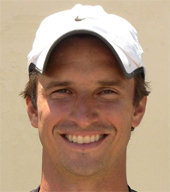

# The Dirty Diaper Drill

**Serve Secrets:**

**The Dirty Diaper Drill**

**Jeff Salzenstein**

This is the second of a new 3 part series from Jeff Salzenstein on Serve
Secrets. Jeff should know something about serving since he was clocked
in excess of 136mph on the ATP tour. But more than that, Jeff has always
been a student of the game and particularly the serve. He is one of the
bright new voices in tennis coaching and one of the very few who comes
from such a high level playing background.

This second article details a powerful drill to help develop a kick
serve with more topsoin.

We're excited to have back Jeff as a Tennisplayer contributor!

*Video demonstration — the original video for this article was hosted on TennisPlayer.net.*

Jeff Salzenstein is the founder of Tennis

training program on the web for players of all

levels. Jeff was an elite American junior player

who went on to become a two time All American at

Stanford. Over the course of his pro career he

won 5 Challenger titles, played in the main draw

at all four Grand Slams, and was ranked in the

top 100 on the ATP Tour. He has career wins over

players including Fernando Verdasco, Mikhael

Tillstrom, Jiri Novak, and Greg Rusedski.

To Visit Jeff at Tennis Evolution and Learn More

About His Coaching and Training, [Click

Here!](http://www.tennisevolution.com)
