# The Killer Forehand - Part 1

### The Killer Forehand: Part 1

### Nick Bollettieri

The killer forehand isn't just about physical size and strength. Look
at this young guy below on the right. Right now he's four feet tall,
but he's got the proper technique and the proper fundamentals to give
him a big, powerful forehand. Yeah, he's a little guy, but he's got
the makings of a big killer forehand.

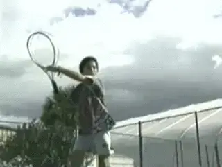

**Technique, not size, is the secret of the Killer Forehand.**

We're going to show you all the ingredients necessary to develop the
killer forehand. We'll show you the correct techniques for both
movement and for the stroke.

You'll learn the pros and cons of the various grips, how to create an
athletic foundation for better power and balance, first step reaction
technique, all about footwork strides and footwork patterns, and you'll
learn early and correct racquet preparation.

We'll analyze the various hitting stances, your swing line and
increasing your racquet speed, and We'll also look at the benefits of
using the opposite arm.

You'll learn a new technique called **hip
loading** and **how to properly recover after the
stroke.** Each of these areas are vital to the
development of the killer forehand.

In addition, you'll see how we have trained some of the top players in
the world at the academy, players like Xavier Malisse, Tommy Haas and
Elena Bovina.

Your killer forehand is going to be steady. The mentality's going to be
that you're not going to miss it. You're going to hit it and hit it
and hit.

**You're going to use your feet, your movement, your
mentality.** Everything we'll show you is building
up to give you the biggest killer forehand possible. So, let's get
started.

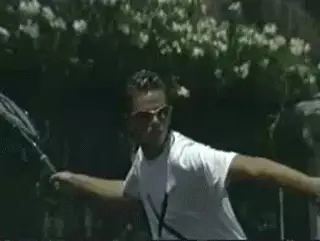
**The Killer Forehand is steady. You're going to hit it and hit it and hit it.**

### Grips

**It all starts with the grip.** When I first
began teaching the game of tennis, there was one or maybe two ways to
hold a grip. Today, it's very different-you have a wide range of
options--and grip has a major bearing on your style of play.

There are three commonly used grips on the killer forehand. The Eastern,
the Semi-Western and the Full Western.

![A picture containing text Description automatically                                                                                                                        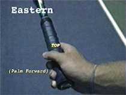
**The Eastern grip is very versatile. It offers great power and spin and can handle balls in any part of the strike zone.**                                                          **The Semi-Western grip is a popular pro grip. It produces power and spin with balls higher in the strike zone.**                                                              **The Western grip is very comfortable on higher balls. It produces heavy spin but lower balls can be difficult.**

Whichever grip you choose, stick with it. It will take months of
practice before you develop a reliable forehand.

Just how tightly do you hold the racket? Actually, you should hold it
very loosely, just tight enough to keep it in your hand. Grip the
racquet as you normally would and take a look at your fingertips. If you
see them turning white, you're gripping too tight.

If you hold it too tight, that means your body's becoming tight, your
arm becomes tight, you lose flexibility. Let your hands work, let them
be free.

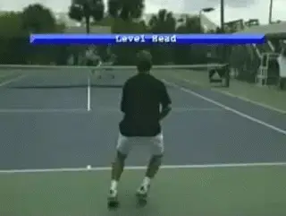
**Your athletic height is about a foot less than your standing height.**

### The Strong Foundation

If I've said it once I've said it a million times, the killer forehand
starts with a strong foundation. A strong foundation starts with a ready
position that allows you to be strong in all your movements and all your
strokes.

**Your ideal athletic height will be approximately one foot lower than
your standing height.** That means that if your
normal standing height is six feet, your ideal athletic height would be
around five feet.

**[Your hips are dropped down to] a low center of
gravity and a wide base to
allow you to react and move to various positions
on the court.**

**Like a downhill skier, lowering your hip position, or center of
gravity will improve your quickness, power and stability.**

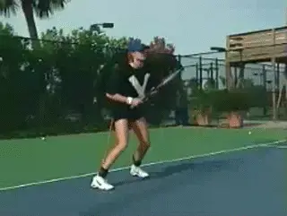

**The athletic trainer promotes
a strong foundation: low center
of gravity and a wide base.**

The athletic movement trainer regulates the height of your center of
gravity as you practice, building into habit the correct body position
and footwork. It makes you keep your body down and utilize the legs. It
allows you to develop all the qualities needed like a good, strong
posture and back position. For more info on the trainer, developed by
Pat Dougherty at the Academy, [link](../Footwork/The%20Athletic%20Foundation.docx)

Adjusted specifically to your height the bungee cord will resist and
remind you when you were using incorrect technique. In match play, you
should play every point as if you were wearing the athletic movement
trainer.

We work and work to get that strong lower foundation. Why? Strong down
below, strong up above. And that's the key: to have a perfect lower
foundation that allows you to use the upper part of the body.

### The Drop Step

Let's work on the first step reaction footwork and **find the proper
technique to go from rest into motion**.

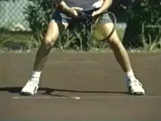
**The drop step gives you explosive movement for difficult balls.**

**For extreme court coverage, you need an explosive
reaction**. **The drop step and drive footwork
prove quickest on all types of surfaces for getting to difficult
balls.**

**By shifting your weight off the outside foot**
**[and tucking the driving foot under your torso,] [your body
weight provides traction,]** **much like a front
wheel drive car in the snow, using the weight of the engine to give the
tires traction.**

**In one quick move, the drop step establishes upper body momentum in
the direction you need to move.**

**When the ball's only three or four steps away from you, you won't
need such an explosive reaction. The weight shift and drive footwork is
effective for less challenging balls.**

### Preparation

There are lots of parts is developing the killer forehand and **an
important part is timing.** **As soon as the ball
leaves the opponent's racquet, that's when the preparation starts. And
remember, you can't prepare too soon.**

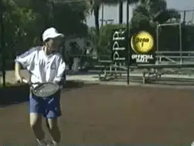
**You can't prepare too soon to hit the Killer Forehand.**

To improve your reaction time, try this. Have your partner on the other
side and when they make contact with the ball, say the word "ball".
When it's your turn to hit it, say the word "hit".

Not only will this put you in better position to hit more killer
forehands, but it's also going to improve your reaction time and
anticipation skills.

In interviews, I always get the same question: what do you look for when
you're looking for a possible professional player? I'll tell you what
I'm looking for. In order to have a killer forehand, you better have
quick feet. You have to spring on that ball like a tiger.

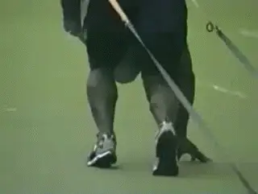

*Video demonstration — the original video for this article was hosted on TennisPlayer.net.*

**If your heels are touching, you're in 10th gear.**

Like riding in first gear on a bicycle, your first two to five steps
have to be quick for maximum acceleration that will help you run down
difficult balls like the wide angle shot.

The gears of a bicycle are a good comparison to footwork strides in
running. **When you run, first gear footwork consists of short,
powerful strides, the feet pumping quickly.**

Tenth gear footwork, are long, big reaching strides good for maintaining
speed but not quick on acceleration. For maximum acceleration getting to
the difficult balls, use first gear footwork.

**First gear sprint footwork is always on the balls of the
feet.** If your heels are touching the ground in
the first two to five steps, you're in tenth gear.

Several footwork patterns are commonly used and can be considered the
dance steps of tennis, allowing great players to appear as if they're
floating or gliding around the court.

###    Crossover Step

### 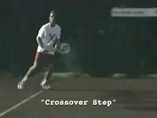

**The crossover step allows for fluid side to side movement, quickly
moving to and from the ball.**

**Cross Behind Step**

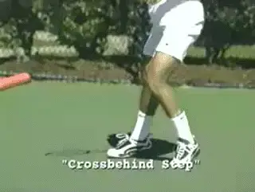

**The cross behind step, which will be moving to the side and back as
well as in recovery.**

###   Shuffle Step

### 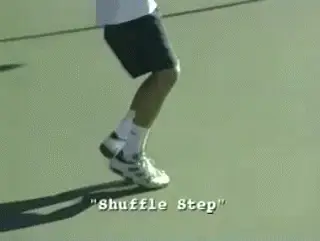

**The shuffle step covers short distances well.**

**Adjustment Steps**

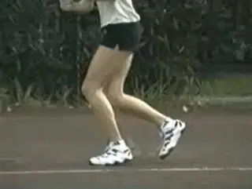

**The adjustment steps are vital to fine tuning your balance and
positioning in your hitting stance.**

Have your coach watch your head as you move side to side. If there is
excessive bobbing up and down, you're not gliding, you're wasting
energy. **One of the trademarks of a great athlete is the ability to
move with footwork as graceful and smooth as a
dance.** So that's Part 1 on the Killer Forehand.
If you learned something, stay tuned for Part 2.

Nick Bollettieri is the legendary coach who invented the concept of the
tennis academy more than 30 years ago. He has trained thousands of elite
players, including some of the greatest champions in the history of the
game, players like Andre Agassi, Tommy Haas, Jim Courier, Monica Seles,
Maria Sharapova, and Boris Becker. IMG Bollettieri Academies are located
in Bradenton, Florida.
