# The Killer Forehand - Part 2

### The Killer Forehand: Part 2

### Nick Bollettieri

### 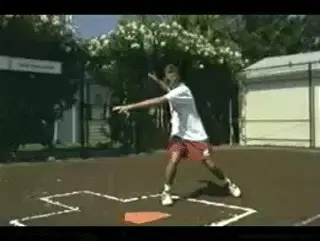

### In the batter's box with the [open stance] Killer Forehand.

### Hitting Stances

You can't fire a canon from a canoe. And you can't hit the Killer
Forehand without a good hitting stance.

**The hitting stances provide power, balance and disguise for your
strokes. [When you arrive at the ball, you need to be in a stance that
allows you all shot possibilities.]**

**The two desirable hitting stances are an open stance and a neutral
stance.**

For a better understanding of that, let's go to the sport of baseball.
The batter has to start outside the batters box before the pitch is
thrown and then had to enter the box as the pitcher throws the ball.

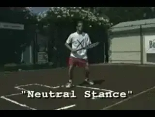

**To master the Killer Forehand you must also hit from [a neutral
stance].**

The batter went into the box with his back foot. In tennis, that's
called the open stance forehand.

The killer forehand also is hit using the neutral stance where the front
foot steps forward toward the target. You must master hitting the killer
forehand from both the open and the neutral stance.

You'll notice the open stance has only the backfoot in the batter's
box. Frequently, there's no time to step into the ball and you're
forced to hit from the open stance. The neutral stance allows you to
drive your weight into the ball and is commonly used when coming forward
and often when the ball's hit down the center.

**[A common error made many players is using the closed hitting stance.
That]** **[would be the same as the batter entering the batter's
box with their front foot first.]**

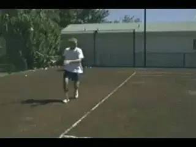

**A [closed stance] is firing the Killer Forehand from a
canoe.**

**[In the closed stance, everything changes. When you're forced to hit
from a close stance, you have to reach to make contact while also snap
your wrist. [This turns your contact zone into a contact
point.]]**

The closed stance forehand, no balance, no power, no consistency, no
control. This is firing a canon from a canoe. No balance, no power, no
killer forehand.

###  The Hitting Zone

What creates the correct hitting stance? ***[Early and correct racket
preparation. Your hitting hand and feet must work together.]***

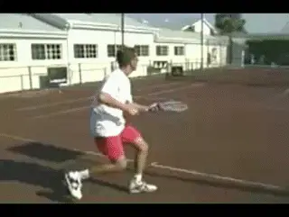

**Your hitting hand and feet work together for early preparation and the
correct stance.**

**If the butt of your racquet were a flashlight, in preparation you
would want to keep the flashlight ahead of your body as you approach the
hitting zone.** This will ensure that you wind up
in the right hitting stance. Remember to prepare early enough to allow
your feet time to set up.

**For better power and control, align the beam of light from the
flashlight to the path of the oncoming ball.**
**This is what we call "being in the slot" in the
backswing.**

You can get a better feel for ideal alignment with the baseball glove
drill. Check and see if you're entering the adjustment zone with your
hand and racquet ahead of your body. This will automatically set you
into an open stance with the option of stepping into the neutral stance.

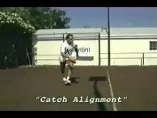

**Your hand and racket must arrive before your body.**

**The killer forehand requires rapid acceleration on
contact.** **This means the butt of the racquet
leads the forward part. Then the racquet head makes acceleration coming
inside to outside giving you the killer forehand.**

**With the hand the foot arriving at the path of the oncoming ball,
this is where it all comes together.** Good
foundation, early first reaction, good footwork, technique moving to the
ball and early and correct preparation has you in a killer forehand
hitting stance. Now you're ready to fire forward.

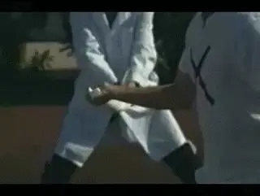

*Video demonstration — the original video for this article was hosted on TennisPlayer.net.*

**Pulling a towel out of your partner's hand simulates the stroke.**

To get a better understanding of forward racquet acceleration, use the
towel and have your partner pull it out of your hands. It simulates the
stroke.

**To test your flight path or swing line, have someone stand behind you
with the racquet between their hands. The racquet needs to pull
forward, straight out of the
slot**. Don't let the racquet touch either hand on
the way out. What we don't want to see is the racquet touching the hand
first. Not good. No power. No killer forehand.

Put your stroke to the test to see if you can make it out of the slot
unscathed. For maximum racquet and speed, you must pull the trigger.

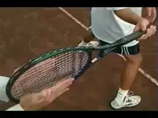

**Pull the racket out of the slot without touching the hands.**

**As you pull the trigger and the racquet starts forward out of the
slot,** **the path which your arm travels is called your swing
line.** If you watch the right elbow through the
stroke, you'll notice that it travels on a diagonal line out and across
the body as the racquet accelerates into the ball.

**By extending to a full reach on your follow through, you'll create
a contact zone that can be upwards of 18 inches in length, giving you
better margin for error and control.**

**For best leverage, try to consistently make contact with stage three
out in front of your body.**

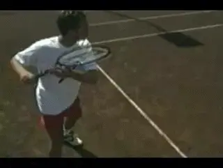\
**Following the diagonal elbow path can length your potential contact
zone to as much as 18 inches.**

However, advance players, through rapid acceleration of the racquet
contact point have the ability to make contact in stages 1 and 2 as well
and still manage to execute the various placements on the court.

### Followthrough

The follow through is the key to success when executing strokes under
pressure. The tendency for many players is to tighten up, which
restricts the follow through.

**Extending to the target lengthens the contact zone giving you
control and consistency. Remember, extend your follow through,
especially under pressure.**

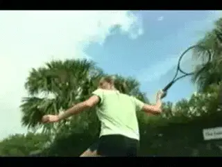

**The follow-through is the key to executing under
pressure.**

**As the stroke accelerates out of the slot, focus on the elbow and
how it passes through the track.** **Check your
swing to see if your arm is bent and flexible and whether your elbow
stays on track.**

### The Opposite Arm

**The use of the opposite arm is essential in
generating killer forehand speed while maintaining consistency and
accuracy.** When you're forced wide in the court, your opposite arm can
serve as a counterbalance keeping your shoulders level through the
stroke.

**[By separating your arms early,] [this technique anchors down
your swing], providing balance and a stronger pulling
action.**

Practice hitting with a small weight in your hand. This simulates the
feel of the counterbalance and the anchoring effect in the stroke.

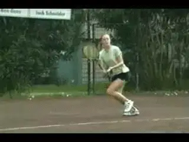

**The opposite arm anchors your swing and provides balance and a strong
pulling action.**

When the conditions are right to rip the killer forehand, the opposite
arm is used in a sweeping motion, stretching the chest muscles into the
stroke, much like a baseball pitcher's glove arm. This sweeping action
lengthens the lever providing additional power through shoulder
rotation.

A great way to get a feel for the anchoring effect and benefits of the
opposite arm is to practice the hand on the hip drill. This will give
you the feel of stretching the chest muscles into the stroke.

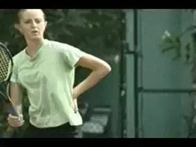

**The hand on hip drill gives you the feeling of stretching the chest
muscles.**

**[The opposite arm can anchor down the stroke on the wide shots and
lengthen the lever with a sweeping action to give you more power on your
killer forehand.]** **[Either way, it's always serving as a
counterbalance to the stroke.]** Check and see how your
stroke matches up to the pocket killer forehand.

Another characteristic of the killer forehand that makes it so explosive
is the loading of the weight into the back of the stance.

Used in both the open and neutral stances, together with the opposite
arm, this technique will put your killer forehand over the top. Practice
hitting strictly off your back foot, sinking your weight down.

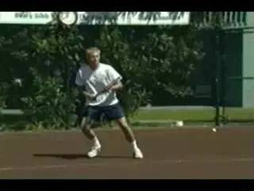

**Loading the weight in the back of the stance adds explosiveness.**

**[\
[Try to keep your weight centered on your backfoot throughout the
stroke]]**. This will give you a good feel for it.
**Focus on how the body winds up and coils like a spring from the hips
up to the shoulders and sinks down into the back of the
stance.**

**Loading the hit down below the height of the contact point, or the
loading line, together with the opposite arm use will put the finishing
touches to achieving killer forehand speed.**

Remember, don't overhit. Remember, when we are building a big forehand,
we aren't hoping one of five go will go in. We want five out of five to
go in. Otherwise, what is a so-called big forehand really worth?

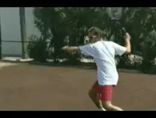

**Practice and master each concept and you'll have your own killer
forehand.**

###  Summary

So the killer forehand is a package weapon. It is a like a jet fighter
coming at you in all directions. **The elements
are**: **the proper grip, a strong foundation,
first step reaction, the hitting stance, racket head acceleration, the
follow-through the opposite arm, and loading with the back
leg.** Practice each of these concepts until you
have them mastered and soon, you'll be known for having a killer
forehand.

Nick Bollettieri is the legendary coach who invented the concept of the
tennis academy more than 30 years ago. He has trained thousands of elite
players, including some of the greatest champions in the history of the
game, players like Andre Agassi, Tommy Haas, Jim Courier, Monica Seles,
Maria Sharapova, and Boris Becker. IMG Bollettieri Academies are located
in Bradenton, Florida.
