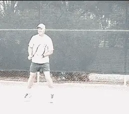
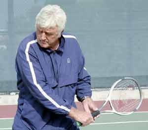
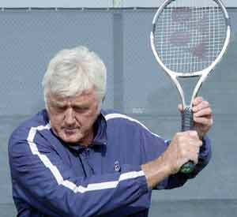
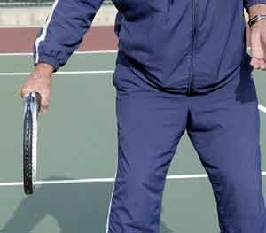
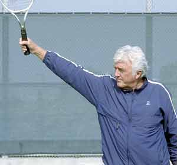
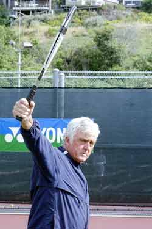
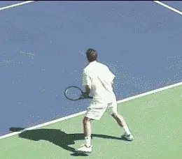
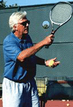

# The Lansdorp One-handed Backhand

### The Lansdorp

### One-handed Backhand

### Robert Lansdorp

**Elliot's backhand was one of the best in the game. You can develop
yours in exactly the same way.**

**If there's one shot I can teach, it's the one-handed backhand.**

Recently I had a chance to see some video of Elliot Teltscher hitting
backhands, 30 years after I first worked with him. To me, he had one of
the great backhands of all time and it still looks classic. So, I want
to outline for you how I developed Elliot's backhand as well as every
other player I have ever trained, including the story of how Pete
Sampras switched from two hands to one hand when he was 16 years old.

As I explained in the last article on the two-hander, which backhand you
develop is a matter of personal preference (See the [Lansdorp Two-Handed
Backhand](The%20Lansdorp%202%20Handed%20Backhand.docx)). Unless a kid
tells me he definitely wants to hit with one-hand, I'll start them with
a two-hander, because young players will have far more success earlier
in their careers with two hands. At a certain point though, I'll have
the kid experiment with the idea of hitting with one-hand.

I'll see that the two-hander is getting pretty good. It looks like
he's hitting through the ball, he's able to follow through out front.
It looks very smooth. Then I say, "Hit me a backhand and let go with
your left hand at the end." I'll ask the kid: "Do you ever hit a
one-handed backhand? What do you think about a one hander?" If the kid
says, "I don't like it," then I say fine, I don't even touch it.

If the kid says "Oh yeah, I wish I could hit a one-hander." Then I
say, "Then hit a one-hander, because that's what you want to do." I
can teach you a one-hander no problem.

I tell him when you're young it's a little more difficult hitting a
one-hander, because people can hit you high balls and you're going to
be struggling. But if you want it, it's worth it. Otherwise, you'll be
16 hitting a two-hander and thinking "I wish I had a one-hander."

**Two views of the one-hand backhand grip, what I call a "true" continental.**

generated](media_the-lansdorp-one-handed-backhand/media/image3.jpg)

So, at some point I always give the kid the option. It doesn't make any
difference to me. In fact, I'd actually rather teach a one-hander. The
one-handed backhand is actually the simplest shot to teach. It's about
as simple as you can make it. It's more strenuous because it takes
longer. But the elements are a lot less complex.

### Grip

I like players to start with what I call a "true" continental grip,
although some people might call it an eastern. This is the grip Sampras
uses, the same as Stephen Edberg or Richard Krichek. With the true
continental grip, you can interchange and teach the player slice. When
you start out it's the easiest to get the feel of hitting through the
ball. The follow-through is the easiest. I can see when they hit the
ball how the racquet is coming through the ball. I know how pure they
are hitting the ball. For the beginning it's crucial.

For most players a lower take back is better, at about the level of your pocket.

After that I don't mind it slipping over a little bit. You get a little
bit more topspin automatically.

My one-handed backhand is more for a faster court. If you play on clay
with a grip that is turned more over the top of the handle, you hit more
even topspin. But the follow-through is also hugely different. You tend
to pull across the body more. Look at Amelie Masurismo or Kuerton and
you'll see what I mean. They can hit the high balls better. It's a
powerful backhand. These players can actually put the ball away on clay.
That's rough to do. But it's really a clay court motion. On a faster
court that motion is going to give you trouble.

### Preparation

For most players, the best backswing is to take it back at about the
level of your pocket. You have a better chance of getting the racquet
below lower balls, and if you get a high ball, you can bring the racquet
up.

Some players take their racquet back higher at about shoulder level.
Elliot Teltscher is an example. Stephan Edberg was another example.
Kuerton does the same thing. If they can bring their racquet down before
they start forward to the ball, I have no problem with the higher
backswing. It's a matter of timing.

**The problem with the high backswing is that it's more difficult to time the swing.**

If your timing is right in bringing the racquet back down, there's no
problem. But some players have a very difficult time with that. That's
why it's good to start by taking the racquet back lower.

As soon as you see the ball, start to turn your body. You should turn
sideways with small, short steps. Well before the ball reaches you. Your
body should be sideways. By the time the ball bounces you should be
ready to hit it.

Getting ready early is key because it allows you to step into the ball
with the right or front foot. You reach the ball with the left foot,
then you can readjust with the front foot when you step in.

### Contact

### 

### Contact is well in front of the body, much further than with the two-hander.

By hitting the ball with one arm, you can make an automatic straight
line through the shot. Compared to the two-hander the contact is much
further in front. Watch the animation of Elliot when he makes contact.
He is really out front.

**There is really no wrist involved. The racquet moves through the
contact zone without any movement in the wrist. If you see the wrist
come up and over, that is at the end of the follow-through, long after
the ball is gone.**

**Once you have made contact with the ball, you leave your left
shoulder back, and you leave your left arm down. You basically stretch
your shoulders. It's a complete stretch of the shoulders. The chest
stretches out.**

**But you don't want to bring your left arm up because that looks
like you're going to take off like a bird. It stays down and you
stretch. By doing that you'll automatically hit on a straight line
through the ball.**

Some people think that you need more strength and so they struggle with
it. These days you have more kids going to a more extreme grip on the
backhand and ripping it with topspin. It's an unbelievable shot down
the line. But I believe in coming more straight out with an eastern or a
continental grip like Pete or Teltscher.

**Chest and shoulders stretch out at the finish. The left arm stays down around the waist.**

###  Follow-through

**The difference between the two-hander and the one-hander is that on
a one-hander you stretch your body out and you basically stay sideways.
On the two-hander you open up like a forehand. If you have a tendency to
swing your body open on the one-hander, you will also tend to slide the
ball with side spin instead of staying with the ball and really hitting
through it.**

**[[The follow-through comes straight out, almost the same spot as on
the forehand. This is the most critical part of the whole
shot.] It's the same on the all the groundstrokes: the
forehand, the two-handed backhand, or the one-handed backhand. [The
follow-through shows if you have hit through the ball. It's the key to
developing pace and being able to hit a ball that
moves.]]**

That's why I have players learn to "leave it out front." Then I can
see exactly what is happening. By that I mean holding the racquet at the
end of the swing with the arm straight out in front. You can leave it up
front, then you hit through the shot. At the finish on the one-hander,
this means you can see partially through the strings.

**The shoulders stay sideways and the arm comes out totally straight. The player can just see through the edge of the strings.**

###  Developing Pete's One-Hander

When he was 14, Pete decided to switch from two-hands to one-hand. Like
I said in the last article, that wasn't my decision. Pete Fischer
talked him into that. Up until that time, Pete had a great two-hander.
I'm not sure I would have ever switched him myself.

So Pete was gone for around two years, but one day his father called me
up and asked me: "Robert, would you mind working with Pete, because he
can't hit a backhand." And I said sure, I'd work with Pete again.

What his dad said was true. At age 16, Pete couldn't really hit a
backhand. He could only slice. Every backhand he hit was a chip.

So over the next three years, we worked extremely hard on driving his
backhand. It's a long process to switch successfully from two-hands to
one hand and it took Pete a long time. He was so talented though and he
picked it up faster than most players. At age 19, his backhand drive was
good enough to win the U.S. Open. In fact when he won the open it
wasn't just good, it was a great backhand.

**Today Pete hits too many looping topspin backhands. He needs to hit more winners - the way he did when he won his first U.S. Open.**

There is no doubt Pete's backhand then was actually better than it is
now. In my opinion, Pete hits far too many loopy topspin backhands.
It's fine to do that sometimes, but you've got to hit that ball.

I've told Pete: get the tape of your first U.S. Open final. See how
many times you hit outright winners with your backhand. So far he
hasn't listened to me, I guess he probably thinks his backhand is all
right if he's won 13 Grand Slams.

But I don't. I know it could be a lot better. People tell me "Lansdorp
only you would tell Pete he needs to work on his backhand." But that's
the truth.

Robert Lansdorp is the legendary Southern California coach who has
developed dozens of world class junior and professional players.
Robert's players include 4 champions who have gone on to become number
one in the world: Maria Sharapova, Pete Sampras, Lindsay Davenport, and
Tracy Austin. In these articles, found exclusively on Tennisplayer,
Robert share his views on what goes into the making of a champion, and
how he developed the strokes of some of the best ball strikers in the
history of tennis.
