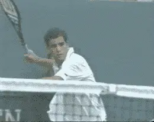
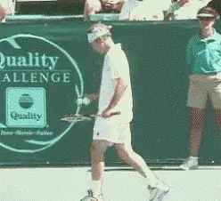

# John McEnroe: The Mental Game

### with John Yandell

*Video demonstration — the original video for this article was hosted on TennisPlayer.net.*

**"It may have worked for me sometimes, but I don't recommend it for
the average player."**

**We all know the secret to winning the mental game is simple. Abuse
every official in sight, and when things don't go your way, start
screaming and throwing racquets.** ***[OK, I'm
kidding. That might have worked for me sometimes, but it's probably not
a good idea for the average player. Take it from me, it can end up
causing all types of problems.]***

**The real secret to being mentally tough is
confidence.** Great players win because they
believe in themselves and believe they can come through in tough
situations.

If you want to learn to win tough matches of your own, you should be
looking for ways to increase your confidence. Basically, that means
learning to stay positive about yourself, your game, and your chances in
a given match.

Great players win because they believe they can come through in tough situations.

All players have a mental breaking point. They can only take so much
pressure before they crack and go negative. When that happens, they
usually end up losing.

People lose sight of the fact that tennis is a game. Playing competitive
tennis has to be fun if you want to be successful. If you consistently
go negative on the court, you can end up burning yourself out and hating
the game.

Have fun. That's easy to say. Stay positive under pressure. It's a
little harder to do on the court, especially at critical points in a big
match. You can also take that from me, personally.

There are a few things, though, that are key for tennis players at any
level from the pros on down.

Tennis is a game and it has to be fun if you want to be successful.

**The first is to keep your eye on the ball. Watch the
ball!** How many times have you heard that one? It
may sound like a cliche, but it's about as basic to playing tennis as
you can get. Watch the slow-motion replays of the great players of the
Grand Slams, and you'll see they're all looking at the ball right when
it's hit.

When players choke, they tend to take their eye off the ball at the last
second. A big part of hitting shots under pressure is just learning to
focus on the ball.

My idol Rod Laver once said: "There is no such thing as choking, only a
lack of concentration." That's putting a positive spin on it. It also
gives you a simple solution to think about it. Don't go negative. It's
not that there's something wrong with you as a person. It's just you
need to keep your concentration or maybe improve your ability to
concentrate.

Even if you learn to watch the ball better, though, don't think that
this or anything else can completely prevent choking.

**[A big part of overcoming choking is just learning to watch the ball all the way to the hit.]**

**[Every player chokes in certain situations, whether it's the pros,
junior tennis, or just a club match. So, don't think you're not going
to choke. Think about how you're going to deal with it when it
happens.]**

**[For me, if I choked, I didn't mind admitting it. The best thing was
just to accept that it happened, try to learn from it, and not worry
about it. If you get critical when you choke, it makes it harder to stay
positive and confident about the match.]**

**[Another major factor in winning the mental game is [learning how to
pace your matches.] Sometimes what you do between points is
as important as anything else in a close match.]**

**Watch how great players use the time between points to dictate the tempo of the match.**

**You need to use the time between points to keep control of yourself
emotionally, to deal with the pressure, and to try to stay positive.
It's a big mistake to rush your play in tight
situations.**

After you play a tough point, or before you start a big point, take your
time. Let yourself recover and decide exactly what you want to do. Be as
deliberate as you need to be. The player who controls the pace of the
match, particularly on the big points is often the one who ends up
winning these matches.

Watch the great players play. You'll see how they tend to do the same
things over and over between points. They make the other player play to
their tempo. It's a way of imposing your will on your opponent and it
can be as important or more important than your shot making in winning
the mental struggle.
