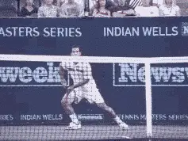
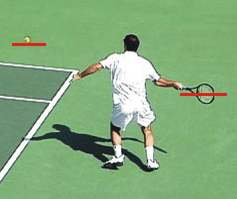
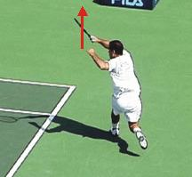
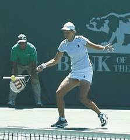
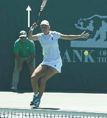

# The Reverse Forehand

### Robert Lansdorp

You probably have never heard of the reverse forehand, but it's become
one of the most important shots in pro tennis. The reverse forehand is
one of the key pro shots of the 90's - and just as important or more
for the new millennium. But no one really recognizes what it is. They
don't talk about it on television or in the magazines. But if you watch
pro tennis after you read this article, you'll see how widespread and
how important the reverse forehand has become.

**"Hey Robert, the ball just skidded off the line."**

Hitting the reverse forehand has added options for the top players in
certain situations that literally didn't exist before the shot came
into the game. By having a good reverse forehand, a pro player can save
himself a minimum of 10 points in an average match. That's a huge
difference, the difference between winning and losing in many, many
matches.

### What Exactly is a Reverse Forehand?

**I call this shot the reverse forehand, because it has a reverse
follow-through.** ***[During the follow-through the
racket head moves slightly forward through the ball, but then moves
upwards and then backwards in the opposite direction from the
hit.]***

Pete Sampras was one of the first players to use it. His running
forehand is probably the most obvious example. Everyone recognizes that
it's a great shot without really understanding how he does it. His
running forehand is so aggressive, so effective, and so consistent
because it's based on the reverse motion. But Pete is far from the only
pro player to use it. In fact, the reverse forehand has become common
place. Once you know to look for it, you'll see that about 90% of the
top players, female and male, use it on a regular basis.

### Sampras Reverse Forehand

Racket Position: The racket head drops below the level of the ball to increase the level of spin.                                                         Contact Point: Contact is later then a conventional forehand. The racket head moves through the hitting zone for a shorter distance.

Upward Follow-through: The racket head moves sharply upward after it moves through the hitting zone.                                                              Reverse Follow-through: The racket head reverses direction and moves backward, in the reverse direction from the hit. 

### The Reverse Forehand Advantage

**The advantage of the reverse forehand is that it let's players do
things that were previously impossible.** Before,
when the ball was low and away from you, the player's only option was a
low percentage play down the line. The reverse forehand allows you to
take the ball slightly later. **You now have the option to hit down
the line, hit a short crosscourt angle, hit a deep crosscourt, or hit a
topspin lob.** **[The reverse allows you to [pull
the ball crosscourt] consistently on the run. You get
[unbelievable angles]. You can use it to hit a [heavy
topspin lob]. Pete also hits it when he
[approaches]. He hits it when the ball comes into his body.
Even if you hit the ball a little late you can still do all these
things. When you do it right it's so smooth. It's a beautiful
shot.]**

Although this article is the first time I've publicly identified the
shot, I've actually studied the reverse and taught it to my students
for a long while. I first noticed the shot when I was working with Pete
Sampras. Pete was 18 or 19 at the time, and I noticed he was doing
something different on the fast balls. I thought it was a mistake at the
time. I have a tape of me telling him to move his feet and get into
position. I thought if he got into better position he could have hit
through the ball in the conventional way. On the tape you can hear Pete
counter, "Hey Robert, the ball just skidded off the line!"

So, I started trying to understand the shot. I went out and learned to
hit it myself. I realized how it could increase your options so
incredibly when the ball is a little late, or when the ball is skidding,
or when the ball is away from your hitting zone. The shot opened up my
eyes and I started looking for it. I noticed Chang hits it. Rios hits
it. Lindsay hits it. So does Hingis. It's not just slow players who are
out of position. Graf actually hit an early version of the shot. You can
hit the reverse with almost any forehand grip. With the extreme western
grips with the hand under the handle, on the low balls the reverse is
almost a must.

### Davenport Reverse Forehand

The racquet is moving sharply upward from below the level of the ball.                                                                                 Lindsey takes the ball later. The racquet head continues upward and briefly forward through the hitting zone.

The racquet head continues its rapid upward movement.                                                                                                    The racquet head reverses direction, moving backward in the opposite direction of the hit.

### The Mechanics

**To hit the reverse forehand, drop the racket down a little lower
than you would on a regular drive. This** **creates
more topspin.** **It's usually hit with an open stance, although you
can hit on the run with a cross step as well.** **[The contact is a
little later compared to a normal forehand drive.] [When you make
contact with the ball, you go through the hitting zone for a shorter
period than with the conventional forehand, then you bring your racket
head up]**, **then you actually let the racket
head go back.** The more spin you want the faster
you bring the racket head up. For more of a drive, you come through the
ball a little more for more pace. Pete hits more of a drive reverse
forehand, Chang hits more of a spin reverse forehand.

In my first two TennisPlayer articles, (Creating American Champions and
The Developmental Process) I talk about how great groundstrokes are
based on the ability to hit through the ball - to drive the ball with
topspin, but not exaggerated topspin. This is the kind of forehand I've
always taught to players like Pete Sampras and Lindsay Davenport. For
these players, the reverse forehand is essentially a variation that
gives you more flexibility. It's actually critical now to be able to
hit certain shots in the modern pro game. You can teach players to drive
the ball in the conventional way, and then you add the reverse without
contradicting that foundation. It's a natural evolution from the basic
bio-mechanics I teach to all my students.

Robert Lansdorp is the legendary Southern California coach who has
developed dozens of world class junior and professional players.
Robert's players include 4 champions who have gone on to become number
one in the world: Maria Sharapova, Pete Sampras, Lindsay Davenport, and
Tracy Austin. In these articles, found exclusively on Tennisplayer,
Robert share his views on what goes into the making of a champion, and
how he developed the strokes of some of the best ball strikers in the
history of tennis.
