# The Split Step  Ready Position

**The Split Step / Ready Position**

**Tim Mayotte**

In my first article ([link](The%20Framework%20-%20A%20New%20Paradigm%20for%20Technique%20and%20Movement.docx).)
I proposed that most educational resources make an unhelpful separation
between technique--the swing of the racquet--and movement to the ball.
I further proposed that this separation has led to poor teaching and
that only by marrying technique and movement can we develop an effective
teaching model.

Put another way, we must understand that a stroke is not a shot. Only by
considering the way a whole shot unfolds can we most effectively help
our students. Toward this end I have created The Framework, a model to
help with analysis of tennis shots.

The model breaks down all shots (other than the serve) into seven
stages. Each stage has a stroke component and a movement component. The
first stage is the Split Step / Ready Position or what I call the Split
/ Ready.

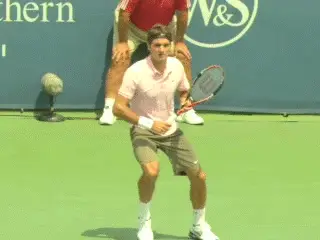

**Movement and the swing are inseparable parts of all shots.**

**Overlooked**

The idea of the Split / Ready has often been an after thought in tennis,
almost a cliché. It has been the poorest stepchild in a teaching world
that fetishizes glossy finishes.

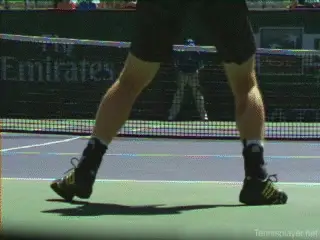

**The Split / Ready is misunderstood and under emphasized.**

It is perhaps the most misunderstood, underemphasized and under
practiced element of the game. How often have you heard a TV announcer
bark, "Wow, what a great split step!" Or, "She mistimed her split!"

Few instructional videos focus on the Split / Ready, much less its
variations. **[Coaches are often asked where the racquet should finish
at the end of the stroke. But rarely are we asked about [where the
racquet should be at the start of a shot.]]**

Although tennis is commonly compared to dance, this analogy is vague and
misleading. **In reality, tennis movement is a series of mini-dances
each punctuated at the beginning and at the end by the Split /
Ready.**

If we study the great players we can see that relatively small
differences in the way they execute the Split /Ready, such as timing,
height, width, the positioning of the arms and racquet, and the
orientation of the feet are what elevate them above other tour players.

I believe teaching and playing great tennis requires turning our
analytic gaze on the particulars of the Split / Ready. This is where
greatness begins!

**Immersion**

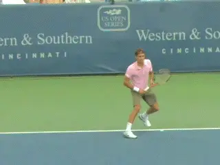

**The complexity of one shot can almost defy description.**

**So now let's begin to immerse ourselves in the
specifics.** I use the word "specifics" with
caution. I am humbled by the reality that each shot, even just one shot,
is an unfolding of elements so complex as to almost defy comprehension.
Variations even in two like-looking hits are often fantastic at close
examination.

Also, keep in mind, this is a model of analysis and not a method of
teaching. Every coach teaches in their own way just as each student
learns in theirs. It's always a process of trial and error with the
unexpected being the norm.

To teach skills we do need to isolate at times and at other times we
need to chunk things together. Still the Framework provides an overview
of the whole. It is intended to guide how we teach and what to focus on
at particular times.

**What Happens First and Last**

I revel in watching club and public park players imitate their favorite
pros. The Rafa disciples whip their racquets upward along the "wrong"
side of their head on the forehand follow through in homage to the
Spaniard.

Faux Feds meticulously hold their eyes on the back of the racquet after
contact like the Maestro. It's telling and funny how many of their
shots end up half way up the net. These impersonations make great public
theatre.

Yet these wannabes (and most teachers) would be better off studying and
practicing what the greats do at the start of each shot --or at the end
of each shot, depending on how you look at it. This is the Split /Ready.

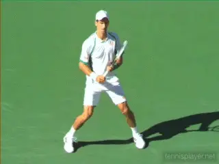

**The Split / Ready: it happens first and it happens last.**

**The Best**

Imagine the following point: Djokovic cracks a flat serve out wide in
the ad court. With a quick stutter step Federer shifts to his backhand
side carving a slice return down the line. The players trade three
topspin open stance crosscourt forehands.

Then Novak, with two steps, one tiny, one huge, nails a flat forehand
drive down the line. To defend Fed pushes out one giant lunging step to
his left and knifes a backhand slice low, short crosscourt.

Djokovic takes two loping steps forward at a sharp angle and drives a
closed stance, two-handed approach up the line. Fed attempts a down the
line pass. His opponent sticks a volley deep in the backhand corner.

Fed finishes this seemingly miraculous point by loping the width of the
court with three giant steps, rolling a parabola shaped backhand topspin
lob that lands just inside the baseline. The grace of this move to his
last shot belies the sheer power of his locomotion.

How do we use the Framework to analyze such mastery? What can we learn
from this great tennis about the Split / Ready? Let's examine in
through the lens of the four rules of the Framework.

| **Rule #1** |  |
| --- | --- |
|  |  |
| **Effective analysis of all shots must consider how movement to the |  |
| ball and the movement of the racket are interwoven.** |  |
|  |  |
| **Rule #2** |  |
|  |  |
| **The Framework is based on the assumption that every shot is a |  |
| succession of stages built one upon the other.** |  |
|  |  |
| **Rule #3** |  |
|  |  |
| **The Framework focuses on the importance of the continuous powerful |  |
| and smooth transfer of energy and momentum through the whole shot |  |
| (and the recovery to the next one.)** |  |
|  |  |
| **Rule #4** |  |
|  |  |
| **The Framework works with the premise that great technique/movement |  |
| eliminates as many variables as possible without sacrificing racquet |  |
| and foot speed. In fact eliminating variables will increase both.** |  |
| ** ** |  |

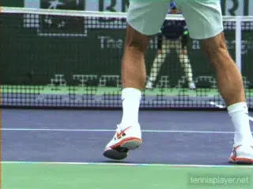

**A Great Split / Ready puts the body in motion with the strongest, best
timed push.**

**Two Goals of the Split / Ready**

Any novice coach knows that players do a split step and prepare the
racquet before each shot. But what are the specifics? What does a great
Split /Ready look like? What do Federer and Djokovic do in this stage
that enables them to play the tennis in our mythical point?

We must establish the goals of this first stage. After much searching
and thinking it seems that there are two main goals a player hopes to
obtain when they strike the Split Step / Ready Position.

The first goal is put or keep the body in motion in a specific fashion
that enables the strongest, best timed push in the direction required by
the incoming shot. The second goal is to have the racquet in the best
position to prepare for the widest variety of incoming shots. So lets
look at what the best do to reach these goals by analyzing what exactly
they do.

**[There are 5 parameters for the Split Step. They are:]**

**Posture and Stability**

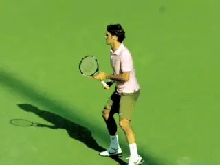

**Perfect posture: head and torso aligned above the hips and legs.**

The first parameter is Posture and Stability. There has never been a
great athlete or dancer who does not have impeccable posture.

**In most cases perfect posture means that the head and torso are
aligned almost directly above the hips and legs with a slight tilt
forwards.** Some great players lean forward
drastically as they prepare to return serve, but pay attention to their
posture at the moment their opponent makes contact.

Djokovic and Federer flow into the split like dancers. This is true for
all the best players of the ages. Laver, Rosewall, Navratilova, Evert,
Goolagong, Clisters, Bueno, Wilander, Agassi. The list is as long as the
list of the greats.

Its noteworthy that many good but not great pros struggle with this.
Christina McHale, Gael Monfils, Johanna Konta, Genie Bouchard, Alison
Riske, Caroline Wozniacki (on the forehand), to name a few, all lean
forward excessively.

The longer the point, the more complications that are created by
excessive lean forward. McHale and others struggle when forced to move
backward and forward.

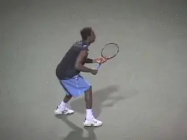

**Despite his athleticism, Gael Monfils is limited by poor posture.**

When forced to back up her center of gravity shifts excessively from and
extreme forward to a extreme backwards. Balance is compromised. Besides
adding variables to her shots Christina's strokes loses the benefits of
full rotational capacity. She also finishes just a bit off balance. A
killer at the top level.

Great players maintain great posture and if they lose it when forced by
a strong shot, get it back it as soon as possible. When Wozniacki, for
example, leans forward going to her forehand, this poor posture like
McHale materially compromises rotational power and balance.

I feel this is a large part of the reason she has not won a Major. (For
you fans of mental training keep in mind that poor technique/movement
makes playing in the biggest moments even more nerve wracking.)

So what are the specific benefits Federer and Djokovic enjoy because of
their posture? Getting into the correct position---the same position for
every shot--helps reduce the number of variables that any athlete needs
to figure out.

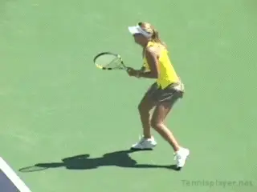

**Leaning forward on her forehand compromises Wozniacki's power and
balance.**

Great posture allows for easy breathing. It helps with balance. It helps
with vision. Seeing the court is easiest when your head, shoulders and
torso are all aligned. Try leaning forward and then looking forward. The
bending neck action, besides the hurting your neck muscles, crimps your
ability to see.

**Timing**

I would argue that the second parameter, timing, is the most important.
Good timing of the split enables the player to be fast off the mark to
the shot. And as we will see later in this series a well-timed split
enables great tempo and rhythm during the stroke.

It can be helpful to view movement to the ball as a number of short
races with each a fraction of a second to few seconds long. In the
perfectly timed split the player leaves the ground just slightly before
his opponent makes contact. He hovers at the peak of the split or is
just coming down off that peak as the opponent hits the shot. The timing
is even earlier when a player is transitioning to the net.

**Appropriate Height of Jump**

The third parameter is height. The height of the jump is related to the
timing. There is quite a bit of variation in the height. It can vary
from 3 inches or more to barely coming off the ground.

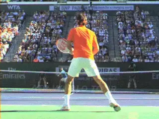

**Federer leaves the ground before contact, and his split peaks at the
hit.**

Deep in the back of the court (when their opponent is in the backcourt)
the player has more time and the increased height allows the player to
"sink" further into the court and then generate more power with a
stronger initial push to the shot.

When close up to the net or when up close to the baseline a players has
less time to "hang in the air." The lower height of the split means a
quicker reaction time. The down side is that the player has less time to
turn her feet in the direction she must move before she lands.

I think a fuller analysis of which pro players jump higher and when and
where they are in the court is merited. It could give additional insight
into how the best do what they do.

**Width**

The importance of the width cannot be overstated. Width is the distance
a player's legs are apart when they land the split. In general a player
wants to get as wide as possible and still be able to push off to the
shot with power, balance and rhythm.

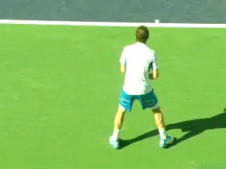

**Increased height on the split allows the player to sink further into
the court.**

The potential size of the first step is directly related to the width of
the legs when the players lands. In addition, a wider split lowers the
center of gravity which ensures better balance.

However, as with height, the appropriate width varies with the shot. For
the volley and the return of serve the width is very wide, as usually it
is only possible to make one step after the split.

But for groundstrokes the width is somewhat narrower as a few steps may
be required. An ultra wide stance makes it impossible to take two or
more steps with good rhythm.

Watch clay courters carefully. Because of the slippery nature of the
court the best have to narrow their stances just slightly when they
split.

**Orientation of Feet**

The fifth parameter is the orientation of the feet. The turning of the
feet in the direction the player wants to move can happen either in the
air or after the landing. It can also happen in the next stage we will
explore, the Unit Turn / Grip Change.

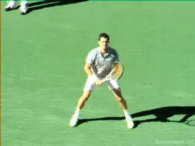

**The split is wider on returns and volleys.**

For the greats, the turning on many groundstrokes has already begun
while they are descending from the jump. Particularly when the player is
far back in the court.

**Racquet Work**

In addition to the five movement parameters, there are three parameters
for understanding the racket work in the ready position.

1. The racquet is gently held with both the dominant hand and
non-dominant hand. For those with a one-handed backhand the non-dominant
hand cradles the throat. For two handers, this can be the same, or the
non-dominant hand can slide down, close to or touching the dominant
hand.

2. The arms are hanging down with a bend at the elbows and with a few
inches between the between the elbows and torso. These few inches are
critical because when the unit turn is done properly the racquet is
automatically ready to start the swing without any further movement of
the arms below the elbow.

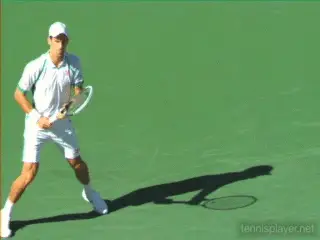

**The greats often turn the feet in the air in the direction of their
movement.**

3. The racquet head is above the hands. There is some variety as to how
low the racquet head should go. Most pros have the head significantly
above the grip. Notable exceptions have included Rod Laver and John
McEnroe.

With the advent of more topspin I think the head above method will
predominate, This is because the initial motion of the racket is upward
into some form of loop.

**The Dances of Tennis**

In an attempt to describe the mastery we witnessed in the point
described above, many observers, fans, and devotees use dance as an
analogue. Federer's movement in particular receives such billing.

The Maestro is often said to move like a ballet dancer. Djokovic and a
handful of others deserve this acclaim as well. If Fed is the ballet
master, (perhaps Baryshnikov) then Djokovic is more a modern dancer
(perhaps Mark Morris).

The connection between dance and tennis is appealing. Like great
dancers, great tennis movers seem to soften the ground as they power to
a shot. Explosiveness is married to flow, balance, and seamless movement
into recovery.

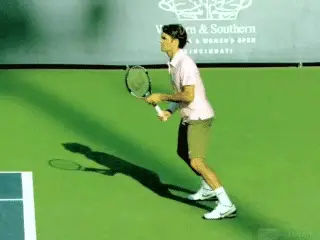

**The racquet work parameters facilitate the beginning of the swing.**

At their best and most elegant, Wilander, Laver, Henin, Goolagong,
Agassi, Murray, and a few others "partner" with the ball. They take
control when they can, leading the dance if you will. When on the
defensive, they absorb or follow.

But teachers should use this analogy carefully. It is more accurate to
say that the best players do a number of separate mini-dances (in any
point longer than two shots.) To prepare for each mini-dance perfectly,
a champion uses the Split / Ready to end one mini-dance and begin
another.

The Split / Ready should therefore be seen as a moment apart, a start
and then a resetting and realignment. The Split / Ready is the alpha and
it is also the omega.

The mini-dance includes the racquet. By the time the greats are floating
into the Split / Ready they have the racquet in position, cradled,
elbows bent and relaxed, with good space between the racquet and the
body. When they land they maintain this valued position.

Great posture and width have thereby been established and reestablished.
Sounds boring. Sound easy!

**Reversing Acceleration**

If we look closely it is far more difficult and beautiful than it seems.
Why? As we see in Rule 3 great tennis is marked by rapid but smooth
acceleration and deceleration. And after the recovery this happens in
reverse.

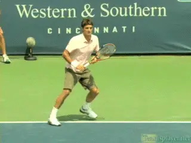

**The Split / Ready punctuates the start and the finish of every
mini-dance.**

After recovery from each shot Federer must hit the ground and absorb his
body weight. Imagine a building being assaulted by an earthquake. The
best structures absorb the disruptive waves of energy and regain
equilibrium. Federer and Djokovic do this ball after ball.

Watch even slightly lesser players like Berdych who often struggle (just
slightly) to absorb and stabilize. This is one reason why there have
been no truly great tall players over 6' 4". This is also why I have
great respect for players like John Isner. The work involved in changing
directions is more difficult the larger the athlete.

What happens after this stabilization and absorption is equally amazing.
Fed now turns the sinking into the ground into the start of the push up
and out to the shot. The transition from absorption/ deceleration to
acceleration is awe inspiring. Imagine that building absorbing an
earthquake and then using the energy to move itself smoothly in any
direction.

This stability helps Fed accomplish Rule 4 with apparent
ease---maximizing foot and racket speed with the minimum number of
variables.

**Concentrated Essence**

In his revealing essay on Michael Joyce and Andre Agassi, David Foster
Wallace describes how all the good to great players look the same when
he watches them warm up at the Canadian Open. Tennis is reduced and
concentrated into its essence.

Wallace sees the parameters of the Ready Position replicated as the pros
prepare for each shot. The racquet position with head up, space between
elbows and torso and head above the hands is established at the
beginning of every shot. Think of how a skier stays still in his upper
body even when navigating moguls. This stillness allows the parameters
of the Ready Position to be maintained.

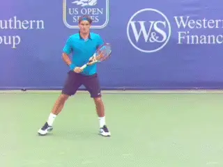

**After every shot, deceleration, absorption, acceleration.**

**Training Implications**

These insights regarding the Split / Ready have major, direct
implications for how we train our players. The majority of tennis
programs for both juniors and adults rely on an inordinate amount of
ball feeding and controlled drills.

Shockingly, players at a number of our top developmental academies
practice the majority of time already knowing where the ball is going!
This is acceptable and even valuable in small doses to work on technical
elements or get in high-rep intense sessions, but as a staple it is
counter productive.

Most practice should require players to work on reacting to live balls
with a Split / Ready. This is central to creating great players.

A great Split / Ready does not ensure great movement, but without it
great movement and great strokes are not possible. If we coaches want
our students to win high level rallies, they must learn the meticulous
execution of this first stage.

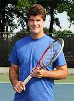

Following a legendary professional playing career, Tim Mayotte is now
focused on developing the best tennis training program in America. For
12 years, Tim has been training junior and young pro players in the
Boston area and developing The Framework, his revolutionary teaching
approach that unifies strokes and movement. As a college player at
Stanford, Tim led his team to an NCAA title, winning the individual
singles in 1981.

Tim won 13 ATP titles, was a semifinalist at Wimbledon and the
Australian Open and won the Silver Medal at the Olympics in 1986. Tim
has wins over virtually every top player of his era, including John
McEnroe, Jimmy Connors, Stefan Edberg, Boris Becker, Andre Agassi, and
Pete Sampras.

He is a former member of the ATP Board of Directors, a former President
of the ATP Players Council, and was also a television commentator for 5
years on USA Network. A graduate of Stanford with a degree in history,
he also holds a Masters Degree in psychology and theology from Union
Theological Seminary.
