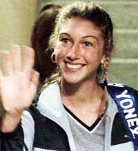
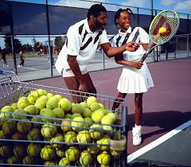
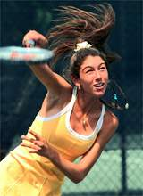
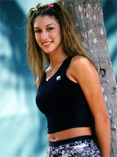
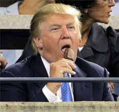
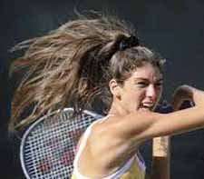
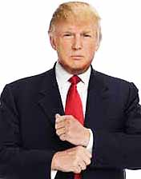
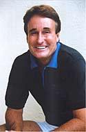

# The Strange Saga of Monique and the Donald: Part 1

### Rick Macci

**Monique Viele--forgotten now but the focus of a unique situation
then.**

I've been fortunate to be around a lot of great athletes in every sport
and know why they become very marketable. People have to understand a
lot of times companies and manufacturers do things on your ability or
your potential.

They try to project and they want to get that relationship with you
early on. You've either got to be very successful in the juniors or do
something way out of the box so that they see a lot of potential.

Some of these kids who have played up in their age groups and had
success give you a little bit of a snapshot. It's a feeling of, okay, I
think they have a chance to do well in the pros or be one of the best
juniors in the United States or the world, and that can give other
people an idea. But when it's all said and done there's no crystal
ball and there's no guarantee.

Yet a player like Venus Williams gets a $12 million deal, $2.5 million
a year from Reebok at age 15 and she only has to play three tournaments
a year. People hear that and they think there's all this money in
tennis. Unfortunately, it's all at the top or it's all on your ability
to be able to bring awareness to someone's brand or to push product.
And hopefully you can play!

**Reebok gave Venus millions before she even had the chance to prove
herself.**

In Venus's situation, because she was African American and no one could
move like her, Reebok saw an opportunity to really form something to
take their brand to another level. The same with Serena initially with
Puma and then with Nike. The same thing with Maria Sharapova and Nike,
and with Andy Roddick when he was with Reebok and later with Lacoste.

**Monique**

There are sometimes situations where even if you haven't really proven
yourself, if companies think you're marketable or you have crossover
capabilities where you can go from the sports page to the front page, or
if you can go from the tennis part to Madison Avenue. If they see that
capability, even if you're not one of the best players in the world
like an Anna Kournikova, the endorsements are there.

A very unique situation that I was involved in during the late 1990s and
early 2000s was with a young lady named Monique Viele. (Pronounced "Vee
Lee"). She was a pretty good athlete who had good groundstrokes and a
113 mile an hour serve to boot.

**A 113mph serve and a big junior win, but what did that mean?**

It was really interesting because at age 13 she won the Florida Open
junior tournament and she beat the girl who ended up winning the U.S.
Open junior title. For Monique, that was really her calling card as a
13-year-old -- she beat one of the best juniors in the world. Other
than that, she just played junior tournaments.

So she never did a lot but I think people were looking for something in
the U.S. because after the Williams sisters, no one really was coming
up. Now, you had this girl who had a lot of ability and hit the ball
decently.

Her potential was echoed by all the companies that came to the academy
to see her play. Bud Collins even quipped that she was the eighth wonder
of the world. Nick Bollettieri said she can't miss.

So there were a lot of other people who saw her potential. I questioned
her mental toughness because I didn't know how she was wired, but
everything else looked as though she could go on to have at least at top
20 career.

**Unique**

What was unique about Monique was she modeled, she sang and she danced.
So she had more star crossover capabilities to maybe play in a
tournament, win it and sing the National Anthem. There was something she
could bring to the table that was different than anybody else, and that
was echoed in the media.

**Could Monique become a crossover figure in modeling, singing--and
tennis?**

Fortunately or unfortunately when people feel when you have this
ability, it kind of takes a life on its own. The story of her ability
spread like wildfire, not just in this country but globally as well.

At the end of the day, writers make their own choice if they're going
to write the article or not, because she hadn't proven herself yet.
Just like Venus hadn't proven herself when the hype started about her.

Some of these kids who are very good still have a lot of questions that
have yet to be answered. It happens to many, many kids who never end up
doing anything in the pros in any sport.

So this isn't uncommon. But Monique had layer after layer. When she
left IMG her father, Rick, wanted me to not only coach her, he wanted me
to represent her and negotiate the deals. Maybe he thought I could put
more helium in the balloon to market her, but he also wanted her to do
something different.

**Enter the Donald**

I knew that Donald Trump had a management company called T Management
and they represented models and singers and I wondered if they'd be
interested in representing someone who could model and sing, and by the
way she hits a good tennis ball.

I knew Donald had a box at the U.S. Open and he always was involved in
tennis. So I contacted the head pro there at his club Mar-A-Lago up at
Palm Beach and he said, "What you want to do Rick is this: You come
down Saturday, Donald will come from the house. He'll come to the
tennis complex and walk through the complex and he goes out and plays 18
holes of golf. And this will be about 9:30."

**The Donald: a box at the Open and a resort in Florida.**

So, this is exactly what I do. We're there practicing on Court One by
the clubhouse and Monique is hitting balls with the hitting partner from
the academy. The Trumpster knows nothing about it. He walks up and he's
used to seeing his members who aren't really that good.

Now, he's seeing this girl out there, 5-8 and 110 pounds, just
blistering groundstrokes off both sides. He walks up and asks the pro,
Anthony, "Who's that?" And Anthony says, "There's Rick Macci, her
coach. Let me introduce you. They come and make the introduction and
I'm having this conversation with Donald and I kind of filled him in
and told him a little bit about the background and where we're at.

I said, "I think there's some endorsement opportunities and she just
left IMG, maybe there's a possibility. I know you guys do some modeling
and singing and acting with T Management, maybe there could be this
synergy that we could do something together."·

And Donald said, "Well, I know she's a heck of a lot better than the
other people who play here, and she looks a hell of a lot better too!"

I said, "You're right about that." He said, "If you need my help,
give me a call." And off he went to play 18 holes or to fire someone.

So the seed was planted. Later he told me, "Rick, she hits the ball
just as well as anybody I see at the Open."

I said, "You're right, she does hit the ball that well, but hitting
the ball and playing are two different things. There's a difference
between a hitter and a player and she's 14 and it's going to take
time, but there are some endorsement opportunities here. The singing and
the modeling are very important to her and her family, too."

*Video demonstration — the original video for this article was hosted on TennisPlayer.net.*

** for Monique's story before coming to Rick.**

He said, "Like I said earlier, if there's anything I can do, let me
know." A week passed, her dad and I talked about it. I got a hold of
the head pro again and he gave me the name of Donald's attorney.

So Rick Viele and I flew to New York to meet with Bernie Diamond, who
was general counsel for the Trump organization. We go to Trump Towers
and negotiate the arrangement that I'm going to be a consultant for T
Management and they do all the contractual part of the deals.

And they're going to get her opportunities to get in teen magazines and
sing National Anthems and start doing some modeling and get some stories
other than tennis. I'll handle the tennis and they'll handle the
other.

We do the deal and everything is full steam ahead. After it's all done
we go into Donald's office and Bernie says, "Everything's done.
We're going to represent Monique and Rick's going to run the tennis."
Donald says, "Great. You're the best!"

**Blistering groundstrokes but could she handle a ranked 45 year old
guy.**

I come to find out he says that a lot. It's Friday and he says, "When
are you going back to Florida?" I said, "We've got a flight at 6."

He said, "My plane leaves at 4. Why don't you back with me?" We
decided, alright, since we're done early we'll go back with the
Trumpster!

We went on Donald's private plane and it's a full of a cast of
characters, to say the least. Donald and his new wife, Melina, and his
ex-wife, Ivana, are on the plane. There are some CEOs who are coming
from New York down to Mar-A-Lago to vacation.

And Donald is just one of the guys, just talking, and nicest guy that
you'd ever want to meet and I thought pretty much down to earth. A lot
of people probably see him on TV as some guy who's super wealthy or
whatever, but he's one of the guys who was in real estate and knew how
to market. That's how I look at it.

Plus he is smarter than smart. Talking to him, I realize he's a real
sports nut. He owned the New Jersey Generals of the former U.S Football
League.

I've been fortunate to be around a lot of people and to me he's just
one of the guys, even though he is looked at much differently. I feel he
is brilliant and he knows how to play the game of life.

On the plane, there was the CEO of Shape magazine. He was a good player,
ranked in the east and about 45 years old. Donald said, "Rick, who do
you think would win, 14-year-old Monique or this guy who's the best
45-year-old in the east?"

**"Hey pal! The Trumpster knows tennis."**

I said, "I've never seen him play but I'll bet $1,000 Monique would
kick his butt." And Donald said, "You've got it. We're betting on
Monique. The match is on. Let's tee it up."

It turned out it was the next day, and we go there at 9am to Mar-A-Lago
and Donald comes at the same time. He always has these five or six
people following him, they call them his tail, I guess, and they follow
him everywhere.

People are really anticipating this match and there is betting going on
all over the place. One hundred dollar bills are flying everywhere.

Donald comes up to me and says; "Are you sure that she's going to
win?" I said, "There's no doubt in my mind. Like you in real estate
I'm seldom wrong."

He says, "There's no doubt in Rick's mind and I'm giving you three
to one." Everybody's taking the guy and nobody is betting on Monique.

Donald said with an authoritative tone that I never heard before, "Hey,
pal, you better be right. The Trumpster doesn't lose." I hoped so too
because I just went from "the best" to "hey pal."

They actually have a pretty close match but Monique wins. It was never
really in doubt. So Donald is going around collecting and saying,
"Never bet against the Trumpster. The Trumpster knows tennis."

A lot of bravado. He was very proud. It was small potatoes in the world
he deals in, but it showed how competitive he was. He's saying, "I'm
right about this too" to his billionaire friends who were watching.

**So that's Part 1 of the story. Stay tuned to hear the unexpected and
tragic twists that followed.**

Rick Macci has coached some of the greatest players

years. He is widely regarded as one the world's top

developmental coaches. Rick and his staff have shaped

the strokes of Jennifer Capriati, Venus and Serena

Williams, Andy Roddick, and dozens of other

successful tour players. In the last 30 years, Macci

students have won 134 USTA national junior

championships, and have been awarded over 4 million

dollars in college scholarships. Rick is a USPTA

Master Pro and a member of the USPTA Florida Hall of

Fame.

The Rick Macci Academy is located in Boca Raton,

Florida at the beautiful Boca Logo Country Club,

where Rick works in collaboration with Dr. Brian

Gordon in implementing their new world class training

system.

For more information about Rick's Academy, email him

at: info@rickmacci.com or call Rick Macci directly

at: (561) 445-2747

a
