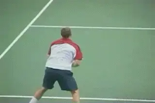
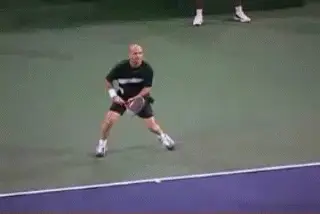

# What is the Modern Forehand?

### Brett Hobden with Gord Runtz

**The modern forehand(s): technical solutions tailored to each tactical
problem.**

It's a fair question: is there such a thing as THE modern forehand? If
there is, then how do we explain all the variations in the swings and
footwork of the top players? Do they simply reflect different \"hitting
styles\"? The answer is no. The variations in the modern forehand are
not a question of hitting styles. They are a reflection of the specific
tactical shots the players are trying to hit. In other words, **the
pros have developed specific technical solutions to address the wide
range of tactical problems they encounter in the modern game
today.**

**Each technical solution can require a different footwork pattern,
impact height, a different preparation and followthrough, and variable
racket head speeds. We see all these differences reflected in the path
of the racquet, especially in the followthrough.**
***[This is why the forehands can look so different, and observing pro
tennis can create confusion.]*** **However, once you understand
how the players are responding to a given ball, the technical
differences in the motions become clear.** You can
learn to see the technical solutions they find to overcome tactical
challenges.

**Three of the seven topspin shot types.**

For the last 15 years, I have spent literally hundreds of hours studying
video of the best players in the world, trying to understand the
mysteries and complexities of the modern game. These articles will
present some of the amazing things I have learned, starting with the
modern forehand. If you want to be a complete modern player yourself,
you need to understand the differences in what players do with the
forehand and when they do it. You need to develop the appropriate
variations for the type of shots you are trying to hit. One of the
limitations in traditional teaching is the tendency to teach only one
variation, usually the basic drive, which leaves the player unequipped
for the shot requirements of successful match play. How many forehands
do you have and when do you use them? If your answer is one, then your
ability to solve your own tactical problems is probably quite limited.

**Shot Types**

So the first step is to realize that the stroke has many variations, and
that you need to be very clear as to which one you're working on at any
given time. In today's game there are actually 7 distinct ways to
deliver a topspin forehand. You'll see them all if you watch a match
between any of today's top players. We call these the seven shot types:

**The arc** is hit ***[about 4 racquet widths over the net with moderate
topspin]***. **The arc is used to move the opponent around the
court, or hit to a weakness.**

**The loop** is a variation of the arc, ***[hit 2 or 3 times higher over
the net]***, ***[with heavy topspin.]*** **The result is
a fast, high bouncing ball, often played to the
backhand.**

**The topspin lob** is an ***[offensive shot hit over a net player's
head].*** **Heavy spin drops the ball quickly after it reaches
its peak.**

**The drive** is a ***[fast, penetrating shot hit with topspin, but with
a flatter trajectory than the arc.]*** **The ball is quick
through the air and difficult to reach when hit into an
opening.**

**The \"bender\", a trademark shot of Pete Sampras.**

**The bender** is typically ***[hit on the run from a low contact
point.]*** **It has a combination of topspin and sidespin,
causing the ball to \"bend\" inwards (curving from right to left for a
right-handed player).**

**The dip drive** is hit ***[from a high contact point, usually around
shoulder level, and driven down into the court.]* It's an
offensive shot hit with power and spin.**

**The angle** is hit ***[cross court with a low trajectory and heavy
spin.]*** **It lands short and is used to open the court, and
also on a passing shot.**

That's just a brief overview and, obviously, there is a lot more to say
to understand each of these shot types. As you can see there really is
no such thing as \"the\" modern forehand. In this series, for the first
time anywhere, we will examine video of the technical components of all
seven topspin deliveries in detail, explain how you can develop them
yourself, and also when and how to use them in match play.

**Direction of Movement**

**Andre moving to the right: the \"right- right\" footwork.**

**[Understanding the variations is made more complex because of the
footwork patterns that can be used to hit them]**. Again there
are several variations. **Most of the above 7 shot types can be hit
while moving in any direction: to the left, right, forward, backward, or
some combination of these (for example both forward and to the
left).** They can also be hit from a relatively
stationary position, when the ball has been hit near the receiving
player and minimal movement to the ball is required. **The optimal
footwork \-- both for the shot and for the all-important recovery that
follows it \-- depends on the player's direction of movement to the
ball.**

Watch in the Agassi animation how Andre is moving to the right as he
hits. ***[This requires a footwork pattern, we call the \"right-right\".
Here players initiate the shot pushing off their right foot, but also
land on the right foot to stop their sideways momentum and begin their
recovery.]***

**Roddick moving to the left: the \"right-left\" footwork.**

Watch in the animation that Roddick is hitting **a \"run-around\"
forehand, moving to the left as he makes the
shot.** This requires a different footwork pattern
we call the \"right-left\". ***[Again the players initiate the shot
pushing off their right foot. The difference is that they land on their
left foot to stop their sideways momentum and initiate their
recovery.]*** (For left-handed players, the above footwork
patterns would of course be \"left-left\" when moving to the left, and
\"left-right\" when moving to the right.)

**Grips**

**[The racket path for a shot can vary with the grip the player is
using.]** This is especially noticeable in the finish
(followthrough). You can actually hit a modern forehand with a grip
anywhere between an eastern and a full western. Many top players on the
pro tour today use what is called a semi-western grip (e.g., Hewitt,
Roddick, Henin-Hardenne, Moya, Gonzalez). Many others use a grip we call
the hybrid, mid-way between an eastern and semi-western. Players who use
the hybrid grip include Federer, Agassi, Davenport and Sampras.

Very few of today's pros use a full western grip. With one or two
possible exceptions, no top pro players currently use a pure eastern
grip, although Pete Sampras' hybrid grip came the closest. **[It is
also worth pointing out that top players sometimes modify their grips
slightly as the situation requires, for example [rotating the racquet
hand slightly in the western direction for very high impact points or
when delivering extreme topspin.]]**

**Grips have a large influence on where the players finish the
forehand.**

How can grip differences affect the racquet path? Again, compare Agassi
and Roddick in the animations. They are receiving similar balls and
hitting similar shots \-- in both cases a drive (that is, a deep
penetrating shot with low net clearance and moderate topspin.) Note the
difference in the finishes. The more the grip is shifted toward the
semi-western or western the more the finish will be across and around
the body. In the animation, we see Agassi with the hybrid grip finishing
over the shoulder with the elevated finish, and Roddick with a
semi-western grip finishing around the body with the inverted finish,
where the racket head is below the wrist. The more topspin a player
generates the more extreme the inverted finish. Roger Federer, for
example, uses far more inverted finishes than Agassi or other players
with the hybrid grip. The reason? Federer hits with much more spin on
his drives than Agassi. Research from Advanced Tennis shows that Agassi
averages about 1800rpm on his forehand while Federer is much higher at
around 2500rpm. We'll talk a lot more about this and the linkage
between grips and finishes in future articles.

The message here is this: If you'd like to emulate your favorite
player, be sure they're using the same grip as you. Or change the
player you're trying to emulate. If you're considering a grip change
and you've been using an eastern grip, the transition to a hybrid grip
is much easier than going to a semi-western. The hybrid has all the
versatility you'll need to hit all the shots of the modern game.

**Type of Ball Received**

**The racket path can also vary with the type of ball received. When
the oncoming ball is difficult** (for example, very
fast, very wide, or with an unpredictable bounce\...), you'll generally
see a **shorter backswing.** This is also true
when the player is **pressed for time.**

**Pro players shorten the backswing to deal with speed and/or lack of
time.**

For example, have a look at players with the best returns-of-serve \--
especially on the faster first serves in the men's game. Shortening the
backswing is the key adaptation players must make to successfully return
a fast or otherwise difficult ball. For example, here we see Agassi and
Federer, both returning a fast first serve.

**Impact Height**

Finally, the **[[racquet path can vary with the height of the impact
point. With] [modern technique, players can hit aggressive
forehands from low, medium and high impact points \-- all the way from
shin to head level.]]** When time permits, players
can even choose the height of their impact point simply by moving
forward or backward on the court. In general, higher impact points
require higher racquet preparations, while lower impact points require
lower preparations.

**Impact heights can range from shin to head level.**

**Learning to Hit Like the Pros**

When you're learning the modern forehand, ***it is important to
understand that the technique you'll need will depend on all of the
above factors.*** Sometimes the adaptations are
subtle. Sometimes they're dramatic. **Players most often get into
trouble when they try to use the same racquet path and footwork to hit
different shots in different circumstances.** If
you're going to play the modern game successfully, you must learn to
continually adapt your stroke and your footwork to the situation and the
shot you're attempting! Unlike in Frodo's Middle Earth, one ring
(i.e., one forehand technique) does not \"rule all\".

In tennis magazines and websites today, you'll see many articles
analyzing the strokes of pro players. When you read such an article \--
for example, on a particular player's forehand \-- ask yourself this
question: **Which forehand is the author analyzing? Is the player
hitting a drive, an arc, a loop, a dip drive\...?**
**[What kind of grip is the player using? What direction are they moving
to meet the ball? What kind of ball are they receiving, and what's the
height of the impact point they've selected? [No player on the pro tour
has a single forehand!]]**

**What kind of ball are you receiving?**

Similarly, when you read articles comparing the strokes of two or more
players, always ask yourself: Are the players hitting the same type of
shot? in the same circumstances? Moving in the same direction? Using the
same grip? In other words, make sure that the author is comparing
\"apples to apples\", not \"apples to oranges\". If it's the latter,
chances are the analysis will mislead you.

**Working on Your Forehand**

When you're working on your forehand, be specific. What's the
situation, and what shot are you going to hit? Make sure that you always
progress to hitting specific shots in response to specific and realistic
situations. Too many tennis lessons teach players how to successfully
use a fixed form of a stroke and a fixed footwork pattern in response to
a simplistic and unrealistic situation. Next time you take a lesson, ask
yourself these two questions: Is the ball I'm being fed similar to what
I typically receive when I play a real point? Is the shot I'm
attempting to hit in this situation realistic for my level of play?
Although it's okay to begin simply, if you want to play real tennis
successfully, you must progress to realistic practice. Otherwise, you
will likely have a great deal of difficulty moving from the training
court to the playing court. What worked so well in training may not work
at all in live play.

**What shot are you trying to hit?**

Learning the modern forehand can pay big dividends for your tennis.
Looking for more pace and spin? You can have it with less effort. Want
more versatility? Modern forehand technique will expand the range of
shots you can hit. A little concerned about injury with the more
athletic-looking stroke? No worries! If you learn the technique
properly, in our experience, the modern forehand will actually reduce
your risk of injury. In fact, it can even eliminate some current
problems you may be having \-- particularly tennis elbow and lower back
problems, and some shoulder and wrist injuries. **We have found that
modern hitting techniques aren't only for advanced players, they have a
lot to offer to all ages and levels.**

If you learn the technique properly, you'll greatly expand the range of
situations you can deal with, and the range shots you can hit. Once you
start down this path, you'll never look back!

  ------------------------------------------------------------------------------------------------------------------------------------------------------------------------------------------------------------------------
                                                                                                                                          website dedicated to providing coaches and players
                                                                                                                                                                        with the knowledge required to teach and play
                                                                                                                                                                        modern tennis successfully. Two DVDs are now
                                                                                                                                                                        available, the first in a new series on teaching
                                                                                                                                                                        and playing the modern game. ([link](http://www.moderntennis.com)) Anyone
                                                                                                                                                                        wishing to contact the authors can also do so
                                                                                                                                                                        directly through their website.
  --------------------------------------------------------------------------------------------------------------------------------------------------------------------- --------------------------------------------------

  ------------------------------------------------------------------------------------------------------------------------------------------------------------------------------------------------------------------------
