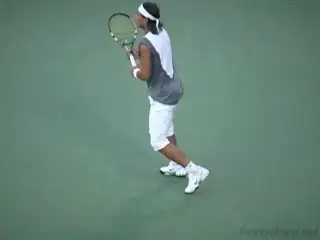
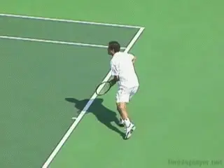
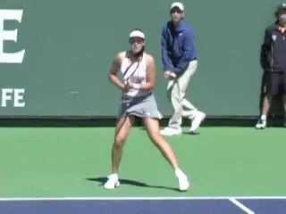
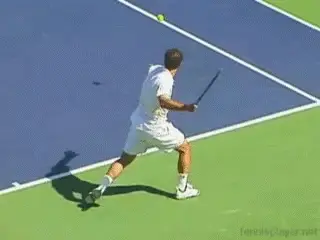
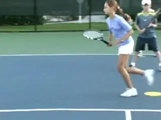
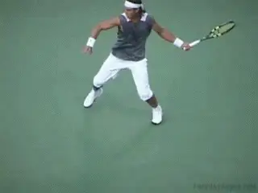
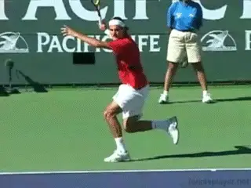
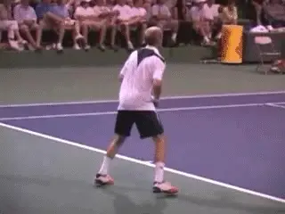
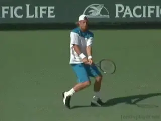
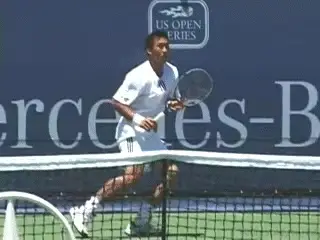

# Contact Moves: The Power Move

**David Bailey**

**Top players use the Power Move when they are pushed wide on the run.**

In previous articles, we've looked at the Aggressive and Neutral
Contact Moves. [link](Footwork%20TOC.docx) Now it's time to
look at the Defensive Contact Moves.

We'll start by looking at what I call the Power Move, the basis for the
running forehand. Then in future articles on the Defensive Contact Moves
we'll look at the two other patterns, the Reverse Spin and the Mogul.

I originally developed the concept of the Contact Move to help us
understand the incredible diversity of movements used by high level
players. These movements include amazing combinations of steps to the
ball, hitting stances, movement of the feet during and after the
contact, balancing steps, and, equally important, recovery steps.

There are multiple variations of all these elements, and they can be
combined in many, many ways depending on the type of ball the player is
facing. The Contact Move concept lets us sort all this out.

The defensive Contact Moves I'm going to analyze are the footwork
patterns used by the top pros when they are challenged and pushed wide
or far back in the court.

**Pete Sampras used the Power Move to turn defense into offense.**

But when we talk about "defensive" contact moves let's understand
what that means. We use defensive Contact Moves when we are challenged
and forced to hit the ball off running steps.

But the idea isn't necessarily to play defensive tennis, and defensive
Contact Moves aren't necessarily associated with "pushing" or a
defensive strategic style. **The idea behind these Contact Moves is
something else: to make a successful shot from a defensive position.
This can be a very aggressive shot, or even a
winner.**

What we are talking about is a situational response to what is happening
in a given point. A Defensive Contact Move can help you hit a shot that
will to get back to a neutral position in the point, or it can be the
basis for counterattack.

This is particularly true of our defensive footwork pattern in this
article, the Power Move. Some players use the Power Move primarily to
attempt winners on the run. The Power Move was the footwork pattern used
by the great Pete Sampras to hit his famed running forehand. Using it,
he was often able to hit clean winners from very wide positions in the
court. You see variations on this strategy used at times by other top
players as well.

**The Power Move**

**Ana Ivanovic perfectly demonstrates the running forehand Power Move.**

So, what exactly is a Power Move? And how can you learn to hit it? The
components are somewhat complex and difficult to see with the naked eye
when the top players are on the run. So, let's break it down step by
step.

**A Power Move resembles an explosive, elevated lunge step.**

- **It begins with the player on the dead run.**

- **Then, just before the start of the forward swing, the player
achieves an open running stance.**

- **The forward swing starts from here.**

- **After the contact, both feet come off the ground, as the player
continues to take at one additional running
step.**

**Unlike most open stance shots, the hips (and sometimes the
shoulders) remain relatively closed through contact with the Power
Move.** This is when compared to the amount of
rotation the players normally use on their forehands. **As the player
lands, the rear leg kicks directly backwards. This is critical for the
player to maintain balance.**

The reduced rotation has to do with the pattern of the footwork. The
player is on the dead run and moving basically sideways. After the hit
he lands on the front foot, continuing in the same direction he was
moving. **Usually this means when the front foot lands, it is more or
less pointing at the sideline. With the front foot facing sideways, the
rotation is naturally reduced.**

**The landing and the breaking step are followed by a crossover step and
the recovery to a neutral position.**

**Recovery**

**The recovery starts with the rear leg coming around the body after
the kick back to make a breaking step.** **Using
the outside foot, the player is now able to push back the other way and
begin the recovery toward the middle.**

**Since the player is on the run and usually wide in the court, the
first step back should almost always be a crossover
step.** This can be followed by one or more
additional running steps, depending on the distance the player has to
travel, and what the opponent has done with the next ball.

**After the crossover, and/or running steps, the player will then use
one or more shuffle steps to recover to the neutral position and prepare
to move to the next ball.**

**Developing the Power Move elements before hitting balls can help
players at all levels.**

**Progression**

As I said, the Power Move is complex, so let's go over the steps one
more time. Watch in the animation of the junior player. I use colored
dots to train elite junior players to master the Power Move first
without the ball. This is a great approach for players at any level who
want to improve their running forehands.

**The progression is:**

- **[running steps toward the ball]**

- **[dropping into a running open stance]**

- **[contact with both feet in the air]**

- **[the landing on the front foot]**

- **[the rear leg kicking back for balance]**

- **[the breaking step with the rear foot]**

- **[the crossover step to begin the recover]**

- **[and finally, shuffle steps to regain a neutral ready
position.]**

**The reverse finish is associated with the reduced body rotation on the
Power Move.**

**Racket Path**

Given the direction the body is moving and also the speed it makes sense
that the racket path on the forehand Power Move is usually more upward,
with the finish over the player's head.

This is the "reverse forehand" finish described by Robert Lansdorp.
[link](../Famous%20Coaches/The%20Reverse%20Forehand.docx) We
can see this most famously in the Sampras running forehand, but the same
swing pattern is used by most of the top pros.

Without the torso rotation to drive the racket around and forward, it's
natural for the swing to accelerate upward over the head, with the
eventual finish moving backwards away from the player.

**Watch how Federer's step forward allows him to rotate more fully.**

**Cutting Off the Angle**

An exception to the shape of the swing pattern is when the player is
able to move forward on a diagonal while still on the run, or simply
take the final step more forward at an angle. When the final running
step is more forward, you are less likely to see the reverse finish.

The player is also able to rotate the torso according to a more normal
pattern and the racket tends to extend further forward before following
through. This is a good goal for any player when on the run--to try to
move forward and cut down the angle of the oncoming shot.

**Though less common, top players use the Power Move on both two-handed
and one-handed backhands.**

**Backhand Power Moves**

The Power Move is far less common in pro tennis on the backhand, but you
still the top players execute it at times on both the one-handed and
two-handed backhands.

The progression for the Power Move on the backhand is basically the same
as for the forehand. The player is on the run full speed toward the
sideline. Just prior to the start of the forward swing, he drops into an
open running stance.

During and after the hit--as with the forehand--the player is
airborne. The landing is with the front foot, and the back foot again
kicks back for balance.

**When two-handed players land with a forward diagonal step, they can
rotate through the Power Move.**

The pattern of the recovery is also the same. The outside foot swings
around and makes a breaking step. This is followed by one or more
crossover steps, and then shuffle steps to recover for the next shot.

As with the forehand, on the backhand power moves the player typically
lands with the front foot facing the sideline. On the two-hander this
means there is less torso rotation than in the regular stroke, also the
case with the forehand.

But again, like the forehand, the two-handed player may step forward on
a diagonal, helping to cut off the angle of the oncoming shot. In this
case the front foot lands at an angle facing more forwards toward the
net. From this position the player gains the ability to rotate more into
the shot as on a typical groundstroke.

\
**The Power Move on the one-hander with the torso staying sideways and
the swing extending.**

**One-Handed Power Move**

**On the Power Move, with the one-handed backhand, the torso tends to
stay more sideways naturally, as is the case with the one-handed stroke
in general.** This is true whether the front foot
lands pointing sideways or more forward toward the net. Again, watch the
sequence of the running steps, the running open stance, the front foot
landing, the kick back and the break step.

The swing pattern with the arm and racket is similar to any other
one-handed backhand with the hitting arm straight and extending outward
to the target with the shoulders sideways.

So that's it for the Power Move. Next, defensive Contact Moves when the
player is pushed backwards off the baseline rather than wide. Stay
Tuned!

*Video demonstration — the original video for this article was hosted on TennisPlayer.net.*

David Bailey is a native Australian who has spent 15 years studying
tennis at the professional level. He has developed a new language for
one of the most complex and misunderstood aspects of the game, footwork
and court movement. David has worked with world class players and
coaches, national tennis associations and top academies, and has
presented at coaching seminars around the world. His teaching system,
the Bailey Method, has become a regular part of the coaching curriculum
at the Nick Bollettierri Tennis Academy, where it is personally endorsed
by Nick

Visit David's Website! [**[!]**](http://www.baileytennisfootwork.com/)

To Contact David directly [**[!]**](mailto:david@baileytennisfootwork.com)
