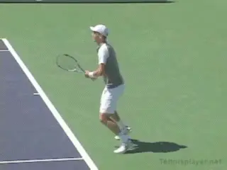
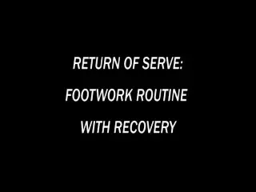

# Return of Serve — Contact Moves Introduction

**By David Bailey**

{width="3.3333333333333335in" height="2.5in"}

*In this series we'll see the Contact Moves for world class returns.*

## What This Series Covers

In this new series of articles for TennisPlayer, I will be outlining my system for developing world-class footwork on the return of serve.

Across four articles we'll cover the full return-of-serve system:

1. **Introduction & Court Positioning** (this article) — where to stand, how to set up, the routines that prime your contact move.
2. **Forehand Contact Moves** — how to load and explode into a forehand return off either side of the body.
3. **One-Handed Backhand Contact Moves** — the contact move patterns that let one-handers neutralize and redirect pace.
4. **Two-Handed Backhand Contact Moves** — the contact move patterns for two-handed returners, including the high take-back for high-bouncing serves.

You can preview the entire range of world-class return contact moves in the video below — I filmed it with two of my students who reached the top 100 in the world.

{width="3.3333333333333335in" height="2.5in"}

**Click the video to study the range of world-class return contact moves.**

## Why Returns Come *After* Groundstrokes

These articles are the natural continuation of my previous TennisPlayer series on the **Contact Moves for the groundstrokes**. I believe we should teach return-of-serve contact moves only after all the contact moves have been taught and understood on the groundstrokes.

Why? Because the return of serve is the most stressful stroke in tennis — you have:

- **No rhythm** — the server controls timing, depth, and spin.
- **Less time** — typically 0.4–0.8 seconds from serve release to contact.
- **No set-up** — you must build your stroke from a neutral, athletic position under pressure.

If a player doesn't have clean contact-move patterns on the groundstrokes, the return of serve will simply expose those weaknesses under maximum duress. Build the groundstrokes first, then transfer the patterns to the return.

## The Contact Move Concept

As I have explained in previous articles, I developed the **concept of the Contact Move** to help explain the bewildering and complex variations that top tennis players use in moving around the court, setting up, executing strokes, and recovering for the next ball.

A *Contact Move* is a conceptual overview that allows us to understand the variations top players use and why. Every groundstroke or return has a **take-back phase**, a **load phase**, and a **drive phase** — and for each phase, there are 3–5 contact-move patterns that world-class players use to solve that specific tactical problem.

On the return of serve, the contact move becomes even more important because:

- The ball is moving faster than any groundstroke.
- The bounce is less predictable (especially on grass, indoor, or high-altitude hard courts).
- The server is trying to take you off the court — wide, body, or into the backhand.

If you don't have a *pre-trained* contact move pattern for the serve to your forehand, your one-handed backhand, and your two-handed backhand, you will be improvising during the point — and improvisation under pressure is where unforced errors come from.

## Court Positioning on the Return

In this first article, we'll cover the basics of court positioning on the return. There are three setup positions to consider:

- **Deep return position** — used against big first serves (e.g., 200+ km/h flat). You trade depth on the return for time to neutralize.
- **Mid-court position** — used against spinny second serves. You can take a fuller swing and look to attack.
- **Inside-the-baseline position** — used against a weaker second server. You take time away and step in to take the return early.

We will also outline the **routines** that players should follow before the return, and how they should start the return movement patterns. The pre-return routine typically includes:

1. A small side-shuffle or hop to get the feet moving (avoid standing still).
2. A split-step timed with the server's racket-drop.
3. A clear visual cue (often the ball toss) to trigger the explosive first step.

## The Contact Move on the Return

Once you have positioned and started the return movement, the contact move is the pattern that gets you from the split-step to the actual ball-strike. The major contact-move patterns on the return are:

- **Push-back contact move** — used when the serve is wide to your forehand or backhand side. You push off the back foot and extend into the court.
- **Drive-through contact move** — used when the serve is body-height or to your strong side. You drive forward through the ball.
- **Side-steps contact move** — used when the serve is sharp-angled and you have to recover after a wide contact.

Each of these patterns will be detailed in the follow-up articles for forehands, one-handed backhands, and two-handed backhands.

## What You'll Learn in This Series

By the end of this four-article series, you'll have a complete mental model of how world-class returners solve the toughest problem in tennis — the return of serve — using a small, repeatable set of contact-move patterns.

**Next up:** *Return of Serve Contact Moves — Forehand* — the contact move patterns for returning to the forehand side.

---

**Read the full article with diagrams and footwork animations:Return of Serve — Contact Moves Introduction (full article)(../../01-fundamentals/footwork/return-of-serve-contact-moves-introduction.html)**

[← Back to Footwork index](index.md) | [Browse all Footwork articles →](../../01-fundamentals/footwork/index.md)
