# Return of Serve - Offensive Contact Moves

**Return of Serve:\
Offensive Contact Moves**

**David Bailey**

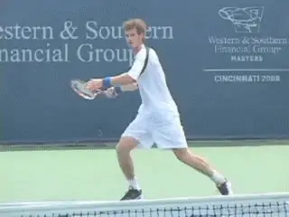

**Offensive Contact Moves mean attacking the return with your feet.**

Offensive Contact Moves allow players to attack the ball with their feet
on the return. Players should use Offensive Contact Moves when they are
trying to take charge of the point with the return. This means hitting
with an aggressive mind set and transferring weight into the shot.

This article presents 5 Offensive Contact Moves for the return of serve.
There are three for the forehand: the Forward Transfer, the Run Around
Forward Transfer, and the Step Down. Then there are two offensive
contact moves for the backhand: the Forward Transfer and the Step Down.

**Backhand Transfer

Preparation:**

 Split Step

 Outside Foot at 45

Degrees

 Open Stance

 Deep Knee Bend

**For each of these Contact Moves we will outline:**

1. Type ball

2. Out steps

3. Hitting Stance

4. Contact Move itself

5. Balance Move

6. Recovery Steps

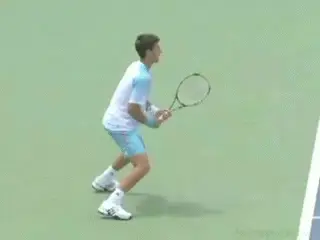

**The open stance set up with the front foot at 45 degrees and a deep knee bend.**

**Forehand Forward Transfer**

Players use the Transfer Move to attack high bouncing or kicking balls.
The serve is typically bouncing up and the player is attempting to hit
as aggressively as possible. They do this by transferring the weight
forward during the swing.

The out step (or the first step) to initiate the movement is a pivot
step or a step out, sometimes followed by small adjusting steps.
([link](http://www.tennisplayer.net/members/footwork/footwork.html) for
more info on outsteps, as explained in the groundstroke articles.)

The player sets up the rear or outside foot at angle of about 45 degrees
to the sideline with the foot usually flat on the court. The stance is
usually fully open.

Most of the weight is on the outside foot, with the player sinking or
dropping the legs so that the rear knee bends up to 90 degrees. To
create this set up, use gravity to your advantage and don't try to
force the bend. Think of just relaxing and letting the legs go down. The
posture is upright with a vertical body alignment.

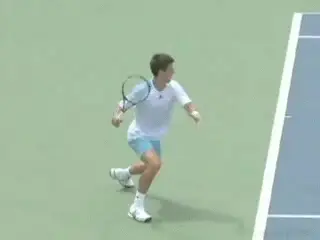

**Backhand Transfer Swing:**

 Push Off with Outside Foot

 Step Forward with Front Foot

 Contact in Air

 Front Foot Landing and Kick Back

 Breaking Step

 Crossover Recovery

As the forward swing starts, the weight transfers directly into the
shot. The outside leg uncoils, propelling the player's entire body
upward and forward. At the same time the player steps into the direction
of the oncoming ball with the left foot.

Typically the player makes contact with one or both feet in the air. The
front foot then lands on the court a split second after contact. The
player usually lands well inside the baseline.

**Balance Move**

To balance on the Forward Transfer, the player curls the back leg with
the heel of the back foot moving upwards. This helps the player stay
upright, extend through the swing and finish with the elbow high and in
front.

After the balance move, the rear leg comes down and then begins the
recovery with a push step off the court, driving the player towards the
midpoint recovery position on the baseline. The recovery steps will be
side skips for a shorter recovery position, or a front crossover step as
the first recovery step if a longer recovery distance is required.

If the return is hit particularly well then the Forward Transfer is also
great to follow into the net as the weight is already going forward with
the player already inside the baseline.

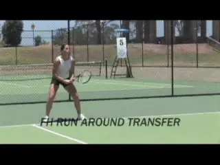

**Forehand Run Around Transfer:**

 Split Step

 Shuffle Steps Around Ball

 Semi Open Stance

 Push Off and Transfer Step

 Contact in Air

 Front Foot Landing with Kick Back

 Breaking Step

 Shuffle Recovery

**Runaround Forehand Transfer**

Players use the Run Around Forward Transfer to hit a serve that has
landed in the middle of the service box or is directed at the body,
usually a ball that has landed short. By moving around this ball players
are able to hit an aggressive forehand return.

The out steps are shuffle steps, like those used on and inside out
forehand groundstroke, as the player moves around the ball to his or her
left. ([link](http://www.tennisplayer.net/members/footwork/david_bailey/contact_move/the_transfer/the_transfer.html) for
more about movment patterns on run around forehand groundstrokes.)

For the Runaround Transfer, the hitting stance is usually semi open as
opposed to fully open. Again the player loads most of his weight on the
outside foot, with a deep bend in the knees.

The player then transfers the weight from the outside foot to the front
foot as they make contact with the ball. As with the regular transfer,
the player lands on the front foot just after the hit.

The balance move is again a leg curl in which the heel of the back leg
moves upwards towards the butt. This helps keep good body balance and
alignment and also helps the player extend through the swing.

The recovery steps are most commonly a push step from the back leg which
comes down and drives the player towards the midpoint recovery position
on the baseline.

The Run around Forward Transfer move is equally great to follow into the
net on a well hit return, as already the weight is going forward and you
finish the shot well inside the baseline.

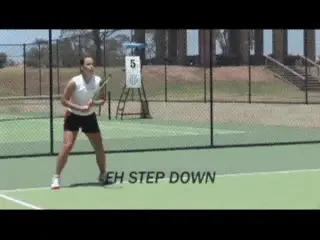

**Forehand Step Down:**

 Step Out

 Shuffle Adjusting Step

 Neutral Stance

 Front Foot on Court at Contact

 Rear Leg Kick Back

 Breaking Step

 Crossover Recovery

**Forehand Step Down Return**

Players use the Forehand Step Down Return on a serve that has landed
short in the service box, but when the bounce is a lower.

This Contact Move allows the player to step aggressively into the
return, taking it early and on the rise. It has become increasingly rare
in pro tennis because of the height and weight of the serve. Still it is
a great return to develop and especially effective at lower levels.

On the Step Down, the pattern of the out steps depends on how far they
player must move to reach the ball. The player positions behind the
oncoming ball, so that he or she can transfer his weight from the back
foot to front foot into the shot.

The out step options are to do a simple step out with the foot closest
to the ball, then step into a neutral stance. Or you can take rhythm or
sliding steps with the outside foot leading the way, followed by the
step into a neutral stance. The player can also take small adjustment
steps if needed.

The hitting stance for the Step Down is a neutral stance with the lead
foot stepping straight down the court before contact. The step should be
wide, balanced and controlled. The player will usually keep the front
foot on the court during contact, but if the ball is high it may raise a
few inches into the air during the forward swing.

During the swing, the player pivots the hips around the front foot. The
back foot kicks back toward the back fence for balance. The kick back
helps the player maintain good body alignment and time the rotation.

The kick back also improves the extension of the swing which is
essential for control, direction and power. The higher the ball, the
greater the kick back will tend to be.

The rear or trail leg then comes around, lands in a breaking step, then
pushes off as the player starts the recovery.

The recovery steps will be side skips for a shorter recovery distance,
or a front crossover step as the first recovery step if a longer
distance is required. I believe that in general the front crossover step
is faster, covering more distance in less time.

If the return is hit particularly well then the step down return is also
great to follow into the net. As with the forward transfer, the weight
is already going forward and the player is typically already inside the
baseline.

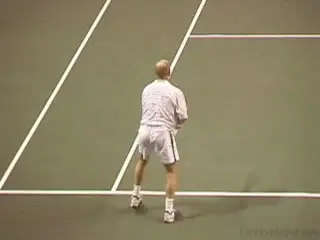

**Backhand Transfer Semi Open:**

 Split Step

 Outside Foot at 45 Degrees

 Semi Open Stance

 Semi Open

 Transfer Step

 Kick Back

 Shuffle Step Recovery

**Backhand Transfer Return**

The Forward Transfer has become the dominant aggressive contact move on
the backhand return for both one and two handers in the pro game. This
is because it allows the player to move their weight forward into the
shot when the ball is high.

Players can use the Backhand Transfer on a high bouncing, floating
serve, and on a heavier ball as well, on either a first or second serve.
The transfer allows them to launch their bodies to the height of the
ball and hit the return as aggressively as possible.

As with the forehand transfer, the out step can be a pivot, or a step,
and can also be followed by adjustment steps. Like the forehand, the
purpose of the out steps is to load the weight on the outside foot,
which is usually at an angle of about 45 degrees to the sideline.

The hitting stance is usually open but can also be semi-open. Initially
though the fully open stance may not feel as natural on the backhand
side, because it makes it more difficult to get the torso fully
sideways.

Most of the weight is on the outside foot with a deep bend in the knee,
up to as much at 90 degrees. As the swing starts, the player pushes off
with the back foot and then steps forward with the front foot

This transfers the body forward and upward into the shot. Depending on
the ball height, the feet can both be in the air, with the front foot
landing on the court just after contact.

The balance move for the backhand Transfer Return is a leg curl with the
heel of the back leg coming upwards. This createsgood body balance and
helps the player extend through the swing. The finish is with the elbow
high and in front and the hips and front toe ending up facing the net.

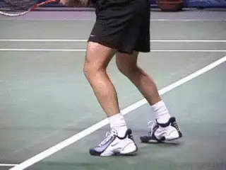

**Back Transfer Open Stance:**

 Split Step

 Outside Foot at 45 Degrees

 Deeper Knee Bend

 Open Stance

 Contact in Air

 Front Foot Landing

 Kick Back

 Break Step

 Reverse Crossover Recovery

After the followthrough, the back foot typically swings around, lands,
and brakes the player. The player then pushes off to recover. The type
of recovery step depends on where the player is on the court and how far
he needs to go to regain the midpoint. Note in the case of the second
backhand transfer hit by Agassi that the recovery step can also cross
behind the right leg as well as in front.

If the return is hit aggressively enough, the backhand transfer move is
great to follow into the net as the weight is going forward and the
player finishes the shot well inside the baseline.

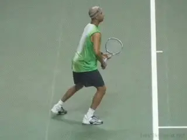

**1 Hand Backhand Transfer:**

 Split Step

 Body Turn

 Outside Foot at 45 Degrees

 Open Stance with Knee Bend

 Transfer Step Forward and Sideways

 Contact in Air

 Front Foot Landing

 Kick Back to Sideline

 Break Step with Rear Foot

**One Hand Backhand**

Players also use the transfer on the one-handed backhand return. The
sequence on the one-handed contact move is similar: to turn and coil the
weight on the outside foot and then transfer it forward into the shot
with the front foot step.

At times the front foot step can be partially sideways as well as
frontwise. But the biggest difference with the one handed backhand is in
the balance move. This is because the torso stays more sideways with the
one-handed swing.

This means the kick back is to the side fence with the back leg
basically perpendicular to the sideline. This keeps the torso from
rotating around too soon and allows the swing to be more along the
direction of the shot.

After the balance move the rear leg comes around to break the motion,
though usually not as far around as on the two hander. From here the
player is ready to move in the appropriate recovery pattern.

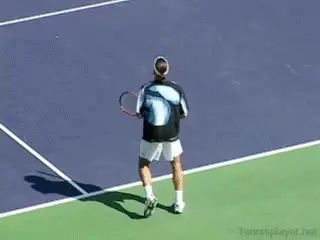

**1 Hand Backhand Step Down On Rise:**

 Split Step

 Pivot with Knee Bend

 Outside Foot at 45 Degrees

 Step Down into Neutral Stance

 Front Foot on Court at Contact

 Rear Leg Sideways Kick Back

 Shuffle Step Recovery

**One Handed Backhand Step Down**

In pro tennis, the Step Down is relatively rare on the one-handed
return, due to the height of the bounce of the serve and the reduced
time to return in the modern game.

You see it however in two instances, when the player is moving in toward
the net to take the ball on the rise, or moving backwards and allowing
the ball In both cases this creates a lower strike zone , which in turn
allows the player to step into the ball with the front foot.

But the step down is an excellent move on more balls at most other
levels of the game, where the factors of contact height and reduced time
interval are less extreme.

After the split step, the contact move begins with the body turn
sideways. This can be initiated with a step out, a pivot, or even a
reverse step away from the ball. The player then loads on the outside
leg, and then takes a step directly forward into a neutral stance.

The foot stays on the court during the forward swing, but the back leg
kicks into the air and back away from the player for balance, and to
keep the torso sideways. As with the transfer, the back foot turns
toward the sideline on the step down. After the shot is complete, the
back leg comes around positioning the player to recover in either
direction using a variety of possible recovery steps.

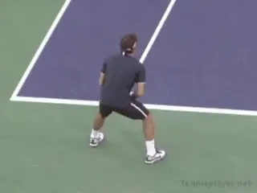

**1 Hand Backhand Step Down Moves Back:**

 Split Step and Steps Back

 Shuffle Step Body Turn

 Neutral Stance

 Front Foot on Court at Contact

 Kick Back to Sideline

 Breaking Step

 Crossover Recovery

As I noted in the first article, the variety of step and movement
patterns on the returns, as in all shots, is much more complex than has
been previously realized. One of the main purposes of these articles is
to simply help players and coaches developed an eye for recognizing them
and how they apply in various situations.

The question then becomes how to apply them in playing and coaching. I
have had tremendous success with players at all levels, training the
specific patterns in a step by step fashion. Other players and coaches
may take a different approach, believing many of these patterns develop
naturally, believing that if something is working correctly, there is no
reason to tamper with it and risk introducing problems where none
existed before.

With this approach, however, I still believe understanding the contact
moves on the returns, as well as all the other shots has tremendous
value. If they understand the principles of movement at the highest
levels of the game, players and coaches will have a clear framework for
evaluating the effectiveness and efficiency of oncourt movement. This
allows them to evaluate where improvement may be needed, and gives them
a step by step methodology for causing this improvement to occur.

So that's it for the aggressive return Contact Moves! Next we'll move
on to neutral and then defensive moves. Stay tuned for that!

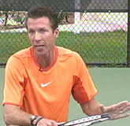

*Video demonstration — the original video for this article was hosted on TennisPlayer.net.*

David Bailey is a native Australian who has spent 15 years studying
tennis at the professional level. He has developed a new language for
one of the most complex and misunderstood aspects of the game, footwork
and court movement. David has worked with world class players and
coaches, national tennis associations and top academies, and has
presented at coaching seminars around the world. His teaching system,
the Bailey Method, has become a regular part of the coaching curriculum
at the Nick Bollettierri Tennis Academy, where it is personally endorsed
by Nick

Visit David's Website! [**[!]**](http://www.baileytennisfootwork.com/)

To Contact David directly [**[!]**](mailto:david@baileytennisfootwork.com)
