# The Athletic Foundation

### **Pat Doughert**

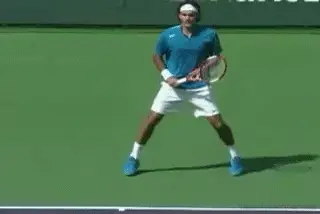

**The athletic foundation is often the missing link in developing into a
professional player.**

As the biomechanics specialist at the Bollettieri Tennis Academy, for
two decades I've worked to help young players develop into tour
professionals. When I compare the top pros to aspiring young players at
our academy, the junior players tend to share grips, swings, footwork
patterns, and stances with the pros. **The missing link for most
juniors is a strong, disciplined athletic
foundation.**

The evolution from junior to professional is a process of evolving from
player into athlete. I have found that the ability to establish and
defend a strong athletic foundation is the measure of a great tennis
athlete. In my view, most instructors and coaches don't tend to focus
enough on developing this vital athletic component in young players.

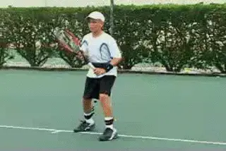

**Training in the AP Belt can make a huge difference in improving court
movement for players at all levels.**

In my new series for TPA, I hope to help players and coaches
understand the athletic foundation and develop more efficient movement
techniques. In Part 1, I'll explain the physical qualities of the
athletic foundation and the importance of being able to establish,
maintain and defend it during battle. I'll also introduce you to my
patented training device that accelerates the development of these
skills. It's called the **Athletic Performance Belt (A.P.
Belt).**

Initally I was a little reluctant to incorporate the A.P.Belt directly
into my first article for fear that the series would seem too much like
an informercial right off the bat. But after talking to John Yandell, he
convinced me that the use of the belt was central to conveying the
concept of the Athletic Foundation. In fact the belt is now required
equipment at the Academy for all full time students. We've also made it
possible for all TPA subscribers to order the belt at a special
price. [link](http://www.active.com/event_detail.cfm?event_id=1175099).

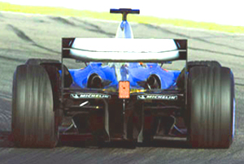

**On the court do you move like a race car--or a tractor?**

**Form and Function**

So what is the athletic foundation? Let's start with a comparison drawn
from auto racing. The structural design and components of any vehicle
tell the story of the vehicle's intended function and determine its
performance capabilities. Consider the Formula-1 racing car. Beneath
**a Formula 1 car's flashy exterior lies a sturdy frame reinforced by
a very tight suspension for razor sharp handling.**

**The car's center of gravity hovers only inches above the
ground.** **[The width of the wheelbase is
proportionately very wide.] [Together, the wide base and low
center of gravity enable the car to perform sharp turns at high speeds
and achieve maximum stability against the forces that cause
rollovers.]**

At the opposite end of the spectrum is a farm tractor. **[A tractor's
design reflects the specific needs of the farmer who drives it.
Acceleration, speed, and handling aren't requirements to succeed in
farming.]** The tractor needs plenty of ground clearance and a
high center of gravity to travel through the dirt and mud in a field and
stay above the crops without damaging them.

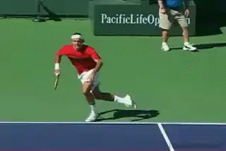

**On court a movement specialist resembles a Formula 1 racer.**

Now imagine a Formula 1 car attempting to perform the off-road tasks of
a tractor. Instantly, it gets stuck in the mud. Conversely, imagine a
tractor traveling at top speed through a slalom course. It's a rollover
on the first corner. The point is exactly the same in understanding how
we move on the court. Our form must be designed for optimal function.

**Movement Specialists**

As a child one of the first physical skills, you learn is how to walk.
When you walk your base of support is narrow, about shoulder width. The
center of gravity is high. Your stride lengths are slightly wider than
shoulder width. These elements are analogous to the structural
characteristics of the tractor. But in tennis, you'll never reach your
athletic potential performing like a tractor. Instead, you need to
develop the performance characteristics of the race car.

**I believe that the greatest tennis players are "movement
specialists."** Movement specialists are athletes
who have learned how to transform their body posture to resemble the
design characteristics of a Formula 1 car. The chart shows the
similarities. Top players use their movement strengths as a weapon to
dominate the opposition. They have explosive reaction times and quick
acceleration that allows them to cover every inch of the court and
maximize offensive opportunities. Fluid and agile footwork enables them
to efficiently track down balls and smoothly execute their strokes, even
on the run. Instantaneous changes of direction and sharp recovery skills
are their weapons for defending the court, minimizing open court
opportunities for the opponent.

Formula-1 Car                    Athletic Foundation
Wide Wheelbase             Wide Footwork Base for Reaction/
Stances

Minimal Ground Clearance       Knees Bent / Hips Low to the Ground

Sturdy Frame                 Strong Upright Back Posture

Tight Suspension            Intense Muscular Reinforcement of
Foundation

Supercharged Engine             Powerful Lower Body Muscles

Speed shift Transmission        Multi-Directional Quick Footwork
Patterns

**The "athletic foundation" is a total body framework that when
activated, powers and stabilizes all footwork and all
strokes.** This foundation parallels the structural
qualities of the Formula 1 car and achieves its structural integrity
through muscular intensity. You'll see the great athletes establish
their foundation just prior to their reaction on the first shot. They
then work hard to defend these qualities of the athletic foundation
until the point is over. The 3 essential structural qualities of the
athletic foundation are:

- Wide Footwork Base of Support (1.5 to 3 Shoulder widths apart)

- Low Center of Gravity (Hip Position)

- Reinforced Back Posture

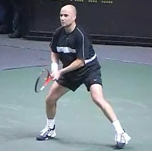
**Agassi's foundation: wide base, lowered center of gravity, great posture.**

**[Wide Base of Support]**

**For quicker reaction time as well as better power and control in
stroke production, the optimal footwork base is 1.5 to 3 shoulder widths
apart**. With a wider base it becomes easier to
maintain the essential low to the ground positioning. If your footwork
base is too narrow, you'll struggle to remain low enough because it
creates an added load on your legs which causes fatigue much more
quickly.

**Another natural by-product of a very narrow base is very slow and
inefficient first step reactions.** (In Part 2 of
this series, you'll learn all about first step reaction techniques.)

**When the footwork base is too narrow in the hitting stances, it
prohibits effective forward weight transfer and typically results in too
much upward launching through the stroke.**

**The end result is a loss of power and control in stroke production.**

**Many players aren't comfortable establishing a wider footwork base
because they feel it slows down their first-step
reaction.** However, there is a specific footwork
technique **called the drop step that we will look at in detail that
allows top players to create an explosive first-step reaction from this
wider base.**

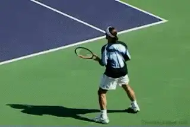

**Great athletes establish the athletic foundation just prior to
reacting to their opponent's shots**

Another component in the athletic foundation that you must learn is
**how to center your balance on the balls of the
feet.** Movement specialists not only work with
quick adjustment step footwork in setting up the optimal stance,
[**[they continue to adjust their fee until their body weight is
centered on the balls of their feet]**. **[Centering their
balance off the heels and on to the balls of the feet provides better
power and stability to the stroke mechanics.]**]

**Low Center of Gravity**

**The actual location of the center of gravity in humans varies by
body type. In females, the center of gravity tends to be between the
hips, where in males it tends to be slightly
higher.** The difference is nominal, however, so we
typically refer to the hips as the reference point for the center of
gravity.

**From a wide base the drop step generates an explosive first move.**

**\
Athletic Height**

When you are down in the athletic foundation position, you establish
what is referred to as your "athletic height". **Your athletic
height should measure approximately 6 inches to one foot below your
normal standing height.** **You achieve this
low-to-the-ground position through bending your knees to lower your
hips, while maintaining upright back posture.**

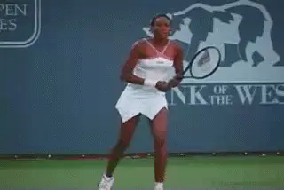

**Watch Venus lower her center of gravity as she creates her
foundation.**

Most players have trouble maintaining a low enough athletic height
during play simply because they haven't developed all the corresponding
movement techniques associated with being low to the ground. **In
addition, it requires more leg strength and stamina to play
low.** Being able to maintain a consistent athletic
height in your movement produces that smooth and fluid look of the
champions. Great athletes make movement look effortless, though it takes
a considerable amount of effort to create that look.

Because it is not easy to stay low and perform at the ideal athletic
height, **most players succumb to playing too upright much of the
time. As a result, they develop inefficient movement habits that
correspond with a high center of gravity. They end up moving more like
that tractor than the race car.**

Some players try hard to "play low" but just can't seem to maintain
the low athletic height. Coaches yell at them to "stay low" but it is
often to no avail. **In the long run, playing too upright is very
inefficient.** It not only produces poor results
(on court), but you'll fatigue much more quickly over the course of a
match. The fact is that if you've never practiced and trained your body
to move while maintaining a low center of gravity, you are not equipped
with the skills to get the job done in matches.

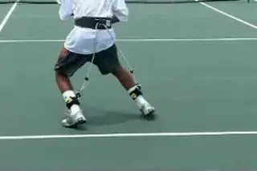

**The AP Belt helps players develop and maintain their athletic
foundation.**

This is where the Athletic Performance Belt comes in. The Athletic
Performance Belt is a training device I patented many years ago. The
Belt is simple to use in practice and is the most effective method I've
found for teaching players how to establish, maintain and defend a
strong athletic foundation. By regulating the height of the athletic
foundation during practice, it naturally teaches you the most efficient
movement techniques that correspond with a low center of gravity. Within
a short period of time the habits you learn in practice will carry over
to your match play.

The A.P. Belt is comprised of a bungee cord that passes through a pulley
mounted on the back side of a belt and attaches on each ankle. By
adjusting the length of bungee based on your height, you feel resistance
from the cord when your technique isn't optimal. This "resistance
feedback" teaches you "right from wrong." You'll feel resistance
from the belt the moment you deviate from correct technique. We know
from learning theory that the way players learn is by developing a
kinesthetic feel for every aspect of the game. Wearing the belt helps
players develop this directly.

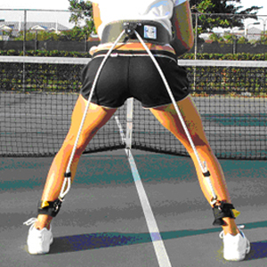

**The Belt helps players create a wide base, low center of gravity, and reinforced back posture.**

Most players experience immediate increases in power and control in
their stroke production from the first time they put the belt on. It
pays dividends in nearly every aspect of your game. Training in it on a
regular basis will develop a stronger, more defined athletic foundation,
increase your quickness, power and control, build tremendous lower body
strength and improve stamina.

Using the belt, you will experience greater demands on your lower body
muscles while maintaining ideal athletic height. This is a real
positive, because it will help your body develop the ability and the
strength to manage the improved loading in your strokes. Eventually,
you'll be more efficient and have the stamina to go the distance
playing from a better foundation.

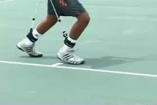

**By working your lower body, the belt improves loading, efficiency, and
stamina.**

**Strong Upright Back Posture**

Can a person's self-confidence be accurately assessed merely by
observing how they stand and carry themselves? Most certainly, and the
most significant indicator is back posture. **Typically, people tend
to display low self-esteem and lack of confidence through poor back
posture.** **Conversely, a person with high
self-esteem and confidence tends to maintain strong upright
posture.** Beyond being a measure of your
self-confidence, there are enormous physical benefits you gain by
maintaining strong back posture.

Strong back posture combined with core strength is the final link to
reinforcing your entire athletic foundation. We've all been told for
good reason that when lifting heavy objects one should keep their back
straight to avoid injury. This holds true when competing in sports like
tennis where moving rigorously and creating powerful strokes are in
demand. **Learning to activate your back muscles with intensity to
reinforce your posture creates an ideal support system for the shoulder
mechanics.**

Intensely reinforced back posture efficiently channels the power
generated from the lower body up to the shoulder mechanics to produce
powerful strokes. In addition, posture ensures that the shoulders remain
level and stable during stroke production, especially critical while
sliding on clay. From a movement perspective intensely reinforced back
posture works like a tight suspension in a Formula 1 car. It allows you
to generate quick reactions and sharp changes of direction while
resisting the forces of inertia that slow you down.

**Weak posture poorly manages the flow of power production and leads
to strokes that easily breakdown. In addition, the risk of injury
increases dramatically when you misuse the back muscles and maintain
weak posture. Greater strength in the back muscles, chest and abdomen
will provide better core stability for more controlled
power.**

**Powerful Lower Body Muscles**

The legs are the primary power source of movement acting like the
supercharged engine of the Formula 1 car. Powerful "quick twitch"
muscles generate explosive movement. If you look at the top professional
players, you'll notice their thighs and backside tend to be very
well-developed areas. This gives you an indication of how important
lower body strength is to a tennis athlete's performance. Your
quadriceps and gluteus must be in great shape to perform low to the
ground like a Formula 1 car.

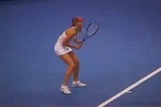

**Sharapova Made or Born?**

**Great Athletes Can Be Made**

It is a popular misconception that athletes are strictly born and not
made. Sure some people are lucky enough to be born with the genetics and
natural ability to maintain a strong athletic foundation from a very
young age. But others are able to develop their athletic foundation and
qualities through years of specific training and development. However,
even the most naturally gifted athletes typically need training and
development to nurture and refine their skills to full potential.

I truly believe that, through hard work and the right training regimen,
it is very possible for less naturally athletic people to develop more
athletic skills and movement techniques and evolve into better athletes
over time**. In many respects it's very similar to learning to play a
musical instrument. All it takes is time to learn the basics, then
quality repetition of the specific skills and techniques to engrain the
habits. The better you practice, the better you
develop.**

As a result of genetics, upbringing, environment and opportunity, some
players will develop more quickly and excel more than others. Be it
sport or music, only a select few will have all the special ingredients
required to rise to the very top. However, it doesn't mean you can't
achieve a high level of proficiency if you work hard at it. So what if
you may not be the most natural talent, destined from birth to be the
next Roger Federer. It's about reaching your personal potential that
really matters.

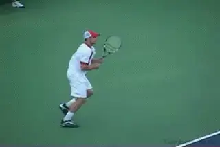

**In tennis there isn't enough emphasis on critical, movement related
skills.**

**\
Athletic Skills are Universal**

The athletic foundation, first step reaction technique, quick stride
acceleration footwork, change of direction techniques, etc. are
basically the same maneuvers in most sports. However, all too often the
emphasis in learning a specific sport is focused solely on
"non-movement" related skills. **By neglecting the development of a
sound athletic foundation, we end up with "players" not
"athletes."** Unfortunately, most tennis players,
don't really begin developing their athletic qualities until the latter
stages of development. It should be the other way around. Without
training with a specific focus on the athletic movement skills, you may
never learn to perform like an athlete.
