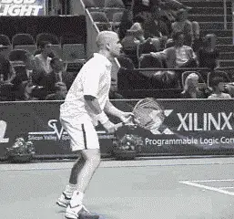
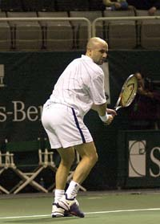
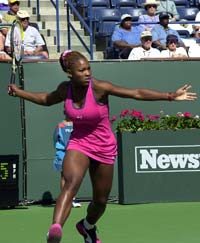
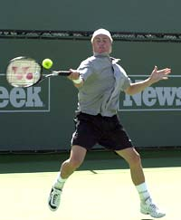
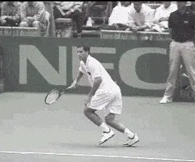
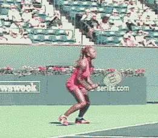

# The Hitting Stance(s)

### **Michael Friedman**

Ever wonder how tennis pros produce such awesome power off their
groundstrokes? Even smaller players like Hewitt and Chang manage to
generate a tremendous amount of force. Over the past decade a more
efficient use of tennis footwork has evolved to create this power and
also to keep up with the decreasing amount of time a player has to get
to the ball and to recover in today's power game.

**Stepping in - the back foot judges the contact point in order for the last step to trigger the swing. Notice how Agassi's right foot does not move until the
completion of the swing.**

The following article on the different hitting stances will demonstrate
how the tennis tour's best movers generate effortless power in
different hitting situations.

Three basic principles all the great players have in common are.
balance, ground force, and the proper implementation of the body's
kinetic chain.

The different stances described in this article are the Step In (Andre
Agassi, Serena Williams), Open Stance (Leyton Hewitt, Serena Williams),
Kick Back (Agassi, Hewitt) Resistance Stance (Serena) and the Running
Stance (Pete Sampras). All of these stances have biomechanical
similarities, including balance, ground force, and the proper linkage of
the body parts which is called the kinetic chain.

### **Balance**

Proper balance allows the body to rotate naturally through the stroke
generating power and allowing for consistency. On groundstrokes, the
body parts should be lined up vertically so the racquet can swing
horizontally allowing the racquet head to move freely through the plane
the ball is on at the point of contact. The axis can be the left side,
the right side, or the center of the body but at the point of contact
the racquet should be perpendicular to the spine. If the spine is
vertical the racquet should be in a horizontal position. Rotating around
a body axis that stays vertical until the end of the follow through is a
sign of good balance.

**Agassi plants his left foot parallel to the baseline. His right foot steps in toward the net, pointed at a 45 degree angle. This keeps his hips sideways until the left knee rotates towards the net. Then the hips and hands are fired toward and through the contact point. Note the toe touch (rear foot).**

The topspin swing is a low to high diagonal. The majority of the force
generated by the racquet through the plane the ball is on is horizontal,
to make the ball fly quickly towards the court. The vertical force
starts below the ball, brushes up, and finishes above it. This lifts the
ball over the net and also creates topspin and control.

Stopping the rotation at the right time, from the contact point to the
follow through, will create acceleration of the racquet head through the
contact point much like the acceleration created when snapping a towel.

When braking the body parts, make sure to keep the head still through
the finish of the swing. Plant the front foot flat on the ground when
Stepping In, or what I call "sticking the landing", and by holding the
toe touch on the back foot, or kicking the back foot back, or just by
resisting movement in the resistance stance, you will be able to rotate
the body and still maintain a balanced body axis to rotate around.

### **Ground Force**

Ground force is the initial drive off the ground through the feet to
initiate the kinetic chain. In each of the stances mentioned above, the
back foot should be sideways or parallel to the net. This assures the
proper relationship of the shin, knee, thigh, and hip to the contact
point. The knee is bent and the ankle flexed. Whether stepping in or to
hitting with an open stance, drive off the instep of the back foot to
start the kinetic chain. To be able to hit the ball in a higher contact
point you can jump off the ground driving off the front foot and kicking
the back foot back towards the back fence as the body rotates.

Serena's drives off her right foot setting in motion a kinetic chain generating a tremendous amount of power. Her back knee begins to rotate into the "K" position where it will almost touch the front knee .

### **Open Stance**

In today's game the open stance is used for two main reasons.

1.  At the speed the ball is coming, players don't have time to step
into the ball.             

2.  It is more efficient to recover back to the middle.

For every one extra step taken to the ball, it takes at least one (if
not two) to get back to the middle, therefore, hitting with a closed
stance slows recovery time.

Using the open stance, Serenas's shoulders turn 90 degrees to the net
while her hips stay at 45 degrees to the net. When she drives off the
right foot and rotates her right knee, she fires her hips a little,
which rotates her shoulders a lot. This is the same principle used in
the golf swing, where shoulders turn more than hips on the backswing.
When the hips are turned on the forward swing, the shoulders are whipped
through, creating greater club head speed.

**Hewitt kicks back with his right leg to balance and brake the body rotation. Notice how straight up and down he keeps his rotating axis.**

**If the right foot comes around too soon the elbow flies away from the body, the racquet face closes and the ball goes into the net. Kicking back keeps the body from over rotating and keeps the elbow in so the racquet face stays perpendicular to the ground through impact.**

### **Kinetic Chain**

**The Kinetic Chain is the sequential movement of linked body parts
when swinging a racquet around an axis (the body) creating centrifugal
force.** If one link is missing it will throw the
smooth transition of movement through the body and hence limit the
potential power one could create at the point of contact.

Like a weight at the end of a rope, if your rotate your body a little,
the weight will move a lot and at a much greater speed. **[The same
centrifugal force applies in tennis, a little body rotation will
generate much greater racquet speed]**.

**The biomechanical sequence starts by pushing off the back foot,
turning the back leg's shin, knee, and thigh towards the net creating
the "K" position where the back knee rotates to a point almost
touching the front knee, not unlike the letter
"K".** **The core of the body - the hips,
torso, and shoulders then rotate towards the net, in that order. The
front leg absorbs the rotation by staying still, and you should be able
to feel the pull from the inside of your front knee to the outside of
the front hip.**

**The braking of body parts will keep the body from over rotating.
This will generate more power by getting the body mass in motion and
then stopping it to create acceleration of the racquet at the point of
contact. The head and front foot should remain still through the stroke
and the rear foot, whether using the toe touch or kicking back acts as
an anchor, stopping the rotation.**

###  **Sampras' Running Forehand**

Sampras's lethal running forehand uses the hitting arm to swing while
stepping across with his left foot. He hits with a closed stance in
order to keep his body from rotating too much as he swings.

**Notice the heel toe landing of his left foot.**
**When the foot lands heel/toe, the whole leg acts like a shock
absorber**. The ankle and knee bend naturally. If
the toe lands first, this stiffens the leg, which does not allow the leg
to absorb the weight being put on it, so it resists and pushes the
weight back.

### **Resistance Stance**

The resistance stance is used when there isn't time to get the entire
body into the optimum position to swing the racquet. Here Serena faces a
hard, deep shot at the baseline and is forced to hit a half volley.

Note how Serena maintains good body balance by widening her stance. She
resists moving her body by staying down on her legs. This allows the
hitting arm and racquet to go through the contact point while the body
stays still through the follow through.
