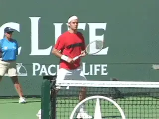
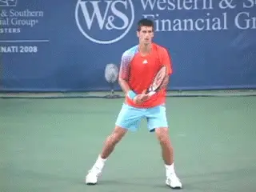
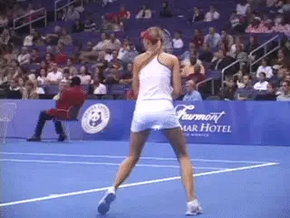
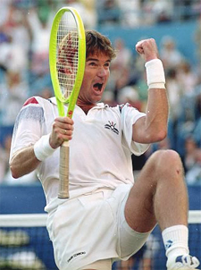
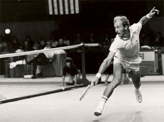
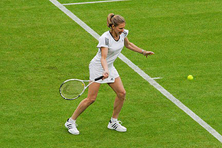
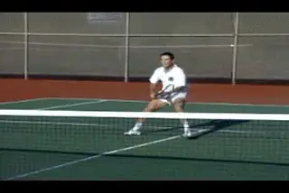

# Breaking Down Your Opponent with Attitude

### By Allen Fox, Ph.D.

**Even for great players, winning a tough match is a prolonged mental
struggle.**

Anyone who has played tennis for any length of time knows that winning a
tough match involves a prolonged and often agonizing mental struggle.
The match may last for hours, and to win you must concentrate with
intensity from start to finish. That's hard work. And on top of it, you
are becoming increasingly hot, tired and physically uncomfortable.
Maintaining your resolve under those conditions is no easy task. But to
win, you must; because when your resolve dissipates, you are finished.
Until then, you always have a chance.

Your opponent across the net, meanwhile, is experiencing the same
problems - difficult as that may be for you to perceive in the heat of
battle. I always found it hard to picture - when my own body ached with
fatigue and the cool drink and shower were looking better than the
winner's trophy - that my opponent might be getting ready to fold. Even
though I knew intellectually that he must be as tired as I was, my own
pain had a certain reality that his could never quite match.

**How do you nudge your opponent toward a breakdown?**

The astute tennis player understands that his who takes steps to nudge
the opponent in the right mental direction so that it is he, and not
you, who gives in to the physical and emotional pressure of the moment.
How can you help him along?

**First, keep in mind that a player brings with him to the tennis
court all of the components of his psychological makeup from the "real
world." By better understanding some of these components, you can learn
to use them to help you win tennis matches.**

Consider one: **[[a person's attitude about himself - or his
"self-image." On or off the tennis court, our self-images are largely
determined by feedback and information given to us by other
people.] [Others constantly react to us and, thereby, tell us
what they think of us. These "evaluations" are, by and large,
transmitted to us without words, and relate to our every ability and
trait, both mental and physical. They are noted and weigh heavily in our
own evaluations of ourselves.] [We like to think that we have the
strength of character to resist being buffeted emotionally in the stormy
seas of other's opinions of us but reality is far from
it.]]**

**Attitudes of Others**

If you don't believe this, picture, for a moment, a horrible experiment
that could be done on you by a group of your associates. Suppose they
all got together without your knowledge and decided to mentally break
you down. To do this they might, whenever you were trying to say
something within the group, glance away and appear disinterested. They
also might belittle your comments, cut you off as soon as possible and,
thereafter, direct all their conversations away from you and only to
each other.

**Your opponent's confidence can be affected by your attitude as well
as your game.**

How long could you maintain your good self-esteem under these
conditions? As strong as you might think you are beforehand, how long
would it take them to totally destroy your self-confidence? I'm sure it
could be done in less than a day. You would quickly conclude that you
had become dull or unattractive or both. You would be hurt and
depressed. And if it went on for any length of time, your "self-image"
would be deeply affected. In fact, since we are social creatures, we
ultimately accept the accumulation of other people's "evaluations" of
us (as evidenced by the way they treat us) as reality.

**Similarly, on the tennis court, your opponent's self-image as a
tennis player will be affected by your attitude toward him. If you fear
him, he will feel strong.** **If you disdain him,
he will feel uncertain. If you respect him, he will fell
confident.** **You must be careful, therefore,
lest you supply your opponent with psychological ammunition to be used
against you. Your objective is to undermine his confidence, not to build
it up.**

**Shaking fists at opponents: boorish, antagonistic, wrong.**

**First, however, let me qualify this idea with the understanding that
a tennis match is not a street-fight.** There are
definite written and unwritten codes of behavior by which we must abide.
But within these codes, it is absolutely legitimate to try to debilitate
your opponent in every way you can. You cannot separate the mental and
physical aspects of tennis competition. Making your opponent feel
emotionally comfortable will make him play better and fight longer,
whether you do it by massaging his ego or by feeding him his favorite
shots.

**An acceptable, yet effective, attitude is one in which you indicate
to your opponent that you expect to beat him no matter what he
does.** Furthermore, you want him to feel that you
have no fear of his game or abilities - that you are completely
impervious to his finest efforts. In convincing him of these things, the
line that you must not cross is the one where you overtly attack him by
word or deed. In the years before tennis became an open, high-profile,
money sport such breaches were rare. In those days players were
sincerely concerned about maintaining the respect and friendship of
their fellow competitors. Jimmy Connors, Ilie Nastase, and John McEnroe
changed all that, and in my years of coaching the Pepperdine tennis team
**I often saw young players shaking their fists at opponents, calling
them names and behaving boorishly antagonistic. This is not necessary,
and, moreover, it is wrong. The goal of weakening an opponent mentally
can be achieved with equal effectiveness and more
subtlety.**

**Stan's belief in his invincibility was annoyingly obvious.**

**Before the open era the great players were very capable of making an
opponent feel small, weak and vulnerable without the slightest breach of
sportsmanship or ethics. They did it by their
attitudes.**

When you walked on court with the likes of Rod Laver, Roy Emerson,
Arthur Ashe, John Newcombe or Stan Smith you were significantly
intimidated without them appearing to do anything. **They did it by
the way they carried themselves, in their bearings and in their
reactions to your shots.** **Nothing you ever did
seemed to worry them. They looked like they expected to win and your
small efforts to the contrary were futile.**

**Stan Smith was particularly adept, in his playing days, at making
opponents feel small and weak. In fact he was even a little annoying,
although no one could ever actually pin a bad sportsmanship rap on
him.** What debilitated his opponent was the fact
that Stan (who won Wimbledon in 1972 and the US Open in 1971) had
unswerving belief in his own invincibility and his bearing made this
belief obvious to his opponent. **If you hit a great shot against Stan
he never acknowledged it - he didn't look at you, he walked in his
normal, erect, purposeful manner and went routinely about his business
as if nothing had happened. Stan always gave the impression that he had
total control of his little world, you were no part of it, and your
efforts to shake him were puny and unworthy of notice. Nothing was said.
This was simply how he appeared, and you, as his opponent, felt like a
pigmy.**

**Steffi took no notice of opponents while dismantling them.**

All the great players display some or all of these characteristics.
Since they actually do believe that they are going to win their body
language and gestures are merely a reflection of this belief - a belief
that is palpable and demoralizing to an opponent. **Steffi Graf walked
quickly and took no notice of an opponent. Pete Sampras walks slowly
and, similarly, takes no notice.** The lady-like
Chris Evert had an unflappable, intimidating, and hard-eyed stare for
opponents, and Martina Hingis, when she was on top, walked and flipped
her racket around in a cocky, "I'm better than you are", manner.
Federer and Nadal rarely react in any way to the loss of a point. They
simply go about their business and prepare to win the next point. All
the great players do it, and all of them do it in their own way, but
their message is the same: "Your best shots have no effect on me and
nothing you do lessens my confidence in my ultimate victory."

**No matter what the circumstance, appear cool, deliberate, confident.**

Whether you feel it or not you can weaken your opponent by behaving in
the same manner as the champions. Never let your opponents see your
weaknesses. These encourage them, give them hope, and keep them fighting
longer. If you are tiring physically, hide it. If you miss and easy
shot, do not cry out in anguish. (Your opponents expect you to and it
will shake them if you don't.) If you are nervous, don't broadcast it
by rushing around, grousing about conditions or telling people about it.
I have actually heard players shout, "I am choking!" What a wonderful
psychological boost something like this gives an opponent. Everybody
chokes. Choke quietly if you must.

No matter what the circumstance or how you feel inside, it is best to
appear cool, deliberate and confident. It's the best way to help an
opponent fold.

**This article is excerpted from Allen's new book, Tennis: Winning the
Mental Match, which will be available at the end of 2010 on Amazon and
on Allen's new website,
[www.allenfoxtennis.net](http://www.allenfoxtennis.net).**

Read More From Allen!

Visit him at [www.allenfoxtennis.net](http://www.allenfoxtennis.net)

Winning the Mental Match Dr. Allen Fox

Tennis is mentally the most difficult sport due to it's personal nature which makes winning and losing feel more

important than they are. In this new book, Allen offers his proven solutions to problems such as choking, reducing

stress, finishing matches, and developing confidence. Based on a life time of high level play and coaching success,

it's a must for all competitive players.

[ to

Order](http://www.amazon.com/Tennis-Winning-Mental-Allen-Fox/dp/0615407765/ref=sr_1_1?ie=UTF8&qid=1336083459&sr=8-1).

Winning may not be everything, but Dr. Allen Fox points out

eminently preferable to losing. In his new book, The

Winner's Mind, Allen lays out an original step-by-step

plan for succeeding at any of life's endeavors, based on

his first hand and very personal observations of the

careers of both world-class tennis players and successful

businessman. The bottom line is that even if you are not a

born champion--and only a tiny percentage of us are--you

can still use the success strategies of champions to tilt

the odds in your favor. Writing with brutal honesty and dry

humor, Fox lays out the common mental characteristics of

winners in sports and in life. He explains the critical

role of intellect over emotion. He analyzes the struggle

between ambition and fear and the insidious and pervasive

fear of failure that undermines so many of us. He then

outline how to confront and overcome these fears in your

life and career, even when they are initially subconscious.

Must reading from one of the great thinkers in tennis, and

a Renaissance Man in life. [ to

Order](http://www.tennis-warehouse.com/descpage-MIND.html).

To purchase this book you can also send a check for $17.95

to Allen Fox, 1120 Inverness Place, San Luis Obispo, CA.

93401. The price includes shipping.

Allen Fox PhD is a former world class player, a coach,

insightful analysts in modern tennis. A top 10

American player from the glory days before Open

tennis, Fox played many of the legendary greats, among

them Roy Emerson, Rod Laver, Stan Smith, and Arthur

Ashe. At Pepperdine he developed the men's tennis

program into an elite contender for national titles,

and gave Brad Gilbert the insights that became the

foundation for "Winning Ugly". His book Think to Win

is a modern classic. He has also starred in a series

of acclaimed videos, including Pro Secrets of Match

Play and Allen Fox's Ultimate Tennis Lesson.
