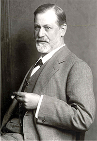
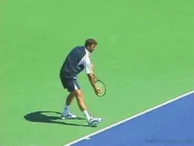
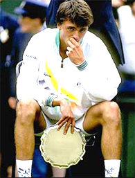
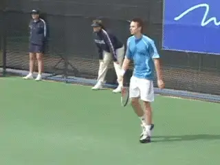
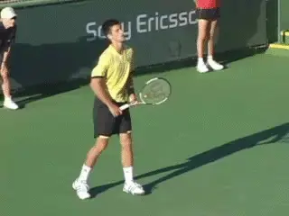
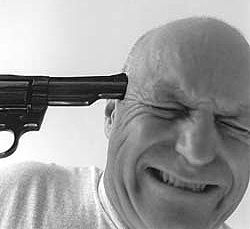
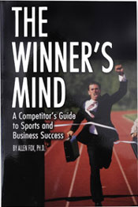

# Defense Mechanisms

### By Allen Fox, Ph.D.

**According to Freud, defense mechanisms are useful in normal
situations.**

Sigmund Freud pointed out that defense mechanisms, such as the excuses
described in the last article ([link](Why%20Emotions%20Can%20Be%20Counter%20Productive.docx)), are
normal and often serve useful and protective purposes. Unfortunately,
competitive tennis is not a normal situation, and the useful purposes
they provide do not include winning matches or engendering respect from
opponents or bystanders. Successful players resist making excuses by
consciously recognizing the real issues on court and using the rational
parts of their brains to keep themselves on track.

The urge to escape is powerful. Defense mechanisms and urges to escape
have extraordinary power. Consider, for example, the Wimbledon final in
1994, when Pete Sampras beat Goran Ivanisevic 7-6, 7-6, 6-0.

Here Ivanisevic became discouraged when he lost the first two sets (even
though he had never lost his serve), and simply handed the final set to
Sampras. When you look at the overall situation logically such a
decision is almost incomprehensible.

Winning the match would be worth millions of dollars - he would get
several hundreds of thousands immediately in additional prize money and
immense amounts more in product endorsements and appearance fees. But
far more importantly, the Wimbledon Championship itself is the
fulfillment of every tennis player's dreams. And he only needed to win
three sets to take the title, which is what he had to do anyway when the
match began.

**With his serve and no breaks in two sets, Ivanisevic could have been
optimistic.**

In fact, he had a far better chance of winning the tournament down two
sets to Sampras in the final, than he had when the tournament began two
weeks and six matches earlier. If this wasn't a good enough for him, he
needn't have entered in the first place. With his serving
effectiveness, who was to say that the final three sets couldn't go his
way?

Obviously something extraordinarily powerful was clouding his logic
system, since deciding to throw away his golden opportunity was so
clearly against his interests. But Ivanisevic was operating on emotion.
He had had a terrifically stressful first two sets; he had been through
two grindingly stressful weeks of tournament play; he was mentally
tired, and the match seemed to be going against him.

He subconsciously wanted out from further stress, particularly since he
sensed an unhappy ending to the process. His way out was to conclude
that further efforts were useless. As crazy as this conclusion appears
to an unemotional outsider, to Ivanisevic at that moment it seemed
completely reasonable, so distorted was his logic system under the
influence of subconscious escapism.

**Powerful emotions clouded Goran's logic systems in his 1994 Wimby final.**

**Logic and Emotion**

Logic and emotions don't mix. Coaches pull their hair out trying to
convince their players to remain focused, rational, and motivated when
they are losing. Standing unemotionally on the sidelines, it is obvious
that the alternative is certain disaster. And after the heat of battle
has dissipated and over a cold Gatorade in the clubhouse, even the
players will agree that losing their heads is not the best way to win
tennis matches. But what leaves coaches perplexed is that after agreeing
in the clubhouse on the obvious benefits of remaining cool and
motivated, the players will go out on court and do the same thing again!

This is because the emotions are extremely powerful, and, like oil and
water, logic and emotion don't mix. (At least they don't mix
immediately or quickly.) The coach and player can usually agree when
they are both in the logic mode, but the on-court competitive situation
is different.

It is emotionally driven, and in the throes of strong emotion, logic is
usually the first casualty. Unfortunately, outside of a college team
situation or a parent-child relationship, logic is the main weapon the
coach or anyone else has. (On college tennis teams the coaches control
the players' scholarships or positions in the lineup so they can
coerce, as can parents.)

**In the throes of strong emotion, logic is usually the casualty.**

How then do effective coaches (or sports psychologists) handle these
issues without force? The general approach is two-pronged. One is to
reduce the stress as much as possible while simultaneously working with
the players' logic systems to convince them to overpower
counterproductive emotions. Of course there are numerous helpful
techniques and specific exercises, and we will discuss them later, but
the crucial hurdle is player motivation.

Emotional control requires motivation more than it requires information.
Under the stress of a match, players need to be extraordinarily
motivated to keep their normal urges to escape under control. These
emotions are extremely compelling and will get out of hand in an instant
if the players are not on top of them.

And it is not a matter of simply giving players information they don't
have. Not only is the information simple and obvious, they've heard it
countless times from coaches, parents, magazine articles, books, and
television commentators. They couldn't avoid it if they tried.

The problem is getting them to do something about it. This is ultimately
a matter of convincing players to decide, at sufficiently deep levels,
to stay practical, keep their goals in mind, and forego
counterproductive emotional responses - difficult because their emotions
are so natural and insistent.

**Escapist defense mechanisms are always ready to pounce.**

Giving up these escapist defenses requires constant conscious vigilance
because the urges are always there, just below the surface, and ready to
pounce. If the players lose confidence, get mentally tired, or become
more stressed than usual they are likely to lose discipline, and out
will pop the defenses.

They often think they get it, but they don't. Coaches wonder why
players, who seem to 'get it' for periods of time, so frequently
relapse and revert to old counterproductive emotional habits. They do so
because even though they understand the situation logically, they
haven't absorbed it deeply enough.

Their commitment to controlling errant emotions is shallow, so they
continue to succumb. They are really cured only when the light bulb in
their head goes off and they irrevocably decide that they are simply not
going to behave counterproductively any more, regardless of anything
that may happen on court. That's when they really 'get it'. But
players rarely have sufficient motivation to 'get it' immediately.

How do I know the problem is motivation? Consider the following thought
experiment. What would happen if I were to go out on court with a gun
and tell the player that I will instantly shoot him in the head if he
becomes angry, makes excuses, or stops trying during the match?

**Are escapist emotions worth dying for?**

**Do you believe he would do any of these things? He would be more
afraid of me than losing. And as long as I am standing there waving my
gun around, I would bet he will keep control of
himself.**

His quick calculation would be that escapist emotions are not worth
dying for. This tells me that players continue to lose emotional control
simply because they don't want to change and control themselves badly
enough. When they do, they will change - and change immediately.

The basic issue never goes away. No matter how well players initially
respond to the ministrations of a good coach, sports psychologist or
even their own budding awareness, they must not forget that outcomes
will forever remain uncontrollable, hence escapist urges will always be
there.

**Just because they control themselves for awhile, they mustn't
assume the underlying problem has been solved. It hasn't. Escapist
tendencies have only been temporarily repressed. If players mentally
weaken, out they will come again. Like alcoholics on the wagon, players
must remain constantly vigilant lest backsliding
occur.**

**Giving in to emotions is like dieting: the first bite leads to more.**

**I have noted a common sequence as players struggle for control of
errant emotions. When they start, particularly under the influence of a
good coach or sports psychologist, they usually improve
immediately.**

This is because almost anything is better than simply letting nature
take its course. They are pleased and even begin to hope that the old
emotional problems are well and safely behind them. But inevitably they
take new losses, and the old doubts resurface.

This erodes their embryonic resolve, and dormant escapist emotions again
run rampant, leading, of course, to more losses and further dissipation
of resolve. Match results roller-coaster in concert with emotions, and
they may go through slumps severe enough to make them doubt the
emotional control process entirely.

**For a time, they will often resist reasserting emotional discipline
and just let themselves go. This is akin to the overweight person who
successfully diets for awhile but finally slips and begins to regain
weight. Dieting has required the constant effort of self-denial. Once
discipline slips and** **the dieter starts to
indulge - just a bit at first - and the lost weight starts to return, it
becomes doubly difficult to diet again since much of the hopeful initial
motivation has dissipated.**

In like manner, tennis players, after the opening rush and early
improvement, will usually relapse. They may not have the stomach to
immediately climb back on the wagon, but rather insist on banging their
heads against the wall for awhile. For the lucky few the obvious lessons
sink in quickly. For the others it requires more time and punishment
than seems reasonable, but most players do eventually 'get it'. And in
future articles, we will endeavor to help players 'get it' sooner.

**This article is excerpted from Allen's new book, Tennis: Winning the
Mental Match, which will be available at the end of 2010 on Amazon and
on Allen's new website,
[www.allenfoxtennis.net](http://www.allenfoxtennis.net).**

Read More From Allen!

Visit him at [www.allenfoxtennis.net](http://www.allenfoxtennis.net)

Winning the Mental Match Dr. Allen Fox

Tennis is mentally the most difficult sport due to it's personal nature which makes winning and losing feel more

important than they are. In this new book, Allen offers his proven solutions to problems such as choking, reducing

stress, finishing matches, and developing confidence. Based on a life time of high level play and coaching success,

it's a must for all competitive players.

[ to

Order](http://www.amazon.com/Tennis-Winning-Mental-Allen-Fox/dp/0615407765/ref=sr_1_1?ie=UTF8&qid=1336083459&sr=8-1).

Winning may not be everything, but Dr. Allen Fox points out

eminently preferable to losing. In his new book, The

Winner's Mind, Allen lays out an original step-by-step

plan for succeeding at any of life's endeavors, based on

his first hand and very personal observations of the

careers of both world-class tennis players and successful

businessman. The bottom line is that even if you are not a

born champion--and only a tiny percentage of us are--you

can still use the success strategies of champions to tilt

the odds in your favor. Writing with brutal honesty and dry

humor, Fox lays out the common mental characteristics of

winners in sports and in life. He explains the critical

role of intellect over emotion. He analyzes the struggle

between ambition and fear and the insidious and pervasive

fear of failure that undermines so many of us. He then

outline how to confront and overcome these fears in your

life and career, even when they are initially subconscious.

Must reading from one of the great thinkers in tennis, and

a Renaissance Man in life. [ to

Order](http://www.tennis-warehouse.com/descpage-MIND.html).

To purchase this book you can also send a check for $17.95

to Allen Fox, 1120 Inverness Place, San Luis Obispo, CA.

93401. The price includes shipping.

Allen Fox PhD is a former world class player, a coach,

insightful analysts in modern tennis. A top 10

American player from the glory days before Open

tennis, Fox played many of the legendary greats, among

them Roy Emerson, Rod Laver, Stan Smith, and Arthur

Ashe. At Pepperdine he developed the men's tennis

program into an elite contender for national titles,

and gave Brad Gilbert the insights that became the

foundation for "Winning Ugly". His book Think to Win

is a modern classic. He has also starred in a series

of acclaimed videos, including Pro Secrets of Match

Play and Allen Fox's Ultimate Tennis Lesson.
