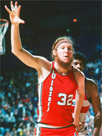
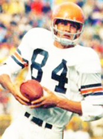
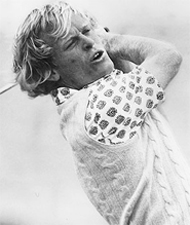
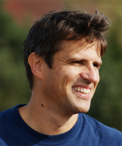
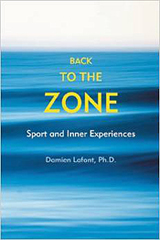

# Does the Zone Exist

### Does the Zone Exist?

### Damien Lafont

**What is the zone, or is it even real?**

Is the Zone real? If it is what are its characteristics? Is there one
Zone or are there many? In this article let's review some surprising
opinions from some the world's top researchers and athletes across
multiple sports.

The subject of the Zone has been intensively studied by psychologists,
neuroscientists, and anthropologists, among others. It has been
explained as a function of genetics, environment, motivation, hypnosis,
and even parapsychology.

Some researchers compare the psychological characteristics of winning
athletes with those of athletes who fail. Others ask athletes to recall
the feelings and sensations they experienced during great moments of
competition.

**Bill Walton: anxiety is a necessary component of the Zone.**

But professional athletes are often reluctant to discuss the idea of the
Zone. And one study by researchers at Cornell and Stanford found that
athletes sometimes incorrectly report being in the Zone when they are
experiencing intense feeling and sensation, but without measurable
performance correlates.

Can the Zone be consciously created? Keith Henschen, a psychologist at
the University of Utah believes so. If athletes create the right
conditions, they create the zone. But Bob Rotella a psychologist who
works with golfers believes "It happens when it happens.
Self-transcendence cannot be produced by force of will."

**Flow**

Hungarian professor Mihaly Czikszentmihalyi believes that the Zone
cannot be quantified by research, sampling methods, or numbers. **He
defines the Zone as a flowing state in which the athletes lose
self-awareness.**

There is a perfect correspondence between the demands of the activity
and the capacity of the athlete which makes the experience completely
enjoyable. There are no scientific instruments that can measure this
confluence of chemical, mental, and kinesthetic events.

Researcher Susan Jackson found that reaching the zone is less a matter
of talent, and more a matter of perception. What we think we can achieve
will determine our experience more than our ability.

**Tom Kite: control creates freedom.**

Jackson argues that changing this perception of what we are capable of
requires high levels of self-confidence and that self-confidence can be
increased by thinking about past successes.

Yuri Hanin, who led Finland's Research Institute for Olympic Sports,
has a different opinion. He believes anxiety and doubt are a fundamental
part of the zone experience. Each athlete has an ideal level of
"competitive anxiety" at which he performs at his peak. Without this
anxiety his level of performance decreases.

As former All Pro basketball player Bill Walton put it, the uncertainty
when facing a challenging opponent ignites heightened mental states.
"What really brings the intensity is knowing that the opponent can beat
you."

**Concentration**

Some athletes describe the Zone in terms of heightened concentration.
They are able to stay focused by concentrating on present action and
ignoring what has previously happened or any future expectations. This
total immersion in the present is what golfer Tony Jacklin has described
as a "cocoon of concentration."

**Chris Evert: the Zone can transform time.**

Tom Kite, one of the best golfers of the early 1990s, says of the Zone,
"When it happens you are in total control. Nothing bothers you."

This means a sense of power, confidence, and calm that frees the athlete
from the fear of failure. Former NBA player Byron Scott says: "All you
can hear is this little voice inside you, telling you 'shoot' every
time you touch the ball. Because you know it's going in."

As Chris Evert put it: "You can't miss anything. It's like you
anticipate way ahead of Time where the ball is going and you also know
where you're going to hit the ball before you hit."

**Perhaps the most bizarre reported aspect of the Zone is
transformation of time. In the heat of the game, time can slow down,
giving the perception that we have all the time in the
world.**

Chris Evert recalls, "Everything seems slower, so you have more time to
adjust."

Bill Walton says: "Everything slows down except you, and you feel like
you're operating at a different speed and at a different level than
anybody else."

**<< The opposite is true that the time is the same for all players,
but the brain of the athlete is activated to a higher level of
performance, e.g. 80% of full capacity so he/she could process the
information much faster and give the faster output to control other
parts of the body. So, it seems the time is slower for the athlete
relatively.>>**

**Bob Trumpy asked what did I do?**

Time can even be suspended as Roger Bannister reported after running the
first sub four-minute mile: "The world seemed to stand still or did not
exist. There was only a great unity of movement and aim."

Golf coach Gail Smirthwaite believes another important and often
overlooked component of the Zone is self-esteem. "Low self-esteem will
make it almost impossible for someone to be able to create the 'flow
state' on demand, because they do not have the belief that they can
achieve the success they seek."

In her book Modified Consciousness, Christine Le Scanff describes an
amnesia that some athletes experience that makes it difficult or even
impossible to describe a Zone performance.

Bob Trumpy, a former all pro tight end, is a good example: **"It was
like being in a tunnel and being blinded by a bright light. When I came
out of the other end of the tunnel, I was in the end zone and my
teammates were celebrating. But I didn't remember what I
did."**

**Le Scanff notes that detachment can give an athlete increased
tolerance: "Sport allows an athlete to achieve an altered state of
consciousness because of the secretion by the body's own biological
drugs. Beta-endorphin has analgesic power fifty times higher than that
of morphine."**

**The zone is love.**

**Love**

Finally, Johnny Miller, winner of over twenty titles on the golf pro
tour, boils it down to love: **["I think love is the secret. I really
believe it."] ["I think the Zone is really being in harmony
with what you're doing. Wanting to do it, wanting to do it for the
right reasons, not for money or for greed or for power." "If you love
what you are doing and just can't wait to play, it's going to be
fun."]**

As this sampling establishes, the term Zone itself may border on the
nebulous. The evidence shows that what we loosely call the Zone can
comprise very different experiences for different athletes. In the next
article let's focus more specifically on what tennis players and the
coaches and psychologists who work with them have to say about the
characteristics of the zone and how it is created and emerges. Stay
Tune!

Damien Lafont Ph.D. is a pioneer in mental, vision and movement study.
Based in Melbourne, Australia, Damien is manager of Vida Mind ([link](http://www.vidamind.com.au) for more info). He works with athletes
and coaches from all sports interested in developing mental skills and
improving performance. A certified teaching pro, he holds a degree in
sport science and training as well as a doctorate in physics.

**Back to the Zone**

"The Zone" is that quasi-mystical state when everything flows
effortlessly, and you can do no wrong. Back to the Zone breaks the Zone
down into its many components. Ultimately it shows us that reaching the
Zone is more about freeing our mind from the unnecessary rather than
learning new techniques and concepts.

[ to
Order!](http://www.amazon.com/Back-Zone-Sport-Inner-Experiences/dp/1891369997/ref=sr_1_2?s=books&ie=UTF8&qid=1409754670&sr=1-2)
