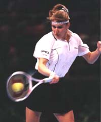
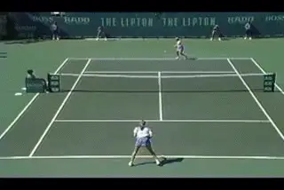
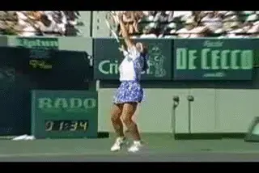
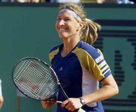
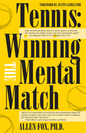

# Even Champions Choke

### By Allen Fox, Ph.D.

**Steffi combined shot making with remarkable grace under pressure.**

I have tremendous admiration for Steffi Graf. Her character was so
strong, so practical, and so perfectly competitive that I am in awe of
the way she played the game.

Even though Steffi has been retired for several years, her famous
husband still judges his achievements in comparison to hers. If we look
back at a few of her memorable matches we can all learn some basic
lessons about how to compete.

It is not simply the fact that Steffi won so many Grand Slam titles that
intrigues me; it is the way she won them. Her shots are, of course,
wonderful as well, but it is her grace under pressure that brought me to
the edge of my seat.

The French Open final Steffi played against Aranxta Sanchez Vicario
toward the end of her career is a good example Graf won the first set
6-4 and held a commanding 4-1 lead in the second set tiebreaker. She was
so close to her fifth French singles Championship that she could taste
it.

Then the incredible happened. Graf made a couple of easy errors, started
to think, develop doubts, choke, yes, choke. Steffi ended up giving away
the set on four consecutive errors and a double fault.

**Every player has had the experience of making errors under pressure.**

Which of us has not had a similar experience (although not in the finals
of a major championship)? We have all wanted to win an important match,
had a lead, reached the brink of victory, gotten excited, started to
think, choked, and then blown our leads. The interesting difference
between Graf and the rest of us, however, is in what happened after the
choke.

At a set all Vicario seemed to have turned the tide of battle and was in
the driver's seat all the way. Steffi was a little down, having choked
away her chance for a straight set victory.

Vicario moved to a 4-2 lead and had several chances to go up 5-2. Graf
fought to keep the set close. Vicario served for the match at 5-4 but
Graf dodged that bullet and evened the score at 5-5. Maybe Steffi was
making her move? But no, only more disappointment.

Four games later Vicario served for the match again at 7-6. At this
stage most people would have concluded that it was simply not their day.
Graf was tired, had thrown away her chances due to weakness of nerve,
and had been teetering on the brink of defeat for the past hour.

**Even after choking, Steffi was prepared to fight out the third set**

Her hopes had been dashed again and again. Any normal mortal would have
weakened just enough to give Vicario the match. But of course Graf
fought on and ultimately won the Championship.

What can we learn from this? We can see how a champion reacts when she
chokes and try to emulate her attitude when we choke, as we are sure to
do from time to time. Steffi accepted with equanimity the fact that she
had choked and derailed her chances of an early victory, but the
attitude that saved her was her belief that choking was not necessarily
going to make her lose.

She did not look at choking as a character flaw that was going to be her
undoing on this day. Choking meant only that as the third set commenced
Graf was even rather than having already won.

She was prepared to fight out the remainder of the match on the same
basis that she fights out all three set matches. And deep in her heart
she knows that if she does this she usually wins.

This is the crucial attitudinal difference between Steffi and many
tennis players. Most of us are fearful. Against a difficult opponent in
an important situation we are afraid that we may not have the 'stuff'
it takes to be a winner.

We become most likely to choke when we get ahead and the match is
apparently ours for the taking. We become afraid that our opponents
will, at this last crucial instant, manage to wiggle free. We know that
this is our golden opportunity to win and fear that if we falter now we
will not get another chance.

**Against a difficult opponent in an important situation, many player
worry they may not have what it takes to execute.**

The feeling that we must win now or never is a tremendous source of
pressure. And the most debilitating attitude of all is that choking is a
character deficiency, proof that we are not 'winners.'

So after choking many players lose confidence and courage. They are
discouraged not just because they lost a few points, but more so because
they think they don't have 'it.'

They may gamely attempt to fight on but their confidence is shattered,
their resolve is weak, and they become unlikely to come up with their
best tennis in the next crucial situation. And because of this attitude
they will usually ultimately lose.

Steffi Graf is not admirable because she is without fear. She certainly
has her fears. She is admirable because she doesn't allow them to
debilitate her.

**Steffi Graf was a great champion, not because she was without fears, but because she never allowed them to debilitate her.**

And just to show that choking and still winning the French final was not
a fluke, Steffi also choked in the Wimbledon final the same year. Up a
set and 4-0 she was absolutely killing Vicario. Then, almost by luck,
Vicario won a game.

You could virtually see Steffi starting to think. Incredible mistakes
made their way into her game. She lost her serve by whiffing the
shortest overhead imaginable at 30-40. Serving for the match at 5-4,
Steffi served two double faults to lose the game.

Then at 5-all she regained control of herself, played two excellent
games, and won her seventh Wimbledon. She is truly a great champion.

**This article is excerpted from Allen's new book, Tennis: Winning the
Mental Match, which will be available at the end of 2010 on Amazon and
on Allen's new website,
[www.allenfoxtennis.net](http://www.allenfoxtennis.net).**

Read More From Allen!

Visit him at [www.allenfoxtennis.net](http://www.allenfoxtennis.net)

Winning the Mental Match Dr. Allen Fox

Tennis is mentally the most difficult sport due to it's personal nature which makes winning and losing feel more

important than they are. In this new book, Allen offers his proven solutions to problems such as choking, reducing

stress, finishing matches, and developing confidence. Based on a life time of high level play and coaching success,

it's a must for all competitive players.

[ to

Order](http://www.amazon.com/Tennis-Winning-Mental-Allen-Fox/dp/0615407765/ref=sr_1_1?ie=UTF8&qid=1336083459&sr=8-1).

Winning may not be everything, but Dr. Allen Fox points out

eminently preferable to losing. In his new book, The

Winner's Mind, Allen lays out an original step-by-step

plan for succeeding at any of life's endeavors, based on

his first hand and very personal observations of the

careers of both world-class tennis players and successful

businessman. The bottom line is that even if you are not a

born champion--and only a tiny percentage of us are--you

can still use the success strategies of champions to tilt

the odds in your favor. Writing with brutal honesty and dry

humor, Fox lays out the common mental characteristics of

winners in sports and in life. He explains the critical

role of intellect over emotion. He analyzes the struggle

between ambition and fear and the insidious and pervasive

fear of failure that undermines so many of us. He then

outline how to confront and overcome these fears in your

life and career, even when they are initially subconscious.

Must reading from one of the great thinkers in tennis, and

a Renaissance Man in life. [ to

Order](http://www.tennis-warehouse.com/descpage-MIND.html).

To purchase this book you can also send a check for $17.95

to Allen Fox, 1120 Inverness Place, San Luis Obispo, CA.

93401. The price includes shipping.

Allen Fox PhD is a former world class player, a coach,

insightful analysts in modern tennis. A top 10

American player from the glory days before Open

tennis, Fox played many of the legendary greats, among

them Roy Emerson, Rod Laver, Stan Smith, and Arthur

Ashe. At Pepperdine he developed the men's tennis

program into an elite contender for national titles,

and gave Brad Gilbert the insights that became the

foundation for "Winning Ugly". His book Think to Win

is a modern classic. He has also starred in a series

of acclaimed videos, including Pro Secrets of Match

Play and Allen Fox's Ultimate Tennis Lesson.
