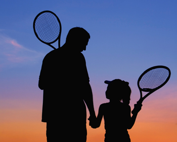
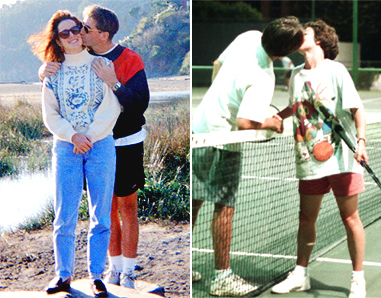
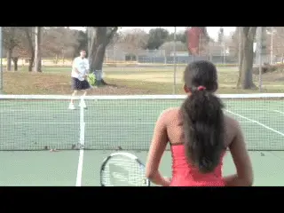
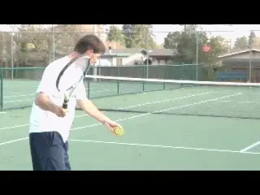
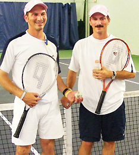

# Family Tennis

### Keith Hayes

--

--

**How is it the sport for life can tear tennis families apart?**

They say tennis is the sport for a lifetime, but over the years I've
seen it tear families in two. Just name the relationship - married
couples, siblings, parents and children - and I've seen a fight break
out on the tennis court.

At a mixed doubles tournament, I once saw a husband berate his wife to
the point of tears. Although both were outstanding players, their
opponents had figured out that they could lob over the wife whenever her
husband charged in on his serve. Later that afternoon, I tried to
console her as she sat glumly beneath a tree.

"That's the last time," was all she said, and the sheer hatred in her
voice and expression chilled me. Within months, the two were divorced.

Tennis can be just as brutal on parents and their kids - especially
teens. Consider the pro tour. Where else can you find so many athletes
in therapy? So many restraining orders filed against parents?

Even at the recreational level, tennis can bring out the worst in a
family. Mom tries to teach Brittany, but Brittany just ignores her and
talks back. Johnny and his dad play a set, and by two-all they're ready
to choke each other.

Love off the court - and also on??

Let's face it. Playing tennis with people you love can get weird,
especially over the long haul. When I first started dating my wife, Ami,
I remembered the wretched mixed doubles incident and resolved never to
compete with or against her.

My rationale was simple: in competition, one player will almost always
be stronger or more skilled than the other, which means that the same
player will almost always win. That's fine if you only plan on playing
with each other once or twice, but if you want to make tennis a regular
thing - or, as the slogan promises, a lifetime thing - then a lopsided
match-up simply will not work.

In our case, I was a much better player than Ami when we first got
together. We both knew that I could easily win if we competed, but I
also understood that doing so would not have helped our relationship.
Meanwhile, I didn't want to hit the ball without purpose because Ami
couldn't control it as well as I could.

As a tennis instructor, I'm used to students trying to "beat" me. I
hit the ball smoothly and evenly right to them and they play out their
little fantasy by running me all over the countryside. If people want to
pay me for the thrill, that's fine. But not when I'm off the clock and
with my family--and especially not on an ongoing basis.

**Collaborative goals to break rally records: the secret to family
tennis, and also a great teaching drill.**

I made a deal with Ami the first time we ever played and we've agreed
to it ever since: We try to hit to each other and see how many we can
hit in the court without missing.

We don't try to beat each other, we try to help each other. Instead of
going for power, we use the best possible form and footwork on every
shot. If the ball bounces twice or lands outside the lines - even by an
inch - we stop the rally and start over.

As the better player, I purposely kept my advice to a minimum.
Fortunately, Ami was kind enough and mature enough to listen, but I took
a big risk by opening my mouth.

**If you're not an instructor - and even if you are one - I don't
recommend teaching family members. Bite the bullet and pay for a few
lessons. And if you're the weaker player, do your spouse - or child or
parent or sibling or whomever - a favor and make an effort to learn the
game properly. I guarantee you'll all have more
fun.**

If you're the stronger player in this equation, you may be thinking
that this still sounds like a raw deal - that you'll still be the one
doing all the running. Perhaps you're right, but what's the point of
doing anything with someone you love? Meeting your own needs, or
building a relationship? If I want to try to blast someone's brains
out, I'll call up another player my own level.

**The stronger player can get an aerobic benefit and work on footwork
and form.**

At first, hitting with Ami wasn't as much fun as playing with my 4.5
and 5.0 friends. However, there's a big difference between playing with
a weaker player when you know she's trying to help you succeed as
opposed playing with someone who's getting her jollies by making you
run.

Because we kept the ball in play continuously, I also began to see the
aerobic benefits of this drill. If I stayed on my toes and resolved to
keep my feet moving, I got a perfectly good workout.

Meanwhile, I could practice my own technique and work on my accuracy and
consistency from different positions on the court. The results were so
positive I've incorporated it into my teaching. Junior players
especially find it exciting to try to keep breaking their own records.

Soon, Ami and I were accepting these sessions as a real challenge.
Beating our latest score turned into a joint project, and a fun one. We
didn't know what to expect when we first began our little experiment,
so we set a modest goal of about twenty.

Today, our record stands at 609 balls from baseline to baseline without
a miss. It took us about 25 minutes, in case you're wondering. As our
score suggests, this simple exercise helped to make Ami a very good
player and it hasn't hurt my game a bit. It got me into better shape
and it actually helped to prepare me for steady players I might face
later in competition.

Record holders Angelo and Ettore Rosetti: 25,944 hits--no fights.

After all, how many of my opponents could claim to have kept a single
ball in play for over 600 shots? Most importantly, Ami and I are still
happily married after 17 years.

That's fine, you may be thinking, but you don't know my
spouse/child/parent/sibling or whatever. We could never hit 600 balls in
a million years. I understand your skepticism, but believe, me, it's
possible. Ami and I never dreamed we'd go so high at first, but we just
kept pecking away - and I'm sure we could go much further.

The thing is, once you can hit about 50 balls in a row, you're pretty
sure you can hit a hundred - and once you can hit a hundred, why not two
hundred? After a while, you reach certain point where keeping the ball
in play becomes more about discipline and concentration than anything
else. Once you get going, it's almost hypnotic.

Of course, fitness does become an issue at a certain point. Just ask the
Rosetti brothers. Identical twins Angelo and Ettore hold the world
record at 25,944. It took them fourteen and a half hours and they never
fought once.

USPTA instructor Keith Hayes attended Pepperdine

Tennis Coach Allen Fox and became a counselor at his

summer tennis camps, beginning a tennis teaching

career - and a friendship with Allen - that has

continued ever since. After Pepperdine, Keith went to

work in the San Francisco Bay Area advertising and

graphic design industries. Later he also became an

English teacher. As head coach of the Marin Catholic

High School women's tennis team, Keith won

back-to-back Division II North Coast Section titles

in 2008 and 2009. When he's not teaching tennis,

Keith continues to work as a freelance writer and

designer. In addition to Tennisplayer.net, his

stories have also appeared in TENNIS magazine.
