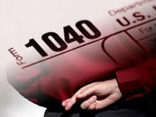
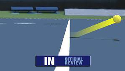
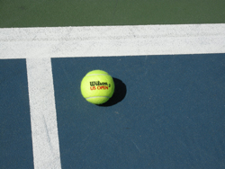
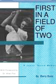

# How to Deal with Bad Calls

### By Barry Buss

**"Mistakes" are the same as cheating in taxes, but is that true in
tennis?**

Tax day is upon us again. If you, like myself, have found yourself
starting to fill out the1040 form at 1040 p.m. on the night before the
deadline, you know that attention to detail can be compromised. Honest
mistakes are acceptable in most spheres of life, but not when it comes
to our beloved internal revenue service. In that case mistakes are
considered cheating.

Is the same thing true in tennis? The guys and girls who play on TV are
fortunate not have to make their own line calls. Now, they even have
shot spot to make sure there are no mistakes. Cheating in pro tennis
might involve performance enhancing drugs, but line calls are not in the
equation.

Unfortunately we in the larger tennis community are not strangers to
inaccurate line calls. Most of us play by the rules. But everyone has
encountered opponents who make performance enhancing line calls.

But unlike errors on your tax return, there is often an acceptable
explanation for bad calls. Bad calls can be deliberate cheating. But
they can also be honest mistakes.

**The pros have shot spot, but club players have to fall back on their own resources.**

If you receive a bad call, and everyone has this experience more often
than they wish, it's important to try to figure out which explanation
applies. A mistake, or a deliberate mistake. There are very different
strategies to employ depending on the answer.

Of course, it's not the actual loss of the point that hurts you when
you get a bad call. It's what it does to your mind, especially if you
happen to be the kind of person who files a scrupulously accurate tax
return. It drives you crazy to think that another player would stoop to
cheating in tennis. But was the call deliberate?

This is the determination you need to try to make. Everyone occasionally
makes a wrong call. Players see the ball wrong and they make a good
faith mistake. But other players use bad calls as a regular strategy -
"if you can't beat them cheat them." This type of player knows that
the effect of this strategy will go far beyond the loss of the point
itself.

**It's your reaction to the call, not the call itself, that hurts you in tennis.**

There is a simple test to determine whether your opponent is in fact
consciously cheating. This is to give him or her an easy way out. If you
throw an instant tantrum, there is little chance of your opponent
reversing his call.

Instead make an honest appeal to your opponent's reasonable side. Try
to stay calm, don't raise your voice too loud, and in a non-aggressive
tone, state "I think you might have made a mistake on that one...I had
a good look and the ball looked good."

How he or she responds will be telling. If your opponent engages you in
dialogue and shows you enough respect to respond to you, he or she is
likely not prone to cheating and may have made an honest mistake.

In this case give them the benefit of the doubt, even if they don't
offer to reverse the call. Remember, you cannot win the argument. It is
their call.

If the opponent offers to replay the point, take it! It's technically
against the rules but it is a clear declaration of fairness by your
opponent.

**All the rules, plus the code, truly a friend at court.**

Take the reprieve from injustice if you can get it, unless there is a
roving official closely observing the interaction. If both players are
committed to fairness, you will probably both feel better and a
potential source of tension can be dispelled.

But the main thing, whatever happens, keep your cool. It's just one
point. In a close match you are going to lose half of them anyway as
Allen Fox as astutely pointed out. ([link](The%20Diabolical%20Scoring%20System%20of%20Tennis.docx).) So
don't sacrifice more precious points stewing over an iffy call.

And what if your opponent doesn't engage? If he opponent ignores you,
there is a very good chance that you are getting jobbed.

In this case, don't just walk away. Ask again, but this time in a
louder and firmer voice. The point here is not to start a confrontation,
but just to let your opponent know that you are aware of what is going
on. He or she may or may not respond, and probably won't. But you have
made your point. You can then back off, for now.

Certain types of responses can also indicate what is going on. If your
opponent uses your first name when making his call "John, I think you
just missed that one" you are definitely being jobbed. The first name
usage is an attempt to feign friendship and congeniality. Your opponent
is trying to back you off with friendliness, and make you doubt
yourself. Don't fall for it.

**In a tournament match you can usually get an official.**

If you are playing in a USTA officiated match, now is the time to seek
help. If you want to be certain you can wait for it to happen again, but
usually, this is something you can feel by instinct from the opponent's
tone and demeanor. And in the overwhelming percentage of cases, the
presence of a linesman will eliminate the problem if not necessarily the
attitude.

When you know your opponent is cheating (as opposed to having made a
mistake) it is even more important to keep your inner peace. It's
crucial to your ability to keep playing well and overcome the situation.
If your head starts to race, you're in deep trouble.

If your opponent acts as if he has been falsely accused, or continues to
be overly polite, or becomes surly, don't let any of that affect you.
Recognize it for what it is, an act and a tactic.

Now what about the worst case scenario - no official available and your
opponent continues to cheat?

**Sometimes you have to get in touch with your inner lawyer.**

Here are some other viable strategies for keeping your sanity and
minimizing the damage to the score and to your psyche.

The first is to get in touch with your inner attorney. If your opponent
does not call the ball immediately and firmly, you have room to debate.
Pounce on the hesitation.

If he ponders or the call is not immediately certain, the rules say he
must give the benefit of the doubt to the opponent. Any use of
non-certain terms such as "I think" or "I'm pretty sure" are
openings for debate.

**The Rules**

In these situations to really protect yourself, you need to be aware of
the rules that cheaters often try to work around.

Did you know for example that any player can call a let in singles or in
doubles? Cheaters when receiving serve have been known to hit returns
for "winners" when the serve was really a let, and then insist it is
their call. Not true.

**Was that ball really a let?**

Did you know that in the case of a double bounce the player must make
the call on himself? Your opponent can't tell you it's his point
because the ball bounced twice on your side unless you agree.

Did you know that you can ask a player to take down a towel if he has
wedged it in the fence right in your site line?

The USTA has a book you can order called Friend at the Court. ([link](http://www.ustashop.com/product_p/usp11b02.htm).) It contains not
only the rules, but the code that governs unofficiated matches. It can
provide you with the ammunition to settle these or almost any other of
the countless tricky situations that can come up in matches.

**Inner Brat**

And finally, here is another strategy if you have the temperament to
pull it off. Get in touch with your inner brat. Shame and humiliation
can influence your opponent to play more fairly. Here is my personal
favorite, which has been effective for me many times.

Grab a ball and place it just inside the line so your opponent can see.
Point at the ball and ask him this "How far in do I have to it my shots
so that you won't call them out? Could you show me so I know exactly
where to aim, as apparently the lines are out on your side."

**Ask the opponent to specify how far in is really in on his side of the net.**

That may be an extreme solution that is required on occasion to fight
back and keep your mental balance. In general, though I believe if you
put fairness out, you'll fairness back.

Histrionics are one thing, but never fight fire with fire by cheating
back. Carry yourself with dignity and it will likely come back to you.
Winning and losing is not a referendum on who you are as a person, but
cheating is. Winning tastes a lot better when it is achieved the proper
way.

Finally, if you find yourself overwhelmed during such match situations,
I am available for a cheating lesson. We will play points and I will
cheat in every imaginable way, and help you practice how to respond
quickly and authoritatively.

So many contests are decided by the slimmest of margins. I can show you
how not to get taken advantage of in your future matches. I'm in the
greater Los Angeles area, but if you aren't I might come if you send me
a plane ticket.

                                                                                                                                                compelling inside look at the psychological
realities of competitive junior tennis. Growing up
in Boston and Los Angeles, Barry become a national
ranked junior player at the age of 12, and a member
of the elite USTA Junior Davis Cup Team. As a
college player he tied the legendary Jimmy Connors
22 match win streak at UCLA. Barry is an independent
teaching pro working in the greater Los Angeles.
areas. You can read his blog by Clicking Here. Or
contact him directly at: barrybuss1964@yahoo.com.

**First in a Field of Two: A Junior Tennis Memoir**

An elite American junior, a legendary college player, Barry Buss tells an

archetypal story about success, failure, pain, and recovery. Written with

direct and graceful literary style, this book exposes the secret family

dysfunction that so often accompanies amazing tennis success. Compelling

and essential for anyone interested in understanding the realities and the

horrifying potential dangers in junior tournament tennis. With a forward

by Dr. Allen Fox.

[ to

Order!](http://www.amazon.com/First-Field-Two-Junior-Tennis/dp/1467558370)
