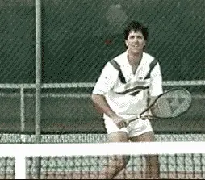
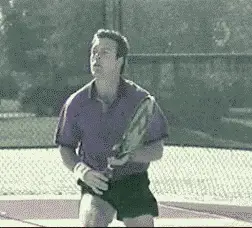
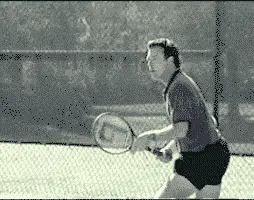
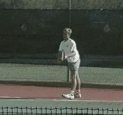
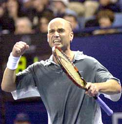
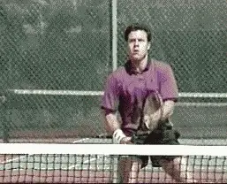

# In your mind's eyes

**In your mind's eyes**

**Jim Loehr**

**Can you "see" yourself playing the tennis you really want to play?**

What would it be like to play perfect tennis? Imagine your strokes are
flowing, you're hitting shot combinations and aggressive winners,
serving and returning with great accuracy, rhythm, and power.

You play a great match and beat a tough opponent, someone you've never
beaten before, or maybe someone you didn't think you belonged with on
the court.

"Impossible!" you say. "I just can't see it." "I'm simply not
capable of beating that person or playing that well."

**In a literal sense, that may be true. Why? Because our mental
pictures, what we can and cannot see ourselves do inside our own minds,
determines what we are capable of doing on a tennis
court.**

**[To play your best tennis, to stay positive, to motivate yourself
through feelings of optimism and confidence, requires that you have the
capacity to see or visualize yourself doing exactly those
things.]**

**Through visualization you can eliminate negative images and replace them with positive ones.**

To achieve your Ideal Performance State, you have to imagine that you
can! But the truth is, many players are limited in their ability to do
this by negative and self-defeating images.

Your potential in tennis is directly tied to the specific ability to see
yourself perform inside your own mind. Negative images set limits on
performance, limits that may be, in fact, below your real potential.

Through visualization, you can learn to eliminate this barrier. To do
it, you must eliminate the negative images that are holding you back and
replace them with positive ones. Images of yourself playing the kind of
tennis you are really capable of playing.

A study of elite athletes across all sports found that 85% believed
visualization was a critical part of their competitive success. In
tennis, this has included many of the greatest players of all time, from
Pancho Gonzales to Chris Evert to John McEnroe.

How can you, as a competitive or recreational player, make this process
work so that you visualize the way great athletes do?

**Develop clear visual models of the strokes you want to develop.**

First, let's define what we mean by visualization more precisely.
Visualization is the systematic creation or the strengthening of
positive mental images. It could also be called positive image
programming. It is learning to communicate information to your body in a
different medium, in imagery, rather than words.

Research has shown the human mind cannot distinguish physical activity
from the experience of vividly imagining it. Imagery is the connecting
link between the mind and body in athletic performance. Regular practice
can improve your ability to communicate this information to your muscles
under competitive pressure.

To begin developing your visualization routines, create a quiet, relaxed
environment where you're not likely to be distracted. You may want to
play soft music or dim the lights. Relax by doing a few slow deep
breaths. This will calm your mind and allow you to focus on the images.

Now, close your eyes and go deep inside your mind's eye. To maximize
the effectiveness of the process, see yourself in your mind's eye as if
you were actually performing on the court. In your mind's eye, become
the performer, and as you see yourself executing the movements mentally,
try to feel what is happening.

**Visualize the attacking sequences you want to play.**

You visualization training should be done in short periods of about five
minutes at a time-it's not the duration, it's how relaxed and
concentrated you are that makes the difference.

Pick your imagery for each session from some of the suggestions below,
and work with your coach to create your own as well. Specifically, there
are three areas in which visualization can make a major impact on your
ability to perform.

The first is in the technical area, the technical execution of strokes.
Every player should develop clear visual models of the stroke patterns
they want to develop. If you are working to develop a new stroke or shot
to correct a long-term bad habit, you should begin by seeing yourself
executing easy, basic patterns as if you were actually hitting slowly
with a ball machine or a practice partner.

Focus on key technical details, full shoulder turns on ground strokes.
Contact in front on your volleys or whatever you or your coach or
teaching pro are working to change.

Two. Shot combinations and winning points. For example, if you're
trying to develop an attacking style, create images of yourself
approaching the net in a variety of situations.

Visualize staying positive and
continuing to fight in
difficult or unexpected
competitive circumstances.

If you play from the backcourt, follow the same process. Learn to
visualize sequences of how you win points. For example, working the ball
crosscourt to the open court, or passing an opponent who comes in off
both sides.

And three. The third area in which visualization training can be
critical is your improvement in dealing with difficult mental or
emotional situations on the court. One of the worst things that can
happen to a player is to be surprised on the court by an unexpected
problem or obstacle. Through visualization, you can practice dealing
with practically any situation before it occurs in competition.

For example, visualize yourself staying positive and fighting when you
go down a break or a set. If you normally get angry or negative, imagine
those feelings coming up. Now, practice letting them go and replacing
them with a positive counter message, such as: "I can do it." "Come
on, let's go." "Fight!"

**Visualize yourself remaining in your ideal performance state in the
face of all those obstacles.**

Other typical situations to rehearse, making a series of
uncharacteristic errors, or missing one or more easy balls at critical
times.

**Another important area. How to react when you get a bad call.
Rehearse staying calm and focused, verifying the call from your
opponent, and, if necessary, requesting a
linesman.**

**Go on the court believing you really can win.**

Review any other specific incidents in your matches when you have broken
down mentally. Now, rehearse the same situations reacting positively in
overcoming the challenge that they posed.

Finally, put all these situations together. Visualize a few games, a
set, or even an entire match against an opponent you want to beat.
Determine the specific patterns you need to win. Rehearse them mentally
until you can see and feel yourself executing them perfectly.

Now you can go on the court believing you really can win. Research has
shown that the combination of this kind of mental, and physical,
practice is far more effective in producing change than physical
practice alone.

Making visualization a regular part of your work can be the key to
taking your game to the next level.

Combined with the other techniques I have shared in this series of
articles, visualization provides the final tool you need to become the
mentally tough player you really want to be.

                                                                                                                                          himself who still competes nationally in USTA
events, Jim created the field of Mental
Toughness training with his revolutionary study
of elite pro players. He has been one of the
most influential voices in tennis and tennis
coaching for over 30 years, and is the author of
multiple best selling books. He has expanded his
influence far beyond sports with the creation of
the Human Performance Institute where he and his
staff have worked with hundreds of leaders in
business, law enforcement, and military special
forces. For the last decade he has also directed
an academy for junior players helping young
people learn what winning in life really means.
