# Love the Battle-Pathways to Performing

**Love the Battle: Pathways to Performing**

**Under Pressure**

**Jim Loehr**

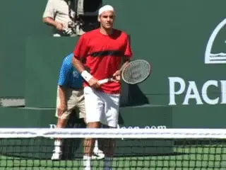

**Great competitors love the process, not just the winning.**

It's easy to love winning. Great competitors learn to love the process.
They learn to extend themselves and to find great fulfillment in the
feeling that they gave their best, put themselves on the line, and moved
closer to the control that they are seeking within themselves.

This mastery of myself, this battle of me against myself, these are not
just competitive skills in sport. These are life skills.

Pete Sampras says in his recent autobiography that he had a mantra
coming up as a young player: "It's all a learning experience." His
focus was never on results. He was never ranked at the top nationally in
the juniors. Yet he went on to win the most Grand Slam titles in
history. Why?

"It was always about playing the right way, trying to develop a game
that would hold up throughout my career."

"It wasn't about winning. **[By putting pressure on myself to develop
a great game, I had less preessure to win. That helped me enjoy the game
and develop my maximum] [potential."]**

These two articles on Tennisplayer have been prepared to help you, no
matter what your level, achieve your fullest potential as well, the same
as Pete Sampras and all the other great champions in our sport. They
contain what I believe are the most important understandings and
technologies from my nearly 20 years of work with high-level performers.

**Emotion Runs the Show**

Perhaps the most important statement I could make about competition is
that emotion runs the show. For a long time in my career, I thought the
key to actualizing talent and skill in the context of pressure was
mental, that something that we would think or visualize would have an
impact on whether or not we could come to terms with the fullest measure
of our talent and skill. And that was true. I fully understood how
important the mental was, but I wasn't sure exactly how it all
connected.

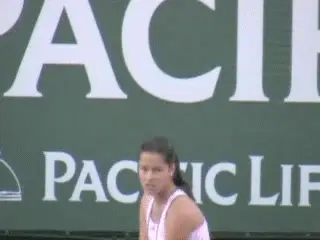

**Emotions, positive and negative, are what run the show.**

**As my career evolved, I began to realize that the real center stage
phenomenon was really not mental, but it was
emotional.** The reason that the mental is
important, the reason that we become very disciplined in how we're
thinking, in our rituals, in how we're visualizing is the impact on
emotion.

The more I began to study the evolution of this emotional concept, the
more I began to realize that what we really have to do as athletes is to
mobilize emotion. We have to mobilize the emotions which empower us,
which bring to life our talent and skill. Whatever we can do to make
that happen, be it physical or be it mental, we must do that.

We know, for instance, that how we're feeling emotionally affects our
thinking. It affects the images we carry in our head. We also know that
the way in which we think and what we are visualizing and the images
we're carrying at any particular time affect what we're experiencing
emotionally.

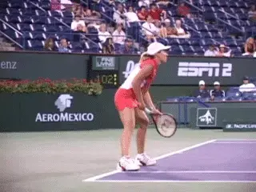

**What we do physically is critical to how we feel.**

**It works both ways. We know, for instance, that if you become
fatigued, if you're not physically fit enough, if you are literally
running out of gas physically, your muscles run out of glycogen.
Suddenly you can't fight the battle anymore.**

**When you become fatigued, you are forced into emotional submission.
The emotions that empower you are gone. When you don't properly sleep,
when you don't intake food and water properly, the effects are dramatic
in terms of your motivation, your sense of passion, your sense of
eagerness. So we should look at this as a continuum. There are a wide
diversity of things, some mental, some physical, that affect
emotion.**

**There is a reason that emotions are so important in the context of
competition. This is because emotions reflect what is happening at a
very deep physiological basis within the person.**

**A very important concept in my development of the notion of peak
performance and the concept of being the very best that you can be was
the idea of the ideal performance state.** ([link](http://www.tennisplayer.net/members/mentalgame/jim_loehr/jim_loehr_ideal_performance_state_images/jim_loehr_ideal_performance_state.html).)
Perhaps the single most important understanding that I came to in the
early part of my career was that the same feelings and emotions are
present when athletes perform at their best, be it baseball, basketball,
football, tennis, whatever.

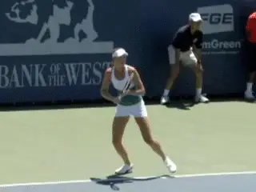

**Our best tennis occurs within a specific feeling climate.**

When we access our talent and skill it invariably occurs within a very
specific, very unique feeling climate. These feelings and emotions
reflect a very delicate balance of physiological harmony, wherein talent
and potential become fulfilled. And therein lies the understanding of
the critical role emotion plays.

**Feelings and emotions are simply body talk**.
**They represent the internal eyes and ears of the body. Feelings and
emotions are analogous to the instrument gauges on a high-performance
race car. They reflect what's going on at a much deeper
level.**

And the body is always talking. Feelings and emotions are always
surfacing in one form or another, and deeply felt emotions have a real
physiological, biochemical basis. Fear, anger, joy, challenge, disgust
have their own unique physiological and biochemical profile.

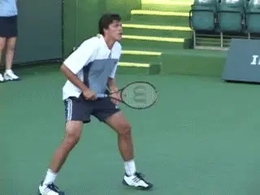

**Feelings are the body talking and the body is always talking.**

The most exciting information that's occurring today in the context of
unlocking this mystery between the mind and the body is in the context
of emotions. Emotions are really the result of millions of tiny
messenger molecules that are stimulating receptors on the surface of all
the cells in our body, whether it be neurons, nerve cells, or muscle
cells, and even immune cells.

Every cell in our body contains millions of receptors, like satellite
dishes pointed outward ready to receive critical information that is
necessary, that is really communicated via these feelings and emotions.
**A messenger molecule**, for instance, that's
released in the brain that's associated with positive emotion and joy
is called **endorphin.** And we know that over
200 varieties of that single chemical by itself is found in nearly every
system of the body, including the immune system and the endocrine
system--200 varieties!

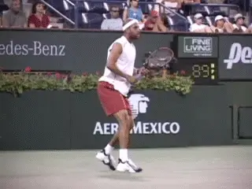

**Emotions affect how we perceive what is happening.**

But the most important thing is that **emotions have a real connection
to the physiology of the body**. **And there is a
peak emotional state that empowers the body, that bring to life one's
talent and skill. If we can summon those emotions, if we can summon
those feelings in the context of competition, that's when we achieve
greatness.**

Emotion affects the way we perceive an event. The way we are feeling
right now powerfully influences the way we see things. And vice versa.

We also know that the way you think about an event, a bad line call, the
way you think about an opponent, the way you think about winning and
losing, is going to affect the kind of emotional climate, the feelings
that surface. The chemistry that lies behind those feelings is being
activated in a very specific way precisely because you're thinking
about something in a specific way.

We've got to become very disciplined and really understand how
important it is to think and to visualize with great discipline when it
comes to competition, because we really are moving our chemistry when we
do so.

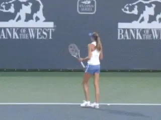

**Discipline--for example, serving and return rituals--are key to
controlling your chemistry during competition.**

I want to spend a little bit of time talking about the emotional state
that empowers us, this ideal of performance state, because this is
really the basis of becoming a super-achiever at anything in life, be it
in sport, in business, being able to take exams in school. If you can
create this wonderful state of physiological harmony that we access and
summon through mobilizing specific emotions and feelings within
ourselves, we have control. That's what makes a peak performer.

Now, what are those feelings? First of all you feel very relaxed in your
muscles. And that reflects a physiological state of arousal. You're
very loose. There's a profound sense of calmness. Even though you're
in the center of a hurricane, things are going wild, things are crazy,
all kinds of stuff happening, there's a real sense of calmness that
you're able to handle what's happening. It's almost like time slows
down.

This, we know, is related to a particular frequency of brain oscillation
called EEG, electroencephalographic activity. And when you get the right
arousal sequence going and the right emotions are mobilized, you will
get this profound sense of calmness. You need to recognize the calmness
that's associated with your best performances.

There's a sense of almost no pressure, even though it's the most
pressurized time in a match, when you've got it wired right, you don't
have the sense of pressure or of nerves. You have a sense of freedom
from that feeling. You have a tremendous sense of challenge. You love
being there.

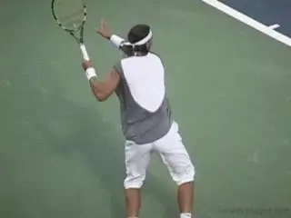

**To stay relaxed you have to want to be there under pressure.**

**Choking**

Fear--the word we use is choking--completely short circuits this,
whatever talents and whatever skill you have. And that's why athletes
are so reluctant to even talk about choking, because it robs you of your
talent and skill. And it's an emotional response. All those little
receptor sites are picking up the hormones associated with the fear
response.

**The particular chemical that is apparently the most detrimental is
what we call cortisol.** And as those cortisol
levels escalate in an exaggerated way, feelings of dread, feeling of
just uncomfortableness, muscles get tight. It causes a whole host of
other messengers to be sent to mobilize the body to flee, to run away.
And we can't do that in sport. We've got to fight. We've got to get
out there and stay relaxed and calm and loving what we're doing.

That means you've got to think about what's happening to you in a very
special way. You cannot be threatened. You've got to think about it in
the context of "I want to be here," "I need this situation," "I
hate pushers, but I need to play this match," "I need to go out there
in the context of competition, and whatever you throw at me, I can
handle, and in fact, I love it. Is this great stress or what?"

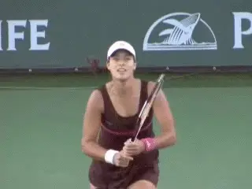

**When you body is in balance you can feel an overwhelming sense of
optimism.**

You perform best when you feel a tremendous sense of energy, when
you're mobilized with energy. The life just comes to the surface. You
don't feel flat. You don't feel dead. And that reflects a wonderful
balance physiologically and biochemically in the body. When you this
positive form of energy, it's a very healthy sign. It's a sign the
body is in a very good state of balance. There's an overwhelming sense
of optimism and positivism.

In almost every case, when an athlete maxes out, it comes in the context
of a positive emotional climate. Positive emotions represent a state of
balance.

**It's true that negative emotions serve a purpose. They're like the
instrument gauges on a race car that suggest that the fuel is low. It
happens sometimes when you're hungry, you're agitated, you're
overstressed, all kinds of things can trigger it.**

**And that's a very important understanding, that negative emotions
serve a very real purpose--they indicate issues that must be
addressed.** **But we have to learn to put aside
negative emotion in the context of competition. Then later we can
address the needs those negative emotions reflect. Positive emotion
simply reflects a healthy, normal state of operation internally. There
aren't any great needs that are being expressed.**

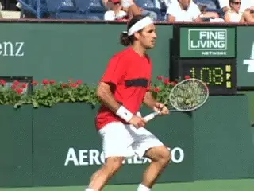

**Positive emotion reflects a normal internal state of operation.**

**Actors and Actresses**

In a sense, we have to become wonderful actors and actresses. It's
similar to the way the actors and actresses have to summon chemistry on
stage to make something that's artificial and phony becomes real, so
that they can make it believable on stage.

There's a sense of great fun and enjoyment in the context of competing
at your best, because there's a unique chemistry to fun. When you're
having fun, you're relaxed, you're focused, everything is like flowing
inside you. Fun has its own unique biochemical, physiological basis.
There's a sense of effortlessness. It's like your mind and your body
are working so wonderfully together, that it's easy, even though
you're working so hard, you're pushing yourself to the max.

There's also a sense of spontaneity. You don't have to think it
through. You're not forcing the performance. It's like coming from
deep within you. You're just very spontaneous when you play.

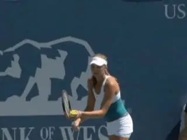

**We have to become great actors to summon the emotions that lead to
confidence.**

This again reflects a special state of neurological balance. There are
right and left hemispheres in your brain. The state I am talking about
is much more right brain. This is opposed to the left brain approach
which is very analytical and very linear, thinking it through in verbal
language.

What I am talking about comes much more from a sense of feel, from the
creative side of you. And this reflects a sense of trust, a letting go,
letting happen what will happen, and just kind of knowing that it's all
deep inside you. It's a special kind of arousal.

There's a sense of confidence. Confidence is perhaps the single most
powerful emotion that we can talk about, because in the chemistry of
confidence brings protection from nerves, brings a wonderful sense of
"I can" to any arena and causes you to be aggressive, causes you to
take the ball early and not to play it safe and cause you to play to
win.

**It's like, "I can do this" and that feeling frees you. The
muscles remain more relaxed. You're in a situation you feel you can
handle. We have to figure out how to get this feeling of confidence to
surface, because confidence is a tremendously empowering
emotion.**

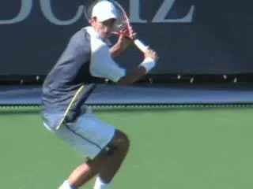

**Feelings of anger and defeat are always there, just waiting to grab
you.**

**Negative Emotions Abound**

Disempowering emotions are everywhere. The feeling of hopelessness and
helplessness and the feeling of low energy and the feeling of "I just
can't," the feelings of disgust and of anger and self-defeatism and so
forth. Those emotions are just waiting out there to grab you.

The ideal performance state doesn't happen just by jumping out of bed.
It's something you've got to work at and understand, You've got to
learn how thinking and visualizing and how the way in which we carry our
bodies, how we walk, how we move our facial muscles can in a real sense
stimulate or block the emotions we need in the context of battle.

When you take a look at the whole constellation of feelings and emotions
that are represented in this ideal performance state, you begin to
realize it is a very unique emotional response. And this is the response
that we're trying to summon when we face adversity and crisis, when
there are all kinds of things that are being thrown at us.

Our forehands or backhands suddenly evaporate, we get cheated, we
suddenly end up playing far below our potential. We make big mistakes
and people in the crowd make comments that infuriate us. Suddenly we
have to bring ourselves right back to this very, very special state of
emotion, to trigger this very unique emotional response.

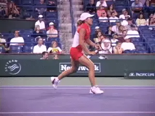

**You must be able to summon the right kinds of emotion under
adversity.**

When things are going badly, when the world turns us against us, this is
where the skill is brought to the forefront. We have so much that we put
into our practicing and all of the logging of hours and hours. We get
into competition and we have expectations.

We want to do well. We want to do the very, very best that we possibly
can, and suddenly we find ourselves against all kinds of odds, things
are not working. And for us at that point, to be able to continue to
summon the kind of emotions which may eventually break us free, that
struggle is perhaps the greatest struggle in competitive sport. That is
the greatest battle--if we can handle the emotions.

What we're really saying is we're dealing with this remarkable
physiology of ours in a wonderfully sensitive way, that we're beginning
to understand how feelings and emotions are simply windows to
understanding our physiology.

**Yes, an outside event can cause us to be angry, we can understand
that. But we also can think in ways, we can act in ways which will cause
that anger to dissipate, to go away. Or perhaps we can avoid even
triggering that feeling of anger in the first place. Perhaps we can keep
the emotional balance, the physiological balance that will ultimately
give us our dreams in sport, to perform to the very best of whatever
we're capable of doing.**

                                                                                                                                                              himself who still competes nationally in USTA
events, Jim created the field of Mental
Toughness training with his revolutionary study
of elite pro players. He has been one of the
most influential voices in tennis and tennis
coaching for over 30 years, and is the author of
multiple best selling books. He has expanded his
influence far beyond sports with the creation of
the Human Performance Institute where he and his
staff have worked with hundreds of leaders in
business, law enforcement, and military special
forces. For the last decade he has also directed
an academy for junior players helping young
people learn what winning in life really means.
