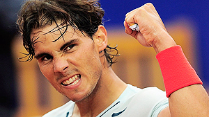

# Match Preparation

### Frank Giampaolo

------------------------------------------------------------------------

**Proper match preparation is a key to becoming a tennis warrior.**

There is a thin line between competitive success and failure. A poor
start, an initial lack of focus, or a bout of wavering confidence can
cause a seemingly winnable match to quickly slip away.

When players know that they are fully prepared for an upcoming event,
their belief in their chances of winning sky rockets. Readiness breeds
confidence.

For players to achieve consistently positive match results, their
preparation must include ritualistic routines. A player who is ready for
battle creates an impenetrable wall that keeps all the human elements of
fear away.

Players who disregard prematch rituals often unknowingly start a
downward spiral that results in a loss. Lack of self-discipline leads to
self-doubt, a condition that fuels nervousness and then causes a lack of
confidence and low self-esteem. These negative forces have a way of
fostering a lack of self-control on match day.

This article is intended to help players of all levels find this state
of readiness and transform from a normal person into a tennis warrior.
It focuses on three critical areas of preparation: pre match
visualization, opponent scouting, and pre match physical preparation.

**What are the internal processes to create your own game face?**

**Prematch Visualization and Imagery**

Getting geared up for a match involves a type of self-hypnosis. Players
use a series of internal processes to spur a metamorphosis to put on
their game faces.

A powerful yet overlooked technique that can make a huge contribution to
this process is the use of visualization and imagery. For prematch
visualization, a player should put aside 20 minutes before the match to
mentally rehearse the performance goals for the upcoming competition.

What we think about often dictates what we create. Responding correctly
to those challenges is a learned behavior that is enhanced by positive
imagery and visualization training.

The player starts this self-hypnosis by seeking out a quiet area away
from other competitors and distractions. With closed eyes, the player
takes several deep, relaxing breaths. He then creates a vivid mental
image of numerous tasks being performed successfully.

This enhances the player's mental awareness and builds his confidence.
The player should mentally rerun the \"movie\" several times to
reinforce the thoughts. This visual experience actually trains a player
to perform the skills imagined.

**Perfectly executed strokes are one area for pre-match visualization.**

Pre-match visualization topics are unlimited, but can include some or
all of the following: Perfectly executed primary and secondary strokes.
Groups of perfectly executed proactive patterns. Successful patterns of
play against different styles of opponents. Between-point rituals.
Protocols for dealing with common emotional issues.

Performing nightly visualization also maximizes efficiency come match
day. As a player goes to sleep, the conscious, analytical, judgmental
side of the brain shuts down while the creative, dream-state side of the
brain awakens. This near subconscious state is when the positive images
are deeply ingrained.

Visualization works best when players are very peaceful, such as when
they are falling asleep, waking up, or simply relaxing in their rooms.
Positive visualization produces an optimistic outlook that can change
negative attitudes, boost moods, and decrease toxic levels of
competitive stress.

**Opponent Profiling**

Observing an upcoming opponent can provide a player with information for
strategic preparation that can make the difference in a match.

Areas to scout include the following:

Stroke strengths and weaknesses (advanced players should also consider
an opponent's preferred strike zones). Primary style of play. Preferred
serve and return patterns, especially on mega points. Dominant
short-ball options.

**Opponent profiling should include style of play.**

Movement, agility, and stamina. Frustration tolerance. Focus. Emotional
stability.

Opponent profiling should continue from the pre-match phase, through the
actual match, and sometimes even into the post-match, where clues about
a player's personality and emotions sometimes become apparent.

**Match-Day Stretching**

For all-around better performance as well as a decrease in potential
injury, players should incorporate a regular stretching routine.

Part 1 is an active warm-up to elevate core body temperature. A light
jog with slow windmill arm rotations, jogging in place, or light jump
roping will work wonders to loosen up the body.

Part 2 is a progression into a series of dynamic stretches:
tennis-specific movements that -incorporate fluid mobility. Suggestions
include shoulder circles, trunk rotations, and squats and lunges for the
lower body.

**Prematch Warm-Up Rituals**

Sam Sumyk, coach of Victoria Azarenka, says, \"Vika's prematch routine
consistently includes a 45-minute stretching ritual followed by a
45-minute hitting routine.\"

While the pros have more of an opportunity to indulge their prematch
routines, players who routinely warm up both their primary and secondary
strokes have a major advantage in tightly contested matches.

Grooving forehands and backhands before a match is important, but a
first-set tiebreak can often come down to a player executing a winning
swinging volley or topspin lob. Confidently performing such shots at
crunch time without hesitation stems from properly warming them up
before the match.

Players who neglect their secondary strokes have a very different
mind-set when faced with the same exact situation. Instead of
instinctively moving forward to hit the swing volley, they hesitate and
are caught thinking, I don't remember the last time I hit one of these.

**Calming Prematch Run**

As match time draws near, players often experience a wave of
apprehension and nervousness. This fear triggers an overflow of
adrenaline; it's time for fight or flight.

When players feel this sensation, they can burn off their performance
anxiety by going for a short run. Players can also do this the night
before the match, in the morning before they hit a ball in warm-up, and
again just before the match begins.

Raising the body's core temperature warms up the muscle groups and
relaxes the tension as it burns off the excess adrenaline, calming the
mind and helping the player begin the match in a peak performance state.

The prematch run or runs should be customized based on the player's
fitness level and emotional stability, as well as the amount of time
available. If a player is not the overly nervous type, she may only need
to take a short run before the match.

