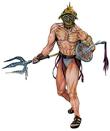
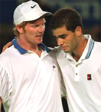
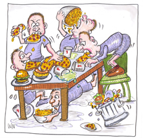
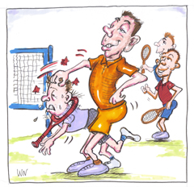
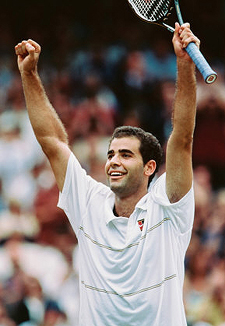
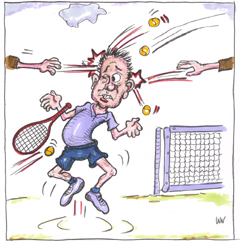
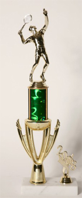

# The Anti-Champions

### Keith Hayes

--

--

**What was the real price of staying an undefeated Gladiator?**

I was 42, and I'd never had an undefeated season in anything. It
didn't bother me, though, because I'd played on a number of teams
before and had followed enough other teams, both pro and amateur, to
understand how elusive an undefeated season can be.

And yet, in my second year as a high school tennis coach, I found myself
at the helm of a team - we'll call them the "Gladiators" - that stood
an excellent chance of winning every match.

In our pre-season meeting, I expressed this to the team, and declared
that our goal for the year was to be undefeated, a perfect twelve for
twelve. A proud silence filled the room.

The returning players paused to consider our 9-3 record the previous
year. They knew that the defending champions would be losing several key
players while the Gladiators remained more or less intact.

While I'd publicly expressed my goal of being undefeated, I had also
set several personal goals that I didn't articulate in the meeting. The
previous season, the Gladiators won a lot of matches and had fun, but I
was never quite satisfied, because of the general looseness of things.

Players didn't respond to my instructions like I'd hoped they would,
and they didn't work as hard in practice as I'd wanted them to work. I
was also disappointed in the Gladiators' overall lack of team spirit.
The top players got along well enough, but they were cliquey and
dismissive of their lower-ranked teammates.

In my second year, I resolved, things would be different; if we were
going to be champions - and I was confident that we would be champions -
we needed to behave like champions.

**Pre-Season**

It's worth noting that the Gladiators' league is perennially one of
the weakest in their section. I had grown up playing in an affluent and
highly competitive region, and I knew what top level high school tennis
looked like.

Although the Gladiators stood an excellent chance of being undefeated, I
understood that we were big fish in a small pond. The Gladiators were a
spirited but unpolished bunch who, when they won, won mainly on
scrappiness.

The Gladiators established their own distinct values and etiquette. For
some reason, they took a strange pride in the fact that they didn't
practice. "Mike," for example, our number one player, enjoyed boasting
that he hadn't picked up a racket since the previous season; he liked
the idea that he could beat people without practicing and he wanted
others to know it.

**The ideal high school tennis uniform?**

As for clothing, players made a point of looking grungy and irreverent.
They wore old Led Zeppelin shirts, sunglasses, skate shoes - anything
but proper tennis attire. The Gladiators were rowdy and undisciplined,
and they seemed to relish their status as the outlaws, the "rock &
roll" team of our league.

During my first season with the Gladiators, a part of me admittedly had
a soft spot for the rock & roll thing. I was brand new at coaching, and
I had plenty other things to worry about - basics, like filling out all
the right paperwork, determining a fair starting lineup, making sure no
one got hurt, missed the bus, or whatever.

Another important distinction between the first and second season, was
that we came in second place in first year, but we had no real chance of
winning the title. This year, if we performed as I expected us to, the
Gladiators would be up front and center and I didn't want us sending
the same message to our opponents.

I felt it was disrespectful, and that other teams would notice it a lot
more if we came in first - especially if we were undefeated. Finally -
and I didn't know how to say this to the Gladiators - I remembered what
a poser I was myself back in high school; I remembered how I'd
squandered so much of my own tennis talent by trying to be cool instead
of putting in the hard work it took to be good. I didn't want the
Gladiators to feel the same regret that I would feel later.

During the preseason, it rained a lot. One day, instead of practice, I
decided to show the Gladiators a documentary on Pete Sampras - arguably
the greatest player ever, and a consummate champion. Not only did I want
the team to see Sampras play, but I wanted them to hear him talk and see
how he carried himself.

When I introduced the DVD, I was disappointed, though hardly amazed, to
discover that most of the Gladiators didn't know who Sampras was - and
that, as usual, they took a certain pride in it.

About halfway through the program, just as we were learning about the
premature death of Sampras' close friend and coach, Tim Gullikson, I
asked Mike, "Brad," and "Jeff" - my top three players - to leave the
room because they couldn't stop laughing.

Later that afternoon, I called them all at their homes and explained
that I expected more from them, that they needed to set an example and a
tone for the whole team. They all claimed to understand and they
promised to try harder.

The next time it rained, I let the rest of the team go home and I forced
Mike, Brad, and Jeff to watch the Sampras DVD from the beginning in
silence. In hindsight this may not have been my finest hour, but I
wanted to make a point.

*Video demonstration — the original video for this article was hosted on TennisPlayer.net.*
**When Sampras lost his coach, the Gladiators laughed.**

**Off to the Races**

Once the season started, the Gladiators cruised through their first
several matches. Despite our success, our habit of leaving a contest
before it was over also bothered me. Players who finished their matches
early - usually the top players - would quietly slip away without
watching their teammates play and I felt it was rude.

Another of our trademarks, whether at home or away, was to devour the
complimentary snacks like animals and then leave trash all over the
ground. I often spoke to the team about these subjects - and enforced
the rules whenever I saw them being violated - but I could never put a
definite end to the behavior.

Meanwhile, few Gladiators saw the point in practicing, let alone
practicing hard, when we could beat our opponents anyway. Brad, our
number two player and self-appointed team spokesman, would regularly
suggest days off or "fun" days whenever we won a match - no matter how
weak our opponent may have been.

When I explained to the Gladiators that great teams, real champions,
never let up, they didn't buy it. When I reminded them that the
competition at the next level, the sectional championships, would be
much tougher if we managed to win our league, they didn't buy that,
either.

Meanwhile, when he wasn't lobbying for a day off, Brad would publicly
challenge every new idea or policy I set forth, either insisting on an
explanation or telling the team why it wouldn't work. Brad was getting
on my nerves, but I knew we couldn't be undefeated without him; once
you bench one of your top players, everyone ranked below him moves up a
spot on the ladder and has to play a tougher opponent. If I wanted to
remain undefeated, I just needed to keep Brad in check.

The worst problem, though, was that certain players - can you guess
which ones? - would pick on others.

One player, "Charlie," had a learning disability and teammates would
toss balls at him when he wasn't looking - not to injure him, just to
bother him. Charlie was a nice kid and a surprisingly competent player,
but he had the maturity level and reasoning skills of a third grader.

Of course, Charlie would get angry and overreact when the other players
threw balls at him, which only delighted them and encouraged them to
throw more. I spoke with the team several times about this and told them
that if I ever caught anyone throwing balls at Charlie, I'd send him
home. When Charlie wasn't at practice, I bluntly reminded the team that
it was both weak and cowardly to pick on Charlie.

During these talks, players would nod and agree philosophically, but the
behavior never stopped. Another player, "Joe," was simply a little
different. He was a nice kid, but players outwardly marginalized him.
They'd ignore him when he spoke, they wouldn't let him play on their
court, and they'd make jokes about him without caring whether he heard
them or not.

Once, I asked Brad and Jeff to help me carry some equipment. As we
walked to the storage room, Brad noticed that Joe, who regularly
volunteered to help, had decided to join us.

When Joe tried to make conversation, Brad turned to him and scoffed,
"Why are you walking with us?"

**Devouring snacks and leaving the trash--a Gladiator trademark**.

Embarrassed, Joe retreated. I started to say something, but I decided
just to let it go. It seemed like every recent exchange I had with Brad
turned into a clash of wills, so I pretended not to hear his comment.
Throughout all this, I gave regular speeches on the importance of
teamwork, but, for some reason, the more I said, the worse things got.

6 Wins 0 Losses

The second half of the season was tense. I found myself yelling at the
Gladiators with astonishing consistency, and, despite my regular
speeches and admonitions, the same old problems kept coming up. Hadn't
I made myself clear?

Although we had beaten all six of the other teams in our league, several
of our matches had been close - and I reminded the Gladiators that these
teams would all be eager to play us again. My sights were still set on
an undefeated season, and I knew we'd have to step things up if we
wanted to maintain our perfect record. If we could just hold it
together, our goal was still within reach.

Like most coaches, I don't like excuses, and one of my worst blowouts
with the Gladiators took place when a player who lost a match told me he
had "had a bad day." I advised him that (a) he still could've won,
and (b) suggesting that he played poorly was an insult to his opponent.
Later, I sat the whole team down and explained to them that "I had a
bad day" is probably the worst and most common excuse in sports.

**Bullying--some I witnessed and probably plenty I did not.**

"Why?" Brad protested. "Sometimes you really do have a bad day! What
if it's true?!"

"Of course it's true," I countered. "We all have bad days, but that
doesn't mean we have to lose. Once you agree to step onto the court,
you're telling your opponent you're ready to play. After that, you
need to accept whatever happens. If you can't to do that, then don't
step on the court."

"Okay, fine," said another player, "but if it's true that I had a
bad day, then it's still not an excuse!"

"Yes, it is," I sighed. "The trouble is that we start telling
ourselves what a bad day we're having before the match is even over.
Instead of problem solving, like champions do, we start preparing to
lose." I reminded the Gladiators of the Pete Sampras DVD. I asked them
if they ever heard Sampras making excuses, and of course they hadn't.

I reminded them of the moment when something popped in Sampras' leg in
the second round of Wimbledon. I reminded them that Sampras had a bubble
of fluid the size of a golf ball in his shin, but he went on to win the
match anyway. I reminded them that Sampras' shin hurt so much that he
couldn't practice between matches, and that he had five more matches
left to play against the world's toughest competition. I reminded them
that Sampras would require a cortizone shot every time he played - the
effects of which would wear off halfway through each match - and that he
still went on to win his record-breaking seventh Wimbledon title that
year.

"Yeah," argued one of the more annoying Gladiators, "but it's not
really fair to compare us to Pete Sampras."

What, I wondered, was wrong with these kids? I had never met a young
athlete in any sport who didn't want to be like the best player in the
world. Don't young basketball players try to copy Kobe Bryant? Young
baseball players copy Derek Jeter and young golfers want to be Tiger
Woods, but all the Gladiators wanted was to cling to their excuses.

**Was it fair to compare the Gladiators to Sampras?**

**9 Win 0 Losses**

Toward the end of the season, "Peter," one of our starting doubles
players, quit the team because Mike, our number one player, had been
harassing him both verbally and physically. To be honest, I had seen
some of this harrassment in its gentler forms over the course of the
season, but I had pretty much written it off as "guy stuff."

Mike was a tall kid and a loudmouth; he was cocky, highly intelligent,
very funny when he wanted to be, and he pretty much messed with
everyone. Most players either ignored Mike's constant goading or they
threw it right back at him. Apparently, Peter was more sensitive and
Mike must've smelled blood. The worst harrassing, of course, took place
behind my back, and I had no idea how dire the situation was until it
was too late.

Mike was a tough nut. Inside, I knew I should've either kicked him off
of the team or, at the very least, benched him for what he'd done to
Peter. Two things stood in my way: One, we only had three matches left
to play in the regular season and our perfect record would certainly
have been over without Mike.

By this time - just three matches to go - the perfect season was no
longer a goal for me but an obsession, and I wasn't about to let it
slip away because of Mike's immaturity. Two, I secretly liked Mike.
Unlike Brad, our number two player, Mike always gave his best once he
got on the tennis court.

He was no champion in the Pete Sampras sense, but he was a fighter, and,
in that respect, at least, I liked the example he set. Also, he was one
of the brightest English students I had ever taught, and when I didn't
want to choke him for being such a knucklehead, I appreciated his keen
insights in class.

The principal and I had long, tense discussions with Mike, and he
justified his behavior by claiming that Peter was "annoying." We tried
every angle to get Mike to apologize for what he'd done, but he'd only
agree - grudgingly - to leave Peter alone.

**Another favorite pastime: tossing balls at a teammate with a disability.**

Despite our best efforts, the principal and I failed to reconcile the
two, and Peter never returned to the team. Throughout the ordeal, the
principal and I spoke regularly with Peter, both formally and
informally. I emailed Peter and encouraged him to rejoin the team, but
he adamantly refused to play for the Gladiators as long as Mike remained
a member.

While Mike infuriated me with his stubbornness, I was quickly losing
patience with Peter, too. He sent me one long email that, in
semi-threatening, pseudo legalistic language, demanded Mike's head on a
platter. He likened the situation to a harassment case in the adult
world. While Mike had undeniably harassed Peter, the principal and I
agreed strongly that this was not the adult world, and that high school
is a place where kids like Mike can make stupid mistakes - so long as
they don't continue - without it ruining their lives.

Though Mike had started the thing, Peter chose to be a martyr,
sacrificing his high school tennis career against everyone's advice -
including his own father's. The principal and I discussed both players
at length, and in the end we weren't sure who infuriated us more.

Peter quit for good, I got a sick feeling whenever I saw him around
campus, a foul mixture of guilt and resentment. Right around this time,
the school notified me that I would be laid off from my English teaching
position the coming fall. Of course, this was bad news, but it wasn't
the team's business.

Besides, the Gladiators still had a job to do. At this point, I had
pretty much had it with the whole thing, anyway, and I figured that if I
got nothing else out of this lousy job, I could at least go out
undefeated for the first time in my life.

With only two matches left to play, I spoke with the Gladiators on the
team bus about the magnitude of an undefeated season. I reminded them of
how rare an undefeated season is, how I'd never experienced one in my
lifetime, and how, if the Gladiators should indeed remain undefeated, it
might not happen again in their lives, either.

No one said much in response to my little pep talk, but my sense was
that the Gladiators didn't care nearly as much about being undefeated
as I did - at least not in the same way. Looking back, how could they
care as much? The prize was already well within their grasp, and they
were only in their teens.

12 Wins 0 Losses

A few days later we achieved our goal, a perfect 12-0 record. I had led
the Gladiators to an undefeated county title but I had spent two thirds
of the season fighting with them over behavioral issues. One player had
quit the team and most of the others hated me. We had won a
championship, but we weren't really champions. Twelve straight
victories later, we didn't even know what a champion was.

The icing on the cake came on the afternoon of the sectional playoffs.
Joe, who had finally clawed his way into the starting lineup (thanks, in
part, to Peter's abrupt departure), was late for the team bus. I was
eager to see Joe play, and I told the driver to wait for another five
minutes in the hopes that Joe would catch up. No one, including Joe's
classmates earlier that day, had reminded Joe about our departure time,
nor did anyone offer to try and find him.

**Was an undefeated season a comprehensive waste?**

Instead, Brad, our self-appointed team spokesman, made a suggestion so
that one of his "cool" friends could play instead: "Let's hurry up
and leave before Joe gets here."

At that point, all I wanted to do was get off the bus and let the
Gladiators fend for themselves. If I weren't legally bound to stay with
the team, I would've driven myself home right then. At the very least,
I should've sent Brad home and let him miss the championships, but I
guess I was too numb by that time to act with any authority. Either way,
if I wasn't sure before Brad's comment, I now knew beyond a doubt that
our "perfect" season had been a comprehensive waste.

It should come as no shock that we lost 7-0 in the first round of the
tournament. What did we expect? We were seeded 15th out of 16 teams, we
didn't take it seriously, and we never believed we'd win, anyway.

Now, all we had left was the team party, which I dreaded almost more
than anything. I didn't want to go, and most of the team didn't want
to see me, either. Forcing a smile, I handed out awards and certificates
while the Gladiators pretended to smile back. They gave me a card.

Today, my biggest regret is for the players who came to practice all
season but never got to play an official match because they didn't
crack the starting line-up. In my folly - in my fantasy - I had
convinced myself that these poor kids would be happy just to have been a
part of an undefeated team.

Despite losing my teaching position, the coaching job was still mine if
I wanted it. Of course, I turned it down. And yet, thanks to my 12-0
record with the Gladiators, I quickly found another coaching job and a
chance to redeem myself.

**Aftermath**

I suppose it's a blessing that all this happened so early in my
coaching career, because I'll never allow myself to make the same
mistakes again. Winning is nice, but it can also be a sham. With the
Gladiators, I let it seduce me, and my obsession ended up hurting
everyone involved. We won every match, but I felt cheap and slimy when
the whole thing was over.

Today, I have no qualms about benching a player or even kicking him off
of the team if necessary. If I had benched the top two Gladiators, we
would have lost half of our matches that year but the rest of the team
would have thanked me. I would have escaped with my sanity, and I could
have built a solid tennis program for the future instead of nearly
destroying one. **In the end, a coach can't just ask for teamwork and
cooperation, he has to demand it.**

Under my successor, the Gladiators had another undefeated season, and
I'm told that not much had changed - except that the rest of the league
resented them more than ever. I can't help but wonder if the subsequent
coach tried to rein in the Gladiators and failed, or if he just let them
do their thing. Of course, a second straight undefeated season rendered
my accomplishment more or less obsolete, along with whatever values or
concepts I had tried to instill in the team.

It's safe to assume that I, along with that season, will soon be
forgotten - either obscured by subsequent victories or intentionally
blocked out by those who experienced it. Do me a favor and save this
story. Without it, my rare and elusive undefeated season will disappear
forever.

USPTA instructor Keith Hayes attended Pepperdine

Tennis Coach Allen Fox and became a counselor at his

summer tennis camps, beginning a tennis teaching

career - and a friendship with Allen - that has

continued ever since. After Pepperdine, Keith went to

work in the San Francisco Bay Area advertising and

graphic design industries. Later he also became an

English teacher. As head coach of the Marin Catholic

High School women's tennis team, Keith won

back-to-back Division II North Coast Section titles

in 2008 and 2009. When he's not teaching tennis,

Keith continues to work as a freelance writer and

designer. In addition to Tennisplayer.net, his

stories have also appeared in TENNIS magazine.
