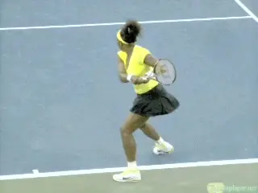
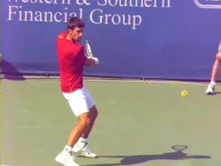
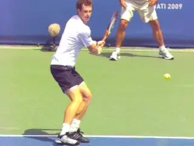

# The Inside Out Backhand

### John Sherwood

**The inside out backhand - valuable when you are pulled wide to recover
on the forehand.**

In modern tennis the inside out forehand is widely understood as a
foundational shot. It allows pros to hit a higher percentage off shots
off their more explosive wing, and also to finish points by hitting by
forehands inside in, as opposed to the riskier and usually less powerful
backhand down the line. And the benefits of learning to play from the
inside forehand position are usually even greater at lower levels.

But most players have never even heard the reverse term: inside out
backhand. Does the inside out backhand exist? And if so, how is used?

**The reality is that the inside out backhand is equally critical in
developing a complete tactical game. This applies at the pro level and
every other level as well.**

It is rarely a weapon compared to the inside out forehand but is
fundamental in three situations. These are: recovering from a wide
forehand, returning in the deuce court, and attacking short mid court
balls. It should be practiced regularly in all three variations to
develop confidence in the same fashion as every other shot.

**Recovery**

When players are pulled wide to the forehand side and can't recover
fully, the inside out backhand allows them to defend or counterattack,
by returning on the crosscourt diagonal - the same as if they were
responding with a crosscourt forehand.

Rather than get caught off balance trying to move far enough around the
ball to hit a forehand, the player, as Serena shows above, has time to
set up for a high-level technical backhand. Note that the shoulders are
turned in the direction of the inside out shot line, and the legs are
set up and coiled in Serena's preferred semi open stance.

**The primary return in the deuce court is the inside out backhand.**

**Deuce Court Return**

When the opponent serves to the backhand in the deuce court, the basic
return is inside out. Yet this is rarely understood by lower-level
players.

The inside out diagonal is the safest play to start the point and allows
the returner to establish court position in the center of the server's
attacking angles.

**Returning down the line on the backhand side in the deuce court can
make you instantly vulnerable to your opponent's
crosscourt.** A deep inside out return forces the
server to respond with a rally ball or attack down the line.

**Going down the line means changing the direction of the shot diagonal,
and usually, hitting into** **a shorter court. These factors add
difficulty.**

Watch the key components in Novak's return. Like Serena the shoulders
are turned so they are virtually parallel to the shot direction.

Watch the path of the racket head as it moves toward contact. It is
perfectly aligned with the diagonal of the outgoing ball. These are
powerful images for any player to model.

It may appear that the contact is "later" on the inside out backhand
than on other backhands. In reality, the whole body is turned toward the
target and the relative relationship of the contact point to the body is
fundamentally similar.

**The third inside out backhand is on short balls left near the center
of the court.**

**Short Balls**

The third basic use of the inside out backhand is when the opponent
leaves the ball short near the center of the court. Here there are two
options.

The player can hit inside out toward the forehand corner and attempt to
finish the point when the court is open. The other option is to use the
inside out backhand as an approach.

Unlike the return or the recovery examples above, the inside out
backhand in this case is often hit with a neutral or slightly closed
stance. Again, a key is aligning the body with the shot.

Watch how Andy Murray turns his shoulders to the inside out target line.
The step with the front foot is along a line parallel to a line across
his torso, again, the shot diagonal.

The turn and the step naturally align the racket face with the outgoing
ball direction. Since the inside out backhand is not as natural or
comfortable as the inside out forehand, players need to allocate
specific time to practice in all 3 variations.

Practicing the inside out backhand will help you prepare for every
situation that you may be presented within today's game. Matches can be
won or lost on just a few key points. Sooner or later the inside out
backhand will be the shot that makes the difference.

                                                                                                                                               Chatham, N.J. John played varsity Division 1
tennis at the University of Toledo and has guided
hundreds of junior players into college and the
pro ranks, including traveling extensively on the
ITF junior and WTA professional circuits. He is a
USPTA Elite Professional and a graduate of the
USTA High Performance Coaching Program. You can
contact John directly at <J1Sherwood@aol.com>
