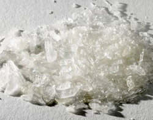

# Thoughts on Andre Agassi

### By Allen Fox, Ph.D.

------------------------------------------------------------------------

**What are we to make of Andre's recent revelations about his drug use
10 years ago?**

The following is my take on the recent revelations of Andre Agassi in
his new book, based on his People Magazine article, his 60 Minutes
interview with Katie Couric, and the reactions in the tennis community
to these revelations.

I am surprised, even shocked, at the recriminations of Agassi coming
from such tennis luminaries as Roger Federer, Rafael Nadal, and Martina
Navratilova. I would have thought they would be more understanding and
compassionate to a man who has brought such wide and excellent publicity
to the sport over so many years\--not to mention the increases this has
meant to their collective pocketbooks. Instead, Andre's honest
revelations, belated though they may be, have brought down a firestorm
of criticism on his head.

But let's review Andre's case. Agassi had an over-the-top, driven, and
even scary (to a young child) father who forced him to play tennis to
the exclusion of education and the other normal accompaniments of
childhood. He didn't play tennis because he liked it. He played because
he was afraid of his father's reaction if he didn't.

He became, to the exclusion of any hint of normalcy, little more than a
semi-robotic tennis machine - obedient to the wishes and expectations of
others while repressing any personal desires to be otherwise. After
awhile, I'm not sure Andre himself knew who he was or what he really
wanted.

  -------------------------------------------------------------------------------------------------------------------------------------------------------------------------
                                           
  -------------------------------------------------------------------------------------------------------------------------------------------------------------------------
                                               **Shocking recriminations from champions such as Federer, Nadal, Navratilova**.

  -------------------------------------------------------------------------------------------------------------------------------------------------------------------------

From his comments it sounds as if he vacillated between mindless
rebellion and trying so hard to please that he would do or say anything
to meet the expectations of his father and the tennis public. All the
while he was feeling guilty about his own fake facade, resentful and
hateful about being forced to play a game he didn't like, pressured to
win, and depressed over losing matches that he tanked or lost through
emotional conflict. No wonder he was confused!

I did not like or respect Agassi throughout most of his early tennis
career. It bothered me to see him tank so often and fritter away his
physical gifts and talents. It bothered me even more to hear him give
interviews afterwards that sounded completely false. He would praise his
opponent for having played a \"great\" match because, it seemed to me,
he had read or heard somewhere that this was what a good sportsman
should say. It always sounded phony and contrived, like something he
thought would make him look good but that didn't have an ounce of
reality to it.

|  |
| --- |
|  |
|  |
| **The drug revelations are only a small part of the story in Andre's fascinating autobiography.** |

Later in his career, when he took on Brad Gilbert as a coach in his late
20's, he made a change, and I became more personally positive about
him. He started to train, try, and play smarter. He also seemed like a
gentle soul and a nice guy, so I started to pull for him and was happy
for his successes.

To the public he changed his persona from that of a hip rebel into a
kind of wise old elder statesman of tennis - courageous, admirable and
charitable - over the hill, but training to an extreme and playing
through pain and injury. It was a rather nice story and good for tennis.

Still, I had slight qualms about his public statements. He always said
the \"right\" things, but they were a little too right. There was still
a feeling of falseness about them. It still sounded like he was posing
as the person he thought he was expected to be rather than the person he
actually was. He was now just better at it. And without the tanking
issues of his early years, it rang better.

But I could never quite buy it. I suspected that he had been faking it
for so long that he didn't know who he really was anyway. His
personality felt to me like one of those movie sets where the main
street consists merely of house facings, held up behind by slanted 2 by
4's.

Agassi's recent writings and interviews are different. For the first
time they have the ring of truth and honesty. For whatever reasons -
maybe religion, a happy marriage, maturity, self-analysis,
catharsis\--whatever - he seems to be willing to toss public
expectations aside and tell it like it is, warts and all.

  --------------------------------------------------------------------
    ** to hear Andre talk more about the issues around his
                   drug use and why he went public.**

  --------------------------------------------------------------------

Maybe the years of faking it to appear good, making up pretty stories,
and trying to be something he wasn't got exhausting. Maybe all his
charitable works have finally made him think better of himself, or maybe
he has just realized that it's a waste of energy resenting the game
that has given him so much and to which he has given so much. In any
case, he has been baring his soul, admitting his past dishonesty, and,
as far as I can see, has become a more sympathetic person than ever. If
he's fooling people, and I don't think he is, then he has certainly
fooled me.

Now to the most controversial revelation \--the drug thing. He says that
for a period of time he was heavily into crystal-meth. His stated
reasons were to escape a game and a life he didn't like; to act upon
hia rebellious resentment and his own self-loathing.

He resented tennis and his father for forcing him to play it. He said he
knew he was hurting himself physically and shortening his career and he
was, in a sense, glad of it. This sounds to me as if Andre is being as
honest as he can, and it is totally credible. To me it is a sad state of
affairs when a person who should be on top of the world is in so much
pain that he is happy to hurt himself and/or escape a life he hates and
resents through harmful drugs.

Admitting his drug use and previous dishonesty certainly doesn't make
him look good. It hardly flatters his image as a great and courageous
competitor and philanthropist, and it doesn't increase his commercial
value as a spokesperson for products. He loses more financially than he
gains, so I don't buy the contention that he came out with all this
information damaging to his image just to sell books.

  -------------------------------------------------------------------------------------------------------------------------------------------------------------------
  
  -------------------------------------------------------------------------------------------------------------------------------------------------------------------
  **Crystal meth: does this look like a performance enhancing drug?**

  -------------------------------------------------------------------------------------------------------------------------------------------------------------------

Moreover and importantly, he used a recreational drug that did not help
his tennis - quite the opposite. There is no evidence that he used
performance-enhancing drugs like steroids, and his honesty in admitting
using crystal-meth does not make it more likely that he did. I feel that
if he had been using performance-enhancing drugs and trying to hide it,
he would not have brought up his drug use at all.

Some people contend that he looked awfully strong and \"may\" have used
steroids, and they are down on him for that. But there is, to my
knowledge, no proof that he has used performance-enhancing drugs. So
simply waving the possibility around and further downgrading him on
supposition is beyond unfair.

Of course, he \"may\" have used such drugs. But of course so \"may\"
have Federer, Nadal, or Djokovic. Or why not Rod Laver, Arthur Ashe, or
me, for that matter? In fact, Agassi \"may\" have gone out at night and
murdered people. But assertions of \"maybes\" without proof are
obviously very silly.

  --------------------------------------------------------------------------------------------------------------------------------------------------------------------------
  
  --------------------------------------------------------------------------------------------------------------------------------------------------------------------------
  **Sergi Bruguera: Olympic medalist or whiner?**

  --------------------------------------------------------------------------------------------------------------------------------------------------------------------------

This brings me to the condemnations coming from some of his fellow
competitors. What are their gripes? That his drug use helped Agassi beat
them? Sergi Bruguera, with a couple of French Championships to his
credit, wants Andre to give him the gold medal he won in the 1996
Olympics after beating him in the final. Andre won 6-2, 6-3, 6-1, while
hurting himself with crystal-meth. How exactly did his drug use affect
the outcome in Bruguera's favor? If Bruguera wanted that gold medal so
badly he should simply have beaten Agassi when he had the chance. Now he
just sounds like a whiner.

The criticism by Nadal and Federer is even more surprising. At the
professional level there is usually a form of brotherhood among players.
(There always used to be, anyway.) They don't all love each other when
they are on court and trying to beat each other's brains out. But they
all go through the same years of tears, sweat, and pain developing their
games and working their ways up in the tournament ranks. So only
\"players\" really know what this isolated little life is like. When
they are done trying to beat each other there is usually some shared
respect, even some small bit of love among them.

This makes some of the criticisms and lack of empathy harder to
understand. Was Agassi a bad guy in the day? Did he hurt these guys in
ways we don't know? I find it hard to believe.

In any case, Andy Roddick, Justin Gimelstob, and, of course, the
ever-loyal Brad Gilbert, have (properly, in my opinion) voiced their
support for Andre, and I hope the warm encouragement from his friends
and the catharsis of his book finally give this gentle, confused,
tortured, but ultimately benevolent guy some of the peace he is seeking.

**This article is excerpted from Allen's new book, Tennis: Winning the
Mental Match, which will be available at the end of 2010 on Amazon and
on Allen's new website,
[www.allenfoxtennis.net](http://www.allenfoxtennis.net).**

Read More From Allen!

Visit him at [www.allenfoxtennis.net](http://www.allenfoxtennis.net)

 

|  | Tennis is mentally the most difficult sport due to it's personal nature which makes winning and losing feel more |
|  | important than they are. In this new book, Allen offers his proven solutions to problems such as choking, reducing |
|  | stress, finishing matches, and developing confidence. Based on a life time of high level play and coaching success, |
|  | it's a must for all competitive players. |
|  |  |
|  | [ to |
|  | Order](http://www.amazon.com/Tennis-Winning-Mental-Allen-Fox/dp/0615407765/ref=sr_1_1?ie=UTF8&qid=1336083459&sr=8-1). |

|  | eminently preferable to losing. In his new book, The |
|  | Winner's Mind, Allen lays out an original step-by-step |
|  | plan for succeeding at any of life's endeavors, based on |
|  | his first hand and very personal observations of the |
|  | careers of both world-class tennis players and successful |
|  | businessman. The bottom line is that even if you are not a |
|  | born champion\--and only a tiny percentage of us are\--you |
|  | can still use the success strategies of champions to tilt |
|  | the odds in your favor. Writing with brutal honesty and dry |
|  | humor, Fox lays out the common mental characteristics of |
|  | winners in sports and in life. He explains the critical |
|  | role of intellect over emotion. He analyzes the struggle |
|  | between ambition and fear and the insidious and pervasive |
|  | fear of failure that undermines so many of us. He then |
|  | outline how to confront and overcome these fears in your |
|  | life and career, even when they are initially subconscious. |
|  | Must reading from one of the great thinkers in tennis, and |
|  | a Renaissance Man in life. [ to |
|  | Order](http://www.tennis-warehouse.com/descpage-MIND.html). |
|  |  |
|  | To purchase this book you can also send a check for \$17.95 |
|  | to Allen Fox, 1120 Inverness Place, San Luis Obispo, CA. |
|  | 93401. The price includes shipping. |

|  | insightful analysts in modern tennis. A top 10 |
|  | American player from the glory days before Open |
|  | tennis, Fox played many of the legendary greats, among |
|  | them Roy Emerson, Rod Laver, Stan Smith, and Arthur |
|  | Ashe. At Pepperdine he developed the men's tennis |
|  | program into an elite contender for national titles, |
|  | and gave Brad Gilbert the insights that became the |
|  | foundation for \"Winning Ugly\". His book Think to Win |
|  | is a modern classic. He has also starred in a series |
|  | of acclaimed videos, including Pro Secrets of Match |
|  | Play and Allen Fox's Ultimate Tennis Lesson. |
|  |  |
|  |  |

------------------------------------------------------------------------
