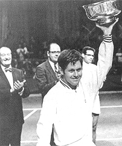
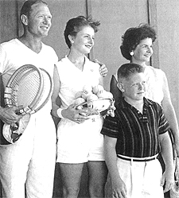
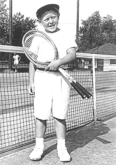
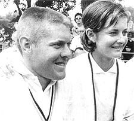
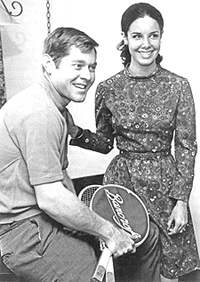
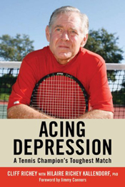

# Thoughts on Cliff Richey's Acing Depression 

### Thoughts on Cliff Richey's Acing Depression 

### By Allen Fox, Ph.D.

**Cliff Richey: a champion with secrets fellow players never
suspected.**

I thought Andre Agassi's book was unusually honest and insightful, but
it pales in comparison to Cliff Richey's new book, "Acing
Depression."

Cliff was a near-great player in the 1970's, achieving the #1 ranking
in the United States, reaching the late rounds but not winning most of
the Slams. Still he notched victories over the best players of his day -
Laver, Newcombe, Connors, Smith, Rosewall, Roche, Emerson, etc. Cliff
and his sister, Nancy, were the only brother and sister pair to ever be
ranked #1 in the United States!

In the book, Cliff describes his own mental processes as he developed
into a tennis champion and later, as he was stricken with debilitating
depression in an incredibly lucid, insightful, and vivid manner. The
reader is able to virtually ride along inside Richey's mind during the
triumphs and horrors of his past 50 years. His descriptions are so
genuine you can almost feel what he felt. And you can certainly see what
he saw.

**Winning and Suffering**

The book traces his development as a tennis player in an
achievement-obsessed, driven, close-knit, and loving but somewhat
isolated and paranoid family atmosphere. He notes his family background
of mental disorder and describes in horrific detail the thoughts and
feelings he had as he competed as a world-class tennis player while
slipping inexorably into a nightmare of anxiety, self-absorption,
self-loathing, and despair.

**Cliff with his father, the teaching pro and college coach George Richey, his sister and mom.**

He details the appalling effects his illness had on his family and on
the other people around him. It provides a stark example of the chasm
that can exist between celebrity/apparent success and happiness.

The book is particularly interesting to me because I spent time with
Cliff on the tour but knew nothing of his personal problems. I was on
the tour with Cliff in the 1960's and considered him to be a friend,
not bosom-buddies, but a bright and funny guy who I always enjoyed
spending a bit of time with.

In those days the tour was a close group - a little fraternity of
players - who played most of the same tournaments, practiced together,
and shared experiences. We were all friends.

At the time I was older and on the downswing of my tennis career (such
as it was in the pre-open era) while Cliff, seven years younger, was on
the upswing of his. In 1966 we even traveled together to South America
on the Davis Cup team and to Australia for tournaments.

**Cliff just after winning his first tournament.**

Yet, until reading the book, I had no idea that Cliff had these tortured
mental issues or that he viewed his fellow competitors more as potential
enemies than friends.

Maybe I should have suspected this when I was scheduled to play him in
the second round of the US Open, as I recall, in about 1970. I had been
off the tour for a couple of years due to a chronic hip injury. I was
only playing part-time and was not really a competitive threat to Cliff,
at least in my mind.

The evening before our match we both happened to be leaving the West
Side Tennis Club at the same time returning to our hotel. In those days
we took the subway back to Manhattan (the West Side Tennis Club was on
Long Island), and the station was a few blocks away at the other side of
the little town of Forest Hills.

As we left the club I was looking forward to a pleasant walk, a chat,
and a few laughs with my old friend, of whom I hadn't seen much since I
left the tour. Instead, Cliff crossed to the other side of the street
and wouldn't speak to me. That was a hint of what was going on. But I
just thought it was funny (ha, ha funny) and put it down to Cliff being
a bit of an over-the-top competitor.

**Cliff and Nancy were close--and the only brother and sister to both make #1 in the U.S.**

Cliff was extraordinarily smart, driven, and funny. Although Cliff had
never even graduated from high school, I liked him a lot because he was
obviously very smart and had a bizarre sense of humor.

In those days much of the charm of the tour was the players themselves,
and we particularly appreciated the odd characters, of which there were
many, and Cliff was definitely one.

The major objective was to have fun, and we didn't take the
idiosyncrasies too seriously. We used them for the laughs, and we all
played into them somewhat. Everyone had nicknames. Cliff was "the
Bull" because of his single-minded, tenacious, ferocious
competitiveness. I was "Commander Of the Space Patrol," so named by
the Aussies because of my alleged scientific take on everything.

**Cliff with his wife Mickey who stayed with him for 40 years before their recent divorce.**

In fact no one was ever called by their given names. Tony Roche was
"Rochie," Pancho Gonzales was "Gorgo," Rod Laver was "Rocket,"
Chuck McKinley was "Stump," etc. So I thought "the Bull" was just
playing into his tour persona when he walked across the street before
our match at Forest Hills. It wasn't until I read his book that I
realized that I actually was the enemy. I thought he was kidding!

Cliff's superior intelligence comes out in his book in his constant use
of tennis analogies to highlight his points about depression. (I say
this because as a general rule in making meaningful analogies it's
necessary to have a broad perspective in order to identify common
characteristics.)

**The book is a great tennis read but also informative about treatment.**

Cliff continually compares his strategies in fighting depression to his
strategies in winning tennis matches. He is very analytic. He describes
exactly the mental qualities that made him a superior tennis player -
how he practiced, how he developed a better serve, how he adapted his
strategies against certain players to turn losses into wins, and how he
could stick with an idea for solving a problem even if there was no
improvement in the short term - and applied them to fighting and beating
depression.

In his book, we learn a great deal about depression and its cures. Cliff
gives us useful information about the relationship of depression to
obsessive-compulsive personality characteristics, anxiety, and stress.
He talks about how depression starts gradually and how significant
changes in one's life can make it accelerate. He goes into detail about
therapies - counseling and drugs - and tells what it feels like to take
various anti-depressants and receive counseling and how well each of
them works. All this interspersed with fascinating stories about big
matches and life on the tennis tour - just a great read. ([link](http://www.amazon.com/Acing-Depression-Tennis-Champions-Toughest/dp/0942257669/ref=sr_1_1?ie=UTF8&s=books&qid=1273533016&sr=8-1)
to order.)

Read More From Allen!

Visit him at [www.allenfoxtennis.net](http://www.allenfoxtennis.net)

Winning the Mental Match Dr. Allen Fox

Tennis is mentally the most difficult sport due to it's personal nature which makes winning and losing feel more

important than they are. In this new book, Allen offers his proven solutions to problems such as choking, reducing

stress, finishing matches, and developing confidence. Based on a life time of high level play and coaching success,

it's a must for all competitive players.

[ to

Order](http://www.amazon.com/Tennis-Winning-Mental-Allen-Fox/dp/0615407765/ref=sr_1_1?ie=UTF8&qid=1336083459&sr=8-1).

Winning may not be everything, but Dr. Allen Fox points out

eminently preferable to losing. In his new book, The

Winner's Mind, Allen lays out an original step-by-step

plan for succeeding at any of life's endeavors, based on

his first hand and very personal observations of the

careers of both world-class tennis players and successful

businessman. The bottom line is that even if you are not a

born champion--and only a tiny percentage of us are--you

can still use the success strategies of champions to tilt

the odds in your favor. Writing with brutal honesty and dry

humor, Fox lays out the common mental characteristics of

winners in sports and in life. He explains the critical

role of intellect over emotion. He analyzes the struggle

between ambition and fear and the insidious and pervasive

fear of failure that undermines so many of us. He then

outline how to confront and overcome these fears in your

life and career, even when they are initially subconscious.

Must reading from one of the great thinkers in tennis, and

a Renaissance Man in life. [ to

Order](http://www.tennis-warehouse.com/descpage-MIND.html).

To purchase this book you can also send a check for $17.95

to Allen Fox, 1120 Inverness Place, San Luis Obispo, CA.

93401. The price includes shipping.

Allen Fox PhD is a former world class player, a coach,

insightful analysts in modern tennis. A top 10

American player from the glory days before Open

tennis, Fox played many of the legendary greats, among

them Roy Emerson, Rod Laver, Stan Smith, and Arthur

Ashe. At Pepperdine he developed the men's tennis

program into an elite contender for national titles,

and gave Brad Gilbert the insights that became the

foundation for "Winning Ugly". His book Think to Win

is a modern classic. He has also starred in a series

of acclaimed videos, including Pro Secrets of Match

Play and Allen Fox's Ultimate Tennis Lesson.
