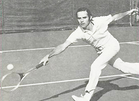
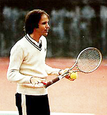
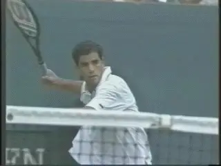
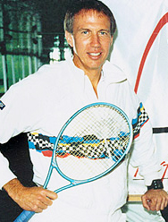
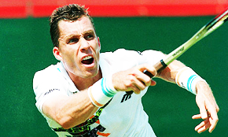

# Titans of Tennis in the Zone

### Damien Lafont

**Tim Gallwey: Harvard tennis captain, voyager to India, creator of the
Inner Game.**

In my last article I outlined multiple components of the so-called
"Zone" as described by top researchers and athletes in many sports.
The article showed that there probably is no one Zone and the experience
and the process of reaching it can be different for different performers
([link](https://www.tennisplayer.net/members/mentalgame/damien_lafont/does_zone_exist/)).

Now in this article let's narrow our focus and discuss the fundamental
pillars of our understanding of the zone in tennis. These are the work
of Tim Gallwey and the work of Dr. Jim Loehr.

We'll see that, as for other sports, each describes different aspects
of the zone and different ways of approaching it. But, interestingly,
together they provide an approach that fuses point play with the other
critical aspects that surround it.

Tim Gallwey's seminal best selling book, The Inner Game of Tennis,
published 40 years ago in 1974, virtually created the field of mental
game studies in sport. His work is sometimes summarized as a simple
message "watch the ball." However the work and its implications are
far broader, complex, and powerful.

Gallwey was captain of the tennis team at Harvard in the 1960s. In 1971
he went to India and spent time in an ashram, where he learned the power
of calming his mind through meditation. When he returned to the United
States, he began to apply his experiences there to tennis. At first he
called his method "Yoga Tennis," but he renamed his approach "the
Inner Game" as he worked on the book of that title.

**Gallwey transformed Yoga Tennis into the Inner Game.**

Gallwey wrote a second tennis book and then books on the inner game in
golf and skiing. Their success showed that there were widespread
problems and frustrations in sport that were not being addressed at the
time by conventional coaching methods.

In tennis, Gallwey advocated watching the path of the ball moving back
and forth between the players as a means of developing "relaxed
concentration." By practicing this, players could become truly focused
without "trying."

This focus on the ball resulted in spontaneous moments of excellence
with the mind seemingly one with the body. There was perfect movement
without effort.

Gallwey believed many players had had this experienced on their own and
felt it was simply random or "lucky." In fact, they were experiencing
brief moments in the Zone. The goal of the "Inner Game" practice was
to increase the frequency and duration of those moments, when the
subconscious takes over and the shots seemed to flow naturally.

But to Gallwey playing "unconsciously" did not mean playing without
being conscious of anything--quite the opposite. Paradoxically it meant
having a greater awareness of the surroundings--of the opponent and the
ball. What was missing was concern about technical issues, or thoughts
about the past, or about what could happen in the future.

The challenge was silencing thoughts in the mind and eliminating or
reducing calculating, judging, and worrying. The goal was fewer
expectations, less regret, less effort to control. Because trying to
control the Zone meant losing it immediately.

Beyond ball focus, the key to the zone was understanding the
relationship between what Gallwey called the "two selves." Every
player brought both selves with him to the court and the disruptive
dialogue between them blocked entrance to the zone.

**The Inner Game: watching the ball impacts the entire experience of
playing.**

Self 1, the conscious mind, constantly gave instructions on how to play.
But this interfered with Self 2 which actually played the game at a
deeper level than words.

Tim Gallwey's belief was that to play at your peak, you needed to
silence Self 1 and release Self 2. This involved three steps.

First, observing your current behavior and internal dialogue but without
judgment. Second, moving away from that verbal dialogue to by imagining
positive images and sensations. Third, making no negative judgments
based on outcome, and letting the process repeat and refine itself over
time.

**Understanding the conflict between the selves was critical. The
player needed to let go of the disruptive self 1 input to achieve
relaxed concentration and focus on the ball purely and
completely.**

Gallwey recommended that the nebulous concept of watching the ball be
replaced by the concept of watching the seams. Specifically players
should observe the spinning of the seems and the differences in that
spin as the ball went back and forth.

As Gallwey put it: "To the extent the mind is preoccupied with the
seams, it tends not to interfere with the natural movements of the body.
Furthermore, the seams are here and now, and if the mind is on them it
is kept from wandering to the past or the future."

**Jim Loehr created the field of mental toughness training almost 25
years ago.**

**Mental Toughness Training**

**Gallwey's inspirational book is still worth reading today and in fact
was one factor that inspired the subsequent work of our second titan:
Dr. Jim Loehr.**

When Jim Loehr wrote his first book he literally coined the phrase
"mental toughness," which went on to become a universal concept in all
sports and virtually every field of endeavor. But ironically Loehr could
not initially find a publisher and "Mental Toughness Training for
Sports" was first self-published with help from Jim's family.

Unlike Gallwey's insights, which stemmed primarily from
self-reflection, Loehr took an empirical approach. He interviewed
athletes and asked them to describe their experiences when they were
playing in their "finest hour."

The result was the discovery of what Loehr called "The Ideal
Performance State." This was a very specific body and mind set that was
common to top players, but that he felt could be recreated at will at
all levels.

**Loehr found that the mind had direct biochemical effects on the body
and vice versa. He found that mental negativity chemically sabotaged
physical performance and was also self-reinforcing. Anxiety and fear
reduced performance and reduced performance produced more anxiety and
fear.**

According to Jim: "An athlete's thoughts prompt certain emotions, and
those emotions have physical consequences. They prompt physiological
responses including increased heart rate, muscle tightness, shortness of
breath, reduced blood flow and narrowing of vision."

**Could other players achieve the performance state of a player like
Federer?**

In addition to his interviews and work with elite juniors at the
Bollettieri academy, Loehr traveled for a year with Ivan Lendl, then the
top player in the world. He noted that Lendl, like virtually all top
players, adopted a long series of rituals between points that he claimed
maintained concentration and rhythm.

This led to his famous formulation of the 4 stages of between point
behavior, still widely taught and practiced today.

**These stages are:**

1.  **[maintaining a positive physical posture after every
point]**

2.  **[relaxing the mind and body through breathing and focus on the
strings]**

3.  **[preparing strategically for the upcoming point]**

4.  **[creative personal physical rituals before serving or
returning.]**

Loehr noted that Lendl spent long hours on the practice court and
maintained a fierce physical conditioning routine. But he also spent
much time off court training control of his mind.

Lendl observed his thoughts and emotions in the same way as in
meditation---simply noting their arising and passing but without
reacting to them. He did mental-focus exercises in order to strengthen
the sharpness of his awareness and capacity to focus and be completely
absorbed by one thing at a time.

Before matches he sat down and defined goals: "Be strong, confident,
eager, quick." Finally he closed his eyes and imagined himself
executing on the court, sometimes visualizing entire games.

**Ivan lendl: the champion's mentality was not innate, but created.**

Observing Lendl and other players, Loehr concluded that the champion's
mentality was the result of disciplined and balanced training rather
than merely innate qualities possessed by superior competitors.

Loehr's enduring contribution was to devise a specific on court and off
court program to create these positive mental, emotional, and bodily
states. This was principally through his prescription of rituals and
disciplined thought patterns between points and games. But it included
off court reprogramming and positive visualizations as well.

Loehr's work has been widely copied, paraphrased, and appropriated by
dozens if not hundreds of self-styled mental gurus. But it remains the
foundation for the field that he virtually created. ([link](https://www.tennisplayer.net/members/mentalgame/mentalgame/mentalgame.html)
for the presentation of Jim's entire system on Tennisplayer.)

Taken together the work of Gallwey and Loehr, so different in approach,
style, and tone still provide a framework for the mental game--during
actual points and in the critical times between. In that way, at least
in tennis, there appears to be more coherence than divergence in
defining and creating the zone.

Damien Lafont Ph.D. is a pioneer in mental, vision and movement study.
Based in Melbourne, Australia, Damien is manager of Vida Mind ([link](http://www.vidamind.com.au) for more info). He works with athletes
and coaches from all sports interested in developing mental skills and
improving performance. A certified teaching pro, he holds a degree in
sport science and training as well as a doctorate in physics.

Back to the Zone

"The Zone" is that quasi-mystical state when everything flows
effortlessly and you can do no wrong. Back to the Zone breaks the Zone
down into its many components. Ultimately it shows us that reaching the
Zone is more about freeing our mind from the unnecessary rather than
learning new techniques and concepts.

[ to
Order!](http://www.amazon.com/Back-Zone-Sport-Inner-Experiences/dp/1891369997/ref=sr_1_2?s=books&ie=UTF8&qid=1409754670&sr=1-2)
