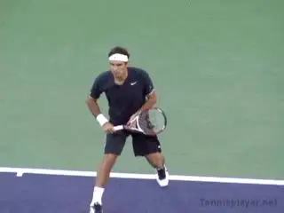
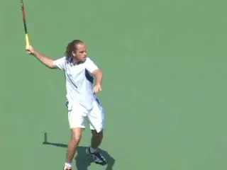
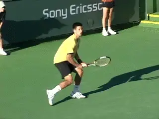
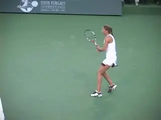
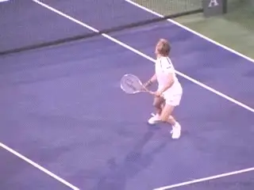
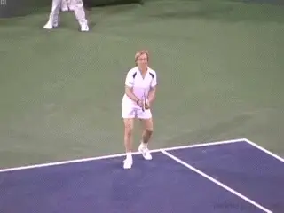
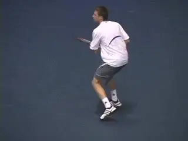
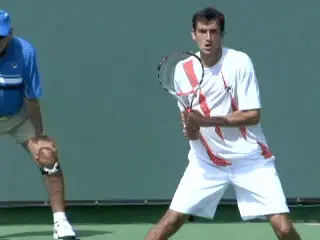
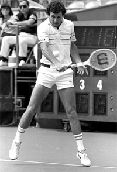
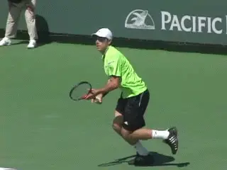

# What is Confidence?

### By Craig Kardon

**Confidence means learning to believe your game will be successful.**

Confidence in tennis, as in anything else, is the ability to have faith
in yourself. It's your belief in yourself and the belief your game will
be successful no matter what the circumstance.

When you go into a match being confident, it doesn't really matter how
the pendulum swings during the match. Let's say you get into a rally
and you hit your best shot, but your opponent gets it back and hurts you
with his reply. When you're confident, that doesn't seem to bother
you. You know in the long run that that's only a brief intermission in
the way things are going to happen.

Confidence means you believe in your shots, no matter what goes on the
other side of the net. A lot of players will go for the shot, but at the
last minute, there's not that belief. To make it work you have to let
go of the outcome and just trust the stroke and believe that it's going
to work. In the long-term, you believe you will win for the simple
reason that you believe in yourself.

**Shot Confidence**

It's important to understand that having confidence is not just a
matter of the quality of your shots. A player I worked with, Xavier
Malisse, would get on a roll and be fantastic. He had a great forehand,
great movement, played really deep defense.

**Even with a big forehand, confidence can suddenly fade.**

But if a guy got back some of those huge forehands, or got really
aggressive, or won what appeared to be a few lucky points, sometimes his
whole game would change. He would lose confidence and begin to play very
passively. So the whole direction of the match could change just because
an opponent got back one or two shots.

You can often tell when your opponent is confident by the way they react
to your best shot. Let's say you get in an exchange, their best against
your best, and you happen to win that exchange. The unconfident opponent
will show signs of visible frustration, maybe rushing into the next
point, maybe talking to himself, questioning line calls, or changing the
exchange in the next rally. These are signs he doesn't believe that his
best can go against your best. So there are visible signs that you can
pick up to see when your opponent is not confident.

Here's another example. You're playing a guy with a great forehand,
it's in the third set, and you get into a long game, and all of a
sudden that guy with the great forehand, he's just putting the ball
into play, he's not ripping it anymore. That would indicate to me that
he's not confident, that you can pretty much go after hisbest shot. You
feel that you can be a little more aggressive, and you're going to get
errors. That's a visible sign of your opponent not being as confident
as you might assume.

**Visible frustration shows a lack of confidence.**

**Good Decisions**

Confidence leads to good decision making. When two players are playing
very well, it's the players who handles his own emotions and trusts
himself to hit the right shot at the right moment that usually wins.
When it gets really close, you have to have the clarity of mind that
goes with being able to do that.

For these reasons, confidence plays a huge role in the outcome of pro
matches. This is true in men's tennis especially, because the game is
so powerful. In men's tennis, momentum can change pretty quickly.
Because there's more power involved there is a smaller margin between
two opponents. If you lose confidence just for a split second and you
lose your serve, then you've lost the set. In women's tennis, the
emotions are just different. They're very strong and there can be
extreme swings. You see women's players coming back from 5-1 down and
still winning.

In men's tennis, the players hide their emotions a lot more. Sometimes
it's really tough to say just from looking at two opponents, who's
really more confident. In women's tennis, you can just tell more easily
by watching, who is hitting the ball harder, who is more confident.
It's all a bit more visibly apparent.

**In women's tennis, the emotions can be more transparent.**

In women's tennis there are a lot more breaks to serve, and there are
often way more swings between two opponents during a match. This means
there is more room for swings in confidence and for players to recover
from them.

**Protecting Confidence**

To win matches, you need to protect your confidence as much as you can,
and get the most out of it when you have it. Champions know how to
protect their confidence and champions know how to use their confidence
to their advantage. Every player needs to find a way to ride their
confidence and get as many games won during that stretch as they
possibly can.

As a coach, you have to recognize when your player is confident and make
him recognize the factors why. What shots are you confident in? What
tactical patterns work for you when you're confident? And do those
shots and patterns work against any opponent?

The most important thing in protecting confidence is actually not
becoming overconfident, and then starting to take things for granted.
Champions do the ordinary things better than anybody else. By ordinary
things I mean first serve percentage, putting returns of serve in play,
not making unforced errors at the wrong times. You can't play loose
points when you're confident. This is one very important way of
protecting your confidence - don't give away points no matter what.

**Be aggressive with your footwork - no matter what.**

**Aggressive Movement**

Another way of protecting your confidence is to be aggressive with your
movement. Never get lazy during a point. Even if you know you can get to
the ball in plenty of time and still hit a winner, you still want to
move efficiently and aggressively no matter what the situation is.

Another key: make sure you put the ball away. On the overhead, even if
the opponent is out of play, you still play the overhead into the
stands, because that shows confidence. That protects your confidence and
it sends a message to your opponent.

Confidence comes from your repeated success and how you value that
success with yourself. When I worked with Martina Navratilova she was a
great example of this. She was a great front runner. When she would get
on a roll, she would keep coming and she would just bury opponents, just
bury them.

**Put the ball away with authority.**

**Being confident also means having flexibility. You have to ask the
player what happens when the opponent gets his best shots back? What
happens if a pattern doesn't work? Are you going to still be confident?
Are you still confident in your decision making abilities? If things
aren't going your way, can you go to Plan B? You have to help your
player be confident in their decision making, and also help them be
confident in a Plan B game plan.**

**Regaining Confidence**

Of course players aren't confident all the time, and for a variety of
reasons. As a coach you also have to find a way to help players regain
confidence when they lose it.

Here is one example with another top player I was coaching. She was
playing against a young player she had never faced on a very hot day.
She simply wasn't playing her best, and I could tell, was focusing on
the negative. There was a rain delay and she started complaining about
all the errors that she was making.

**Keep track of the points you are winning, and how.**

So I asked her, have you been keeping track of all the winners you're
getting? Are you keeping track of the points that you're winning and
how you're winning them? And she stopped complaining, and after the
rain delay, the pendulum started to turn.

The moral of that story is to keep track of the points you're winning
when you're not confident, not the points you're losing. Focus on the
positive things you're doing on the court, not the negative things.
Sometimes those positive things will start happening a bit more often
because you're focusing on them.

Another example. I coached a player who loved to look at his statistics
all the time, comparing his game and his stats over the years. You know,
in 2008, I was doing this, and I hit a high percentage of second serve
return winners, etc.

He might look at a whole year's worth of statistics, and if his numbers
were up there, then his confidence went up. But what was interesting was
what happened when his statistics were lower - even if he was winning
matches at the time.

**Focus on the positive things you are doing on court, not the
negative.**

He would look at things that didn't seem to have anything to do his
results. He might be winning but then look at his statistics, and decide
well, I'm not returning well. Even if his ranking was going up, he
wasn't happy because he was not up there in the return category, or
whatever. And of course then his results would start to go down.

If you are going to study the statistics, you have to look at them in a
way that is going to build your confidence. For instance if you have a
player who is holding serve a high percentage of time, he should feel
freer to play more aggressively on the return games. Or if you're a
consistent backcourt player, and see you're only making 5 unforced
errors in a set, that's a pretty good number that should make you feel
more confident.

**Assumption and Belief**

**Loss of confidence is a disbelief in success.**

As a coach, you have to break down the reality of the situation.
Confidence is an assumption or a belief that things are going to go your
way. When you're not confident, you're assuming things are not going
to go your way. That belief can be what's causing you to be too
passive, or maybe that's what's causing you to overhit.

Basically, a loss of confidence is a disbelief in success in the future.
When you're confident, the things that you do well in the present allow
you to believe things are going to be better off in the future.

Structuring Success

But when you have lost this belief how do you get it back? The basic
idea is to structure things to put the player in successful situations.
You can work on something new, different patterns of play, for example,
and build up confidence in that way.

But probably the best way to do this is to put yourself in winning
situations, and this means organizing things so that your player meets
other players you know they can beat.

**Why did Bill Scanlon play local pro events?**

A great example is what a former top ten player Bill Scanlon would do.
Scanlon beat John McEnroe and had a winning record against Boris Becker.
But once or twice a year he would play a local men's open tournament.
The draw was filled with local pros. It was like about a hundred bucks
to the winner.

I used to practice with him quite a bit in Dallas, and I asked Scanlon,
why in the world would you do that? You're going to kill these guys.
His answer was that it created confidence. He said it was an opportunity
for him to stay mentally strong and keep doing the things he normally
tried to do in matches. But against lower level players he could do them
more easily and more often.

So he created situations where he could have repeated success and build
his confidence. Then, when he faced similar situations in tour matches
where he really needed to be confident, he had those experiences to draw
on. He might have to just complete one point sequence at a critical time
to make the difference in a match. That increased confidence could be
the key.

My advice to club players is to do the same. When you are not confident,
you need to put yourself in more situations where you know you are going
to have success. Play lesser players. Try to really concentrate and beat
someone 6-0, 6-0. Not too many club players would think of that. People
think they can only get better playing against better players. But that
is only partially true. If you are serious about rebuilding or
increasing your confidence, you need to do what Bill Scanlon did and
find a way to execute the shots you need over and over.

**Tommy Haas pumped himself up to build confidence at the French.**

**Tommy Haas**

Another example of how to build your confidence is the match Tommy Haas,
played at the French Open this year, versus Leonardo Mayer in the round
of 32. It was a 5-set match. Mayer is a younger guy who hit the ball way
heavier than Tommy, with a huge serve. But he didn't have as much
patience or experience as Tommy did.

Tommy was not that confident and wasn't playing his best. It would have
been very easy for him to get upset, watching all those missiles fly by,
knowing he could play much better himself.

But he did a very smart thing. He didn't show a lot of emotion when he
was losing. When the guy overpowered him, he just didn't let it bother
him. But when he played a good point and hit a winner or got an error,
he would really pump himself up.

He was sending a message to the other guy. Maybe on a different day or
against a different opponent, Tommy wouldn't have needed to do that.
The point is he found something positive to build his confidence on.
Literally he was able to change the way he felt during the match. It was
like he expected good things to happen, and they happened.

**Recognize the opportunity to believe when you do something good.**

**Players sometimes don't recognize those opportunities. You have to
recognize when you've done something that is very good in a given
situation, pat yourself on the back, and believe that you can do it
again when the situation is right.**

**Again, my advice club players, if you want to get create confidence,
then you have to do the same kind of things. You have to focus on the
positive and tell yourself that when good things happen, you can make
them happen again.**

Next, I'll tell the story of my work coaching Ana Ivanovic and how all
these issues about confidence relate to her game and the ups and downs
talented players sometimes experience at the top of the game.

Craig Kardon is the touring coach and

in Irving, Texas. He is also the coach of the

Philadelphia Freedoms in World Team Tennis. As a

tour coach he has worked with many of the

world's top players, including Martina

Navratilova, whom he coached to multiple Grand

Slam titles, as well as Jennifer Capriati,

Xavier Malisse, and Ana Ivanovic.

Craig can be contacted directly at:

<Clkardon@aol.com>.
