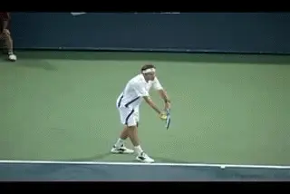
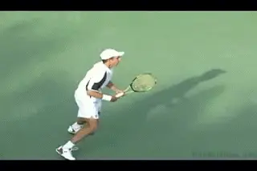
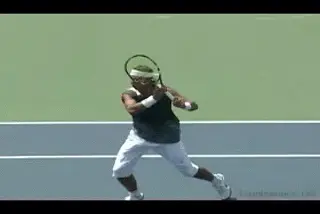
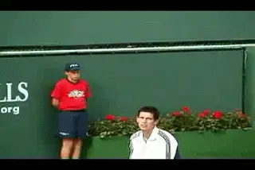

# When Momentum is Neutral

### When Momentum is Neutral 

### By Alistair Higham

**Neutral Momentum can produce the most exciting matches.**

So far we've looked at the concept of Momentum, and how to react when
momentum is with you, and when it is totally with you. ([link](http://www.tennisplayer.net/members/mentalgame/mentalgame.html).)
In this article, let's look at the third stage of momentum: When
Momentum is Neutral. Neutral momentum means that things are in the
balance --the scales are waiting to be tipped by one player or the
other. It can be an unnerving or exciting feeling, because things could
swing either way. This is the opportunity top players seize by stepping
up and going for the victory.

When the momentum is neutral the level of play and the energy levels of
the two players is even. Some of the most exciting and memorable matches
occur when momentum is netural with the players are at their best and
involved in an epic tussle. The atmosphere can be electric with hopes,
fears and anticipation. This happened in a Davis Cup tie I witnessed in
1999, Great Britain versus the USA.

The match score was two all and in the final match, Greg Rusedski and
Jim Courier were tied at 2 sets apiece. As the fifth set advanced, the
deadlock continued. The crowd was at fever pitch, the television
audience soared, and the players became gladiators more than tennis
players.

**The momentum is also neutral when the players are sparring and feeling
each other out.**

Courier said he dealt with the huge crowd support for Rusedski by
imagining he was in a row boat in a storm with waves crashing over, but
it was his job to simply keep rowing. Courier and the USA went on to
win, but as Peter Fleming, the TV commentator said, so did the sport of
tennis. Neutral momentum is rarely as exciting as in tennis because the
players don't have teammates and there is no time limit to cut the
battle of wills short.

At other times, neutral momentum can be far less exciting. It can seem
as if nothing much is happening in the match, rather like two boxers
just sparring. At football matches (Americans call it soccer), crowds go
quiet when the momentum is neutral in this way and players are passing
the ball around without any obvious attacking inclinations.

Neutral momentum can look this way at the beginning of the match, as the
players feel each other out. But it can also occur well into the match,
when neither player can find his rhythm, and the game is full of errors
from both players (such as when neither player seems able to hold their
serve). For example, there can be neutral momentum when the match is 2-2
in the second set, even though one player is a set ahead. That is not as
exciting as neutral momentum at 5-5 in the final set.

**Don't Wait**

But whenever neutral momentum occurs, this is the time when there are
chances for surging ahead, chances that can be created or taken. When
the momentum is neutral, you need to be ready to grab it. The player who
waits in this situation is like a sprinter waiting on the line for their
rival to shout "go". You have to be looking to establish a flow of
momentum in your favor.

**Neutral momentum offers the chance to grab opportunities.**

If you wait for your opponent to do something, it is possible that you
will end up raising your game too late to win the set. In days gone by,
it was more possible to wait, in the hope your opponent would try to
seize momenturm first and make a mistake. These days, the saying "he
who hesitates is lost" is more appropriate.

You often hear of players nearly pulling off an upset, then consoling
themselves with the thought that there was nothing they could do when it
came down to it, because their opponent came up with the goods. Usually
this is because they waited for something to happen.

**Grab it**

When the momentum is neutral, higher-ranked players will often raise
their game, spurred on by the realization that they must act before
it's too late. But how should you grab it? What do you do to raise your
game? In what way should you act?

It can be tactically, by zoning in on specific tactics you have
discussed with your coach before the match. Sometimes, if your opponent
is looking nervous, grabbing the momentum may mean showing them you are
up for the fight and making them play every ball by playing percentage
tennis.

The right attitude is critical to surge ahead when the opportunity comes.

confidence](media_when-momentum-is-neutral/media/image5.jpg)

On the other hand, there may be times when percentage tennis is not
enough. Recently I was the on court captain for Britain when we played
Spain in the semi-final of the European Championship. We lost in the
final set of the final doubles. We had played high levels of tennis that
would have beaten most teams. But when momentum was neutral we didn't
find the levels of exceptional tennis that the Spanish found. We were
devastated. Sometimes you need more than percentage tennis. Whatever you
do, decide quickly and do it. Keep the future in your hands.

**Be Ready Before You Begin**

To grasp the opportunity to surge ahead requires that you are properly
psyched up to do so before the match begins.

This is particularly true if you are playing an opponent you are not
expected to beat. You have to be mentally ready to stick the knife in if
the opportunity of neutral momentum comes along. Don't wait to see what
happens, because the opportunity will disappear quickly against the
better players. (If you don't like the idea of sticking the knife in
you can always push them over the cliff or take the bull by the horns!)

A phrase used by Tim Henman's former coach, David Felgate was "step up
to the plate." This came about after Tim lost a number of matches to
better players early in his career and seemed happy to have played well.
David felt he was never really in the match as a serious contender when
key moments came up. That changed and Tim's results improved.

**When momentum is neutral step up and stick in the knife.**

**Come Back and Go**

Grabbing the situation might simply mean urging yourself to forge ahead
to win when you have pulled back from being well behind. Very often you
will see a player comeback and draw level, only to relax and lose the
set.

There are many examples of players who made a change in their game or
renewed their efforts when they were behind, but as soon as they pull
level in the score, they thought the job was done and relaxed their
fighting spirit. Their energy dropped and they lost the momentum.

At the same time the player in the lead may relax when an opponent comes
from behind and draws even, because their fears have been realized.
Sometimes this releases tension, sometimes it makes them angry. Either
way their energy and fighting spirit often goes up.

This change in energy on court from either one or both players is why
the momentum can switch again, and the player who has come back can
lose. So, if you are the player who fights to draw level, be determined
to keep fighting and surge ahead. Be aware that the game when the scores
are level is key if you intend to win. Never draw level and wait to see
what happens -- come back and then go forward!

Alistair Higham is the National Manager of Coach Development for the
LTA, the governing body for tennis in Great Britain. He is the author of
[Momentum: The Hidden Force in Tennis]. Alistair is a former
professional player who continues to compete successfully at the highest
levels of English regional tennis. He has developed and coached dozens
of top junior players, and traveled extensively on the international
junior circuit, where he has had the unique opportunity to make a close
study of the hidden force that dictates so much in the outcome of
competitive tennis matches.

**Momentum: The Hidden Force in Tennis Alistair Higham**

Read this important new perspective on momentum and the development of
the mental game, by top English coach Alistair Higham. Based on his
observation of literally thousands of competitive matches as well as his
own professional career, this book will give you the perspective and the
tools to create momentum in your own matches and deal with the critical
turning points that are the difference between winning and losing.

[ to
Order!](http://www.1st4sport.com/1st4sportsite/product/1st4Sport/Tennis/Tennis/sports/Sports/B60401.htm)
