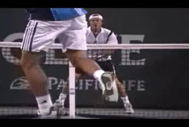
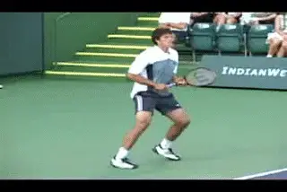

# When Momentum is Totally Against You

### By Alistair Higham

**When momentum is totally against you it can lead to mental and
physical negativity, even at the pro level.**

When the momentum is totally against you, it is the easiest thing in the
world to believe it's just not your day. At one point you were up a
set. But now you're 4-1 down in the third. We've all been there. For
most players it seems that the hill is too big to climb.

They conclude that the flow of the match is irreversibly with the
opponent. Then it becomes all too easy to display negative body
language, or indulge in fits of temper giving your opponent even more
encouragement. At times like these players sometimes wonder why they
bother playing at all!

The fact is, however, that matches do turn around regularly from
seemingly impossible positions. The key point is to understand this. You
are only in a stage of momentum. When momentum is totally against you,
that is just one of many stages. And those stages always change over the
course of a match.

**Champions know matches can turn around from "impossible situations."**

If you can shift the momentum to a different stage, the match can start
to change before your eyes. Miracle comebacks aren't actually miracles.
They are the inevitable result of shifting and controlling momentum. The
object should not be the comeback itself. The object should be to turn
around the underlying dynamics that control the outcome. Still, changing
momentum from this stage is the most difficult transition in tennis.
It's mentally tougher than moving up a stage at any other time. But if
you can recover from the stage where momentum is totally against you,
then turning points may emerge. The match may subtly begin to turn
around, and the nerves of your opponent may start to work in your favour
instead of the other way around.

**Don't Lose Hope**

**The most important thing when the momentum is totally against you,
is not to lose hope.** It is not easily done,
because your opponent is full of confidence, has the cushion of a lead
and is trying to finish you off. That would be tough enough at any time,
but it usually happens when you are feeling frustrated, disheartened and
maybe tired, having spent considerable time and energy only to find
yourself in this unfavourable position. Once hope is gone you have no
chance of turning things around.

**Moving momentum when you are far behind is mentally tougher than at any other time.**

Your opponent may seem to be playing too well for you to have a chance
of victory, but you should remember how easy it is to play well when the
momentum is totally with you. It is the same for them. They won't be as
good when the momentum has shifted.

The road to making a comeback is steep at first but it will get easier
if you can dig in and get a foothold. Once you have stuck in and begun
to make a comeback, two factors will work in your favour: you will begin
to feel better and your opponent will dislike the fact that it's not as
easy as it was. This double change in energy gives the best conditions
for a change in the flow of the match.

**Take Your Time**

When the momentum is totally against you, take your time. Let the steam
go out of your opponent's game. You have to take the time allowed and
find some way of getting points on the scoreboard. Momentum in this
situation tends to change slowly, and you have to build the foundations
for a change.

\
**Giving up hope means giving up the chance of changing momentum.**

**Playing one point at a time is very
important.** When you are well behind in momentum,
it is not possible just to collect points quickly like you can when you
are in the lead. It's a bit like trying to get out of a pit. Put great
emphasis on every step.

**[\
[Winning one game can make all the difference.]]** If
you can stay in touch with your opponent on the scoreboard when you are
well behind in momentum, you will be closer when things turn around. For
example, if you can somehow hold onto your serve when you are 1-4 in the
final set, then 2-4 is a lot closer than 1-5 if your opponent starts to
wobble or you start to build some momentum.

This is where the phrase weathering the storm applies. You hear it in
other sports as well. In football (what you Americans call soccer) in
this situation, getting the ball and somehow keeping possession of it is
crucial. The same applies in tennis. You have to find a way of staying
in the match. Staying in the match is the best way of building
foundations for a change in the future. What you are building toward is
a potential turning point that occurs when you are not so far behind in
the momentum.

It is particularly important not to lose hope when you are tired. You
never know how tired your opponent is as well. Don't let things slide.
Stay in touch with the score by trying to win the first point of each
game and taking each point one at a time.

**Have a Cunning Plan**

Here's an interesting ploy: If you are a set up, but well behind in the
second set of a three-set match, you might consider the effect of
starting the final set fresh, having had a set in which you can, as it
were, take a break from the tactics and intensity of play which won you
the first set.

**"Exhibition Tennis" can produce winners that move momentum.**

You can actually take advantage of being well behind in the second set
by deliberately playing what I call exhibition tennis. This means you
create the impression that you are no longer trying or no longer care
about the outcome of the match. The plan is twofold and in a sense is a
win-win ploy.

If you lose the second set, you lull your opponent into a sense of false
security so that for the crucial start of the third set you can hit your
opponent with different tactics and/or a new attitude. However, this
approach of exhibition tennis may allow you to unsettle your opponent
with quick, spectacular one-off winners to get yourself quickly out of
the momentum totally against you stage. It is then possible to revert to
the strategy that won you the first set, knowing that you have got back
the necessary momentum and that your opponent's nerves may become a
factor as you continue your comeback.

**The stages of momentum control the outcome--not the score at a given moment.**

**Read the Future**

A final point to consider. Momentum moves through the five stages
outlined in the first article ([link](Momentum%20-%20An%20Introduction%20to%20the%205%20Stages.docx)),
and sometimes you cannot control it. It can run its own course and
appear to have a life of your own. Therefore be wise. Realise there is
always a strong chance that it will change.

Let that knowledge give you hope when you are well behind. The key is to
control your own mental energy and watch for signs of your opponent's
change in mental energy, particularly after obviously significant
events.

Remember what makes momentum turn: A change in your opponent's mental
energy -- either gradual or sudden. Or a change in your mental energy
-- either gradual or sudden. Remember it is the stage of momentum, not
the score at the moment that will ultimately determine the outcome of
the match.

Alistair Higham is the National Manager of Coach Development for the
LTA, the governing body for tennis in Great Britain. He is the author of
[Momentum: The Hidden Force in Tennis]. Alistair is a former
professional player who continues to compete successfully at the highest
levels of English regional tennis. He has developed and coached dozens
of top junior players, and traveled extensively on the international
junior circuit, where he has had the unique opportunity to make a close
study of the hidden force that dictates so much in the outcome of
competitive tennis matches.

**Momentum: The Hidden Force in Tennis Alistair Higham**

Read this important new perspective on momentum and the development of
the mental game, by top English coach Alistair Higham. Based on his
observation of literally thousands of competitive matches as well as his
own professional career, this book will give you the perspective and the
tools to create momentum in your own matches and deal with the critical
turning points that are the difference between winning and losing.

[ to
Order!](http://www.1st4sport.com/1st4sportsite/product/1st4Sport/Tennis/Tennis/sports/Sports/B60401.htm)
