# Why Can't I Play the Way I Practice?

### Jeff Greenwald

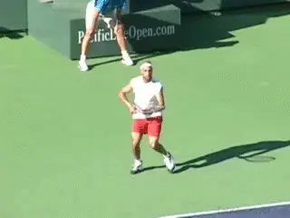

**Why can't I hit my best shots when I need them--like the pros do?**

"Why can't I play the way I practice?" "Why can't hit my best shots
when I need them most?"

"I don't understand what happened, I was playing so well all week.
Then when I played the tournament I played so much worse."

Is there a player who hasn't asked these questions? Is there a coach
who hasn't heard them from his players?

Is there any way to bridge this gap between practice and competition?
The answer is yes, absolutely. I know because I have helped players make
this leap many times.

The performance gap between the ability to hit shots in practice versus
matches is a fundamental barrier every competitive player must overcome
to realize his or her potential. Unfortunately many players never do.

In this article, we'll take a look at the four barriers that keep
players from playing the way that you are really capable. Then I'll
introduce clear, step by step solutions to help you overcome them and
unlock your ability to hit your best shots when it counts most.

| The 4 Barriers |  |
| --- | --- |
| Insufficient Self Awareness | Short-Term Focus |
| Irrelevant Stimuli | Sub-Optimal Communication |

There are four primary barriers that impede the quality of a player's
performance in tournaments. These are: (1) Insufficient self-awareness.
(2) Excess focus on short-term results. (3) Preoccupation with
"irrelevant" stimuli. And, (4) sub-optimal communication between
players and their coaches and parents.

**Insufficient Self Awareness**

The first barrier is insufficient self-awareness. Self-awareness is a
prerequisite for realizing your potential in competition. This is
because it is the foundation of learning and development, not only in
tennis, but in all areas.

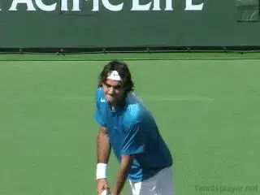

**Can you feel what actually happens in your body when you play your
best shots?**

Sounds simple, but my experience shows it's a major problem for
competitive tennis players. Time and time again I see players miss out
on important learning opportunities because they are unaware of what is
actually happening in their matches.

For example, a player will miss the same ball over and over, but make
absolutely no effort to adjust what he or she is doing technically or
tactically.

Why? The answer is that emotions get in the way of awareness. Players
are either too upset to notice the need to change, or they are unclear
about exactly what to change, or they are too distracted to actually
execute what their brain tells them to change.

Learning to become more self-aware is a skill and can be trained. But
self-awareness requires a different focus. The emphasis has to shift
totally into the present, to what is actually happening
moment-to-moment.

Too many players are living and dying with the outcome of every point,
or sometimes every ball, and what that may mean in terms of whether they
will win or lose. How wil this affect my past ranking? How will this
affect my future ranking? This mind set makes it literally impossible to
focus on anything else.

Andre Agassi put it this way: "There is a time to enjoy the good shots
and a time to get upset about what happened, but it's not when you're
out there."

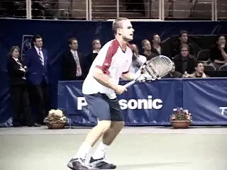

**Do you sometimes obsess over the outcome of individual points?**

Rather than obsessing about the outcome, players have to develop the
ability to sense what is actually happening in their bodies. To do this
you have to begin paying more attention to how your body **feels** and
what it is really doing when you hit the right shots and when you make
errors.

Players often speak in very general terms about what happened when they
play well, "I just had a better rhythm," or "I felt more confident
today." These comments are not specific enough to be really helpful.

Instead, players must learn to cultivate "kinesthetic" awareness. This
is a physical or tactile memory of how your body actually feels when you
strike the ball well. Being familiar with and "owning" this feeling is
the key to the repeated execution of your best strokes, especially under
pressure.

For example, when you hit a forehand deep in the court notice how your
hand feels on the racquet, what kind of follow through you have, notice
the arc of the ball, or whatever strong impressions come into your mind.
Initially, this is a conscious process, but eventually this physical
awareness becomes automatic. This will help you make critical minor
adjustments with ease.

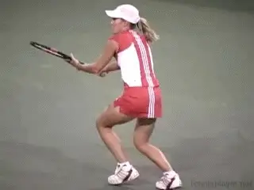

**What is the kinesthetic that goes with your best shots?**

Ask yourself, do you really know what it feels like when you are hitting
your forehand or your backhand well? Can you imagine clearly what your
body feels like head to toe when you hit your serve at the highest
level? What about when you make a great volley? Can you imagine these
feelings and recreate this kinesthetic experience in practice?

Developing kinesthetic feelings should encompasses every area of your
game. For example, by shifting the attention into your body you will
also be able to correct your footwork and your positioning to the ball
because you will know exactly what feels "off."

A second important technique is learning to "scan" your body for
excess tension. Typically, the shoulders and arms are where more tension
is stored. If you are able to discipline yourself to feel the difference
in your body when this is happening, compared to when you are swinging
freely, you can then consciously relax these areas. This is another
process that will become instinctive over time.

There is a final benefit to learning to play in this intuitive fashion.
Your anticipation will improve because you will be more present. Your
mind will be more alert and you will become aware of your opponent's
patterns. This is hugely important for competitive success. For more on
how this works, I highly recommend Jay Berger's two articles on
Anticipation. ([link](http://www.tennisplayer.net/members/high_performance/jay_berger/anticipation/anticipation.html))

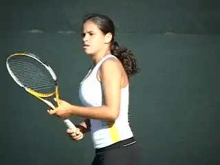

*Video demonstration — the original video for this article was hosted on TennisPlayer.net.*

**Breaking through the emphasis on results requires courage.**

**Excessive Focus on Short Term Results**

Perhaps one of the biggest challenges in developing your game is
acquiring a long-term perspective to deal with short-term setbacks.

Players obsess about rankings--that is just a fact. But being impatient
with your ranking and tying your success too closely to rankings can be
a major barrier to the learning process.

The fear of losing and the emphasis on short-term results prevent
players from trying new things and getting out of their comfort zone
long enough to see what is really possible. This fear prevents them from
feeling what is happening and using the kinesthetic memories that could
actually lead to the level of play they are so desperately seeking.

The question is this: Is it more important for you to win today,
whatever the cost, or play tennis in a way that helps you access your
potential and win in the long- run?

"There is a wasteland of talent in competitive tennis," says a top
national coach on the ATP Tour. "Many players are simply chasing
rankings and not building their games."

Breaking through this short-term orientation requires you to take risks,
to go for your shots, even when you feel tight, and remain focused on
the kind of game that will benefit you in the long run.

"Players get too caught up in the pure results of the tournament,"
says Tom Gullikson, former Davis Cup Captain and top-ranked doubles
player on the ATP Tour in the 80's. "Players must be more honest with
themselves, assess their strengths, be aware of how they are reacting to
pressure, and understand why their play is breaking down at key times."

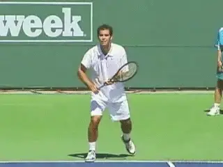

**Pete Sampras evaluated his strengths and weaknesses every year he was
number 1.**

"Pete Sampras would do this consistently from year-to-year, even in his
sixth straight year as the number one player in the world."

Easier said than done, I know. However committing to the small changes
and improvements you have made in practice require this long-term
vision. When you find yourself falling back into your old tentative
patterns you need to be aware that this is happening and recommit to a
more courageous style of play.

Committing to the plan that you and your pro or coach have developed
together and executing it is the key. You have to take the chance of
shifting gears, putting worry aside, and letting your feel for the game
emerge.

Think about every match as a stepping stone to your best tennis in the
future. Make that vision the most important thing. You have to really
believe that the way you play the game is more important than the
immediate result.

**Performance Goals**

The best way to take steps in this direction is by committing to
specific performance goals, goals that can be measured in the same way
as ranking, but with far more positive effect. Write these goals
down--65% first serve percentage, attacking net 5 times per set win or
lose, staying composed on break points, focusing on your kinesthetic
keys, recognizing what you can and cannot control--whatever goals seem
appropriate for where you really are.

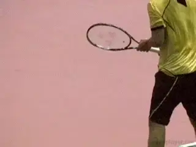

**Attacking the net 5 times per set: a great example of a performance
goal.**

Again Pete Sampras is a great example. Developing the skills he needed
to play serve and volley tennis took time that cost him results. When
Pete was 16 he was ranked #60 in the national juniors. Three years
later, he won the U.S. Open at age 19.

Once you are thinking more productively about your game and focus less
on the immediate outcome, you will feel more permission to go for your
shots. This process takes time, honesty and continual evaluation. But
gradually your tournament performance will start to reflect the skills
you demonstrate on the practice court.

**Irrelevant Stimuli**

If you raise your self-awareness on the court and have a longer-term
perspective of your game, there is another benefit. Your learning curve
will rise dramatically as you focus more on what is actually
"relevant" during matches. Focusing on the wrong stimuli during
matches is a major hindrance to developing as rapidly as possible.

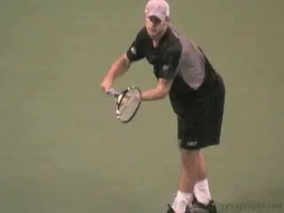

**Focusing on the right stimuli is the difference in the return.**

Research shows that a majority of successful pros have learned to
accelerate their learning curves in this way. Damian Farrow, a scientist
at the Australian Institute of Sport, who works with Olympians and other
elite athletes, has recently found some important clues in identifying
the differences between amateur and expert tennis players regarding
their learning process.

One of the most obvious differences between these two groups is the
ability for pro players to spend more time on "relevant stimuli" in
matches because minds are not distracted by the irrelevant factors
discussed above.

To give just one example, Farrow found that pro players were able to
track the direction of the serve earlier than amateurs. This gave them a
huge edge in reacting to the speed and placement of their opponents'
shots.

According to Farrow, "Great tennis players can tell from the angle of a
server's arm where the ball will go. Novices generally don't have that
skill. But they can learn. Top tennis players can predict the direction
and speed of the ball before it leaves the racket."

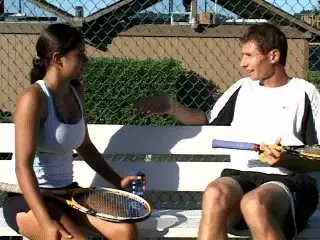

**Reading the serve can double the time interval you have to move and
execute.**

By predicting the path of the ball from the swing they know a split
second earlier where to move. "This fraction of time is game
changing," says Farrow. "A serve going 120 miles per hour takes
approximately a third of a second to travel the 60 feet from baseline to
service line.

"This means that an expert, who doesn't have to wait until the server
makes contact to read the shot, has twice as long to move, plant his
feet, and swing."

Many players are blocking their ability to react to the ball because
they are handcuffed by anxiety related to the possible outcome. When you
stay present, stay composed, and stay engaged, a new set of learning
opportunities will automatically open.

**Sub-Optimal Communication**

The ability to stay focused on what is relevant in competition and
accelerate your learning process also requires a positive collaborative
relationship between player and coach.

For the past two years I have been teaching USTA coaching workshops on
how to improve communication with players, manage players' ambivalence
about the change process, and helping coaches teach players to apply
their skills in competition.

*Video demonstration — the original video for this article was hosted on TennisPlayer.net.*

**The communication gap between players and coaches affects learning.**

Listening to reports from both players and coaches has convinced me that
there is a wide spread communication gap in junior tennis that is
affecting the learning process.

Here are some of the things I have heard from coaches. "My players are
so caught up in the rankings and who's ranked higher that they play in
fear."

"My players just won't commit to changes and actually executing them
in tournaments."

"A lot of my players melt down as soon as they have their back against
the wall."

"My players call me right before their matches asking me what they
should do--and have no idea themselves."

On the other side of the fence I have heard this from players:

"My coach is always pushing me to try stuff that doesn't work in
matches."

"My coach bombards me to change too many things, and then gets mad when
I'm not able to pull them off."

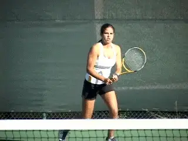

**Players have to be truly open to change and trying new strategies.**

"My coach never asks me how I want to play. All he does is tell stories
from his experiences or talk about theories that don't really make
sense to me."

The underlying problem here is that too often there is not an open line
of communication between player and coach. The coach blames the player
for not doing what the he says, and the player blames the coach for
judging him and not believing in his abilities.

Players and coaches have to both feel they can honestly discuss what is
and isn't working. The truth is coaches can be defensive when players
challenge their authority or expertise.

But players have to have the freedom to voice their reservations about
particular swing or strategic changes in lessons and to discuss the
potential consequences in tournaments. And coaches have to have the
patience to listen and understand the fears of players, even when they
disagree or have another perspective.

On the flip side, players have to be truly open to change and have to
work to recognize and admit what is really holding them back. The
commitment to changes must be a team effort. But once there is agreement
on a path of development, players need the courage to embrace the
challenge and make the changes their own.

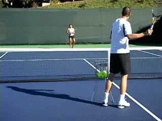

**Do players sometimes get too much input in lessons?**

Both sides have to be able to talk about this process, especially when
it gets derailed or there are set backs. Players will inevitably revert
to their old patterns on occasion, and both sides need to discuss this
with a supportive attitude and without recrimination.

**Case Study #1**

One former college player, now at the 5.0 level, began working with me
about three months ago to help him play looser in tournaments and get
out of a two-year "slump." After just the third session he was more
relaxed and playing better than he had in a long time.

However, that week he decided to take a lesson with a new pro. In our
next session he reported that he had felt awful on the court all
week--overthinking, making unforced errors, and feeling totally
indecisive.

As I inquired about the lesson and what the pro had asked him to do, my
client reported that "He wanted me to get my right leg through on the
forehand, stay lower to the ball, drop my racquet head lower on the
forehand, hit higher over the net and wait on the ball longer rather
than catching it on the rise."

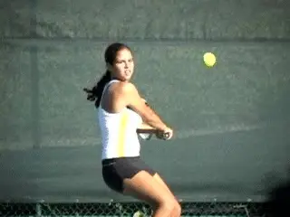

**Input from coaches shouldn't undermine your positive approach.**

This was just the instruction for one stroke. There was a similar litany
about the rest of his game, all imparted in the course of one hour. From
my vantage point, the amount of information my client received was
totally overwhelming.

This was particularly true since his biggest issue was overthinking his
shots and not trusting himself. I asked him to put a temporary
moratorium on lessons and he agreed to put all those technical ideas on
hold until he developed a more trusting, positive approach to the game.
In three months, he began to flourish.

I use this example, because it highlights the frequent absence of
effective, collaborative communication in traditional lessons. Of
course, technical information plays a critical role in proper
development. But it can only be effective when communicated in a way
that takes the personality, learning style, and psychological challenges
faced by the player into account.

The problem was that this particular pro did not identify any of these
in my client. Likewise, my client hesitated to speak up and indicate
that he felt overwhelmed and didn't give the pro a chance to adjust his
agenda. Without proper intervention, this dynamic could have persisted
for months, even years, with both the player and the coach suffering
unnecessarily.

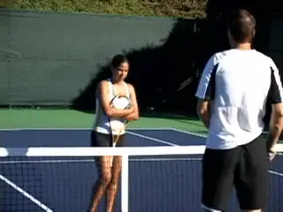

**Do the goals of your coach match your goals as a player?**

**Case Study #2**

During one of the USTA High Performance workshops I facilitated last
year, I was approached by a top-national coach struggling with a very
talented, nationally ranked player. He reported to me that on any given
day this player could beat any player in the top fifty in the world.

However, he also explained that on an "off" day he could lose to
numerous players ranked below him. Essentially, the coach was pulling
his hair out because of the gap between his player's talent and his
actual execution in tournaments. He asked that I work with him to see if
I could help bridge this gap.

I learned that the coach's main objectives, were first, to reduce his
player's emotional volatility, and second to help him find a better
balance during rallies. He wanted his player to construct points with
more patience and flexibility. He wanted the player to add more variety,
to take some pace off from time to time and use the court a bit more.

What he wanted did not seem too much to ask in the coach's mind, and he
had been pressing his player to do this for quite some time.

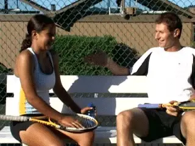

**Honest, positive communication between players and coaches is
critical.**

When I talked to the player, however, I found that he simply could not
see the value of playing the way his coach insisted. He was a winner and
a shot maker. This attitude had been deeply instilled in him by his
family. Period.

From his perspective, hitting every ball as hard as he could, from all
angles of the court, was working--he was a top nationally ranked
player. He had numerous wins over players ranked above him. He was
praised for this type of play.

I began to understand the dynamics in play, but my goal was not to
adjudicate the issues about playing style. I considered that a judgment
call to be worked out between player and coach.

My concern was that there was very little direct collaborative
discussion going on. Obviously, the player was not responsive to the
coach. But on the coach's part, there was little recognition of the
player's concerns about the development of his own game. The player's
ambivalence was not being adequately addressed and everyone suffered as
a result.

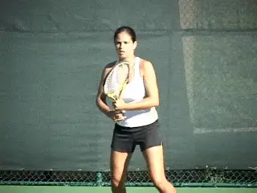

**With communication the path to change and a more varied game stays
open.**

Gradually, through open conversation among all parties, the player began
to feel that I understood his position, and that his coach did as well.
The coach became more understanding and softened his approach. This in
turn caused the player to become more receptive.

Eventually, this player did start playing with some more variety and
developed a more "controlled aggressive" approach to rallies. The
coach had him hit three different kinds of balls in practice on a
regular basis, mixing different paces and spins with his ripping
winners.

His training now became less of an either/or confrontation about
opposite styles of play. Instead, all the options had a value and a
place. As a result, he became more comfortable with varying his tactics,
and his ambivalence was resolved.

The point is that the coach is critical in helping the player improve,
but it is equally or more important that the player be allowed make his
own observations and follow his intuition and sense of curiosity about
the learning process.

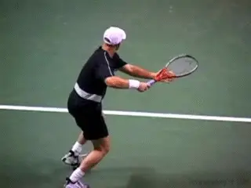

**Work to overcome your barriers and discover the great tennis you
really have inside you.**

The ability to communicate what you notice about your game and the
ambivalence you may feel about certain changes are critical to
developing a sense of ownership over your game.

When something doesn't feel right in your game, you have to speak up.
Tapping your ability as a player is dependent on it. You cannot be
passive in the learning process.

I know there is more ability in you than you probably even imagine. If
you have the nagging feeling that you can be better or aren't learning
at the rate you thought you should, you are probably right. You can
learn to play the way you practice--or possibly even better. Tune into
how you feel on the court when you hit the ball well, focus on
short-term performance goals, pay attention to what is really happening,
tell your coach what you notice, and watch as your game blossoms.

The Best Tennis of Your Life

Learn how to play with freedom and win more matches! In his new book
Jeff Greenwald, an elite international seniors player, coach, and
psychotherapist, outlines 50 specific mental strategies to play the best
tennis of your life. See how to embrace pressure, maintain confidence,
and increase your focus and intensity. Jim Loehr calls Jeff's book: "a
real contribution to the field of applied sports psychology."\
\
[ to
Order!](http://www.amazon.com/Best-Tennis-Your-Life-Performance/dp/1558708448/ref=pd_bbs_sr_1?ie=UTF8&s=books&qid=1200341206&sr=8-1)

Jeff Greenwald, M.A., MFT is a nationally recognized sport psychology
consultant. Jeff has worked as a consultant for the United States Tennis
Association and trains numerous players around the world on the mental
game. As a player in the men's 35 and over age division he attained an
ITF #1 world ranking, as well as the #1 ranking in men's singles and
doubles in the United States.

Greenwald is the author of ["The Best Tennis of Your
Life"](http://www.amazon.com/Best-Tennis-Your-Life-Performance/dp/1558708448/ref=pd_bbs_sr_1?ie=UTF8&s=books&qid=1200341206&sr=8-1)
published by Betterway. [ to
order.](http://www.amazon.com/Best-Tennis-Your-Life-Performance/dp/1558708448/ref=pd_bbs_sr_1?ie=UTF8&s=books&qid=1200341206&sr=8-1)
Jeff has a private practice based in San Francisco and Marin County,
California. He can be reached at 415-640-6928 or by email at
jeff@mentaledge.net. You can also visit Jeff's website at
[www.mentaledge.net](http://www.mentaledge.net/).
