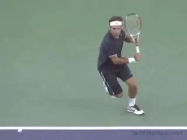
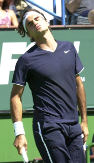
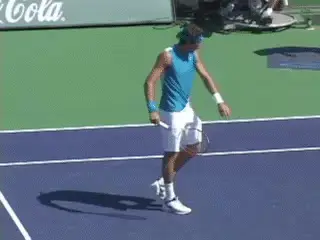
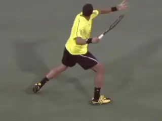
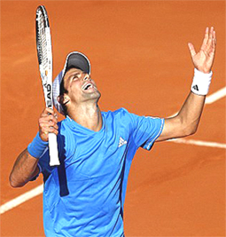
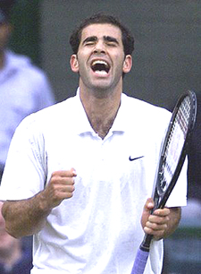

# Why Emotions Can Be Counter Productive

### By Allen Fox, Ph.D.

**Darwin's theory of emotional response is at odds with what happens in
tennis matches.**

**Emotions are often counterproductive in tennis. Most
counterproductive emotional responses during tennis matches are driven
by subconscious fears of failure and urges to escape the stress of
competition.**

Charles Darwin would have it that emotional responses generally evolve
because they, in some way, enhance prospects for species survival. In
other words, they are supposed to be helpful. Unfortunately, in tennis
matches the opposite is usually the case.

**Our nervous systems were not designed to exert fine motor control
for long periods of time under high stress. Certain normal emotional
responses, in particular those involving escape from prolonged and
excessive anxiety, frequently make players lose to opponents who are
physically and technically inferior.**

**By its very nature, tennis is an emotional game. Of course, it may
not look it from the outside, but as noted in the first article, tennis
is constructed to be a one-on-one, non-contact
fistfight.**

Tennis is inherently antagonistic since players use their tennis tools
to break down their opponents. It is a battle of wills, where players
compete for physical and mental dominance, where threat and intimidation
play significant roles in victory, and where one contestant ultimately
proves himself directly superior to his opponent. This makes the
emotional stakes far greater than they appear. Closely-contested matches
are stressful because winning them is so pleasurable and uplifting, and
losing them is so painful.

**It's not normal to exert fine motor control for long periods under
stress.**

**Uncontrollable Outcomes**

Uncontrollable outcomes cause stress. For the serious tennis competitor,
one who has invested countless hours honing tennis skills and who
competes full-bloodedly, the emotional stakes of match-play are high.
The problem is that the outcome is not controllable.

It is an unpleasant fact of life that no matter how hard you train, how
well you concentrate, how shrewd your game plan is, and how perfectly
you control your emotions, you cannot be sure of winning against an
opponent of equal ability. The scary truth of competition is that you
can do everything right and still lose.

This is the structure for a fearful and uncomfortably stressful state of
affairs. Essentially, you have players in a situation where one outcome
is very pleasant and the other is very painful, but try as they might,
they cannot control the outcome. It is a structure tailor-made for
stress, anxiety, and escapism.

**You can do everything right and still lose**.

By way of analogy, I have seen a similar paradigm in a psychology
experiment. There dogs were strapped into an apparatus where, when shown
an illuminated circle on a screen, they could press a bar and receive a
reward of food. Of course, they soon learned to press the bar to get the
food.

Then they were shown an illuminated ellipse on the screen. If they
pressed the bar in this case, they were given a painful electric shock.
They soon learned not to press the bar when the ellipse appeared. So
far, so good.

But then came the tricky part. The experimenters began to change the
shape of the ellipse to make it look more like a circle. The time
finally arrived when the dog could not tell the difference between the
circle and the ellipse, making the task of discrimination impossible.
Yet the dog continued to try to figure it out and press the bar,
sometimes getting the food and sometimes the shock.

**As a result, the dog became increasingly agitated and disturbed,
entering a state of what the experimenters termed "experimental
neurosis."** **[It yelped and squirmed to avoid
being put into the harness. Of] [course, it had only to stop
pressing the bar regardless of what it saw on the screen to avoid the
shocks, but the dog kept trying to solve an impossible
problem.]**

**So it got randomly rewarded and punished attempting to control an
outcome that was uncontrollable.** **As a result,
the dog become very nervous and tried to escape from this stressful and
unpleasant situation - much as tennis players often do in an analogous
situation.**

**In experiments, dogs tried to avoid situations with random reward and punishment.**

**It is natural to try to escape from stress. The usual means of
escape from the stress, uncertainty, and uncontrollability of a tennis
match are: to become angry, to make excuses, to lose concentration, to
focus on and complain about 'problems' rather than solve them or
forget them, or to simply give up.**

**Of course, this is not a conscious decision, nor is it a productive
one. But it is quite normal. Any creature will become stressed and try
to escape from an uncontrollable situation when the alternative outcomes
are randomly pleasant (winning/food) or extremely painful
(losing/electric shock).**

**Escape responses are natural. It is the exceedingly rare (or
abnormal) individuals who can remain rational, unemotional, and
practical in an important match when, despite their committed efforts,
things are going wrong and the prospects of failure loom
large.**

**The vast majority cannot. Since they can't simply pack their bags
and run off the court, their alternative is to use forms of mental and
emotional escapism to temporarily insulate themselves from the impending
pain of defeat.**

**Anger: an unconscious distortion that protects us from reality.**

**Defense Mechanisms**

**When players elect to forget about winning in favor of making
excuses, becoming blindly angry, or deciding that further efforts to win
are hopeless,** they are employing what Sigmond
Freud called **["defense mechanisms."] [These are unconscious
distortions of perception and interpretation that protect us from
unpalatable realities, and they are quite normal.]**

**Freud postulated that cold reality can force us to face stressful or
frightening issues that we cannot resolve. At such times we often
comfort ourselves, unconsciously, of course, by adjusting the way we see
things so that these stressors appear to go away. Defense mechanisms
are, in essence, soothing forms of self-delusion. The key to their
effectiveness is that while we are using them, we don't realize what we
are doing.**

**If the grapes are sour, then who wants them anyway?**

One of the common defense mechanisms employed in tennis matches is
called "rationalization." An early example of it in literature was
Aesop's fable of the fox and the grapes. Here, unable to reach grapes
high above him, the fox rationalizes that they are 'sour' anyway.

Since 'sour' grapes are unpalatable, the fox is not unhappy about
being unable to get them. He thus reconciles the discrepancy between his
desires and capabilities. (Like the tennis player who says he doesn't
care if he wins.) As with all defense mechanisms, it works only because
the fox completely believes his own story, a belief made possible
because there are elements of truth in it.

Players rationalize when they unconsciously rearrange facts to produce a
picture of reality that is less insecure and stressful than the real
one. As with all defense mechanisms, some of the real facts in a close
tennis match are unpalatable.

At the top of the list is the fact that they may lose, despite their
most fervent efforts to win. This is scary and stressful. So players
create more attractive depictions by emphasizing different facts and
adjusting their viewpoints. Examples are, "I don't care if I win
because all I want is the exercise anyway." or "The guy cheated me,
and if the cheater wants the match that badly, let him have it." or
"I'm so mad I just don't care anymore." or "What's the use of
trying? It's just not my day." Here the truth is that the player does
want exercise; the player did get a bad call; and the player may well be
having a bad day.

There are elements of truth in each statement. But to reach their happy
conclusions the players must unconsciously reduce the importance of some
facts while amplifying the importance of others. They don't make up
false facts; rather they just change the emphasis of real ones.
Inconvenient facts are ignored while convenient ones are highlighted.

**If it's just not your day, then you are off the hook if you lose.**

At the end of this process the rationalizing players are able to reach
conclusions that solve their emotional difficulties. It costs them a lot
of tennis matches, but while they are doing it, they feel better. Angry
players, for example, feel no fear. They are no longer afraid of losing.
All they feel is anger - problem solved!

**Or, a player who is afraid of losing gets a bad call and decides to
tank the match. Once he or she stops trying to win, the fear of losing
goes away, and the stress is reduced - again, problem solved! Afterward
the player may regret it, but by then it is too
late.**

**Excuses**

**The example above where players tank because of bad calls fits into
the general category of rationalization we all recognize as
excuse-making. After anger, excuse-making is probably the most
wide-spread method of escape from the stress and uncertainty of
competition. It's a particularly fertile field and comes in a thousand
disguises.**

**Excuses magnified out of proportion mask the real issues about winning.**

Here the 'problem', whatever it is, becomes magnified out of
proportion and fills the rationalizing player's mind so as to mask the
real issue of winning. Of course, there are a host of counterproductive
consequences, but the most obvious is that it makes us lose matches.

We have all had plenty of experience with opponents making excuses for
losing, and while we may be too polite to say so, we tolerate it as a
character weakness, maybe even a small moral deficiency. In any case, we
don't like it. (Fortunately, we rarely make excuses ourselves except
under unusual circumstances. Or do we?)

It is an obvious 'excuse' when our opponents see fit to share their
on-court 'problems' with us, and we suspect they are ungraciously
fabricating it to devalue our victory. On the other hand it is simply a
'problem' when we share our on-court troubles with them. We feel that
they need to know these things to truly understand the situation. We
think they are missing something if they don't realize we were playing
with an extraordinary handicap, and they have been fortunate to avoid a
sound thrashing.

What confuses most of us with the excuse issue is that when we make
them, the problems we tell people about are real. For example, if you
have a pulled leg muscle and can't run normally, would it be an excuse
if you mentioned this fact to other people? The answer is yes! That
it's real is beside the point. Almost all excuses made by anybody are
real. It's just that nobody wants to hear them.

**His Grand Slam record was in part a triumph of mind over emotion.**

**Your motivation in telling people your excuse is to convince them
that you are a better tennis player than today's result might indicate.
You hope to improve their opinion of you or at least get some sympathy.
Unfortunately, you will get neither and will, in fact, accomplish
exactly the opposite.**

In the best case they might believe your excuse is real, but they still
see you as weak for having to tell them about it. In the worst case,
they don't believe you and think you are fabricating on top of being
weak. In either case, they lose some respect for you.

**Finally, nobody except your mother is interested in your tennis
problems, real or not.** If you feel an excuse
coming, bite your lip, and resist talking about it. Put it out of your
mind or work around it. If you want to win the match you will need all
your mental faculties focused on playing better. Lamenting your problems
will simply distract and weaken you.

You should be interested in problems only in so far as they make you
alter your game plan to play around them. For example, if your leg hurts
and you can't move normally you can still win. You just have to hit
more severely so that your opponent can't get to your legs and be
determined to execute better when you do get to the ball. Worrying about
your leg and thinking about telling people about it only detracts from
your execution, where you need to be better focused than ever.

**Sampras**

If that seems improbable strategy, consider the case of the great Pete
Sampras. At Wimbledon in 2000, Sampras won his 13th Grand Slam title,
breaking the record then held by Roy Emerson. Preparing for the
tournament, Sampras developed a shin inflammation with fluid under the
skin that required acupuncture and cortisone injections. The leg was so
painful he was virtually unable to practice between matches.

**Press play to hear Pete talk about overcoming adversity to break the Grand Slam record.**

In his autobiography Pete reveals that by the time he reached the final
against Pat Rafter, "I wasn't exactly playing on one leg, but it was
getting awfully close to that."

Yet, because Sampras refused to talk about the injury to the press, most
observers were unaware of how much pain he was in.

Instead of making excuses, Pete used the injury to motivate himself to
break the record. "The adversity just got me more fired up, once I
sniffed the finish line. I was so into the moment I actually enjoyed the
pain. It was like, "This is it. Screw it, I'm going to get this done
right here. No one said it was going to be easy."

**Here is a perfect example from the highest level of the game of how
a player can use the power of the mind to triumph over our natural
tendency to make excuses and escape challenging and stressful
situations.**

**This article is excerpted from Allen's new book, Tennis: Winning the
Mental Match, which will be available at the end of 2010 on Amazon and
on Allen's new website,
[www.allenfoxtennis.net](http://www.allenfoxtennis.net).**

Read More From Allen!

Visit him at [www.allenfoxtennis.net](http://www.allenfoxtennis.net)

Winning the Mental Match Dr. Allen Fox

Tennis is mentally the most difficult sport due to it's personal nature which makes winning and losing feel more

important than they are. In this new book, Allen offers his proven solutions to problems such as choking, reducing

stress, finishing matches, and developing confidence. Based on a life time of high level play and coaching success,

it's a must for all competitive players.

[ to

Order](http://www.amazon.com/Tennis-Winning-Mental-Allen-Fox/dp/0615407765/ref=sr_1_1?ie=UTF8&qid=1336083459&sr=8-1).

Winning may not be everything, but Dr. Allen Fox points out

eminently preferable to losing. In his new book, The

Winner's Mind, Allen lays out an original step-by-step

plan for succeeding at any of life's endeavors, based on

his first hand and very personal observations of the

careers of both world-class tennis players and successful

businessman. The bottom line is that even if you are not a

born champion--and only a tiny percentage of us are--you

can still use the success strategies of champions to tilt

the odds in your favor. Writing with brutal honesty and dry

humor, Fox lays out the common mental characteristics of

winners in sports and in life. He explains the critical

role of intellect over emotion. He analyzes the struggle

between ambition and fear and the insidious and pervasive

fear of failure that undermines so many of us. He then

outline how to confront and overcome these fears in your

life and career, even when they are initially subconscious.

Must reading from one of the great thinkers in tennis, and

a Renaissance Man in life. [ to

Order](http://www.tennis-warehouse.com/descpage-MIND.html).

To purchase this book you can also send a check for $17.95

to Allen Fox, 1120 Inverness Place, San Luis Obispo, CA.

93401. The price includes shipping.

Allen Fox PhD is a former world class player, a coach,

insightful analysts in modern tennis. A top 10

American player from the glory days before Open

tennis, Fox played many of the legendary greats, among

them Roy Emerson, Rod Laver, Stan Smith, and Arthur

Ashe. At Pepperdine he developed the men's tennis

program into an elite contender for national titles,

and gave Brad Gilbert the insights that became the

foundation for "Winning Ugly". His book Think to Win

is a modern classic. He has also starred in a series

of acclaimed videos, including Pro Secrets of Match

Play and Allen Fox's Ultimate Tennis Lesson.
