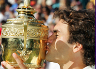
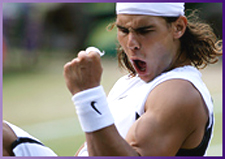
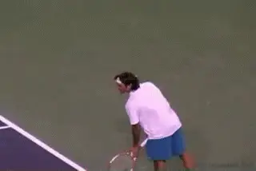
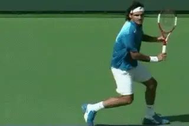
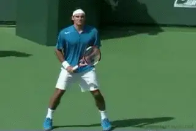
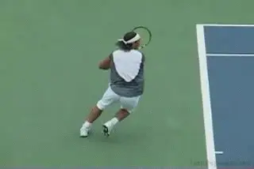
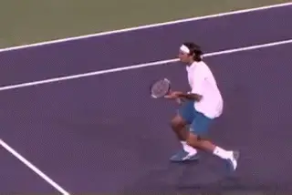
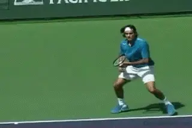
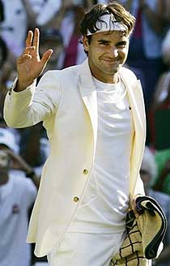
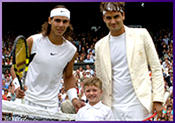

# How Roger Federer Won Wimbledon 2006

### John Yandell

**Courage, incredible serving, and fashion style?**

Wow. It may not have been the Roger Slam, but still, what an amazing
accomplishment. Think about it. If you are Roger Federer, obviously you
know exactly what 4 titles in a row means--Wimbledon immortality with
Bjorn Borg and Pete Sampras. Then, think about who is over there on the
other side--the giant teenager with the biceps and the attitude and the
winning record against you--the player that everyone says is 'in your
kitchen' as a certain pro coach I know likes to put it.

And Roger pulled it off. He held it together and played such a
courageous match. His serving was incredible, and he hit so many clutch
shots at key times. Yeah, he made some tight errors, but it wasn't like
Paris--there wasn't that same stream of almost inexplicable unforced
errors on the backhand side. Plus he had that blazer going for him,
which I think actually did have something to do with it. Still, I
wasn't sure until almost the last point. Because it was obvious that
after that first set, Nadal was hovering on the verge of turning the
match around in every game. Does it sound like I was for Roger? Yes, and
I want him to win in Paris too. And I want Nadal to win Wimbledon.

To what extent was Nadal actually in Roger's kitchen?

So what did the numbers show about how Roger won the match? And what
were the differences between Paris and Wimbledon?

In the article last month on the French ([link](http://www.tennisplayer.net/members/strategy/john_yandell/federer_versus_nadal_french_open_2006/federer_versus_nadal_french_open_2006.html)),
I said that the official statistics don't make sense sometimes.
Wimbledon was one of those times. Here's what I mean. According to the
Wimbledon website, Roger hit 43 winners, and Nadal made 29 unforced
errors (including double faults). So that's 72 points for Roger.

In comparison, Nadal hit 42 winners, and won 33 points on Roger's
unforced errors. That's 75 points for Nadal. So that's 3 more points
for Nadal in the official statistics. But Federer won the match. Why
don't the statistics explain the match? The answer is that those
winners and errors only accounted for about 60% of the total points
played.

The exact match total was 246 points played. Roger won 133. Nadal won
113. So, Roger won 20 points more than Rafael. Like most matches I've
charted, the player who won the most total points won the match. But
again, the winner and unforced errors only accounted for about 60% of
the points. They aren't usually enough to tell the story. So, what
about those other 100 or so points? Who won those and how?

**Roger's serving was phenomenal.**

It wasn't straight winners and errors, so what was it? Right, the
Forced Errors--points Roger won by creating pressure on Nadal, or vice
versa. That's the missing statistic we need to really understand what
is happening in pro matches, as Patrick McEnroe keeps pointing out. A
forced error is as good as a winner, and has the same value when we
measure the Aggressive Margin ([link](The%20Unknown%20Statistics%20-The%20Forced%20Error.docx).)

Roger created a whopping 61 Forced Errors. He actually won more points
through Forced Errors than through Winners or Unforced Errors. His total
was 61 points on Forced Errors, 43 on Winners, and 29 on Unforced
Errors. That adds up to his total points won: 133.

Nadal by comparison won 38 points on Forced Errors, 42 on Winners, and
33 on Unforced Errors. That adds up to his total of 113. Remember the
Winners and Unforced Errors from the official statistics had the players
pretty close, with Nadal ahead by 3 points. When we add in the Forced
Errors it all makes sense. The big difference was the 23 more points for
Federer on Forced Errors.

Winners     Forced Errors         Opponents\        Total
Unforced Errors    
Federer         43              61                  29             133

Nadal           42              38                  33             113

How did Roger create them? It was in large part his phenomenal serving.
That fluid, minimal motion that we have already looked at in technical
detail. ([link](http://www.tennisplayer.net/members/avancedtennis/john_yandell/federer_serve/federer_serve_part1/federer_serve_part1.html).)
He hit 13 aces, but more importantly, almost 30 other serves that were
unreturnable, that is, serves that were Forced Errors. So that was 43
free points, more than twice as many points as he won outright on his
serve at the French. Why so many? Well, the grass for one thing. But
Roger also served almost 80% for the match. Think about that about how
huge 80% is in a Wimbledon final. And that serving percentage meant that
he started out more points than that ahead, even when Nadal made a
return.

**Aggressive Margin**

His serving goes a long way in accounting for the difference in his
Aggressive Margin compared to Nadal. The Aggressive Margin is the other
key statistic we've looked at in these articles. ([link](The%20Aggressive%20Margin.docx).) Once again. if you add up a
player's winners and forced errors and then subtract his unforced
errors, that gives you the Aggressive Margin. For the match, Federer was
+65 for the match or +16/set. Nadal was +44 for the match or +11/set.

|  |  |  |  |  |
| --- | --- | --- | --- | --- |
| Aggressive Margin | Forehand | Backhand | Net | Serve |
| Federer Wimbledon | +10 | -0- | +12 | +42 |
| Nadal Wimbledon | +2 | +12 | +7 | +23 |

But besides the serve, how did Roger get to +16/set? We saw that in
Paris that Federer actually won the match statistically if you just
excluded the backhand. Interestingly it was similar at Wimbledon.
Roger's numbers were better on every stroke but the backhand, compared
to Nadal. But the difference was that at Wimbledon he didn't have those
horrifying 36 unforced backhand errors. In both matches he had 10
backhand winners. The difference was that at Wimbledon he only had 10
unforced errors, not 36.

**Verus Paris: no inexplicable backhands.**

Interestingly Nadal was also negative on his backhand in Paris Like
Federer he had 10 backhand winners and forced errors, but 13 unforced
errors, for an Aggressive Margin of -3. That was way better than Roger
though who was -26. At Wimbledon Nadal did much better on his backhand.
He had 22 winners and forced errors and 10 unforced errors. So, he was
+12. That was better than Roger by 12 points. But it was less than the
23-point backhand advantage he had in Paris, even though they both had
negative aggressive margins.

So, the difference was that, compared to Paris, Roger lost by a much
smaller margin on the backhand. And he won by a much greater margin and
the serve. He also won on the forehand, which was actually a reversal of
Paris. He came up big with quite a few of those forehands when he really
needed them. Finally, he made a few clutch volleys at key times.

Aggressive Margin              Forehand       Backhand     Net    Serve
Federer Paris                     +5            -26        +13     +18

Nadal Pairs                      +10             -3         +3     +18

**Backhand Slice**

So, what accounted for the difference in Roger's backhand? Was it the
slice? That definitely had something to do with it, although you
couldn't see that reflected directly in the backhand winners.
Obviously, Nadal's ball was a lot lower on the grass which made it less
difficult to deal with on the backhand side, but the way Roger mixed it
up also seemed to have a big impact on the mental struggle.

**Was the mix of slice backhands another key?**

Roger still played heavily to Nadal's backhand, hitting inside in with
his forehand and even hitting backhands down the line like he did in
Paris. But he mixed in some crosscourt slices to Nadal's forehand, and
this seemed to frustrate Nadal. It was a teaching pro's dream cliche.
Hit the ball low with slice to an extreme grip forehand! And it should
be especially effective on grass! How many times have you heard that? In
this case the player actually did it and it actually worked.

The slice threw Nadal off enough to draw some uncharacteristic forehand
errors. These were turning points in the match. For example, take the
key game when Nadal served for the second set at 5-4. At 15 love,
Federer hit a forehand slice return, then a low short crosscourt slice
backhand. Nadal hit a loopy, wide crosscourt forehand, and then Federer
stuck a backhand crosscourt drive. It should have still been a routine
ball for Nadal, but the sudden change of pace seemed to throw him off.
He mistimed the ball, made a bad unforced error into the net, and let
out a loud, agonized groan. He hadn't sounded like that before and it
meant something.

**Nadal's forehand: a few errors came at critical times.**

On the next point at 15-15, Federer hit a slice backhand return and then
a short angled backhand crosscourt slice. Nadal made another bad
forehand error. Now it was 15-30, and Nadal missed his first serve long
by about 8 feet and then hit a double fault into the tape. Those were
obvious signs the pressure and frustration were getting to him.

At 15-40 Federer just got his racket on Nadal's first serve and floated
the return back deep down the middle. Nadal made another error hitting
his forehand way long and let out another similar bellow. To me, that
game was the turning point in the entire match, even though the set
ended up in a tiebreaker.

In that tie breaker, there was one more key moment in the mental battle
when Roger hit that crazy running forehand slice and Nadal missed a down
the line forehand with the court open. That got Federer to 3-3 when it
looked like Nadal might take over the breaker. But Roger blunted the
onslaught.

*Video demonstration — the original video for this article was hosted on TennisPlayer.net.*

**A few clutch volleys at the right times.**

There were other similar points and exchanges in the final two sets were
Roger seemed able to use his variety to neutralize Nadal and then finish
with that gorgeous, signature aggressive play. And his topspin backhand
looked about 50 times better than in Paris, didn't it? I mean just the
way he looked when he hit it--and that was reflected in the numbers.

Like McEnroe said, Nadal didn't give up even after that second set, and
his will was enough to carry him through the third set and win the
breaker there. But in the fourth it all caught up with him. Serving at
1-2 and 30 love, Nadal suddenly lost 4 straight points and was quickly
down a break. In that game, Federer crushed two forehands. But Nadal
also missed a forehand off another deep, floating slice. Then on break
point Nadal hit that easy overhead out of the park. That made it 3-1
Federer.

**Another difference: forcing more errors with aggressive forehand's.**

Roger held for 4-1. Then immediately he added another break to go up
5-1. He really took charge in that game, running around second serves
and hitting a couple of huge forehand returns, and then backing that up
with a very sharp backhand volley winner and some dominant forehands,
including one to finish an amazing power backcourt point that left Nadal
sprawled on the grass. You could feel that the momentum had permanently
tipped. On breakpoint, Roger hit another sharp forehand return and then
finished with an easy high forehand volley.

Roger tightened up and immediately gave back one of those breaks in his
next service game, but I still felt like he was going to get it. He
wasn't going to blow serving for the match twice. In the last game his
serve and his forehand came through. Nadal also made two critical
unforced errors, which showed the momentum was just not going to shift
back his way.

So how much of it was the court itself, and how much was it the tactics,
how much was it the pressure of a first Wimbledon final for Rafael, and
how much was it Roger's higher confidence level given all of these
factors? And what about the blazer?

**An image and a feeling--part of the mentality of a champion?**

I say it was some of all of that. It seems that the pundits were
somewhat right. The change in tactics seemed to pay off at critical
times. But what happens the next time they play on clay? Sure Roger
cleaned up his backhand errors and the match was more or less a draw
from the backcourt, but I doubt Federer can be +42 on his serve in
Paris, or Rome, or Monte Carlo. That'll be interesting to see. Will he
try the slice on clay and what'll happen if he does? Let's hope we get
the chance to find out.

**The Blazer Inside the Mind**

The numbers give us perspective, but maybe the real difference was in
Federer's mental state on Wimbledon center court. Maybe that mental
state is what produced the improved tactics and execution and the better
numbers.

Or maybe it really was the blazer--don't laugh, I think that was part
of the whole deal. Personally I thought it looked ultra sharp. When you
look good you feel good, right? Something like that was definitely going
on for Roger. I think that cream blazer had something to do with his
perspective on who he was and how he felt--or wanted to feel--at
Wimbledon. Remember the blazer was his idea not Nike's. He literally
recreated his image in a way that tied him to tennis history. Don't try
to tell me that same process is not going on with Rafael. He looks like
no one else on the court--and he plays the same way. Image isn't
everything, but image does reflect and influence reality.

If you've read some of the articles on the great champions of the past,
([link](http://www.tennisplayer.net/members/champions/Ed_Atkinson/Ed_Atkinson_Bill_Tilden/Ed_Atkinson_Bill_Tilden.html))
you may have noticed the pictures of the original 'tennis blazers'
that were worn by the top players all the way through the 1940s.

**Another final: too much to hope for in New York?**

I've been predicting for a few years that since everything in fashion
is retro something or other, they'd have to be back at some point. And
yes, I want one. And maybe some slacks to go with it. It could all be
synthetics like normal warm-ups, with the same zippers and pockets.
Think of the color possibilities, not to mention the crest on the front
pocket. I'm under contract with Fila not Nike, so Michael McCrory are
you listening down there in San Diego? So far as I can tell Nike isn't
even selling it. I'm telling you it could be huge!

And what about New York? Federer versus Nadal in 3 Grand Slam finals in
a row? That seems improbable and too much to hope for. New York is so
tough and there are so many players that could put either or both of
them out in the frenzy of the U.S. Open. But it COULD happen. They both
seem that good. If it does it'll be the greatest spectacle yet of the
Open era. At the very least I hope to see them play a couple more Slam
finals in the upcoming years like the ones we've been lucky enough to
witness in 2006. In fact I hope Federer wins the next time they play in
Paris, and Rafa when they play in England.

John Yandell is widely acknowledged as one of the leading videographers
and students of the modern game of professional tennis. His high speed
filming for Advanced Tennis and Tennisplayer have provided new visual
resources that have changed the way the game is studied and understood
by both players and coaches. He has done personal video analysis for
hundreds of high level competitive players, including Justine
Henin-Hardenne, Taylor Dent and John McEnroe, among others.

In addition to his role as Editor of Tennisplayer he is the author of
the critically acclaimed book Visual Tennis. The John Yandell Tennis
School is located in San Francisco, California.
